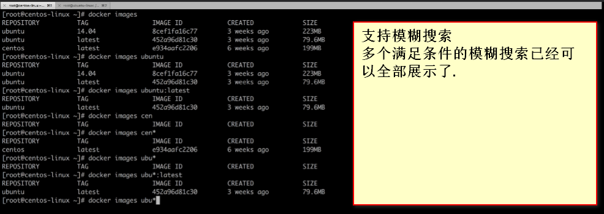
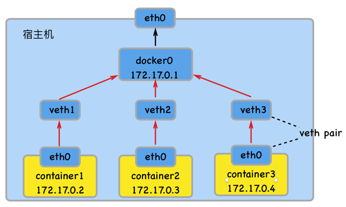
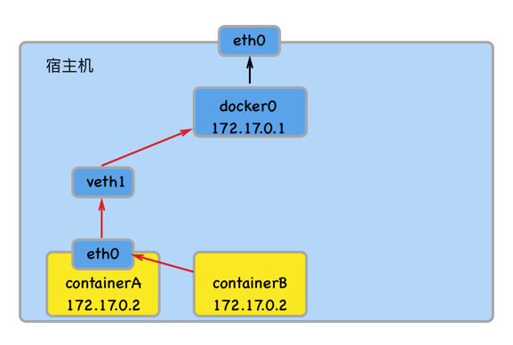
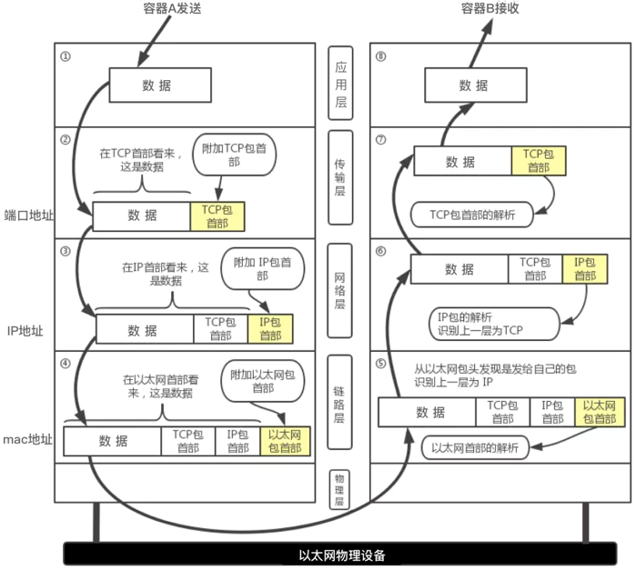
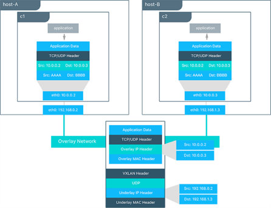
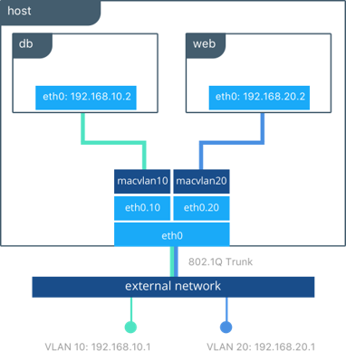
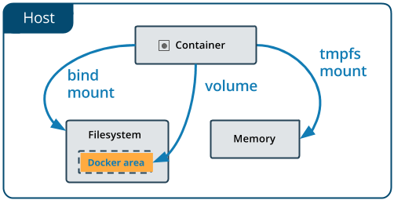
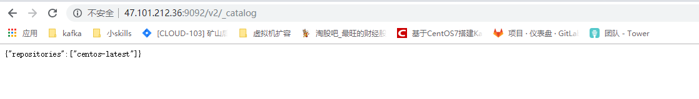
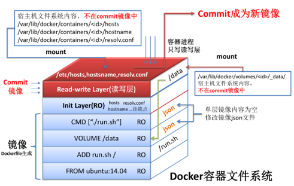
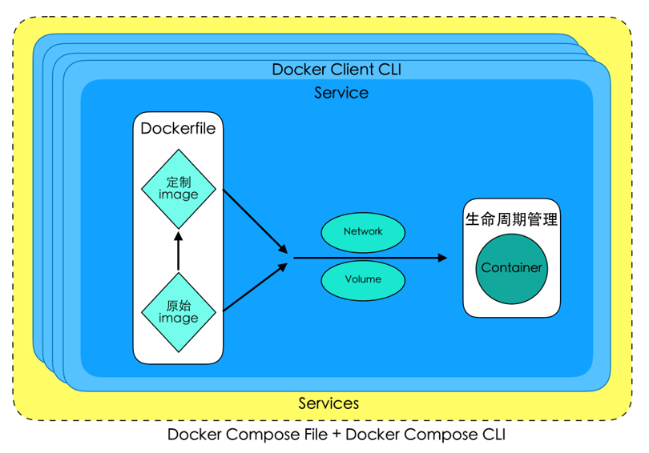

## 第一章 Docker概览

### 1.Docker简介

1.1Docker和VMare区别? 为什么有了VMware还要用Docker?

1.2Docker的革命性意义

- 更轻量
- 环境迁移

### 2.Docker整体结构了解


### 3.Docker底层技术了解


### 4.总结


---

```
docker version
sudo service docker start
```


ubuntu下存在`sudo` 权限问题


```
docker search 


Options:
  -f, --filter filter   Filter output based on conditions provided
      --format string   Pretty-print search using a Go template  (利用go的字符串)
      --limit int       Max number of search results (default 25)
      --no-trunc        Don't truncate output

命令格式：
	docker search [OPTIONS] TERM
命令参数(OPTIONS)：
	-f,  --filter filter   	根据提供的格式筛选结果
	     --format string   	利用Go语言的format格式化输出结果
	     --limit int       	展示最大的结果数，默认25个  (顺序:limit>filter)
	     --no-trunc        	内容全部显示
      

```

```shell
docker search centos # 通过镜像名进行搜索, 支持名字模糊搜索, 写cen 也可以搜索到 centos

docker search -f is-official=true cent

docker search -f is-official=true --limit 3 redis

docker search --no-trunc centos
```


#### 镜像查看

docker images  或 docker image ls

```shell
作用：
	列出本地镜像
命令格式：
	docker images [OPTIONS] [REPOSITORY[:TAG]]  
     或者  docker image ls [OPTIONS] [REPOSITORY[:TAG]]
命令参数(OPTIONS)：	
	-a, --all             		展示所有镜像 (默认隐藏底层的镜像)
	     --no-trunc        	不缩略显示
	-q, --quiet           	只显示镜像ID
```




#### 镜像下载  docker pull

```shell
推荐:  docker pull -h  去查看其用法

docker pull [OPTIONS] NAME[:TAG|@DIGEST]

docker pull centos  默认 是 下载 latest  
docker pull centos:7

dockr pull ubuntu:16  是没法搜索到的,需要使用  16.04 这样完整的版本号

其实上是根据  IMAGE ID 来进行判断是否下载的, 如果在本地中有目标ID 那么不会下载, 只在本地进行引用
这个在删除的时候可以体现出来
```


#### 镜像删除  docker rmi  或 docker image rm

```
作用：
	将本地的一个或多个镜像删除  (通过名字和id都可以删除)
命令格式：
	docker rmi [OPTIONS] IMAGE [IMAGE...]
     或者  docker image rm [OPTIONS] IMAGE [IMAGE...]
命令参数(OPTIONS)：	
	-f, --force      		强制删除  (用于在本地已经创建了容器的镜像)
```

```shell
#展示两次删除的区别: 
# 第一次删除了引用
# 第二次彻底删除了文件
[root@izuf6csxy0jrgs3azvia67z ~]# docker images
REPOSITORY          TAG                 IMAGE ID            CREATED             SIZE
ubuntu              16.04               7e87e2b3bf7a        6 weeks ago         117MB
ubuntu              14.04               5dbc3f318ea5        6 weeks ago         188MB
centos              7                   1e1148e4cc2c        3 months ago        202MB
centos              latest              1e1148e4cc2c        3 months ago        202MB
[root@izuf6csxy0jrgs3azvia67z ~]# docker rmi centos:7
Untagged: centos:7
[root@izuf6csxy0jrgs3azvia67z ~]# docker rmi centos
Untagged: centos:latest
Untagged: centos@sha256:184e5f35598e333bfa7de10d8fb1cebb5ee4df5bc0f970bf2b1e7c7345136426
Deleted: sha256:1e1148e4cc2c148c6890a18e3b2d2dde41a6745ceb4e5fe94a923d811bf82ddb
Deleted: sha256:071d8bd765171080d01682844524be57ac9883e53079b6ac66707e192ea25956
```

```shell
#展示两个镜像是同一个ID的时候, 不能通过ID 去进行删除
[root@izuf6csxy0jrgs3azvia67z ~]# docker images
REPOSITORY          TAG                 IMAGE ID            CREATED             SIZE
ubuntu              16.04               7e87e2b3bf7a        6 weeks ago         117MB
ubuntu              14.04               5dbc3f318ea5        6 weeks ago         188MB
centos              7                   1e1148e4cc2c        3 months ago        202MB
centos              latest              1e1148e4cc2c        3 months ago        202MB
[root@izuf6csxy0jrgs3azvia67z ~]# docker rmi 1e11
Error response from daemon: conflict: unable to delete 1e1148e4cc2c (must be forced) -image is referenced in multiple repositories

---------------------------------
[root@izuf6csxy0jrgs3azvia67z ~]# docker rmi centos
Untagged: centos:latest
[root@izuf6csxy0jrgs3azvia67z ~]# docker images
REPOSITORY          TAG                 IMAGE ID            CREATED             SIZE
ubuntu              16.04               7e87e2b3bf7a        6 weeks ago         117MB
ubuntu              14.04               5dbc3f318ea5        6 weeks ago         188MB
centos              7                   1e1148e4cc2c        3 months ago        202MB
[root@izuf6csxy0jrgs3azvia67z ~]# docker rmi 1e11
Untagged: centos:7
Untagged: centos@sha256:184e5f35598e333bfa7de10d8fb1cebb5ee4df5bc0f970bf2b1e7c7345136426
Deleted: sha256:1e1148e4cc2c148c6890a18e3b2d2dde41a6745ceb4e5fe94a923d811bf82ddb
Deleted: sha256:071d8bd765171080d01682844524be57ac9883e53079b6ac66707e192ea25956
```


#### 镜像保存备份 docker save  (强烈推荐要加上版本号)

```
作用：
	将本地的一个或多个镜像打包保存成本地tar文件(输出到STDOUT)  (标准输出流,所以需重定向到 xx.tar文件)
命令格式：
	docker save [OPTIONS] IMAGE [IMAGE...]   (一个或多个同时操作, 借助名字或id均可)
命令参数(OPTIONS)：	
	-o, --output string   		指定写入的文件名和路径

```


```shell
#可以使用Name或ID来标记镜像
#会提示使用 -o 或者 > 来进行保存成文件
[root@izuf6csxy0jrgs3azvia67z docker_demo]# docker images
REPOSITORY          TAG                 IMAGE ID            CREATED             SIZE
ubuntu              latest              47b19964fb50        4 weeks ago         88.1MB
ubuntu              16.04               7e87e2b3bf7a        6 weeks ago         117MB
ubuntu              14.04               5dbc3f318ea5        6 weeks ago         188MB
centos              7                   1e1148e4cc2c        3 months ago        202MB
centos              latest              1e1148e4cc2c        3 months ago        202MB
[root@izuf6csxy0jrgs3azvia67z docker_demo]# docker save centos ubuntu:14.04 47b1 centos:7
cowardly refusing to save to a terminal. Use the -o flag or redirect
[root@izuf6csxy0jrgs3azvia67z docker_demo]# docker save centos ubuntu:14.04 47b1 centos:7 > linux.tar
[root@izuf6csxy0jrgs3azvia67z docker_demo]# ll
total 486424
-rw-r--r--1 root root 498098176 Mar 10 11:52 linux.tar
[root@izuf6csxy0jrgs3azvia67z docker_demo]# ll
-rw-r--r--1 root root 498098176 Mar 10 11:52 linux.tar
[root@izuf6csxy0jrgs3azvia67z docker_demo]# docker save centos ubuntu:14.04 47b1 centos:7 -o linux2.tar
[root@izuf6csxy0jrgs3azvia67z docker_demo]# ll
-rw-------1 root root 498098176 Mar 10 11:54 linux2.tar
-rw-r--r--1 root root 498098176 Mar 10 11:52 linux.tar
```


#### 镜像备份导入 docker load

```
作用：
	将save命令打包的镜像导入本地镜像库中
命令格式：
	docker load [OPTIONS]
命令参数(OPTIONS)：	
	-i,  --input string   	指定要打入的文件，如没有指定，默认是STDIN
	-q, --quiet          		不打印导入过程信息
```

```shell
[root@izuf6csxy0jrgs3azvia67z docker_demo]# docker rmi ubuntu:latest 7e87 5dbc 
....省略控制台输出...
[root@izuf6csxy0jrgs3azvia67z docker_demo]# docker images
REPOSITORY          TAG                 IMAGE ID            CREATED             SIZE
[root@izuf6csxy0jrgs3azvia67z docker_demo]# docker load -h
Flag shorthand -h has been deprecated, please use --help

Usage:	docker load [OPTIONS]

Load an image from a tar archive or STDIN

Options:
  -i, --input string   Read from tar archive file, instead of STDIN
  -q, --quiet          Suppress the load output
[root@izuf6csxy0jrgs3azvia67z docker_demo]# docker load -i linux.tar 
....省略控制台输出...
[root@izuf6csxy0jrgs3azvia67z docker_demo]# docker images
REPOSITORY          TAG                 IMAGE ID            CREATED             SIZE
<none>              <none>              47b19964fb50        4 weeks ago         88.1MB
ubuntu              14.04               5dbc3f318ea5        6 weeks ago         188MB
centos              7                   1e1148e4cc2c        3 months ago        202MB
centos              latest              1e1148e4cc2c        3 months ago        202MB
# 发现存在问题, 经过执行 docker save centos ubuntu:14.04 47b1 centos:7 > linux.tar 
# 对应的ubuntu latest 的REPOSITORY和TAG都变成<none>了. 和我们打包备份的时候没有指定版本号有关, 这里需要注意.
```

#### 镜像重命名 docker tag

```
作用：
	对本地镜像的NAME、TAG进行重命名，并新产生一个命名后镜像
命令格式：
	docker tag SOURCE_IMAGE[:TAG] TARGET_IMAGE[:TAG]
命令参数(OPTIONS)：	
	无
```

```shell
#事实上这是一个重命名的命令, 这里会增加一个引用, 并不会修改原来的.
[root@izuf6csxy0jrgs3azvia67z docker_demo]# docker images
REPOSITORY          TAG                 IMAGE ID            CREATED             SIZE
<none>              <none>              47b19964fb50        4 weeks ago         88.1MB
ubuntu              14.04               5dbc3f318ea5        6 weeks ago         188MB
centos              7                   1e1148e4cc2c        3 months ago        202MB
centos              latest              1e1148e4cc2c        3 months ago        202MB
[root@izuf6csxy0jrgs3azvia67z docker_demo]# docker tag -h
Flag shorthand -h has been deprecated, please use --help

Usage:	docker tag SOURCE_IMAGE[:TAG] TARGET_IMAGE[:TAG]

Create a tag TARGET_IMAGE that refers to SOURCE_IMAGE
[root@izuf6csxy0jrgs3azvia67z docker_demo]# docker tag centos:7 centos:7.4
[root@izuf6csxy0jrgs3azvia67z docker_demo]# docker images
REPOSITORY          TAG                 IMAGE ID            CREATED             SIZE
<none>              <none>              47b19964fb50        4 weeks ago         88.1MB
ubuntu              14.04               5dbc3f318ea5        6 weeks ago         188MB
centos              7                   1e1148e4cc2c        3 months ago        202MB
centos              7.4                 1e1148e4cc2c        3 months ago        202MB
centos              latest              1e1148e4cc2c        3 months ago        202MB

------------------------------------------------------------------------
#但是如果是<none>的情况, 相当于存在一个没有标签的镜像, 然后重命名之后就变成默认的镜像
[root@izuf6csxy0jrgs3azvia67z docker_demo]# docker tag 47b1 ubuntu:latest
[root@izuf6csxy0jrgs3azvia67z docker_demo]# docker images
REPOSITORY          TAG                 IMAGE ID            CREATED             SIZE
ubuntu              latest              47b19964fb50        4 weeks ago         88.1MB
ubuntu              14.04               5dbc3f318ea5        6 weeks ago         188MB
centos              7                   1e1148e4cc2c        3 months ago        202MB
centos              7.4                 1e1148e4cc2c        3 months ago        202MB
centos              latest              1e1148e4cc2c        3 months ago        202MB
```


#### 镜像详细信息 docker image inspect/docker inspect

```
作用：
	查看本地一个或多个镜像的详细信息
命令格式：
	docker image inspect [OPTIONS] IMAGE [IMAGE...]
      或者 docker inspect [OPTIONS] IMAGE [IMAGE...]
命令参数(OPTIONS)：	
	-f, --format string          利用特定Go语言的format格式输出结果
```

```shell
#查出来的是json字符串
#固定语法

[root@izuf6csxy0jrgs3azvia67z ~]# docker image inspect centos
[
    {
        "Id": "sha256:1e1148e4cc2c148c6890a18e3b2d2dde41a6745ceb4e5fe94a923d811bf82ddb",
        "RepoTags": [
            "centos:7",
            "centos:7.4",
            "centos:latest"
        ],
        "RepoDigests": [],
        "Parent": "",
        "Comment": "",
        "Created": "2018-12-06T00:21:07.135655444Z",
        "Container": "1fdbb0fcc184eb795364f7aa5fdc00299d0a2b90d8e26b4696217c22da7f983f",
        "ContainerConfig": {
            "Hostname": "1fdbb0fcc184",
            "Domainname": "",
            "User": "",
            "AttachStdin": false,
            "AttachStdout": false,
            "AttachStderr": false,
            "Tty": false,
            "OpenStdin": false,
            "StdinOnce": false,
            "Env": [
                "PATH=/usr/local/sbin:/usr/local/bin:/usr/sbin:/usr/bin:/sbin:/bin"
            ],
            "Cmd": [
                "/bin/sh",
                "-c",
                "#(nop) ",
                "CMD [\"/bin/bash\"]"
            ],
            "ArgsEscaped": true,
            "Image": "sha256:b3a68d99a4a4195c6c97c2345b83cb2d6cfd1661247816ac403cf0b584437ad7",
            "Volumes": null,
            "WorkingDir": "",
            "Entrypoint": null,
            "OnBuild": null,
            "Labels": {
                "org.label-schema.build-date": "20181205",
                "org.label-schema.license": "GPLv2",
                "org.label-schema.name": "CentOS Base Image",
                "org.label-schema.schema-version": "1.0",
                "org.label-schema.vendor": "CentOS"
            }
        },
        "DockerVersion": "17.06.2-ce",
        "Author": "",
        "Config": {
            "Hostname": "",
            "Domainname": "",
            "User": "",
            "AttachStdin": false,
            "AttachStdout": false,
            "AttachStderr": false,
            "Tty": false,
            "OpenStdin": false,
            "StdinOnce": false,
            "Env": [
                "PATH=/usr/local/sbin:/usr/local/bin:/usr/sbin:/usr/bin:/sbin:/bin"
            ],
            "Cmd": [
                "/bin/bash"
            ],
            "ArgsEscaped": true,
            "Image": "sha256:b3a68d99a4a4195c6c97c2345b83cb2d6cfd1661247816ac403cf0b584437ad7",
            "Volumes": null,
            "WorkingDir": "",
            "Entrypoint": null,
            "OnBuild": null,
            "Labels": {
                "org.label-schema.build-date": "20181205",
                "org.label-schema.license": "GPLv2",
                "org.label-schema.name": "CentOS Base Image",
                "org.label-schema.schema-version": "1.0",
                "org.label-schema.vendor": "CentOS"
            }
        },
        "Architecture": "amd64",
        "Os": "linux",
        "Size": 201779604,
        "VirtualSize": 201779604,
        "GraphDriver": {
            "Data": {
                "MergedDir": "/var/lib/docker/overlay2/6099b0dfde447cd9b332ac2c0e1cb7d660572a9d8a31a988e1db8d253e717d00/merged",
                "UpperDir": "/var/lib/docker/overlay2/6099b0dfde447cd9b332ac2c0e1cb7d660572a9d8a31a988e1db8d253e717d00/diff",
                "WorkDir": "/var/lib/docker/overlay2/6099b0dfde447cd9b332ac2c0e1cb7d660572a9d8a31a988e1db8d253e717d00/work"
            },
            "Name": "overlay2"
        },
        "RootFS": {
            "Type": "layers",
            "Layers": [
                "sha256:071d8bd765171080d01682844524be57ac9883e53079b6ac66707e192ea25956"
            ]
        },
        "Metadata": {
            "LastTagTime": "2019-03-10T12:15:26.0800718+08:00"
        }
    }
]

#上面的信息量太大, 我们可以针对性的查看部分
[root@izuf6csxy0jrgs3azvia67z ~]# docker inspect centos | grep Created
        "Created": "2018-12-06T00:21:07.135655444Z",
# 存在问题: 显示的只有当前行
[root@izuf6csxy0jrgs3azvia67z ~]# docker inspect centos | grep Data
            "Data": {
#解决办法: 使用固定的go语法
[root@izuf6csxy0jrgs3azvia67z ~]# docker inspect -f "{{json .Id}}" centos
"sha256:1e1148e4cc2c148c6890a18e3b2d2dde41a6745ceb4e5fe94a923d811bf82ddb"
# 其中的 点 表示第一层
[root@izuf6csxy0jrgs3azvia67z ~]# docker inspect -f "{{json .GraphDriver.Data}}" centos
{"MergedDir":"/var/lib/docker/overlay2/6099b0dfde447cd9b332ac2c0e1cb7d660572a9d8a31a988e1db8d253e717d00/merged","UpperDir":"/var/lib/docker/overlay2/6099b0dfde447cd9b332ac2c0e1cb7d660572a9d8a31a988e1db8d253e717d00/diff","WorkDir":"/var/lib/docker/overlay2/6099b0dfde447cd9b332ac2c0e1cb7d660572a9d8a31a988e1db8d253e717d00/work"}

#补充: 
docker image inspect -h 和 docker inspect -h  不同, 一个只针对image, 一个是针对docker 对象, 也就是说还包括 容器,网络,数据卷等

```


#### 镜像历史信息  docker history

```
作用：
	查看本地一个镜像的历史(历史分层)信息
命令格式：
	docker history [OPTIONS] IMAGE
命令参数(OPTIONS)：
	-H, --human		将创建时间、大小进行优化打印(默认为true)
	-q, --quiet           	只显示镜像ID
	     --no-trunc        	不缩略显示
```

```shell
[root@izuf6csxy0jrgs3azvia67z ~]# docker history centos
IMAGE               CREATED             CREATED BY                                      SIZE                COMMENT
1e1148e4cc2c        3 months ago        /bin/sh -c #(nop)  CMD ["/bin/bash"]            0B                  
<missing>           3 months ago        /bin/sh -c #(nop)  LABEL org.label-schema.sc…   0B                  
<missing>           3 months ago        /bin/sh -c #(nop) ADD file:6f877549795f4798a…   202MB 
```


### 第四章 容器 --打包技术

关闭

```
service docker stop
reboot now 
# 这两种方式都会将 所有的运行的容器关闭掉
```

#### 容器创建 docker create

```
作用：
	利用镜像创建出一个Created 状态的待启动容器
命令格式：
	docker create [OPTIONS] IMAGE [COMMAND] [ARG...]
命令参数(OPTIONS)：
	-t, --tty           		分配一个伪TTY，也就是分配虚拟终端
    -i, --interactive    	即使没有连接，也要保持STDIN打开
    --name          		为容器起名，如果没有指定将会随机产生一个名称
命令参数（COMMAND\ARG）:
	COMMAND 表示容器启动后，需要在容器中执行的命令，如ps、ls 等命令
	ARG 表示执行 COMMAND 时需要提供的一些参数，如ps 命令的 aux、ls命令的-a等等
-------------------
补充:
docker create --help 查看帮助信息, 不能使用 -h , 因为这里的-h已经作为它用. 类似的还有其他的.
[COMMAND] 用于创建容器带有的命令, 如yum , apt-get ls 等
[ARG]  用于对 [COMMAND] 传递参数  比如  ls -alh
当然, COMMAND其有默认值:   /bin/bash 或其它
```

```shell
[root@izuf6csxy0jrgs3azvia67z docker]# docker ps
CONTAINER ID        IMAGE               COMMAND             CREATED             STATUS              PORTS               NAMES
[root@izuf6csxy0jrgs3azvia67z docker]# docker create centos ls -a
8a6a45f9a0d0b8a2590264af688684b4269066ffaafc8fdf8e6a116166d3e66f
[root@izuf6csxy0jrgs3azvia67z docker]# docker ps
CONTAINER ID        IMAGE               COMMAND             CREATED             STATUS              PORTS               NAMES
[root@izuf6csxy0jrgs3azvia67z docker]# docker ps -a
CONTAINER ID        IMAGE               COMMAND             CREATED             STATUS              PORTS               NAMES
8a6a45f9a0d0        centos              "ls -a"             18 seconds ago      Created                                 stupefied_lichterman
# docker ps 默认不显示  created状态的 容器. 如果要显示需要加 参数 -a
# 如果使用[COMMAND]选项, 那么会覆盖默认的 /bin/bash 命令
[root@izuf6csxy0jrgs3azvia67z docker]# docker create centos 
901eec029d7ea5b1f2687334c49c40c59959a8a1a200c0f8aefbd8b7efce81cb
[root@izuf6csxy0jrgs3azvia67z docker]# docker ps
CONTAINER ID        IMAGE               COMMAND             CREATED             STATUS              PORTS               NAMES
[root@izuf6csxy0jrgs3azvia67z docker]# docker ps -a
CONTAINER ID        IMAGE               COMMAND             CREATED             STATUS              PORTS               NAMES
901eec029d7e        centos              "/bin/bash"         7 seconds ago       Created                                 flamboyant_bartik
8a6a45f9a0d0        centos              "ls -a"             2 minutes ago       Created                                 stupefied_lichterman

# PORTS 选项标记的是端口映射
# NAMES 会给创建的容器生成一个默认的名字, 当然也可以通过 --name 选项来指定名字
[root@izuf6csxy0jrgs3azvia67z docker]# docker create --name centos-test centos
ba1085bfe9f0ff8a00b2e06a4eb4f62f4b171d695ee865d4a92600ef2b921617
[root@izuf6csxy0jrgs3azvia67z docker]# docker ps -a
CONTAINER ID        IMAGE               COMMAND             CREATED              STATUS              PORTS               NAMES
ba1085bfe9f0        centos              "/bin/bash"         3 seconds ago        Created                                 centos-test
901eec029d7e        centos              "/bin/bash"         About a minute ago   Created                                 flamboyant_bartik
8a6a45f9a0d0        centos              "ls -a"             3 minutes ago        Created                                 stupefied_lichterman

# 分配
```

#### 容器启动 docker start

```shell
#COMMAND默认值, 会在每次启动该容器的时候都会执行一次. 
#但是要显示需要通过 -a 参数来实现
[root@izuf6csxy0jrgs3azvia67z ~]# docker start 6137
6137
[root@izuf6csxy0jrgs3azvia67z ~]# docker ps
CONTAINER ID        IMAGE               COMMAND             CREATED             STATUS              PORTS               NAMES
[root@izuf6csxy0jrgs3azvia67z ~]# docker ps -a
CONTAINER ID        IMAGE               COMMAND             CREATED             STATUS                     PORTS               NAMES
61374d7c1f72        centos              "ls -a"             53 seconds ago      Exited (0) 8 seconds ago                       centos-test

[root@izuf6csxy0jrgs3azvia67z ~]# docker start -a 6137
.
..
.dockerenv
anaconda-post.log
bin
dev
etc
home
lib
lib64
media
mnt
...

#类似Python这种命令执行需要 虚拟一个终端, 同时还要有标准输入和输出才能展示出来.
#在控制台直接输入Python的时候是有输出的.
#所以, 创建的时候需要 -t 才能分配 虚拟终端, -i 才能提供标准输入, 这两者都具备才能运行 python

# 所以, start python的时候, 也需要 有标准输出和输入. 所以需要  -a 和 -i 参数

[root@izuf6csxy0jrgs3azvia67z ~]# docker ps -a
CONTAINER ID        IMAGE               COMMAND             CREATED             STATUS                     PORTS               NAMES
61374d7c1f72        centos              "ls -a"             7 minutes ago       Exited (0) 4 minutes ago                       centos-test
[root@izuf6csxy0jrgs3azvia67z ~]# docker create --name python centos python
1d270adb44c8be96bacb5d17d44922e51bc8d984a5fac3afd7a118a3fcfcae27
[root@izuf6csxy0jrgs3azvia67z ~]# docker ps -a
CONTAINER ID        IMAGE               COMMAND             CREATED             STATUS                     PORTS               NAMES
1d270adb44c8        centos              "python"            4 seconds ago       Created                                        python
61374d7c1f72        centos              "ls -a"             8 minutes ago       Exited (0) 5 minutes ago                       centos-test
[root@izuf6csxy0jrgs3azvia67z ~]# docker start 1d27
1d27
[root@izuf6csxy0jrgs3azvia67z ~]# python
Python 2.7.5 (default, Oct 30 2018, 23:45:53) 
[GCC 4.8.5 20150623 (Red Hat 4.8.5-36)] on linux2
Type "help", "copyright", "credits" or "license" for more information.
>>> quit()
[root@izuf6csxy0jrgs3azvia67z ~]# docker start -a python
[root@izuf6csxy0jrgs3azvia67z ~]# docker create -ti --name python-new centos python
e4c60ba568f333b1015f05413c9ae7d0e4ac94931497b12d97210a5db9a2ff6c
[root@izuf6csxy0jrgs3azvia67z ~]# docker start -a python-new
Python 2.7.5 (default, Oct 30 2018, 23:45:53) 
[GCC 4.8.5 20150623 (Red Hat 4.8.5-36)] on linux2
Type "help", "copyright", "credits" or "license" for more information.
>>> quit

quit
^C
[root@izuf6csxy0jrgs3azvia67z ~]# docker start --help

Usage:	docker start [OPTIONS] CONTAINER [CONTAINER...]

Start one or more stopped containers

Options:
  -a, --attach               Attach STDOUT/STDERR and forward signals
      --detach-keys string   Override the key sequence for detaching a container
  -i, --interactive          Attach container's STDIN
[root@izuf6csxy0jrgs3azvia67z ~]# docker start -ai python-new
import os
>>> import os
>>> os.dir(".")
Traceback (most recent call last):
  File "<stdin>", line 1, in <module>
AttributeError: 'module' object has no attribute 'dir'
>>> quit()
```

#### 容器创建并启动 docker run

```
作用：
	利用镜像创建并启动一个容器
命令格式：
	docker run [OPTIONS] IMAGE [COMMAND] [ARG...]
命令参数(OPTIONS)：查看更多
	-t, --tty           		分配一个伪TTY，也就是分配虚拟终端
    -i, --interactive    	    即使没有连接，也要保持STDIN打开
    --name          			为容器起名，如果没有指定将会随机产生一个名称
	-d, --detach				在后台运行容器并打印出容器ID
	--rm						当容器退出运行后，自动删除容器
命令参数（COMMAND\ARG）:
	COMMAND 表示容器启动后，需要在容器中执行的命令，如ps、ls 等命令
	ARG 表示执行 COMMAND 时需要提供的一些参数，如ps 命令的 aux、ls命令的-a等等

```

```shell
docker run <=> docker create + docker start -a   前台模式
docker run -d <=> docker create + docker start    后台模式
```

#### 容器关闭 docker stop

```
补充
docker run -dti --rm centos bash
# 那么当 stop 或 kill 掉容器的时候, 那么容器会被自动删除
```

```shell
[root@izuf6csxy0jrgs3azvia67z ~]# docker stop -h
Flag shorthand -h has been deprecated, please use --help

Usage:	docker stop [OPTIONS] CONTAINER [CONTAINER...]

Stop one or more running containers

Options:
  -t, --time int   Seconds to wait for stop before killing it (default 10)

# 如果不使用 -d 在后台运行, 那么虽然 Python可以起到阻塞作用, 但是一旦 Ctrl+D 退出或 quit()退出之后. 
[root@izuf6csxy0jrgs3azvia67z ~]# docker ps -a
CONTAINER ID        IMAGE               COMMAND             CREATED             STATUS              PORTS               NAMES
[root@izuf6csxy0jrgs3azvia67z ~]# docker run -ti centos python
Python 2.7.5 (default, Oct 30 2018, 23:45:53) 
[GCC 4.8.5 20150623 (Red Hat 4.8.5-36)] on linux2
Type "help", "copyright", "credits" or "license" for more information.
>>>    
[root@izuf6csxy0jrgs3azvia67z ~]# docker ps -a
CONTAINER ID        IMAGE               COMMAND             CREATED             STATUS                     PORTS               NAMES
f71a5c68f152        centos              "python"            11 seconds ago      Exited (0) 6 seconds ago                       kind_goldwasser
[root@izuf6csxy0jrgs3azvia67z ~]# docker run -dti centos python
f8b7611d03b80c7709306035e4df0b87c63b8fbf9e1c0cb59fa9b62dbb133600
[root@izuf6csxy0jrgs3azvia67z ~]# docker ps -a
CONTAINER ID        IMAGE               COMMAND             CREATED             STATUS                     PORTS               NAMES
f8b7611d03b8        centos              "python"            3 minutes ago       Up 3 minutes                                   nervous_wiles
f71a5c68f152        centos              "python"            4 minutes ago       Exited (0) 4 minutes ago                       kind_goldwasser
```

#### 容器终止  docker kill 

```
作用：
	强制并立即关闭一个或多个处于暂停状态或者运行状态的容器
命令格式：
	docker kill [OPTIONS] CONTAINER [CONTAINER...]
命令参数(OPTIONS)：
	-s, --signal string   	指定发送给容器的关闭信号 (默认“KILL”信号)
```

> 补充
>
> ```shell
> # 使用kill的时候默认发送的是 15)SIGTERM  ;    (通知即将关掉 ,  给时间回收一下内存等)
> # 使用kill -9 是发送 9)SIGKILL
> [root@izuf6csxy0jrgs3azvia67z docker_demo]# kill -l
>  1) SIGHUP	 2) SIGINT	 3) SIGQUIT	 4) SIGILL	 5) SIGTRAP
>  6) SIGABRT	 7) SIGBUS	 8) SIGFPE	 9) SIGKILL	10) SIGUSR1
> 11) SIGSEGV	12) SIGUSR2	13) SIGPIPE	14) SIGALRM	15) SIGTERM
> 16) SIGSTKFLT	17) SIGCHLD	18) SIGCONT	19) SIGSTOP	20) SIGTSTP
> 21) SIGTTIN	22) SIGTTOU	23) SIGURG	24) SIGXCPU	25) SIGXFSZ
> 26) SIGVTALRM	27) SIGPROF	28) SIGWINCH	29) SIGIO	30) SIGPWR
> 31) SIGSYS	34) SIGRTMIN	35) SIGRTMIN+1	36) SIGRTMIN+2	37) SIGRTMIN+3
> 38) SIGRTMIN+4	39) SIGRTMIN+5	40) SIGRTMIN+6	41) SIGRTMIN+7	42) SIGRTMIN+8
> 43) SIGRTMIN+9	44) SIGRTMIN+10	45) SIGRTMIN+11	46) SIGRTMIN+12	47) SIGRTMIN+13
> 48) SIGRTMIN+14	49) SIGRTMIN+15	50) SIGRTMAX-14	51) SIGRTMAX-13	52) SIGRTMAX-12
> 53) SIGRTMAX-11	54) SIGRTMAX-10	55) SIGRTMAX-9	56) SIGRTMAX-8	57) SIGRTMAX-7
> 58) SIGRTMAX-6	59) SIGRTMAX-5	60) SIGRTMAX-4	61) SIGRTMAX-3	62) SIGRTMAX-2
> 63) SIGRTMAX-1	64) SIGRTMAX
> ```

```shell
前提知识点：
Linux其中两种终止进程的信号是：SIGTERM和SIGKILL
SIGKILL信号：无条件终止进程信号。进程接收到该信号会立即终止，不进行清理和暂存工作。该信号不能被忽略、处理和阻塞，它向系统管理员提供了可以杀死任何进程的方法。
SIGTERM信号：程序终结信号，可以由kill命令产生。与SIGKILL不同的是，SIGTERM信号可以被阻塞和终止，以便程序在退出前可以保存工作或清理临时文件等。

docker stop 会先发出SIGTERM信号给进程，告诉进程即将会被关闭。在-t指定的等待时间过了之后，将会立即发出SIGKILL信号，直接关闭容器。
docker kill 直接发出SIGKILL信号关闭容器。但也可以通过-s参数修改发出的信号。

因此会发现在docker stop的等过过程中，如果终止docker stop的执行，容器最终没有被关闭。而docker kill几乎是立刻发生，无法撤销。

此外还有些异常原因也会导致容器被关闭，比如docker daemon重启、容器内部进程运行发生错误等等“异常原因”。
```

#### 容器暂停  docker pause

```
作用：
	暂停一个或多个处于运行状态的容器
命令格式：
	docker pause CONTAINER [CONTAINER...]
命令参数(OPTIONS)：
	无	
```

*注: 涨停也是一个特殊的运行状态*

#### 容器取消暂停 docker unpause

```
作用：
	取消一个或多个处于暂停状态的容器，恢复运行
命令格式：
	docker unpause CONTAINER [CONTAINER...]		
命令参数(OPTIONS)：
	无
```

*注: 暂停和取消暂停 都是只能运行一次, 重复运行会报错*

```shell
[root@izuf6csxy0jrgs3azvia67z ~]# docker ps -a
CONTAINER ID        IMAGE               COMMAND             CREATED             STATUS                  PORTS               NAMES
f8b7611d03b8        centos              "python"            2 days ago          Up 10 hours (Paused)                        nervous_wiles
f71a5c68f152        centos              "python"            2 days ago          Exited (0) 2 days ago                       kind_goldwasser
[root@izuf6csxy0jrgs3azvia67z ~]# docker pause f8b7
Error response from daemon: Container f8b7611d03b80c7709306035e4df0b87c63b8fbf9e1c0cb59fa9b62dbb133600 is already paused
```


#### 容器重启

```
作用：
	重启一个或多个处于运行状态、暂停状态、关闭状态或者新建状态的容器
	该命令相当于stop和start命令的结合
命令格式：
	docker restart [OPTIONS] CONTAINER [CONTAINER...]
命令参数(OPTIONS)：
	 -t, --time int   		重启前，等待的时间，单位秒(默认 10s) 
				实则是关闭前等待的时间	
```

```shell
docker restart <=> docker stop + docker start
```


#### 容器的详细信息

```
作用：
	查看本地一个或多个容器的详细信息
命令格式：
	docker container inspect [OPTIONS] CONTAINER [CONTAINER...]
      或者 docker inspect [OPTIONS] CONTAINER [CONTAINER...]
命令参数(OPTIONS)：	
	-f, --format string	利用特定Go语言的format格式输出结果
	-s, --size		显示总大小
```

```shell
[root@izuf6csxy0jrgs3azvia67z ~]# docker inspect f8
[
    {
        "Id": "f8b7611d03b80c7709306035e4df0b87c63b8fbf9e1c0cb59fa9b62dbb133600",
        "Created": "2019-03-10T13:27:48.925737681Z",
        "Path": "python",
        "Args": [],
        "State": {
            "Status": "running",
            "Running": true,
            "Paused": false,
            "Restarting": false,
            "OOMKilled": false,
            "Dead": false,
            "Pid": 13875,
            "ExitCode": 0,
            "Error": "",
            "StartedAt": "2019-03-12T03:57:58.638030916Z",
            "FinishedAt": "2019-03-12T03:55:10.114967417Z"
        },
        "Image": "sha256:1e1148e4cc2c148c6890a18e3b2d2dde41a6745ceb4e5fe94a923d811bf82ddb",
...
...
...
State还可查看容器的状态
[root@izuf6csxy0jrgs3azvia67z ~]# docker inspect -f "{{json .State.Running}}" f8
true
```

#### 容器日志 docker logs

```

```

```shell
#显示的是   容器 COMMAND 产生的一些结果
```

```shell
[root@izuf6csxy0jrgs3azvia67z ~]# docker ps -a
CONTAINER ID        IMAGE               COMMAND             CREATED             STATUS                  PORTS               NAMES
1d3f38d39a95        centos              "python"            3 minutes ago       Up 3 minutes                                dreamy_lovelace
f8b7611d03b8        centos              "python"            2 days ago          Up 10 hours                                 nervous_wiles
f71a5c68f152        centos              "python"            2 days ago          Exited (0) 2 days ago                       kind_goldwasser
[root@izuf6csxy0jrgs3azvia67z ~]# docker logs 1d
Python 2.7.5 (default, Oct 30 2018, 23:45:53) 
[GCC 4.8.5 20150623 (Red Hat 4.8.5-36)] on linux2
Type "help", "copyright", "credits" or "license" for more information.
```

#### 容器重命名 docker rename

```
作用：
	修改容器的名称
命令格式：
	docker rename CONTAINER NEW_NAME
命令参数(OPTIONS)：	
	无
```

```shell
[root@izuf6csxy0jrgs3azvia67z ~]# docker ps -a
CONTAINER ID        IMAGE               COMMAND             CREATED             STATUS                  PORTS               NAMES
1d3f38d39a95        centos              "python"            About an hour ago   Up About an hour                            dreamy_lovelace
f8b7611d03b8        centos              "python"            2 days ago          Up 12 hours                                 nervous_wiles
f71a5c68f152        centos              "python"            2 days ago          Exited (0) 2 days ago                       kind_goldwasser
[root@izuf6csxy0jrgs3azvia67z ~]# docker rename 1d This
[root@izuf6csxy0jrgs3azvia67z ~]# docker ps -a
CONTAINER ID        IMAGE               COMMAND             CREATED             STATUS                  PORTS               NAMES
1d3f38d39a95        centos              "python"            About an hour ago   Up About an hour                            This
f8b7611d03b8        centos              "python"            2 days ago          Up 12 hours                                 nervous_wiles
f71a5c68f152        centos              "python"            2 days ago          Exited (0) 2 days ago                       kind_goldwasser
```

#### 容器连接 docker attach

```
作用：
	将当前终端的STDIN、STDOUT、STDERR绑定到正在运行的容器的主进程上实现连接
命令格式：
	docker attach [OPTIONS] CONTAINER
命令参数(OPTIONS)：	
	--no-stdin             	不绑定STDIN
```

```shell
[root@izuf6csxy0jrgs3azvia67z ~]# docker ps -a
CONTAINER ID        IMAGE               COMMAND             CREATED             STATUS              PORTS               NAMES
[root@izuf6csxy0jrgs3azvia67z ~]# docker run -dti centos bash
6113fc2dd14a609a8dff44a3a363037a1ea45ecd5173fc8c88d26a66d3c55cf3
[root@izuf6csxy0jrgs3azvia67z ~]# docker ps -a
CONTAINER ID        IMAGE               COMMAND             CREATED             STATUS              PORTS               NAMES
6113fc2dd14a        centos              "bash"              4 seconds ago       Up 4 seconds                            adoring_blackwell
[root@izuf6csxy0jrgs3azvia67z ~]# docker attach 611
#两次ps的的PID不同, 之前的ps -A执行结束, 所以第二次的ps就有新的PID
[root@6113fc2dd14a /]# ps -A
  PID TTY          TIME CMD
    1 pts/0    00:00:00 bash
   15 pts/0    00:00:00 ps
[root@6113fc2dd14a /]# ps -A
  PID TTY          TIME CMD
    1 pts/0    00:00:00 bash
   16 pts/0    00:00:00 ps

#这里如果退出, 那么相应的也会退出该容器, 容器则变成关闭状态.
[root@6113fc2dd14a /]# exit
exit
#想要再次连接则会报错:
[root@izuf6csxy0jrgs3azvia67z ~]# docker attach 611
You cannot attach to a stopped container, start it first
[root@izuf6csxy0jrgs3azvia67z ~]# docker ps -a
CONTAINER ID        IMAGE               COMMAND             CREATED             STATUS                     PORTS               NAMES
6113fc2dd14a        centos              "bash"              6 minutes ago       Exited (0) 2 minutes ago                       adoring_blackwel
#而attach必须是 运行中的容器, 所以 需要先启动
#进入Python终端
[root@izuf6csxy0jrgs3azvia67z ~]# docker run -dti centos python
e964d014521a36cb229e5e21dda0686a4cfed7e394509f45fe8989aac23c7cdc
[root@izuf6csxy0jrgs3azvia67z ~]# docker ps -a 
CONTAINER ID        IMAGE               COMMAND             CREATED              STATUS              PORTS               NAMES
e964d014521a        centos              "python"            About a minute ago   Up About a minute                       friendly_mirzakhani
6113fc2dd14a        centos              "bash"              14 minutes ago       Up About a minute                       adoring_blackwell
[root@izuf6csxy0jrgs3azvia67z ~]# docker attach e96
>>> print("hello world")
hello world
>>> quit()
```

```shell
#attach 把当前终端的 标准输入, 标准输入, 标准错误流 和 当前容器终端的主进程联系起来. 即PID=1 的进程.
#所以当attach之后会执行 COMMAND 命令, 该命令执行完, 则终端退出.
```

#### 容器中执行新命令  docker exec

```
作用：
	在容器中运行一个命令
命令格式：
	docker exec [OPTIONS] CONTAINER COMMAND [ARG...]
命令参数(OPTIONS)：	
	-d, --detach               	后台运行命令
	-i, --interactive		即使没连接容器，也将当前的STDIN绑定上
	-t, --tty                  	分配一个虚拟终端
	-w, --workdir string       	指定在容器中的工作目录
	-e, --env list             	设置容器中运行时的环境变量
```

```shell
[root@izuf6csxy0jrgs3azvia67z ~]# docker ps -a
CONTAINER ID        IMAGE               COMMAND             CREATED             STATUS              PORTS               NAMES
[root@izuf6csxy0jrgs3azvia67z ~]# docker run -dti centos python
f73f3758588ba82728a3b7645b1eed3e648ce5b110eeec19b548db909fa04ad6
[root@izuf6csxy0jrgs3azvia67z ~]# docker ps -a
CONTAINER ID        IMAGE               COMMAND             CREATED             STATUS              PORTS               NAMES
f73f3758588b        centos              "python"            9 seconds ago       Up 8 seconds                            modest_goldberg
[root@izuf6csxy0jrgs3azvia67z ~]# docker exec f7 ps -A
  PID TTY          TIME CMD
    1 pts/0    00:00:00 python
    6 ?        00:00:00 ps
[root@izuf6csxy0jrgs3azvia67z ~]# docker exec f7 ps -A
  PID TTY          TIME CMD
    1 pts/0    00:00:00 python
   11 ?        00:00:00 ps
[root@izuf6csxy0jrgs3azvia67z ~]# docker exec f7 python
[root@izuf6csxy0jrgs3azvia67z ~]# docker exec -ti f7 python
Python 2.7.5 (default, Oct 30 2018, 23:45:53) 
[GCC 4.8.5 20150623 (Red Hat 4.8.5-36)] on linux2
Type "help", "copyright", "credits" or "license" for more information.
>>> quit()
[root@izuf6csxy0jrgs3azvia67z ~]# docker ps -a
CONTAINER ID        IMAGE               COMMAND             CREATED             STATUS              PORTS               NAMES
f73f3758588b        centos              "python"            2 minutes ago       Up 2 minutes                            modest_goldberg
```

```
#重点:
#exec  和 attach区别在于不和主进程进行关联, 是以容器子进程的形式存在, 所以其运行不影响容器主进程. 执行结束也不会导致容器直接退出.
而 docker logs 日志打印的只是主进程的日志, exec的日志是没法打印的.
```

### 第五章 容器与镜像

```shell
#引入, centos7的docker镜像默认是没有ifconfig模块,需要安装net-tools工具
[root@izuf6csxy0jrgs3azvia67z ~]# docker ps -a
CONTAINER ID        IMAGE               COMMAND             CREATED             STATUS              PORTS               NAMES
[root@izuf6csxy0jrgs3azvia67z ~]# docker run -dti centos bash
a43634abeb56cd28ad5487807d2ec4aa02ef24a711b8e9c45252614f718c6622
[root@izuf6csxy0jrgs3azvia67z ~]# docker ps -a
CONTAINER ID        IMAGE               COMMAND             CREATED             STATUS              PORTS               NAMES
a43634abeb56        centos              "bash"              3 seconds ago       Up 3 seconds                            frosty_mclaren
[root@izuf6csxy0jrgs3azvia67z ~]# docker exec a4 ifconfig
OCI runtime exec failed: exec failed: container_linux.go:344: starting container process caused "exec: \"ifconfig\": executable file not found in $PATH": unknown
[root@izuf6csxy0jrgs3azvia67z ~]# docker exec a4 yum install -y net-tools
Loaded plugins: fastestmirror, ovl
Determining fastest mirrors
 * base: mirrors.aliyun.com
 * extras: mirrors.aliyun.com
 * updates: mirrors.aliyun.com
Resolving Dependencies
--> Running transaction check
---> Package net-tools.x86_64 0:2.0-0.24.20131004git.el7 will be installed
--> Finished Dependency Resolution

Dependencies Resolved

================================================================================
 Package         Arch         Version                          Repository  Size
================================================================================
Installing:
 net-tools       x86_64       2.0-0.24.20131004git.el7         base       306 k

Transaction Summary
================================================================================
Install  1 Package

Total download size: 306 k
Installed size: 918 k
Downloading packages:
warning: /var/cache/yum/x86_64/7/base/packages/net-tools-2.0-0.24.20131004git.el7.x86_64.rpm: Header V3 RSA/SHA256 Signature, key ID f4a80eb5: NOKEY
Public key for net-tools-2.0-0.24.20131004git.el7.x86_64.rpm is not installed
Retrieving key from file:///etc/pki/rpm-gpg/RPM-GPG-KEY-CentOS-7
Importing GPG key 0xF4A80EB5:
 Userid     : "CentOS-7 Key (CentOS 7 Official Signing Key) <security@centos.org>"
 Fingerprint: 6341 ab27 53d7 8a78 a7c2 7bb1 24c6 a8a7 f4a8 0eb5
 Package    : centos-release-7-6.1810.2.el7.centos.x86_64 (@CentOS)
 From       : /etc/pki/rpm-gpg/RPM-GPG-KEY-CentOS-7
Running transaction check
Running transaction test
Transaction test succeeded
Running transaction
  Installing : net-tools-2.0-0.24.20131004git.el7.x86_64                    1/1 
  Verifying  : net-tools-2.0-0.24.20131004git.el7.x86_64                    1/1 

Installed:
  net-tools.x86_64 0:2.0-0.24.20131004git.el7                                   

Complete!
[root@izuf6csxy0jrgs3azvia67z ~]# docker exec a4 ifconfig
eth0: flags=4163<UP,BROADCAST,RUNNING,MULTICAST>  mtu 1500
        inet 172.17.0.2  netmask 255.255.0.0  broadcast 172.17.255.255
        ether 02:42:ac:11:00:02  txqueuelen 0  (Ethernet)
        RX packets 1264  bytes 9634846 (9.1 MiB)
        RX errors 0  dropped 0  overruns 0  frame 0
        TX packets 1037  bytes 67850 (66.2 KiB)
        TX errors 0  dropped 0 overruns 0  carrier 0  collisions 0

lo: flags=73<UP,LOOPBACK,RUNNING>  mtu 65536
        inet 127.0.0.1  netmask 255.0.0.0
        loop  txqueuelen 1  (Local Loopback)
        RX packets 0  bytes 0 (0.0 B)
        RX errors 0  dropped 0  overruns 0  frame 0
        TX packets 0  bytes 0 (0.0 B)
        TX errors 0  dropped 0 overruns 0  carrier 0  collisions 0
```


#### 容器提交 docker  commit

```
作用：
	根据容器生成一个新的镜像(会保留原来容器和对原有容器进行的更改)
命令格式：
	docker commit [OPTIONS] CONTAINER [REPOSITORY[:TAG]]
命令参数(OPTIONS)：
	-a, --author string    	作者
	-c, --change list      	为创建的镜像加入Dockerfile命令
	-m, --message string   	提交信息，类似git commit -m
	-p, --pause            	提交时暂停容器 (default true)	
```

```shell
[root@izuf6csxy0jrgs3azvia67z ~]# docker commit -m "(export) install net-tools" a436 net-tools:v1.0
sha256:311dc06b53aade01b986b9fdebbabde3de00facfb8633736274911046c108304
[root@izuf6csxy0jrgs3azvia67z ~]# docker images
REPOSITORY          TAG                 IMAGE ID            CREATED             SIZE
centos-net          v1.0                cf3acaf1acc4        10 hours ago        280MB
centos              latest              1e1148e4cc2c        3 months ago        202MB

```

#### 容器导出  docker export

```
作用：
	将容器当前的文件系统导出成一个tar文件
命令格式：
	docker export [OPTIONS] CONTAINER
命令参数(OPTIONS)：
	-o, --output string   		指定写入的文件，默认是STDOUT	
```

```shell
[root@izuf6csxy0jrgs3azvia67z docker_demo]# docker export -o centos-net.tar f825
[root@izuf6csxy0jrgs3azvia67z docker_demo]# ll
total 744844
-rw-------1 root root 264616960 Mar 13 22:22 centos-net.tar
-rw-r--r--1 root root 498098176 Mar 10 11:52 linux.tar
```

#### 容器打包的导入 docker import

```
作用：
	从一个tar文件中导入内容创建一个镜像
命令格式：
	docker import [OPTIONS] file|URL|-[REPOSITORY[:TAG]]
命令参数(OPTIONS)：
	-c, --change list      	为创建的镜像加入Dockerfile命令
	-m, --message string   	导入时，添加提交信息	
```

```shell
[root@izuf6csxy0jrgs3azvia67z docker_demo]# docker import -h
Flag shorthand -h has been deprecated, please use --help

Usage:	docker import [OPTIONS] file|URL|-[REPOSITORY[:TAG]]

Import the contents from a tarball to create a filesystem image

Options:
  -c, --change list      Apply Dockerfile instruction to the created image
  -m, --message string   Set commit message for imported image
[root@izuf6csxy0jrgs3azvia67z docker_demo]# docker import -m "(export) install net-tools" centos-net.tar centos-net2:v1.0
sha256:c0ff4aa5865696bdd95809180676267f4683029d0dee258a3d2ca45c12a980b8
[root@izuf6csxy0jrgs3azvia67z docker_demo]# docker images
REPOSITORY          TAG                 IMAGE ID            CREATED             SIZE
centos-net2         v1.0                c0ff4aa58656        22 seconds ago      257MB
centos-net          v1.0                cf3acaf1acc4        12 hours ago        280MB
ubuntu              latest              47b19964fb50        5 weeks ago         88.1MB
centos              latest              1e1148e4cc2c        3 months ago        202MB

#docker commit 和 import 的区别:
#commit保留了镜像的详细信息, 用的更多
#import只保留了最后修改的综合的样子
[root@izuf6csxy0jrgs3azvia67z docker_demo]# docker history centos
IMAGE               CREATED             CREATED BY                                      SIZE                COMMENT
1e1148e4cc2c        3 months ago        /bin/sh -c #(nop)  CMD ["/bin/bash"]            0B                  
<missing>           3 months ago        /bin/sh -c #(nop)  LABEL org.label-schema.sc…   0B                  
<missing>           3 months ago        /bin/sh -c #(nop) ADD file:6f877549795f4798a…   202MB               
[root@izuf6csxy0jrgs3azvia67z docker_demo]# docker history centos-net:v1.0
IMAGE               CREATED             CREATED BY                                      SIZE                COMMENT
cf3acaf1acc4        12 hours ago        bash                                            78.5MB              install net-tools
1e1148e4cc2c        3 months ago        /bin/sh -c #(nop)  CMD ["/bin/bash"]            0B                  
<missing>           3 months ago        /bin/sh -c #(nop)  LABEL org.label-schema.sc…   0B                  
<missing>           3 months ago        /bin/sh -c #(nop) ADD file:6f877549795f4798a…   202MB               
[root@izuf6csxy0jrgs3azvia67z docker_demo]# docker history centos-net2:v1.0
IMAGE               CREATED             CREATED BY          SIZE                COMMENT
c0ff4aa58656        5 minutes ago                           257MB               (export) install net-tools

```

### 第六章 docker核心技术--网络管理

#### 为什么需要docker网络管理

```
容器的网络默认与宿主机、与其他容器都是相互隔离。
容器中可以运行一些网络应用(如nginx、web应用、数据库等)，如果要让外部也可以访问这些容器内运行的网络应用，那么就需要配置网络来实现。
有可能有的需求下，容器不想让它的网络与宿主机、与其他容器隔离。
有可能有的需求下，容器根本不需要网络。
有可能有的需求下，容器需要更高的定制化网络（如定制特殊的集群网络、定制容器间的局域网）。
有可能有的需求下， 容器数量特别多，体量很大的一系列容器的网络管理如何
……

因此容器的网络管理是非常重要的

------------------
容器网络管理:
-不设置隔离   => 性能最高
自带5种网络驱动模式
-可以手动安装别的模式
```


#### docker网络默认5种驱动模式

```
Docker有五种网络驱动模式
bridge network 模式（网桥）：默认的网络模式。类似虚拟机的nat模式
host network 模式（主机）：容器与宿主机之间的网络无隔离，即容器直接使用宿主机网络
None network 模式：容器禁用所有网络。
Overlay network 模式（覆盖网络）： 利用VXLAN实现的bridge模式
Macvlan network 模式：容器具备Mac地址，使其显示为网络上的物理设备
```

#### 查看网络 docker network ls

```
作用：
	查看已经建立的网络对象
命令格式：
	docker network ls [OPTIONS]
命令参数(OPTIONS)：
	-f, --filter filter   		过滤条件(如 'driver=bridge’)
	    --format string   	格式化打印结果
	    --no-trunc        	不缩略显示
	-q, --quiet          	 	只显示网络对象的ID
注意：
	默认情况下，docker安装完成后，会自动创建bridge、host、none三种网络驱动
```

```shell
[root@izuf6csxy0jrgs3azvia67z ~]# docker network ls
NETWORK ID          NAME                DRIVER              SCOPE
6d052b504ac7        bridge              bridge              local
a468c0a23faf        host                host                local
47d7fe0d3f46        none                null                local
[root@izuf6csxy0jrgs3azvia67z ~]# docker network ls -f 'driver=host'
NETWORK ID          NAME                DRIVER              SCOPE
a468c0a23faf        host                host                local
```


#### 创建网络 docker network

```
作用：
	创建新的网络对象
命令格式：
	docker network create [OPTIONS] NETWORK
命令参数(OPTIONS)：
	-d, --driver string        		指定网络的驱动(默认 "bridge")
	    --subnet strings       		指定子网网段(如192.168.0.0/16、172.88.0.0/24)
	    --ip-range strings     		执行容器的IP范围，格式同subnet参数
	    --gateway strings      		子网的IPv4 or IPv6网关，如(192.168.0.1)
注意：
	host和none模式网络只能存在一个
	docker自带的overlay 网络创建依赖于docker swarm(集群负载均衡)服务
	192.168.0.0/16 等于 192.168.0.0~192.168.255.255    192.168.8.0/24
	172.88.0.0/24 等于 172.88.0.0~172.88.0.255
```


```shell
Create a network

Options:
      --attachable           Enable manual container attachment
      --aux-address map      Auxiliary IPv4 or IPv6 addresses used by Network driver (default map[])
      --config-from string   The network from which copying the configuration
      --config-only          Create a configuration only network
  -d, --driver string        Driver to manage the Network (default "bridge")
      --gateway strings      IPv4 or IPv6 Gateway for the master subnet
      --ingress              Create swarm routing-mesh network
      --internal             Restrict external access to the network
      --ip-range strings     Allocate container ip from a sub-range
      --ipam-driver string   IP Address Management Driver (default "default")
      --ipam-opt map         Set IPAM driver specific options (default map[])
      --ipv6                 Enable IPv6 networking
      --label list           Set metadata on a network
  -o, --opt map              Set driver specific options (default map[])
      --scope string         Control the network's scope
      --subnet strings       Subnet in CIDR format that represents a network segment
[root@izuf6csxy0jrgs3azvia67z ~]# docker network create -d bridge my-bridge
204abef6d8250b2e3d264ff00ca7844a34fb525c9f4bc0d6b609cd5658eb32b0
[root@izuf6csxy0jrgs3azvia67z ~]# docker network ls
NETWORK ID          NAME                DRIVER              SCOPE
6d052b504ac7        bridge              bridge              local
a468c0a23faf        host                host                local
204abef6d825        my-bridge           bridge              local
47d7fe0d3f46        none                null                local

# docker默认的是 bridge
[root@izuf6csxy0jrgs3azvia67z ~]# docker network create -d host my-bridge
Error response from daemon: network with name my-bridge already exists
[root@izuf6csxy0jrgs3azvia67z ~]# docker network create -d host my-bridge2
Error response from daemon: only one instance of "host" network is allowed

#依赖集群,需要先启动 swarm
[root@izuf6csxy0jrgs3azvia67z ~]# docker network create -d overlay my-bridge2
Error response from daemon: This node is not a swarm manager. Use "docker swarm init" or "docker swarm join" to connect this node to swarm and try again.

# host 和 null 只能存在一个
[root@izuf6csxy0jrgs3azvia67z ~]# docker network create -d null my-bridge2
Error response from daemon: only one instance of "null" network is allowe
```


#### 网络删除 docker network rm

```
作用：
	删除一个或多个网络
命令格式：
	docker network rm NETWORK [NETWORK...]
命令参数(OPTIONS)：
	无
```

```shell
[root@izuf6csxy0jrgs3azvia67z ~]# docker network rm 204a
204a
[root@izuf6csxy0jrgs3azvia67z ~]# docker network ls
NETWORK ID          NAME                DRIVER              SCOPE
6d052b504ac7        bridge              bridge              local
a468c0a23faf        host                host                local
47d7fe0d3f46        none                null                local
```


#### 查看网络详细信息 docker network inspect

```
作用：
	查看一个或多个网络的详细信息
命令格式：
	docker network inspect [OPTIONS] NETWORK [NETWORK...]
      或者 docker inspect [OPTIONS] NETWORK [NETWORK...]
命令参数(OPTIONS)：
	-f, --format string   	根据format输出结果
```

```shell
[root@izuf6csxy0jrgs3azvia67z ~]# docker network inspect -h
Flag shorthand -h has been deprecated, please use --help

Usage:	docker network inspect [OPTIONS] NETWORK [NETWORK...]

Display detailed information on one or more networks

Options:
  -f, --format string   Format the output using the given Go template
  -v, --verbose         Verbose output for diagnostics
[root@izuf6csxy0jrgs3azvia67z ~]# docker inspect 6d05
[
    {
        "Name": "bridge",
        "Id": "6d052b504ac75a7f072529b0439f8f3b3d685a68334955bea3929515df71f639",
        "Created": "2019-03-16T17:01:50.101348476+08:00",
        "Scope": "local",
        "Driver": "bridge",
        "EnableIPv6": false,
        "IPAM": {
            "Driver": "default",
            "Options": null,
            "Config": [
                {
                    "Subnet": "172.17.0.0/16",
                    "Gateway": "172.17.0.1"
                }
            ]
        },
        "Internal": false,
        "Attachable": false,
        "Ingress": false,
        "ConfigFrom": {
            "Network": ""
        },
        "ConfigOnly": false,
        "Containers": {},
        "Options": {
            "com.docker.network.bridge.default_bridge": "true",
            "com.docker.network.bridge.enable_icc": "true",
            "com.docker.network.bridge.enable_ip_masquerade": "true",
            "com.docker.network.bridge.host_binding_ipv4": "0.0.0.0",
            "com.docker.network.bridge.name": "docker0",
            "com.docker.network.driver.mtu": "1500"
        },
        "Labels": {}
    }
]
[root@izuf6csxy0jrgs3azvia67z ~]# docker inspect -f "{{json IPAM.Config.Gateway}}" 6d05
Template parsing error: template: :1: function "IPAM" not defined
# 下面的Gateway不是一个对象    ---> 存疑
[root@izuf6csxy0jrgs3azvia67z ~]# docker inspect -f "{{json .IPAM.Config.Gateway}}" 6d05
Template parsing error: template: :1:12: executing "" at <.IPAM.Config.Gateway>: can't evaluate field Gateway in type interface {}
[root@izuf6csxy0jrgs3azvia67z ~]# docker inspect -f "{{json .IPAM.Config}}" 6d05
[{"Subnet":"172.17.0.0/16","Gateway":"172.17.0.1"}]
```


#### 使用网络 docker run --network

*docker 的网络使用是基于 容器 的 , 所以使用的是 docker run 加 --network 选项的方式*

```
作用：
	为启动的容器指定网络模式
命令格式：
	docker run/create --network NETWORK
命令参数(OPTIONS)：
	无
注意：
	默认情况下，docker创建或启动容器时，会默认使用名称为bridge的网络
```

```shell
[root@izuf6csxy0jrgs3azvia67z ~]# docker network create -d bridge my-bridge
fb089483b6b4f554580487bdcbf645e0f09272fb1b7313879f910302f1fcf96b
[root@izuf6csxy0jrgs3azvia67z ~]# docker network ls
NETWORK ID          NAME                DRIVER              SCOPE
6d052b504ac7        bridge              bridge              local
a468c0a23faf        host                host                local
fb089483b6b4        my-bridge           bridge              local
47d7fe0d3f46        none                null                local
[root@izuf6csxy0jrgs3azvia67z ~]# docker run --network my-bridge -dti centos bash
a0a310e8849e94147d508513af3ebaaee14c4d1d09639ca4186dac4d11ca6b2e
[root@izuf6csxy0jrgs3azvia67z ~]# docker exec a0a3 ping baidu.com
PING baidu.com (123.125.115.110) 56(84) bytes of data.
64 bytes from 123.125.115.110 (123.125.115.110): icmp_seq=1 ttl=50 time=25.1 ms
64 bytes from 123.125.115.110 (123.125.115.110): icmp_seq=2 ttl=50 time=25.1 ms
64 bytes from 123.125.115.110 (123.125.115.110): icmp_seq=3 ttl=50 time=25.2 ms

# 默认的网络是 bridge
--network string                 Connect a container to a network (default "default")
```


#### 网络连接和断开  docker network connect / disconnect

```
作用：
	将指定容器与指定网络进行连接或者断开连接
命令格式：
	docker network connect [OPTIONS] NETWORK CONTAINER
	docker network disconnect [OPTIONS] NETWORK CONTAINER
命令参数(OPTIONS)：
	-f, --force   		强制断开连接(用于disconnect)
```

```shell
[root@izuf6csxy0jrgs3azvia67z ~]# docker inspect a0a3
[
    {
...
            "Networks": {
                "bridge": {
                    "IPAMConfig": {},
                    "Links": null,
                    "Aliases": [],
                    "NetworkID": "6d052b504ac75a7f072529b0439f8f3b3d685a68334955bea3929515df71f639",
                    "EndpointID": "c0baa058cc0efa0097abe7cbaf43b33d0e96faa1e27302d573447fc2613bf5fb",
                    "Gateway": "172.17.0.1",
                    "IPAddress": "172.17.0.2",
                    "IPPrefixLen": 16,
                    "IPv6Gateway": "",
                    "GlobalIPv6Address": "",
                    "GlobalIPv6PrefixLen": 0,
                    "MacAddress": "02:42:ac:11:00:02",
                    "DriverOpts": null
                },
                "my-bridge": {
                    "IPAMConfig": null,
                    "Links": null,
                    "Aliases": [
                        "a0a310e8849e"
                    ],
                    "NetworkID": "fb089483b6b4f554580487bdcbf645e0f09272fb1b7313879f910302f1fcf96b",
                    "EndpointID": "69d79b6fdf55e689f71e0d4750a17d97d8a46b935a981359bb0f10319e148642",
                    "Gateway": "172.20.0.1",
                    "IPAddress": "172.20.0.2",
                    "IPPrefixLen": 16,
                    "IPv6Gateway": "",
                    "GlobalIPv6Address": "",
                    "GlobalIPv6PrefixLen": 0,
                    "MacAddress": "02:42:ac:14:00:02",
                    "DriverOpts": null
                }
            }
        }
    }
]
[root@izuf6csxy0jrgs3azvia67z ~]# docker network disconnect my-bridge a0a3
[root@izuf6csxy0jrgs3azvia67z ~]# docker inspect a0a3
[
    {
...
"Networks": {
                "bridge": {
                    "IPAMConfig": {},
                    "Links": null,
                    "Aliases": [],
                    "NetworkID": "6d052b504ac75a7f072529b0439f8f3b3d685a68334955bea3929515df71f639",
                    "EndpointID": "c0baa058cc0efa0097abe7cbaf43b33d0e96faa1e27302d573447fc2613bf5fb",
                    "Gateway": "172.17.0.1",
                    "IPAddress": "172.17.0.2",
                    "IPPrefixLen": 16,
                    "IPv6Gateway": "",
                    "GlobalIPv6Address": "",
                    "GlobalIPv6PrefixLen": 0,
                    "MacAddress": "02:42:ac:11:00:02",
                    "DriverOpts": null
                }
            }
        }
    }
]
[root@izuf6csxy0jrgs3azvia67z ~]# docker network disconnect bridge a0a3
[root@izuf6csxy0jrgs3azvia67z ~]# docker inspect a0a3
[
    {
...
            "Networks": {}
        }
    }
]
# 存在问题: connect|disconnect 不能用于 host 网络的驱动
[root@izuf6csxy0jrgs3azvia67z ~]# docker network connect bridge a0a3
[root@izuf6csxy0jrgs3azvia67z ~]# docker network connect host a0a3
Error response from daemon: container cannot be disconnected from host network or connected to host network
#docker 容器和网路连接不能同时存在 none 和 bridge
[root@izuf6csxy0jrgs3azvia67z ~]# docker network connect none a0a3
Error response from daemon: container cannot be connected to multiple networks with one of the networks in private (none) mode
# 可以存在多个 bridge 桥接网络
#其他还有 overlay  macvlan  
```

#### docker 网络模式简介

<u>*此部分内容, 留待深入研究*</u>

####  bridge 网络模式

```
特点：
宿主机上需要单独的bridge网卡，如默认docker默认创建的docker0。
容器之间、容器与主机之间的网络通信，是借助为每一个容器生成的一对veth pair虚拟网络设备对，进行通信的。一个在容器上，另一个在宿主机上。
每创建一个基于bridge网络的容器，都会自动在宿主机上创建一个veth**虚拟网络设备。
外部无法直接访问容器。需要建立端口映射才能访问。
容器借由veth虚拟设备通过如docker0这种bridge网络设备进行通信。
每一容器具有单独的IP
```



#### bridge 网络模式 - 端口映射

```
作用：
	启动的容器时，为容器进行端口映射
命令格式：
	docker run/create -P …
      或者 docker run/create –p …
命令参数(OPTIONS)：
	-P, --publish-all		将容器内部所有暴露端口进行随机映射
	-p, --publish list 	手动指定端口映射
注意：
	-p [HOST_IP]:[HOST_PORT]:CONTAINER_PORT
	如：-p ::80		将容器的80端口随机(端口)映射到宿主机任意IP
	       -p :8000:6379 	将容器的6379端口映射到宿主机任意IP的8000端口
	       -p 192.168.5.1::3306	将容器的3306端口随机(端口)映射到宿主机的192.168.5.1IP上
```

#### host 网络模式 

```
特点：
容器完全共享宿主机的网络。网络没有隔离。宿主机的网络就是容器的网络。
容器、主机上的应用所使用的端口不能重复。例如：如果宿主机已经占用了8090端口，那么任何一个host模式的容器都不可以使用8090端口了；反之同理。
外部可以直接访问容器，不需要端口映射。
容器的IP就是宿主机的IP
```


#### 特殊的 host 网络模式 (Container 网络模式)

```
Container网络模式，其实就是容器共享其他容器的网络。
相当于该容器,，在网络层面上，将其他容器作为“主机”。它们之间的网络没有隔离。
这些容器之间的特性同host模式。
使用方法：
	Docker run/create --network container:CONTAINER …
```



#### none 网络模式

```
特点：
容器上没有网络，也无任何网络设备。
如果需要使用网络，需要用户自行安装与配置。
应用场景
该模式适合需要高度定制网络的用户使用。
```

#### overlay 网络模式

```
Overlay 网络，也称为覆盖网络。
Overlay 网络的实现方式和方案有多种。Docker自身集成了一种，基于VXLAN隧道技术实现。
Overlay 网络主要用于实现跨主机容器之间的通信。
应用场景：需要管理成百上千个跨主机的容器集群的网络时
```



#### overlay 网络实现原理

IP隧道网络原理





#### macvlan 网络模式

```
macvlan网络模式，最主要的特征就是他们的通信会直接基于mac地址进行转发。
这时宿主机其实充当一个二层交换机。Docker会维护着一个MAC地址表，当宿主机网络收到一个数据包后，直接根据mac地址找到对应的容器，再把数据交给对应的容器。
容器之间可以直接通过IP互通，通过宿主机上内建的虚拟网络设备（创建macvlan网络时自动创建），但与主机无法直接利用IP互通。
应用场景：由于每个外来的数据包的目的mac地址就是容器的mac地址，这时每个容器对于外面网络来说就相当于一个真实的物理网络设备。因此当需要让容器来的网络看起来是一个真实的物理机时，使用macvlan模式
```




### 第七章 Dokcer 核心技术 --数据卷

#### 为什么使用数据卷

```
宿主机无法直接访问容器中的文件
容器中的文件没有持久化，导致容器删除后，文件数据也随之消失
容器之间也无法直接访问互相的文件
为解决这些问题，docker加入了数据卷(volumes)机制，能很好解决上面问题，以实现：
容器与主机之间、容器与容器之间共享文件
容器中数据的持久化
将容器中的数据备份、迁移、恢复等
```

#### 数据卷的特点

```
数据卷存在于宿主机的文件系统中，独立于容器，和容器的生命周期是分离的。
数据卷可以目录也可以是文件，容器可以利用数据卷与宿主机进行数据共享，实现了容器间的数据共享和交换。
容器启动初始化时，如果容器使用的镜像包含了数据，这些数据会拷贝到数据卷中。
容器对数据卷的修改是实时进行的。
数据卷的变化不会影响镜像的更新。数据卷是独立于联合文件系统，镜像是基于联合文件系统。镜像与数据卷之间不会有相互影响。
```

#### docker 数据卷管理

#### docker 挂载容器数据卷的三种方式

```
-bind mounts：将宿主机上的一个文件或目录被挂载到容器上。
-volumes：由Docker创建和管理。使用docker volume命令管理
-tmpfs mounts：tmpfs 是一种基于内存的临时文件系统。tmpfs mounts 数据不会存储在磁盘上。
```




#### bind mounts 方式挂载数据卷

```
利用docker run/create的参数为容器挂载数据卷
用法：
	方式一： -v, --volume参数
	    	-v 宿主机文件或文件夹路径:容器中的文件或者文件夹路径
	方式二：--mount参数
	   	--mount type=bind, src=宿主机文件或文件夹路径, dst=容器中的文件或者文件夹路径
	   	注意：src指定的文件和路径必须提前创建或存在
```

```shell
[root@izuf6csxy0jrgs3azvia67z ~]# docker run -dti -v /root/home/d_dir:/root/c_dir centos
949cd46f665a4bdeb404dd6d7e28350d91c019cbd702131ed5f1f913ec17899f
[root@izuf6csxy0jrgs3azvia67z ~]# pwd
/root
[root@izuf6csxy0jrgs3azvia67z ~]# cd home/d_dir/
[root@izuf6csxy0jrgs3azvia67z d_dir]# ls -a
.  
..
[root@izuf6csxy0jrgs3azvia67z d_dir]# docker exec 949c touch /root/c_dir/test.txt
[root@izuf6csxy0jrgs3azvia67z d_dir]# ll
total 0
-rw-r--r--1 root root 0 Mar 22 14:44 test.txt
```

**-v 和 --mount 方式的区别: 前者在src目录不存在的时候自动创建对应的目录而不会报错. 而 --mount 的src指定的目录必须存在;  同时前者是通过`:`来分隔, 后者是通过`k=v,` 来分割. **

```shell
[root@izuf6csxy0jrgs3azvia67z d_dir]# docker run -dti --mount type=bind,src=/root/home/mount_dir,dst=/root/c2_dir centos
docker: Error response from daemon: invalid mount config for type "bind": bind source path does not exist: /root/home/mount_dir.
See 'docker run --help'.
[root@izuf6csxy0jrgs3azvia67z d_dir]# cd ~
[root@izuf6csxy0jrgs3azvia67z ~]# pwd
/root
[root@izuf6csxy0jrgs3azvia67z ~]# cd home/
[root@izuf6csxy0jrgs3azvia67z home]# mkdir mount_dir
[root@izuf6csxy0jrgs3azvia67z home]# docker run -dti --mount type=bind,src=/root/home/mount_dir,dst=/root/c2_dir centos
fae6aa9af6149691fce728817810c5da133975d1ec192477352a92fe5468afea
[root@izuf6csxy0jrgs3azvia67z home]# docker exec fae6 touch /root/c2_dir/test2.txt
[root@izuf6csxy0jrgs3azvia67z home]# ll
total 8
drwxr-xr-x 2 root root 4096 Mar 22 14:44 d_dir
drwxr-xr-x 2 root root 4096 Mar 22 14:50 mount_dir
[root@izuf6csxy0jrgs3azvia67z home]# cd mount_dir/
[root@izuf6csxy0jrgs3azvia67z mount_dir]# ll
total 0
-rw-r--r--1 root root 0 Mar 22 14:50 test2.txt
```


#### volumes方式挂载数据卷

> volumes方式挂载数据卷 相当于 对 bind方式的 进一步封装, 默认`src=/var/lib/docker/volumes/volume_name`, 

```
利用docker run/create为容器挂载数据卷
用法：
	方式一： -v, --volume参数
	    	-v VOLUME-NAME:容器中的文件或者文件夹路径
	方式二：--mount 参数
		--mount type=volume, src=VOLUME-NAME, dst=容器中的文件或者文件夹路径
volume对象管理：
	docker volume 命令管理volume数据卷对象
	docker volume create		创建数据卷对象
	docker volume inspect		查看数据卷详细信息
	docker volume ls			查看已创建的数据卷对象
	docker volume prune		删除未被使用的数据卷对象
	docker volume rm		删除一个或多个数据卷对象
```

```shell
[root@izuf6csxy0jrgs3azvia67z volumes]# docker volume -h
Flag shorthand -h has been deprecated, please use --help

Usage:	docker volume COMMAND

Manage volumes

Commands:
  create      Create a volume
  inspect     Display detailed information on one or more volumes
  ls          List volumes
  prune       Remove all unused local volumes
  rm          Remove one or more volumes

Run 'docker volume COMMAND --help' for more information on a command.
[root@izuf6csxy0jrgs3azvia67z volumes]# docker volume create -h
Flag shorthand -h has been deprecated, please use --help

Usage:	docker volume create [OPTIONS] [VOLUME]

Create a volume

Options:
  -d, --driver string   Specify volume driver name (default "local")
      --label list      Set metadata for a volume
  -o, --opt map         Set driver specific options (default map[])
[root@izuf6csxy0jrgs3azvia67z volumes]# docker volume create volume-1
volume-1
[root@izuf6csxy0jrgs3azvia67z volumes]# docker volume ls
DRIVER              VOLUME NAME
local               e0a05aa123e7b787769af6cee9cb9f0b26bc0b4299d4045eacd2251f855e07d5
local               volume-1
[root@izuf6csxy0jrgs3azvia67z volumes]# docker volume inspect -h
Flag shorthand -h has been deprecated, please use --help

Usage:	docker volume inspect [OPTIONS] VOLUME [VOLUME...]

Display detailed information on one or more volumes

Options:
  -f, --format string   Format the output using the given Go template
[root@izuf6csxy0jrgs3azvia67z volumes]# docker volume inspect volume-1
[
    {
        "CreatedAt": "2019-03-22T15:58:29+08:00",
        "Driver": "local",
        "Labels": {},
        "Mountpoint": "/var/lib/docker/volumes/volume-1/_data",
        "Name": "volume-1",
        "Options": {},
        "Scope": "local"
    }
]
[root@izuf6csxy0jrgs3azvia67z volumes]# ll /var/lib/docker/volumes/volume-1/_data
total 0
[root@izuf6csxy0jrgs3azvia67z volumes]# docker run -dti -v volume-2:/root/c3_dir centos
70e105ea449fc28edc2d44eb8922882938fa4138f952717aa462acedbe8627c6
[root@izuf6csxy0jrgs3azvia67z volumes]# docker volume ls
DRIVER              VOLUME NAME
local               e0a05aa123e7b787769af6cee9cb9f0b26bc0b4299d4045eacd2251f855e07d5
local               volume-1
local               volume-2

# docker voluem对象 的管理命令: create ls inspect prune rm 等.
[root@izuf6csxy0jrgs3azvia67z volumes]# docker volume prune -h
Flag shorthand -h has been deprecated, please use --help

Usage:	docker volume prune [OPTIONS]

Remove all unused local volumes

Options:
      --filter filter   Provide filter values (e.g. 'label=<label>')
  -f, --force           Do not prompt for confirmation
[root@izuf6csxy0jrgs3azvia67z volumes]# docker volume ls
DRIVER              VOLUME NAME
local               e0a05aa123e7b787769af6cee9cb9f0b26bc0b4299d4045eacd2251f855e07d5
local               volume-1
local               volume-2
[root@izuf6csxy0jrgs3azvia67z volumes]# docker volume ls
DRIVER              VOLUME NAME
local               e0a05aa123e7b787769af6cee9cb9f0b26bc0b4299d4045eacd2251f855e07d5
local               volume-1
local               volume-2
[root@izuf6csxy0jrgs3azvia67z volumes]# docker ps -a
CONTAINER ID        IMAGE               COMMAND             CREATED             STATUS              PORTS               NAMES
70e105ea449f        centos              "/bin/bash"         7 minutes ago       Up 7 minutes                            pedantic_easley
fae6aa9af614        centos              "/bin/bash"         About an hour ago   Up About an hour                        awesome_cartwright
949cd46f665a        centos              "/bin/bash"         About an hour ago   Up About an hour                        xenodochial_bhaskara
[root@izuf6csxy0jrgs3azvia67z volumes]# docker stop -t 0 70e1
70e1
[root@izuf6csxy0jrgs3azvia67z volumes]# docker ps -a
CONTAINER ID        IMAGE               COMMAND             CREATED             STATUS                       PORTS               NAMES
70e105ea449f        centos              "/bin/bash"         7 minutes ago       Exited (137) 2 seconds ago                       pedantic_easley
fae6aa9af614        centos              "/bin/bash"         About an hour ago   Up About an hour                                 awesome_cartwright
949cd46f665a        centos              "/bin/bash"         About an hour ago   Up About an hour                                 xenodochial_bhaskara
[root@izuf6csxy0jrgs3azvia67z volumes]# docker volume prune -h
Flag shorthand -h has been deprecated, please use --help

Usage:	docker volume prune [OPTIONS]

Remove all unused local volumes

Options:
      --filter filter   Provide filter values (e.g. 'label=<label>')
  -f, --force           Do not prompt for confirmation
[root@izuf6csxy0jrgs3azvia67z volumes]# docker volume prune
WARNING! This will remove all local volumes not used by at least one container.
Are you sure you want to continue? [y/N] y
Deleted Volumes:
e0a05aa123e7b787769af6cee9cb9f0b26bc0b4299d4045eacd2251f855e07d5
volume-1

Total reclaimed space: 0B
[root@izuf6csxy0jrgs3azvia67z volumes]# docker volume ls
DRIVER              VOLUME NAME
local               volume-2
```

#### tmpfs mount 方式挂载数据卷

*基于内存的临时文件系统*

```
利用docker run/create为容器挂载数据卷
用法：
	--mount type=tmpfs, dst=PATH
```

```shell
[root@izuf6csxy0jrgs3azvia67z volumes]# docker run -dti --mount type=tmpfs,dst=/root/c_dir centos
7b05fc9bef6ddf97e3484309ce2f76d1b3c9ec457cc55f9030f3fedba618a5af
# 相比之前区别:只是存在内存中, 所以不会有 src 参数, 不再能使用 -v 的方式挂载
# 但是仍然可以算作一种持久化的存储
```

#### 共享其他容器的数据卷 –-数据卷容器

```
利用docker run/create 的--volumes-from参数指定数据卷容器
用法：
	docker run/create --volumes-from CONTAINER
```

```shell
[root@izuf6csxy0jrgs3azvia67z volumes]# docker run -dti --mount type=volume,src=volume-test,dst=/root/c_dir centos
6203958a862d42ea86baaca3767f104300347947110811b69efe27e939468619
[root@izuf6csxy0jrgs3azvia67z volumes]# docker inspect volume-test
[
    {
        "CreatedAt": "2019-03-22T16:24:04+08:00",
        "Driver": "local",
        "Labels": null,
        "Mountpoint": "/var/lib/docker/volumes/volume-test/_data",
        "Name": "volume-test",
        "Options": null,
        "Scope": "local"
    }
]
[root@izuf6csxy0jrgs3azvia67z volumes]# docker images
REPOSITORY          TAG                 IMAGE ID            CREATED             SIZE
redis               latest              4161e91dcc29        2 days ago          95MB
centos-net2         v1.0                c0ff4aa58656        8 days ago          257MB
centos-net          v1.0                cf3acaf1acc4        9 days ago          280MB
ubuntu              latest              47b19964fb50        6 weeks ago         88.1MB
centos              latest              1e1148e4cc2c        3 months ago        202MB
[root@izuf6csxy0jrgs3azvia67z volumes]# cd /var/lib/docker/volumes/volume-test/_data/
[root@izuf6csxy0jrgs3azvia67z _data]# ll
total 0
[root@izuf6csxy0jrgs3azvia67z _data]# docker exec 6203958a touch /root/c_dir/test_txt
[root@izuf6csxy0jrgs3azvia67z _data]# ll
total 0
-rw-r--r--1 root root 0 Mar 22 16:29 test_txt
```

#### Docker 数据卷的注意事项

```
Docker的数据卷更多会是使用volumes方式来进行使用。使用时需注意：
如果挂载一个空的数据卷到容器中的一个非空目录中，那么这个目录下的文件会被复制到数据卷中。
如果挂载一个非空的数据卷到容器中的一个目录中，那么容器中的目录中会显示数据卷中的数据。如果原来容器中的目录中有数据，那么这些原始数据会被隐藏掉。
这两个规则都非常重要，灵活利用第一个规则可以帮助我们初始化数据卷中的内容。掌握第二个规则可以保证挂载数据卷后的数据总是你期望的结果。
```

**注意: 规则二中容器的数据只是被隐藏, 并不是被删除...**

**规则一**

```shell
[root@izuf6csxy0jrgs3azvia67z _data]# docker run -dti centos bash
5be45e8327f5515e8684e02c06ef41dc3171e77e9273a25efa8b9e527250f570
[root@izuf6csxy0jrgs3azvia67z _data]# docker ps -a
CONTAINER ID        IMAGE               COMMAND             CREATED             STATUS              PORTS               NAMES
5be45e8327f5        centos              "bash"              4 seconds ago       Up 4 seconds                            hardcore_agnesi
[root@izuf6csxy0jrgs3azvia67z _data]# docker exec 5be4 ls /run
console
cryptsetup
faillock
lock
log
sepermit
setrans
systemd
user
utmp
[root@izuf6csxy0jrgs3azvia67z _data]# docker run -dti --mount type=volume,src=test-name,dst=/run centos
07582733077ce81feeb32ac095cf2fd9dca9def23431bdb212ec882d9ceb1b17
[root@izuf6csxy0jrgs3azvia67z _data]# docker volume ls
DRIVER              VOLUME NAME
local               test-name
[root@izuf6csxy0jrgs3azvia67z _data]# docker inspect test-name
[
    {
        "CreatedAt": "2019-03-22T17:13:55+08:00",
        "Driver": "local",
        "Labels": null,
        "Mountpoint": "/var/lib/docker/volumes/test-name/_data",
        "Name": "test-name",
        "Options": null,
        "Scope": "local"
    }
]
[root@izuf6csxy0jrgs3azvia67z _data]# ls /var/lib/docker/volumes/test-name/_data
console  cryptsetup  faillock  lock  log  sepermit  setrans  systemd  user  utmp
[root@izuf6csxy0jrgs3azvia67z _data]# docker exec 5be4 ls /run
console
cryptsetup
faillock
lock
log
sepermit
setrans
systemd
user
utmp
```

**规则二**

```shell
[root@izuf6csxy0jrgs3azvia67z _data]# docker volume ls
DRIVER              VOLUME NAME
local               test-name
[root@izuf6csxy0jrgs3azvia67z _data]# docker run -dti --mount type=volume,src=test-name,dst=/root/test_dir centos
532743b2ee6e399c29cd12b11d7946994ba965a75e0bffe36f9b2e4f8c7fc1fe
[root@izuf6csxy0jrgs3azvia67z _data]# docker exec 5327 ls /root/test_dir 
console
cryptsetup
faillock
lock
log
sepermit
setrans
systemd
user
utmp
[root@izuf6csxy0jrgs3azvia67z _data]# docker run -dti --mount type=volume,src=test-name,dst=/root/ centos
bc5e66b44e1c9f8c3f2bf6826f9117a7cfad55e538a6908c5890772bceb91ec6
# 这里 /root 目录已经不是之前展示的样子了. 进行了 "隐藏和覆盖"
[root@izuf6csxy0jrgs3azvia67z _data]# docker exec bc5e ls /root
console
cryptsetup
faillock
lock
log
sepermit
setrans
systemd
user
utmp
```

### 第八章 Docker核心技术 --仓库

#### docker 私有仓库搭建

> - registry 本质上是一个镜像, 所以我们会使用 pull 方法
>
> - --restart always 用于在我们**重启docker 服务**的时候,  **容器不会退出.**
> - -p ​:port:​5000  registry 服务一般默认是 **5000**

```
第一步：在需要搭建仓库的服务器上安装docker。
第二步：在服务器上，从docker hub下载registry仓库
	docker pull registry
第三步：在服务器上，启动仓库
	docker run -d -ti --restart always\
			--name my-registry\
			-p 8000:5000\
			-v /my-registry/registry:/var/lib/registry\
 	registry
	注意：registry内部对外开放端口是5000。默认情况下，会镜像存放于容器内的/var/lib/registry(官网Dockerfile中查看)目录下，这样如果容器被删除，则存放于容器中的镜像也会丢失。

本地利用curl 服务器IP:8000/v2/_catalog  查看当前仓库中的存放的镜像列表。（注意打开8000端口访问)
```

```shell
[root@izuf6csxy0jrgs3azvia67z ~]# docker version
Client:
 Version:           18.09.3
 API version:       1.39
 Go version:        go1.10.8
 Git commit:        774a1f4
 Built:             Thu Feb 28 06:33:21 2019
 OS/Arch:           linux/amd64
 Experimental:      false

Server: Docker Engine -Community
 Engine:
  Version:          18.09.3
  API version:      1.39 (minimum version 1.12)
  Go version:       go1.10.8
  Git commit:       774a1f4
  Built:            Thu Feb 28 06:02:24 2019
  OS/Arch:          linux/amd64
  Experimental:     false
[root@izuf6csxy0jrgs3azvia67z ~]# docker pull registry
Using default tag: latest
latest: Pulling from library/registry
c87736221ed0: Pull complete 
1cc8e0bb44df: Pull complete 
54d33bcb37f5: Pull complete 
e8afc091c171: Pull complete 
b4541f6d3db6: Pull complete 
Digest: sha256:3b00e5438ebd8835bcfa7bf5246445a6b57b9a50473e89c02ecc8e575be3ebb5
Status: Downloaded newer image for registry:latest
[root@izuf6csxy0jrgs3azvia67z ~]# docker run -dti --restart always --name my-registry -p :4000:5000 -v /root/home/docker_demo/registry:/var/lib/registry registry
9158ebfce55ceba53a886d995eb574899b354a0fed1a023b1947958f2450299e
[root@izuf6csxy0jrgs3azvia67z ~]# docker ps -a
CONTAINER ID        IMAGE               COMMAND                  CREATED             STATUS              PORTS                    NAMES
9158ebfce55c        registry            "/entrypoint.sh /etc…"   7 seconds ago       Up 7 seconds        0.0.0.0:4000->5000/tcp   my-registry
[root@izuf6csxy0jrgs3azvia67z ~]# curl 127.0.0.1:4000/v2/_catalog
{"repositories":[]}
#还可以通过浏览器访问
```

#### 私有仓库 --上传、下载镜像

> - 必须按照规范`docker tag IMAGE ip:port/image_name` 来修改名字才能完成上传, 其中**端口**是之前进行映射的 服务器端口4000
> - HTTPS 和 HTTP

```
第一步：利用docker tag重命名需要上传的镜像
	docker tag IMAGE 服务器IP:端口/IMAGE_NAME
第二步：利用docker push上传刚刚重命名的镜像
	docker push 服务器IP:端口/centos

注意：
	必须重命名为服务器IP:端口/IMAGE_NAME
	如果push出现了类似https的错误那么需要往配置文件/etc/docker/daemon.json里添加：”insecure-registries”:[“服务器IP:端口”]  
	然后重启docker。

```

```shell
[root@izuf6csxy0jrgs3azvia67z ~]# docker tag centos 47.101.212.36:4000/centos-latest
[root@izuf6csxy0jrgs3azvia67z ~]# docker  images
REPOSITORY                         TAG                 IMAGE ID            CREATED             SIZE
redis                              latest              4161e91dcc29        3 days ago          95MB
centos-net                         v1.0                cf3acaf1acc4        10 days ago         280MB
registry                           latest              f32a97de94e1        2 weeks ago         25.8MB
ubuntu                             latest              47b19964fb50        6 weeks ago         88.1MB
47.101.212.36:4000/centos-latest   latest              1e1148e4cc2c        3 months ago        202MB
centos                             latest              1e1148e4cc2c        3 months ago        202MB
[root@izuf6csxy0jrgs3azvia67z ~]# docker push 47.101.212.36:4000/centos-latest
The push refers to repository [47.101.212.36:9092/centos-latest]
Get https://47.101.212.36:9092/v2/: http: server gave HTTP response to HTTPS client
[root@izuf6csxy0jrgs3azvia67z ~]# vim /etc/docker/daemon.json 
[root@izuf6csxy0jrgs3azvia67z ~]# service docker restart
Redirecting to /bin/systemctl restart docker.service
[root@izuf6csxy0jrgs3azvia67z ~]# docker push 47.101.212.36:4000/centos-latest
The push refers to repository [47.101.212.36:9092/centos-latest]
071d8bd76517: Pushed 
latest: digest: sha256:365fc7f33107869dfcf2b3ba220ce0aa42e16d3f8e8b3c21d72af1ee622f0cf0 size: 529
[root@izuf6csxy0jrgs3azvia67z ~]# curl 127.0.0.1:9092/v2/_catalog
{"repositories":["centos-latest"]}
[root@izuf6csxy0jrgs3azvia67z ~]# docker pull 47.101.212.36:4000/centos-latest

[root@izuf6csxy0jrgs3azvia67z ~]# docker images
REPOSITORY          TAG                 IMAGE ID            CREATED             SIZE
redis               latest              4161e91dcc29        3 days ago          95MB
centos-net          v1.0                cf3acaf1acc4        10 days ago         280MB
registry            latest              f32a97de94e1        2 weeks ago         25.8MB
ubuntu              latest              47b19964fb50        6 weeks ago         88.1MB
centos              latest              1e1148e4cc2c        3 months ago        202MB
[root@izuf6csxy0jrgs3azvia67z ~]# docker pull 47.101.212.36:9092/centos-latest
Using default tag: latest
latest: Pulling from centos-latest
Digest: sha256:365fc7f33107869dfcf2b3ba220ce0aa42e16d3f8e8b3c21d72af1ee622f0cf0
Status: Downloaded newer image for 47.101.212.36:9092/centos-latest:latest
[root@izuf6csxy0jrgs3azvia67z ~]# docker images
REPOSITORY                         TAG                 IMAGE ID            CREATED             SIZE
redis                              latest              4161e91dcc29        3 days ago          95MB
centos-net                         v1.0                cf3acaf1acc4        10 days ago         280MB
registry                           latest              f32a97de94e1        2 weeks ago         25.8MB
ubuntu                             latest              47b19964fb50        6 weeks ago         88.1MB
47.101.212.36:9092/centos-latest   latest              1e1148e4cc2c        3 months ago        202MB
centos                             latest              1e1148e4cc2c        3 months ago        202MB
```


#### 搭建带认证私有仓库(一)

```
在服务器上：
	第一步：删除先前创建的无认证的仓库容器
		docker rm -f my-registry
	第二步：创建存放认证用户名和密码的文件：
		mkdir /my-registry/auth -p
	第三步：创建密码验证文件。注意将将USERNAME和PASSWORD替换为设置的用户名和密码
		docker run --entrypoint htpasswd registry -Bbn USERNAME PASSWORD > /my-registry/auth/htpasswd
	第四步：重新启动仓库镜像
docker run -d -p 8000:5000 --restart=always --name docker-registry \
-v /my-registry/registry:/var/lib/registry \
-v /my-registry/auth:/auth \
-e "REGISTRY_AUTH=htpasswd" \
-e "REGISTRY_AUTH_HTPASSWD_REALM=Registry Realm" \
-e "REGISTRY_AUTH_HTPASSWD_PATH=/auth/htpasswd" \
registry
```

```shell
[root@izuf6csxy0jrgs3azvia67z docker_demo]# mkdri /root/home/auth -p
-bash: mkdri: command not found
[root@izuf6csxy0jrgs3azvia67z docker_demo]# mkdir /root/home/auth -p
[root@izuf6csxy0jrgs3azvia67z docker_demo]# ls /root/home/
auth  d_dir  docker_demo  mount_dir
[root@izuf6csxy0jrgs3azvia67z docker_demo]# docker run --entrypoint htpasswd registry -Bbn testun testpw > /root/home/auth/htpasswd[root@izuf6csxy0jrgs3azvia67z docker_demo]# ls /root/home/auth/
htpasswd
[root@izuf6csxy0jrgs3azvia67z docker_demo]# vim /root/home/auth/htpasswd 
[root@izuf6csxy0jrgs3azvia67z docker_demo]# docker run -d -p 9092:5000 --restart always --name docker-register -v /root/home/docker_demo/registry:/var/lib/registry -v /root/home/auth:/auth -e "REGISTRY_AUTH=htpasswd" -e "REGISTRY_AUTH_HTPASSWD_REALM=Registry Realm" -e "REGISTRY_AUTH_HTPASSWD_PATH=/auth/htpasswd" registry
069dfeded84ce8bd09ac976cff68a18bd932952b436897248bcd7cdd70e516d5
[root@izuf6csxy0jrgs3azvia67z docker_demo]# docker ps -a
CONTAINER ID        IMAGE               COMMAND                  CREATED             STATUS                     PORTS                    NAMES
069dfeded84c        registry            "/entrypoint.sh /etc…"   7 seconds ago       Up 6 seconds               0.0.0.0:9092->5000/tcp   docker-register
25bb71d41e9d        registry            "htpasswd -Bbn testu…"   3 minutes ago       Exited (0) 3 minutes ago                            peaceful_einstein
[root@izuf6csxy0jrgs3azvia67z docker_demo]# docker ps -a
CONTAINER ID        IMAGE               COMMAND                  CREATED             STATUS                     PORTS                    NAMES
069dfeded84c        registry            "/entrypoint.sh /etc…"   12 seconds ago      Up 11 seconds              0.0.0.0:9092->5000/tcp   docker-register
25bb71d41e9d        registry            "htpasswd -Bbn testu…"   3 minutes ago       Exited (0) 3 minutes ago                            peaceful_einstein

```

#### 带认证的私有仓库 --上传 下载镜像

```
在本地机器上：
	第一步：首先登录到服务器
		docker login -u username -p password 47.94.153.230:8000
	第二步：然后执行pull或者push命令	第三步：操作完毕后，可以退出登录
		docker logout 47.94.153.230:8000
这是如果想查看仓库中已有的镜像，那么需要进行http验证才可以。可以直接借助浏览器访问47.94.153.230:8000/v2/_catalog就可以访问了

注意这里：47.94.153.230指服务器IP
```

```shell
[root@izuf6csxy0jrgs3azvia67z docker_demo]# docker ps -a
CONTAINER ID        IMAGE               COMMAND                  CREATED             STATUS                     PORTS               
069dfeded84c        registry            "/entrypoint.sh /etc…"   12 seconds ago      Up 11 seconds              0.0.0.0:9092->5000/t
25bb71d41e9d        registry            "htpasswd -Bbn testu…"   3 minutes ago       Exited (0) 3 minutes ago                       
[root@izuf6csxy0jrgs3azvia67z docker_demo]# docker login -u testun -p testpw 47.101.212.36:9092
WARNING! Using --password via the CLI is insecure. Use --password-stdin.
WARNING! Your password will be stored unencrypted in /root/.docker/config.json.
Configure a credential helper to remove this warning. See
https://docs.docker.com/engine/reference/commandline/login/#credentials-store

Login Succeeded
[root@izuf6csxy0jrgs3azvia67z docker_demo]# docker images
REPOSITORY                         TAG                 IMAGE ID            CREATED             SIZE
redis                              latest              4161e91dcc29        3 days ago          95MB
centos-net                         v1.0                cf3acaf1acc4        10 days ago         280MB
registry                           latest              f32a97de94e1        2 weeks ago         25.8MB
ubuntu                             latest              47b19964fb50        6 weeks ago         88.1MB
47.101.212.36:9092/centos-latest   latest              1e1148e4cc2c        3 months ago        202MB
centos                             latest              1e1148e4cc2c        3 months ago        202MB
[root@izuf6csxy0jrgs3azvia67z docker_demo]# docker pull 47.101.212.36:9092/centos-latest
Using default tag: latest
latest: Pulling from centos-latest
Digest: sha256:365fc7f33107869dfcf2b3ba220ce0aa42e16d3f8e8b3c21d72af1ee622f0cf0
Status: Image is up to date for 47.101.212.36:9092/centos-latest:latest
[root@izuf6csxy0jrgs3azvia67z docker_demo]# curl 127.0.0.1:9092/v2/_catalog
{"errors":[{"code":"UNAUTHORIZED","message":"authentication required","detail":[{"Type":"registry","Class":"","Name":"catalog","Action":"*"}]}]}
[root@izuf6csxy0jrgs3azvia67z docker_demo]# docker images
REPOSITORY                         TAG                 IMAGE ID            CREATED             SIZE
redis                              latest              4161e91dcc29        3 days ago          95MB
centos-net                         v1.0                cf3acaf1acc4        10 days ago         280MB
registry                           latest              f32a97de94e1        2 weeks ago         25.8MB
ubuntu                             latest              47b19964fb50        6 weeks ago         88.1MB
47.101.212.36:9092/centos-latest   latest              1e1148e4cc2c        3 months ago        202MB
centos                             latest              1e1148e4cc2c        3 months ago        202MB
[root@izuf6csxy0jrgs3azvia67z docker_demo]# docker rmi 47.101.212.36:9092/centos-latest
Untagged: 47.101.212.36:9092/centos-latest:latest
Untagged: 47.101.212.36:9092/centos-latest@sha256:365fc7f33107869dfcf2b3ba220ce0aa42e16d3f8e8b3c21d72af1ee622f0cf0
[root@izuf6csxy0jrgs3azvia67z docker_demo]# docker pull 47.101.212.36:9092/centos-latest
Using default tag: latest
latest: Pulling from centos-latest
Digest: sha256:365fc7f33107869dfcf2b3ba220ce0aa42e16d3f8e8b3c21d72af1ee622f0cf0
Status: Downloaded newer image for 47.101.212.36:9092/centos-latest:latest
[root@izuf6csxy0jrgs3azvia67z docker_demo]# docker images
REPOSITORY                         TAG                 IMAGE ID            CREATED             SIZE
redis                              latest              4161e91dcc29        3 days ago          95MB
centos-net                         v1.0                cf3acaf1acc4        10 days ago         280MB
registry                           latest              f32a97de94e1        2 weeks ago         25.8MB
ubuntu                             latest              47b19964fb50        6 weeks ago         88.1MB
47.101.212.36:9092/centos-latest   latest              1e1148e4cc2c        3 months ago        202MB
centos                             latest              1e1148e4cc2c        3 months ago        202M
```

浏览器展示如下:



*注: 还会出现 弹窗 来提示输入用户名和密码*

#### 总结:

- 小型的项目 和 不愿意接收三方服务的 项目适合搭建私有仓库
- 通常情况下, 更多的时候是使用   cloud 技术, 即后面学的  dockerfile


### 第九章 Docker核心技术 --Dockerfile

#### 1. 简介

```
Dockerfile其实就是根据特定的语法格式撰写出来的一个普通的文本文件
利用docker build命令依次执行在Dockerfile中定义的一系列命令，最终生成一个新的镜像（定制镜像）
```

```shell
#一般默认名字是 Dockerfile 
[root@izuf6csxy0jrgs3azvia67z dockerfile-dir]# vim Dockerfile
-------------------------------------------
# test Dockerfile
FROM centos
RUN echo '这是一个测试的dockerfile'
-------------------------------------------
[root@izuf6csxy0jrgs3azvia67z dockerfile-dir]# docker build -h
Flag shorthand -h has been deprecated, please use --help

Usage:	docker build [OPTIONS] PATH | URL | -

Build an image from a Dockerfile

Options:
      --add-host list           Add a custom host-to-IP mapping (host:ip)
      --build-arg list          Set build-time variables
      --cache-from strings      Images to consider as cache sources
      --cgroup-parent string    Optional parent cgroup for the container
      --compress                Compress the build context using gzip
      --cpu-period int          Limit the CPU CFS (Completely Fair Scheduler) period
      --cpu-quota int           Limit the CPU CFS (Completely Fair Scheduler) quota
  -c, --cpu-shares int          CPU shares (relative weight)
      --cpuset-cpus string      CPUs in which to allow execution (0-3, 0,1)
      --cpuset-mems string      MEMs in which to allow execution (0-3, 0,1)
      --disable-content-trust   Skip image verification (default true)
  -f, --file string             Name of the Dockerfile (Default is 'PATH/Dockerfile')
      --force-rm                Always remove intermediate containers
      --iidfile string          Write the image ID to the file
      --isolation string        Container isolation technology
      --label list              Set metadata for an image
  -m, --memory bytes            Memory limit
      --memory-swap bytes       Swap limit equal to memory plus swap: '-1' to enable unlimited swap
      --network string          Set the networking mode for the RUN instructions during build (default "default")
      --no-cache                Do not use cache when building the image
      --pull                    Always attempt to pull a newer version of the image
  -q, --quiet                   Suppress the build output and print image ID on success
      --rm                      Remove intermediate containers after a successful build (default true)
      --security-opt strings    Security options
      --shm-size bytes          Size of /dev/shm
  -t, --tag list                Name and optionally a tag in the 'name:tag' format
      --target string           Set the target build stage to build.
      --ulimit ulimit           Ulimit options (default [])
[root@izuf6csxy0jrgs3azvia67z dockerfile-dir]# pwd
/root/home/docker_demo/dockerfile-dir
[root@izuf6csxy0jrgs3azvia67z dockerfile-dir]# ll
total 4
-rw-r--r--1 root root 73 Mar 23 17:16 Dockerfile
[root@izuf6csxy0jrgs3azvia67z dockerfile-dir]# docker build /root/home/docker_demo/dockerfile-dir
Sending build context to Docker daemon  2.048kB
Step 1/2 : FROM centos
 ---> 1e1148e4cc2c
Step 2/2 : RUN echo '这是一个测试的dockerfile'
 ---> Running in 615183849e27
这是一个测试的dockerfile
Removing intermediate container 615183849e27
 ---> 7c3459c0404e
Successfully built 7c3459c0404e
[root@izuf6csxy0jrgs3azvia67z dockerfile-dir]# docker images
REPOSITORY                         TAG                 IMAGE ID            CREATED             SIZE
<none>                             <none>              0ecb3daceb64        5 seconds ago       202MB
redis                              latest              4161e91dcc29        3 days ago          95MB
centos-net                         v1.0                cf3acaf1acc4        10 days ago         280MB
registry                           latest              f32a97de94e1        2 weeks ago         25.8MB
ubuntu                             latest              47b19964fb50        6 weeks ago         88.1MB
47.101.212.36:9092/centos-latest   latest              1e1148e4cc2c        3 months ago        202MB
centos                             latest              1e1148e4cc2c        3 months ago        202MB

#发现name和tag是NONE
[root@izuf6csxy0jrgs3azvia67z dockerfile-dir]# docker build /root/home/docker_demo/dockerfile-dir/ -t test-image:v1.0
Sending build context to Docker daemon  2.048kB
Step 1/2 : FROM centos
 ---> 1e1148e4cc2c
Step 2/2 : RUN echo '这是一个测试的dockerfile'
 ---> Using cache
 ---> 0ecb3daceb64
Successfully built 0ecb3daceb64
Successfully tagged test-image:v1.0
[root@izuf6csxy0jrgs3azvia67z dockerfile-dir]# docker images
REPOSITORY                         TAG                 IMAGE ID            CREATED             SIZE
test-image                         v1.0                0ecb3daceb64        4 minutes ago       202MB
redis                              latest              4161e91dcc29        3 days ago          95MB
centos-net                         v1.0                cf3acaf1acc4        10 days ago         280MB
registry                           latest              f32a97de94e1        2 weeks ago         25.8MB
ubuntu                             latest              47b19964fb50        6 weeks ago         88.1MB
47.101.212.36:9092/centos-latest   latest              1e1148e4cc2c        3 months ago        202MB
centos                             latest              1e1148e4cc2c        3 months ago        202MB
# 只是进行了重命名,并没有增加镜像

#如果不使用 默认的 Dockerfile 作为名字, 可以如下操作
[root@izuf6csxy0jrgs3azvia67z dockerfile-dir]# ll
total 4
-rw-r--r--1 root root 73 Mar 23 17:16 Dockerfile
[root@izuf6csxy0jrgs3azvia67z dockerfile-dir]# mv Dockerfile dockerfile-test
[root@izuf6csxy0jrgs3azvia67z dockerfile-dir]# docker build . -f /root/home/docker_demo/dockerfile-dir/dockerfile-test -t test-image:v2.0
Sending build context to Docker daemon  2.048kB
Step 1/2 : FROM centos
 ---> 1e1148e4cc2c
Step 2/2 : RUN echo '这是一个测试的dockerfile'
 ---> Using cache
 ---> 0ecb3daceb64
Successfully built 0ecb3daceb64
Successfully tagged test-image:v2.0
[root@izuf6csxy0jrgs3azvia67z dockerfile-dir]# docker images
REPOSITORY                         TAG                 IMAGE ID            CREATED             SIZE
test-image                         v1.0                0ecb3daceb64        8 minutes ago       202MB
test-image                         v2.0                0ecb3daceb64        8 minutes ago       202MB
redis                              latest              4161e91dcc29        3 days ago          95MB
centos-net                         v1.0                cf3acaf1acc4        10 days ago         280MB
registry                           latest              f32a97de94e1        2 weeks ago         25.8MB
ubuntu                             latest              47b19964fb50        6 weeks ago         88.1MB
47.101.212.36:9092/centos-latest   latest              1e1148e4cc2c        3 months ago        202MB
centos                             latest              1e1148e4cc2c        3 months ago        202MB
```

> **要关注 ` ---> Using cache`**
>
> - 当对 Dockerfile 进行build的时候, 如果是第一次 build 那么会执行每一步;
> - 如果不是第一次build , 之前的步骤都不会再执行,  从修改的那一个步骤开始后面的不论是否修改都全部执行. 
> - 但凡进行修改就会 重新生成一个新 镜像

#### Dockerfile 使用命令  docker build

> 底层就是  `docker commit`

```
作用：
	根据dockerfile创建镜像
命令格式：
	docker build [OPTIONS] PATH | URL | -
命令参数：
	PATH		Dockerfile所在路径(文件夹路径)，文件名必须是Dockerfile
	URL		Dockerfile所在URL地址
	
	OPTIONS:
		-t, --tag list		为镜像设置名称和tag
		-f, --file string		指定Dockerfile的路径(这是可以使用其他名称命名Dockerfile)
```

####  Dockerfile 特征

**Dockerfile 构建特征 (一)**

==查看官方的Dockerfile：https://github.com/docker-library/docs ==


**Dockerfile构建特征 (二)**

```
Dockerfile必须具备一个FROM命令来进行构建
每一个Dockerfile命令都会构建一层镜像（本质上是每一层都会启动一个容器，执行完命令后，将容器进行提交commit后，产生新的镜像层）
通过查看下载下来的镜像，发现历史层信息的层ID是missing，其实是因为原本的层id只存在于构建镜像的宿主机上，一旦转移镜像后，历史层消息中将只保留最新一层的ID
```

**Dockerfile 命令概述 **  [官方权威链接](https://docs.docker.com/engine/reference/builder/#usage)

- FROM: 指定基础镜像

- RUN： 构建镜像过程中需要执行的命令。可以有多条。docker build
  - 在 `docker build`的过程中 被执行, 所以在有多条RUN命令且发生修改的时候, 一般新修改的放在后面防止重复执行命令或者造成不必要的损耗.

- CMD：添加启动容器时需要执行的命令。多条只有最后一条生效。可以在启动容器时被覆盖和修改。
  - **在   `docker run` 或者 `docker create` 的时候 被执行**
  - 有三种方式,  **推荐使用第三种方式**
  - 第一种: `CMD ["executable","param1","param2"]` (exec form) , 本质是类似linux下执行`exec`的方式, 以当前的终端进程来直接执行, 且执行结束后会杀死当前终端. 所以一般并不推荐该种方式, 如果前面涉及配置环境变量等, 则没法满足功能.
  - 第二种: `CMD ["param1", "param2"] ` (as default params to ENTRYPOINT)
  - 第三种: `CMD command param1 param2` (shell form).  本质上linux下启动一个子进程或者子线程来执行, 会继承当前终端的环境.

- ENTRYPOINT：同CMD，但这个一定会被执行，不会被覆盖修改。
  - **在   `docker run` 或者 `docker create` 的时候 被执行**
  - **有两种方式, 推荐使用 第一种 方式**
  - 第一种: `ENTRYPOINT["executable","param1","param2"]` (exec form, prefered)
  - 第二种: `ENTRYPOINT command param1 param2` (shell form)
  - **推荐第一种的原因是 第二种创建子进程的时候是在后台执行, 没法传递信号到前台, 且执行命令的PID不再是1**

- LABEL：为镜像添加对应的数据。
  - 命令: `LABEL <key>=<value> <key>=<value> <key>=<value> ...`

- MLABELAINTAINER：表明镜像的作者。将被遗弃，被LABEL代替。

- EXPOSE：设置对外暴露的端口。
  - 命令: `EXPOSE <port> [<port>/<protocol>...]`,
  - 举例: `EXPOSE 80/udp`  默认是 TCP ,可以修改 UDP
  - 可以设置多个暴露的端口, 写多行 EXPOSE 命令即可

- ENV：设置执行命令时的环境变量，并且在构建完成后，仍然生效

- ARG：设置只在构建过程中使用的环境变量，构建完成后，将消失

- ADD：将本地文件或目录拷贝到镜像的文件系统中。能解压特定格式文件，能将URL作为要拷贝的文件

- COPY：将本地文件或目录拷贝到镜像的文件系统中。

- VOLUME：添加数据卷

- USER：指定以哪个用户的名义执行RUN, CMD 和ENTRYPOINT等命令

- WORKDIR：设置工作目录
- ONBUILD：如果制作的镜像被另一个Dockerfile使用(FROM)，将在那里被执行Docekrfile命令
- STOPSIGNAL：设置容器退出时发出的关闭信号。

- HEALTHCHECK：设置容器状态检查。

- SHELL：更改执行shell命令的程序。Linux的默认shell是[“/bin/sh”, “-c”]，Windows的是[“cmd”, “/S”, “/C”]。

**总结**

重点掌握:

- Docker 容器与镜像之间的关系 (尤其commit命令的作用和效果)
- Dockerfile 的书写规则和使用规则




 

#### [最好的学习网站](https://github.com/docker-library/docs)


### 第十章 Docker核心技术 之 Docker Compose

#### docker compose 简介

Docker Compose是一个能**一次性定义和管理多个Docker容器**的工具。

**详细地说：**

- Compose中定义和启动的每一个容器都相当于一个服务(service)
- Compose中能定义和启动多个服务，且它们之间通常具有协同关系

**管理方式：**

  使用YAML文件来配置我们应用程序的服务。

  使用单个命令（docker-compose up），就可以创建并启动配置文件中配置的所有服务。

#### docker compose 工作原理

- *Docker Compose File* + *Docker Compose CLI* 两部分共同组成了  docker compose
- 相当于 启动  多个 service




**Docker Compose 安装**

•Docker for Mac与Docker for Windows自带docker-compose

•Linux下需要单独安装：

•第一步：sudo curl -L https://github.com/docker/compose/releases/download/1.21.2/docker-compose-$(uname -s)-$(uname -m) -o /usr/local/bin/docker-compose

•第二步：sudo chmod +x /usr/local/bin/docker-compose

终端中使用docker-compose --version查看安装的版本

这里示例安装版本是1.21.2，很可能您看到这里时，已经出现更新的版本，因此建议换成最新版本。[查看最新版本](https://github.com/docker/compose/releases)。

•[其他安装方法查看](https://docs.docker.com/compose/install/)


**Docker Compose CLI**

•利用docker-compose --help查看或者[查看官方文档](https://docs.docker.com/compose/reference/overview/)

•对比后会发现：Docker Compose CLI的很多命令的功能和Docker Client CLI是相似的。最主要的区别就是前者能一次性运行管理多个容器，后者只能一次管理一个。


**Docker Compose 版本**

•[Docker Compose File](https://docs.docker.com/compose/compose-file/) 有多个版本，基本是向后兼容的，但也有极个别配置项高版本中没有。

•在docker-compose.yml一开始就需要利用version关键词标明当前file使用的版本


**Docker Compose FIle TOP配置参数概览**

Docker Compose File 顶级配置项：

•version：指定Docker Compose File版本号

•services：定义多个服务并配置启动参数

•volumes：声明或创建在多个服务中共同使用的数据卷对象

•networks：定义在多个服务中共同使用的网络对象

•configs：声明将在本服务中要使用的一些配置文件

•secrets：声明将在本服务中要使用的一些秘钥、密码文件

•x-***：自定义配置。主要用于复用相同的配置。


[更多详细配置](https://docs.docker.com/compose/compose-file/)


**Docker Compose 应用**

<u>**无疑, 这一点内容非常重要, 需要反复实践. 时间关系, 没法详细复现一次**</u>

**Docker Compose 案例一  小型web服务项目搭建**

> 步骤:
>
> - 1.搭建一个Flask小型web项目
>
> - 2.根据项目环境, 利用Dockerfile构建镜像
>
> - 3.撰写docker-compose.yaml配置文件, 启动项目

下面是 app.py文件:

```python
# encoding=utf-8
import time

import redis
from flask import Flask

app = Flask(__name__)
# 此处的host是docker-compose.yaml文件中redis服务的名称
cache = redis.Redis(host='redis', port=6379)

def get_hit_count():
    """利用redis统计网站访问次数"""
    retries = 5
    # 由于当redis重启的时候, 可能有短暂时间无法访问redis
    # 因此循环的作用就是在此期间重试, 默认重试 5 次
    while True:
        try:
        # redis 的 incr 方法, 如果hits值存在则自动+1, 否则新增该键, 值为1
            return cache.incr("hits")
        except redis.exceptions.ConnectError as e:
            if retries == 0:
                raise e
            retries -= 1
            time.sleep(0.5)


@app.route("/")
def main():
    count = get_hit_count()
    return "欢迎访问, 网站已经累计访问{}次\n".formart(count)


if __name__ == "__main__":
    app.run(host="0.0.0.0", debug=True)
```

Dockerfile 文件

```dockerfile
# flask web app v1.0
# 搭建一个基于flask的web项目, 实现简单的web访问量统计

# 第一步: 获取镜像: Python3.5.2
# 补充小技巧: 当无法很好判断镜像版本的时候, 可以去github上docker维护的官方lib(地址:https://github.com/docker-library/docs)上去找 对应的tag, 并且推荐找alpine的, 更加轻量
FROM python:3.5-alpine

# 第二步: 拷贝代码到镜像中: ADD COPY 注: 此项目代码量少故而采此方式, 实际中会使用其他方式拷贝到镜像中
# COPY 更加安全, 所以更推荐
COPY ./flask-web-codes /code

# 第三步: 安装项目的依赖环境: flask redis(这里把它作为另外一个镜像进行单独配置, 这里不再安装)
WORKDIR /code
RUN pip install -r requirements.txt

# 第四步: 项目启动, 通过配置 CMD 来实现:  python app.py
CMD ["python", "app.py"]
```

docker-compose.yaml 文件内容:

```yaml
version: "3.7"
services:
  flask-web:
    build: .
    ports:
      - "5000:5000"
    container_name: flask-web
    networks:
      - web
  redis:
    image: redis
    container_name: redis
    networks:
      - web
    volumes:
      - redis-data:/data
networks:
  web:
    driver: bridge
volumes:
  redis-data:
    driver: local
```


