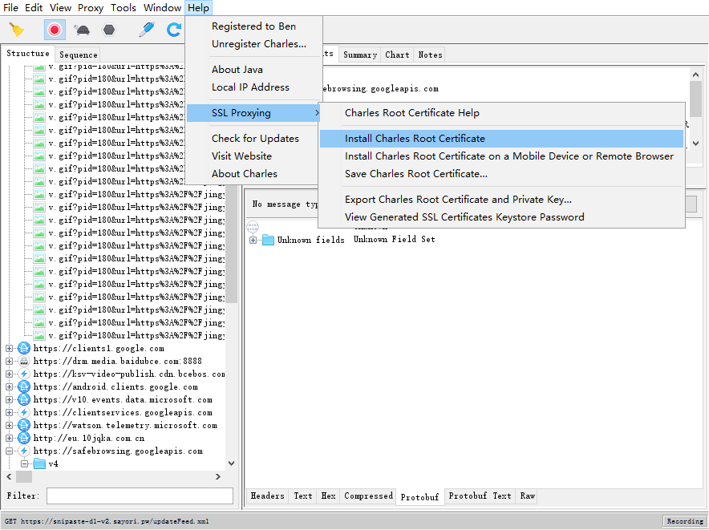
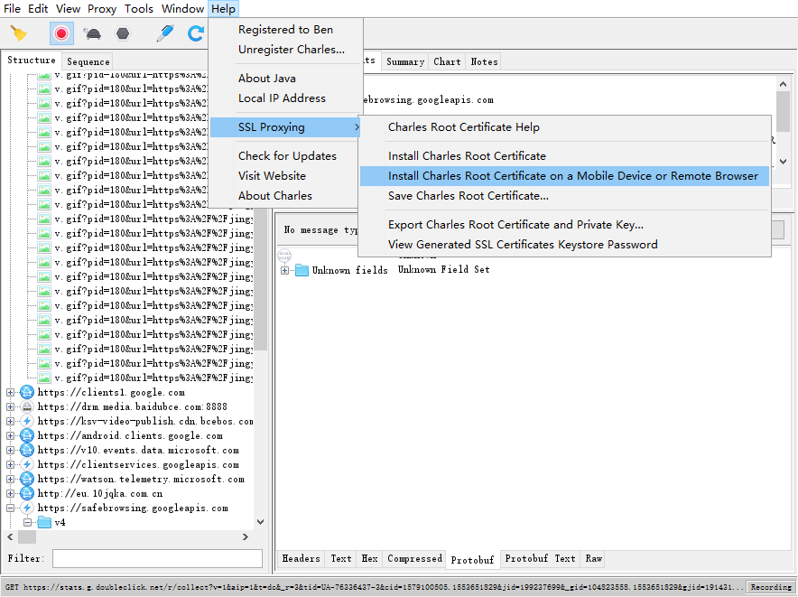
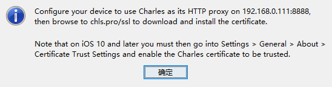

#### 1. docker安装  (注意: 基于 centos7 的操作)

- 1.如果系统已经自带, `docker --version` 或 `docker version`(推荐) 去查看 docker 是否是新版本;

  - docker涉及到很多权限问题, 建议操作都在 root 账户下
  - 确保 yum 包 更新到最新: `sudo yum update`
  - 如果是老版本, 则先卸载老版本:  `sudo yum remove docker  docker-common docker-selinux docker-engine`

- 2.其他 可以参考 [阿里云教程](https://help.aliyun.com/document_detail/60742.html) 

- 3.防火墙问题  (pycharm 配置 docker 的时候会报  没有到主机的路由)

  - 查看端口开放情况: `firewall-cmd --list-ports`
  - 开放端口: `firewall-cmd --zone=public --add-port=80/tcp –-permanent`     (开放80端口)
  - 关闭端口: `firewall-cmd –-remove-port=80/tcp --permanent`
  - **特别注意: 防火墙和端口修改后, 需要重启一下 防火墙的服务, 配置才能生效**  `service firewalld restart`  ,  而且这里是  `firewalld`  不是 `firewall`

- 4.配置成 **多个server和多个client** 的配置, 如果有 `/etc/docker/daemon.json` 文件则需要修改, 如果没有则创建.

  - ```json
    {
        "registry-mirrors": ["https://r0n0i7op.mirror.aliyuncs.com"],
        "hosts": [
            "tcp://0.0.0.0:2375",
            "unix:///var/run/docker.sock"
        ]
    }
    ```

  - 提示:  这里主要是配置 tcp 一行, unix 一行其实是默认值是否配置无所谓.    2375 端口是通常使用的端口, 其实改成别的未被使用的端口也可以.  

  - 需要重启 docker, 而且要通过 `docker version` 来查看  docker 服务是否开启

    - 重新加载配置项`systemctl daemon-reload` 和 `service docker start`

    - ```shell
      [root@localhost guang]# docker version
      Client:
       Version:           18.09.3
       API version:       1.39
       Go version:        go1.10.8
       Git commit:        774a1f4
       Built:             Thu Feb 28 06:33:21 2019
       OS/Arch:           linux/amd64
       Experimental:      false
      Cannot connect to the Docker daemon at unix:///var/run/docker.sock. Is the docker daemon running?
      [root@localhost guang]# service docker start
      Redirecting to /bin/systemctl start docker.service
      Job for docker.service failed because the control process exited with error code. See "systemctl status docker.service" and "journalctl -xe" for details.
      ```

    - 提示:  实际操作过程中出现过问题, docker远程访问被拒绝, 通过排查发现:

      - 1.两台机器(虚拟机上的代码机 和 虚拟机上的centos服务器) 可以相互 ping 通, 说明 IP 是通
      - 2.查看两台机器的防火墙都关闭, 且 服务器上的 2375 端口是开放的.
      - 3.通过`netstat -an|grep 2375` 发现服务器的监听是正常的. 但是通过   `telnet 127.0.0.1 2375` 查看发现  不正常, **推测是 服务器的 docker 服务出现问题.**  
      - 4.通过  `docker version` 发现客户端还在工作, 但是 server 挂掉. 重启多次并未成功. 推测和修改的 `/etc/docker/daemon.json` 有关系, 于是想到 配置 "registry-mirrors" 的时候必须是 自己登录 阿里云所分配的而不能是其他来源的.  
      - 5.中间还通过 屏蔽 `daemon.json` 的 每一行来逐一排除问题. 
      - 最后的最后, 其实啥也不是, 是启动项和我们配置的hosts 冲突的问题. 具体的可以参考[解决hosts启动冲突的问题](https://blog.csdn.net/jerry010101/article/details/85817893)

    - 看官方文档吃力是硬伤.


映射:

- docker 映射
- python解释器映射
- sftp映射


#### 2. 依赖安装的思路

- 1.先去  要安装的软件的官网 找 `install guide`
- 2.如果没有对应操作系统的依赖安装方式, 可以去 `github` 去搜索 别人已经有的
- 3.去看报错信息, 去谷歌百度搜索 依赖 的新名称
- 4.通过  apk 或 apt 等 + search + 模糊key 去搜索


`docker run -d -p 4444:4444 --shm-size=2g selenium/standalone-chrome:3.141.59-mercury`


更改 host   :  172.17.0.2  ----> chrome

连接被拒绝

```
  File "/usr/local/lib/python3.5/site-packages/urllib3/util/retry.py", line 398, in increment
    raise MaxRetryError(_pool, url, error or ResponseError(cause))
urllib3.exceptions.MaxRetryError: HTTPConnectionPool(host='chrome', port=4444): Max retries exceeded with url: /wd/hub/session (Caused by NewConnectionError('<urllib3.connection.HTTPConnection object at 0x7f3128da9828>: Failed to establish a new connection: [Errno 111] Connection refused',))
```

s

还涉及到一个知识点:

chrome 容器 和 容器中  chrome 是两回事. 需要 chrome容器工作起来之后, 还要 它其中的 chrome 跑起来.

这个时候 spider 去连接  才能 成功.


**授权问题**


#### 手机连接问题

通过  teamviewer 工具来进行手机的连接

Github提示的测试步骤:

- `docker run --privileged -d -p 4723:4723 -v ~/.android:/root/.android -v /dev/bus/usb:/dev/bus/usb --name container-appium appium/appium`
  - 激活测试的容器
  - `--privileged`  是进行授权 ,  在  yaml 文件中可以设置为  true
  - 两个映射也很重要, 一个是root用户的映射,解决每次连接都需要授权,  一个是 usb 驱动的映射

- `docker ps -a`  查看容器是否已经创建

- `docker exec -it container-appium adb devices`  

  - 当看到 一串  字符串码  的时候,表示已经连接成功了.
  - 然后, 查看手机的一些信息 作为 定制的`desired_capabilities` 配置信息

- `docker exec -it container-appium adb shell`

  - 前提要保证手机的连接

  - 在此命令执行成功后, 内部继续执行 `logcat | grep ActivityManager`

    - 会出来很多 内容, 但是都忽略

  - 然后,  点开任意一款 app  , 然后  控制台会打印新的内容, 注意 类似下面这些

    - ```
      cmp=com.ted.android/.view.splash.SplashActivity
      ```

    - `com.ted.android` 就是 `desired_caps["appPackage"]`

    - `.view.splash.SplashActivity` 就是 `desired_caps["appActivity"]`

- codes

  - ```python
    # -*- coding: utf-8 -*-
    from appium import webdriver
    import requests
    
    # 执行 docker exec -it container-appium adb devices 并保证手机正常连接
    # 然后找到下列信息
    desired_caps = {}
    desired_caps["platformName"] = "Android"  # 操作系统名称
    desired_caps["platformVersion"] = "8.0.0"  # 系统版本
    desired_caps["deviceName"] = "Nokia 6"  # 手机名称
    
    # 执行 docker exec -it container-appium adb shell, 并在内部执行  logcat | grep ActivityManager
    # 通过点击任意一款app, 然后从控制台 找到类似 "cmp=com.ted.android/.view.splash.SplashActivity"
    desired_caps["appPackage"] = "com.ted.android"
    desired_caps["appActivity"] = ".view.splash.SplashActivity"
    
    print("尝试连接")
    
    
    def test_chrome_server():
        while True:
            i = 0
            try:
                resp = requests.get("http://appium:4723/wd/hub/status", timeout=0.5)
            except Exception as e:
                i += 1
                if i > 10:
                    raise e
            else:
                print(resp.content)
                break
    
    
    test_chrome_server()
    
    driver = webdriver.Remote(
        command_executor = "http://appium:4723/wd/hub",
        # desired_capabilities = DesiredCapabilities.CHROME 因为容器内部没有chrome, 同时手机的型号多样需要自己定制.
        desired_capabilities = desired_caps
    )
    
    
    print("连接成功")
    import time
    time.sleep(3)  # 加一个延时, 保证界面完全 展示出来之后 再点击
    driver.find_element_by_android_uiautomator('text(\"热门\")').click()
    time.sleep(5)
    # driver.close()
    # 注意点  不再是 close 而是 quit 方法
    driver.quit()
    ```

- **授权问题**

  - 需要映射  `-v ~/.android:/root/.android`


#### 抓包

Charles(推荐)  [Charles 在线破解工具](https://www.zzzmode.com/mytools/charles/) [Charles 破解工具web版](https://github.com/8enet/Charles-Crack)

- 本地代理
- 本地代理只能同时有一个工作, 除非配置多级代理

HTTP抓包

HTTPS抓包

配置证书




**andriod 抓包**

- 1.需要和charles在同一个局域网网段, 可以通过无线wifi 发送连接
- 2.还需要配置 **[代理]** --> **[手动]** ,,   配置 :
  - 代理服务器主机名:   装charles的主机在局域网的ip
  - 代理服务器port:  在charles的代理设置中, 默认是 8888
- 3.**微信小程序的请求  https 协议**
  - 被charles代理之后, 是没法发送 https 请求的, 因为没有安装证书.
  - 但是, 可以通过浏览器 发送 https 请求.
  - 但是, 如果要 从 应用内部访问https 请求, 可以通过 charles 的 来配置
    - 
    - 出现如下弹框, 提示: 
      - 1.我们给手机配置  代理 IP 和 代理 port
      - 2.去手机浏览器 访问  chls.pro/ssl  下载证书
    - 


#### websocket 协议

**应用场景: **  直播平台 弹幕

| 协议      | 特点                                                         |
| --------- | ------------------------------------------------------------ |
| HTTP      | 1.请求和响应是一一对应的, 先由客户端发送, 服务器响应<br />2.单向<br />3.每次请求都是一个新的套接字, 资源主要消耗在 不停的开关套接字. |
| websocket | 1.类似套接字编程, 但是有 基于 HTTP 协议的握手过程.<br />2.当服务器和客户端都开启的时候, C 会发送请求 和 S 建立连接<br />3.C 和 S 之间 可以多次的 双向 推送消息<br />4.只用一个套接字 即可, 不会在一次请求后断开, 所以请求量很大的时候也会占用很多资源. <br />5.有长连接和短链接的方式, 但是用 websocket 一般都是用 长连接, 否则可以选 HTTP更好 |


