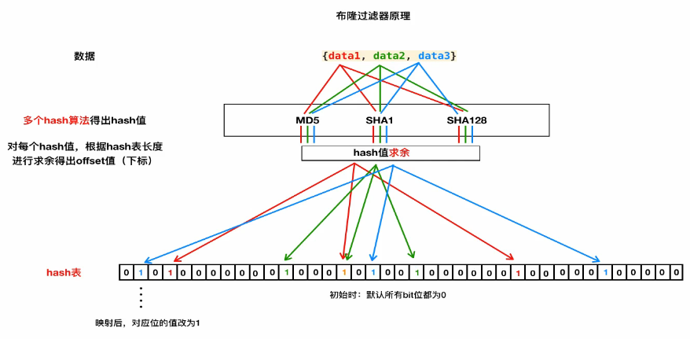
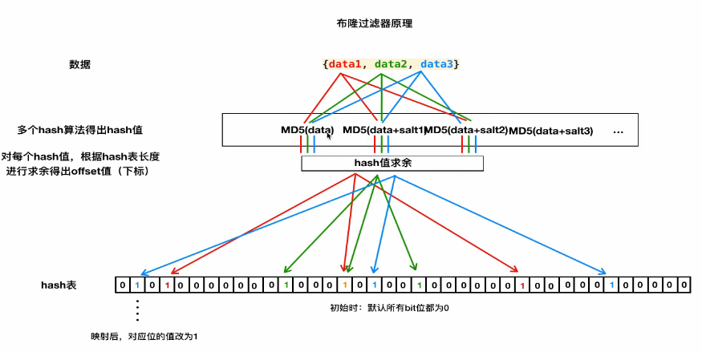

### 1. 去重的应用场景和基本原理

#### 1.1 场景引入思考:   

- 1.防止发送重复的请求
- 2.防止保存重复的数据

> 原理:一致, 对二进制字符串去重

#### 1.2 基本原理:

思考:

- 明确 数据构成类型(字符串, 数字 , 对象, 特殊字符...)  ==> 来制定去重方案
- 判断依据: 什么样的数据算作重复数据?

> 总结:
>
> ​	根据给定的 **[判断依据]** 和 **[去重容器]**, 将原始数据逐一进行判断, 判断去重容器中是否有该数据, 如果没有则把该数据的 **对应判断依据** 添加到去重容器中, 同时标记该数据是不重复数据; 如果有就不添加, 同时标记该数据是重复数据. 
>
> - **判断依据(原始数据, 原始数据特征值)**
> - **去重容器(存储判断依据)**

#### 1.3 特征值判断原因:

- 业务需求
- 效率考量(内存中, 不能太大, 同时判断的速度要足够快)

#### 1.4 去重容器 方案选择


### 2. 基于信息摘要算法的去重

#### 2.1 信息摘要hash算法介绍

- 信息摘要hash算法可以将 **任意长度**的文本、字节数据, 通过 算法 得到一个**固定长度**的文本。如, MD5(32位16进制, 128Bit, 16Byte) 、SHA1(40位16进制, 160Bit, 20Byte)等.

  - 特征:  ==只要源文本不同, 计算得到的结果(摘要)必然不同==
  - 摘要: 摘要算法主要用于比对信息源是否一致, 因为只要源发生变化, 得到的摘要必然不同;  而且通常结果要比源短很多, 所以称为 "摘要"。

- 正因此, 利用信息摘要算法能大大降低去重容器的存储空间使用率, 并提高判断速度, 且由于其强唯一性的特征, 几乎不存在误判.

- 注意: 

  - hash算法得出的结果本质就是一串数值, 如md5的128位指的是二进制的长度, 十六进制的长度是32位. 一个16进制等于4个二进制(位数不足前面填0). 

- ```python
  In [1]: from hashlib import md5
  
  In [2]: m5 = md5()  # 小写
  
  In [3]: m5.update("abscedwwasgfsdfsd")  # python2 中这里不会报错, py3中会报错
  ---------------------------------------------------------------------------
  TypeError                                 Traceback (most recent call last)
  <ipython-input-3-6002a57d4a95> in <module>()
  ----> 1 m5.update("abscedwwasgfsdfsd")
  
  TypeError: Unicode-objects must be encoded before hashing
  
  # 对于 字符串来说 [4] 和 [5] 的操作是等价的. 
  # 中文字符串前面不能用 b"", 因为不支持 ascii码
  In [4]: m5.update("abscedwwasgfsdfsd".encode("ascii"))
  
  In [5]: m5.update(b"abscedwwasgfsdfsd")
  
  In [6]: m5.hexdigest()  # 转化成16进制
  Out[6]: '12cc79930ee8b571799afd0b0282d133'
  # Out[6] 字符串中每一个char对应的都是单独的16进制, 每个char又可以 先转换成10进制, 再10->2进制
  In [7]: int("f", 16)
  Out[7]: 15
  
  In [8]: bin(15)
  Out[8]: '0b1111'  # 0b表示是2进制
  
  In [9]: bin(5)
  Out[9]: '0b101'  # 位数不足4位, 实际操作中会在前面补0
  
  ```

#### 2.2 信息摘要hash算法去重方案实现

- 普通内存版本
  - set()    
  - 生命周期就是当前运行的程序.
- Redis持久化版本
  - 中断或者重启, 数据不丢失, 且对速度要求比较高
- MySQL持久化版本
  - 对效率要求不是特别高
  - 一般 单表加索引 可以支持 "几十万到几百万" 的业务量级.

**CODE**

- `__init__.py`

```python
# -*- coding: utf-8 -*-
# 基于mysql的去重判断依据的存储
from sqlalchemy import create_engine, Column, Integer, String
from sqlalchemy.orm import sessionmaker
from sqlalchemy.ext.declarative import declarative_base

Base = declarative_base()

from . import BaseFilter


# class Filter(Base):
#     """"""
#     __tablename__ = "filter"
#
#     id = Column(Integer, primary_key=True)
#     hash_value = Column(String(40), index=True, unique=True)


class MySQLFilter(BaseFilter):
    """基于mysql的去重判断依据的存储"""

    def __init__(self, *args, **kwargs):
        # class Filter(Base):
        #     """"""
        #     __tablename__ = kwargs["mysql_table_name"]
        #
        #     id = Column(Integer, primary_key=True)
        #     hash_value = Column(String(40), index=True, unique=True)

        # 方法中创建类, 不太符合python风格, 可以选择使用 type 动态创建

        # self.table = Filter

        self.table = type(
            kwargs["mysql_table_name"],
            (Base,),
            dict(
                __tablename__=kwargs["mysql_table_name"],
                id=Column(Integer, primary_key=True),
                hash_value=Column(String(40), index=True, unique=True)
            )
        )

        BaseFilter.__init__(self, *args, **kwargs)

    def _get_storage(self):
        """返回一个mysql连接对象(sqlalchemy的数据库连接对象)"""
        engine = create_engine(self.mysql_url)
        Base.metadata.create_all(engine)
        Session = sessionmaker(engine)  # Session 相当于一个类
        return Session

    def _save(self, hash_value):
        """
        利用mysql(sqlachemy)
        :param hash_value:
        :return:
        """
        session = self.storage()
        filter = self.table(hash_value=hash_value)
        session.add(filter)
        session.commit()
        session.close()

    def _is_exists(self, hash_value):
        """"""
        session = self.storage()
        ret = session.query(self.table).filter_by(hash_value=hash_value).first()
        session.close()
        if ret is None:
            return False
        return True
```


### 3. 基于 Simhash 算法的去重

#### 3.1 Simhash 介绍以及应用场景

- Simhash 算法是一种局部敏感hash算法, 能实现 **相似** 文本内容的去重。

#### 3.2 Simhash的特征

- 与信息摘要算法的区别

  | 信息摘要算法                                            | Simhash算法                                         |
  | ------------------------------------------------------- | --------------------------------------------------- |
  | 如果原始内容只相差一个字节, 所产生的签名也可能差别很大. | 如果原始内容只相差一个字节, 所产生的签名差别非常小. |

- **海明距离**: 比较两者的simhash值的**二进制位**的差异来表示原始文本内容的差异. 差异个数又被称为**海明距离.**

- 注意:

  - Simhash 对长文本 500字+ 比较适用, 短文本可能偏差较大
  - 在Google的论文给出的数据中, 64位simhash值, 在海明距离为3(<=3)的情况下, 可以认为两篇文档是相似的或者是重复的. 当然这个值只是参考值, 针对自己的应用可能有不同的测试取值.

#### 3.3 Simhash值得比对

- Python实现的 [simhash](https://github.com/leonsim/simhash) 算法.  该模块得出的simhash值长度正是64位
- 64 或者 其他位数 都可以, 但是进行对比的 长度必须一致

#### 3.4 代码片段

```python
# -*- coding: utf-8 -*-

# 代码来自: https://leons.im/posts/a-python-implementation-of-simhash-algorithm/ , 略有修改

import re
from simhash import Simhash


def get_features(s):
    width = 3
    s = s.lower()  # 全部转换成小写
    s = re.sub(r'[^\w]+', '', s)  # 将空白字符或者标点符号 删除
    ret = [s[i:i + width] for i in range(max(len(s) - width + 1, 1))]  # 类似分词操作
    print(ret)
    return ret


print('%x' % Simhash(get_features('How are you? I am fine. Thanks.')).value)
print('%x' % Simhash(get_features('How are u? I am fine.     Thanks.')).value)
print('%x' % Simhash(get_features('How r you?I    am fine. Thanks.')).value)

# 分词
print(Simhash('aa').distance(Simhash('bb')))  # 31
print(Simhash(['aa', 'a']).distance(Simhash(['aa', 'b'])))  # 10
```


### 4. 布隆过滤器原理与实现

*注: 适用于亿级数据, 相比hash还要缩小16倍资源的占用率*

#### 4-1 布隆过滤器的原理:




#### 4-2 布隆过滤器原理解读

##### 4-2-1. hash表特征(上图)

- 有序

- 定长(和初始创建的容量大小有关)
- 元素只能是: 0 或 1, 默认值全部是 0 

##### 4-2-2. 上图的映射关系

- 1.将数据 **data** 通过 **摘要算法** 生成 16进制的 字符串
  - 每个数据会经过不同的摘要算法进行一次处理. 每次处理都会修改一个对应的比特位数据从0->1
- 2.将 16进制 的字符串 转换成 10进制  (使用 int 方法)
- 3.将 转换后 的数据 对 hash表的长度进行 ==取余== 操作, 获取 偏移量offset (hash表的下标索引)
  - offset 值一定是 小于  hash表的容量(长度)
- 4.将对应 offset 下标对应的 比特位数值 从默认的0 修改为 1

- 5.上述是基本数据的完成. 当我们需要目标数据进行判断的时候, 对目标数据进行同样的 1-3步 的操作 , 只是在第4步操作的时候, 不再进行修改元素的值, 而是对该位置的元素进行是否为1的判断. 

  - **当目标数据通过 不同摘要算法 映射的offset 对应的元素的值全部为1 的时候 当作 重复依据**
  - 布隆过滤器的误判 --  没法避免

##### 4-2-3. 布隆过滤器存在误判  

  - 1.误判率:   1/万 ~ 1/10万
  - 2.解决思路: 
      - 1.增加 hash函数的个数
          - python中解决**内置hash函数不足**的问题方法 -- ==同一个hash函数+加盐==
          - 经验上 5-10 个比较合适, 一般选择 5,7,9 个等
      - 2.增加hash表的长度



##### 4-2-4. 原理代码demo

```python
In [1]: from hashlib import md5

In [2]: m5 = md5()

In [3]: m5.update("a")
---------------------------------------------------------------------------
TypeError                                 Traceback (most recent call last)
<ipython-input-3-d720aed72802> in <module>()
----> 1 m5.update("a")

TypeError: Unicode-objects must be encoded before hashing

In [4]: m5.update("a".encode())

In [5]: m5.hexdigest()
Out[5]: '0cc175b9c0f1b6a831c399e269772661'  # md5 生成的 16进制数据

In [6]: int('0cc175b9c0f1b6a831c399e269772661', 16)
Out[6]: 16955237001963240173058271559858726497  # 转换成10进制

In [7]: 256 * 1024 * 1024 * 8  # 256MB -> bit位
Out[7]: 2147483648  # 大约是 21 亿

In [8]: 16955237001963240173058271559858726497 % 2147483648  # 摘要算法的10进制值 取余 容量 , 计算出 offset (或者叫 index)
Out[8]: 1769416289
```

#### 4-3 布隆过滤器实现

- Python实现的 内存版布隆过滤器 [pybloom](https://github.com/jaybaird/python-bloomfilter)   -- 基于内存版本的实现

- 手动实现的redis版本的布隆过滤器  [redis 命令参考](http://doc.redisfans.com/)  通过 `BIT` 进行模糊搜索
  - 发现   `SETBIT` 和 `GETBIT`  满足要求
  - **注意:**
    - 1.需要了解 redis 的几种数据结构, 其中 bit 是一种特殊的 string 类型.
    - 2.string类型在 redis中 可以保存的 容量上线是 512Mb  , 换算成bit位大约是 42亿 左右. 

##### 代码

```python
# -*- coding: utf-8 -*-
# 布隆过滤器redis版本实现


# 1.多个hash函数的实现 和 求值
# 2.hash表的实现 实现对应的映射 和判断
# 3.Notice: the salts and the len of hash list mustn't modify in same project
import hashlib

import six
import redis


class MultipleHash(object):
    """根据提供的原始数据, 和预定义的多个 salt, 生成多个hash函数值"""
    def __init__(self, salts, hash_func_name="md5"):
        self.hash_func = getattr(hashlib, hash_func_name)
        if len(salts) < 3:
            raise Exception("please provide more than 3 element(salt) in the salts")
        self.salts = salts

    def _safe_data(self, data):
        """
        python3 bytes <=> python2 str
        python3 str <=> python2 unicode
        :param data: 原始数据
        :return: 处理成对应python版本可以被 hash函数的update方法解析的数据
        """
        if six.PY3:
            if isinstance(data, str):
                return data.encode()
            elif isinstance(data, bytes):
                return data
            else:
                raise Exception("please provide a right str data")
        else:
            if isinstance(data, unicode):
                return data.encode()
            elif isinstance(data, str):
                return data
            else:
                raise Exception("please provide a right str data")

    def get_hash_values(self, data):
        """根据提供的原始数据, 返回多个hash函数值"""
        hash_values = []
        hash_obj = self.hash_func()
        for salt in self.salts:
            hash_obj.update(self._safe_data(data))
            hash_obj.update(self._safe_data(salt))
            ret = hash_obj.hexdigest()
            hash_values.append(int(ret, 16))
        return hash_values


class BloomFilter(object):
    """布隆过滤器"""
    def __init__(self, salts, redis_host="localhost", redis_port=6379, redis_db=0, redis_key="bloomfilter"):
        self.redis_host = redis_host
        self.redis_port = redis_port
        self.redis_db = redis_db
        self.redis_key = redis_key
        self.client = self._get_redis_cli()
        self.multiple_hash = MultipleHash(salts=salts)

    def _get_redis_cli(self):
        """返回一个redis链接对象"""
        pool = redis.ConnectionPool(host=self.redis_host, port=self.redis_port, db=self.redis_db)
        client = redis.StrictRedis(connection_pool=pool)
        return client

    def save(self, data):
        hash_values = self.multiple_hash.get_hash_values(data)
        for hash_value in hash_values:
            offset = self._get_offset(hash_value)
            self.client.setbit(self.redis_key, offset, 1)  # default 0 , set 1 when match
        return True

    def _get_offset(self, hash_value):
        # (2**9 * 2**20 * 2**3) :  the len of hash list
        return hash_value % (2**9 * 2**20 * 2**3)  # 512MB*1024*1024*8　：MB->bit位

    def is_exists(self, data):
        hash_values = self.multiple_hash.get_hash_values(data)
        for hash_value in hash_values:
            offset = self._get_offset(hash_value)
            v = self.client.getbit(self.redis_key, offset)
            if v == 0:
                return False
        return True


if __name__ == '__main__':
    # mh = MultipleHash(['1', '2', '3'])
    # ret = mh.get_hash_values("aongaojrwqojnafsojfoasfwxsgwecx")
    # print(ret)
    data = ["asfdsafweafxc", "123", "123", "456", "vmb", "vmb"]
    bm = BloomFilter(salts=["1", '2', '3', '4'])
    for d in data:
        if not bm.is_exists(d):
            bm.save(d)
            print("mapping data success : %s" % d)
        else:
            print("find replace data : %s" % d)
```


