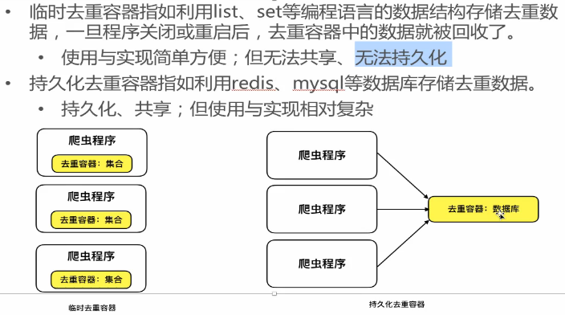

### 1. 去重的应用场景和基本原理

#### 1.1 场景引入思考:   

- 1.防止发送重复的请求
- 2.防止保存重复的数据

> 原理:一致, 对二进制字符串去重

#### 1.2 基本原理:

思考:

- 明确 数据构成类型(字符串, 数字 , 对象, 特殊字符...)  ==> 来制定去重方案
- 判断依据: 什么样的数据算作重复数据?

> 总结:
>
> ​	根据给定的 **[判断依据]** 和 **[去重容器]**, 将原始数据逐一进行判断, 判断去重容器中是否有该数据, 如果没有则把该数据的 **对应判断依据** 添加到去重容器中, 同时标记该数据是不重复数据; 如果有就不添加, 同时标记该数据是重复数据. 
>
> - **判断依据(原始数据, 原始数据特征值)**
> - **去重容器(存储判断依据)**

#### 1.3 特征值判断原因:

- 业务需求
- 效率考量(内存中, 不能太大, 同时判断的速度要足够快)

#### 1.4 去重容器 方案选择

