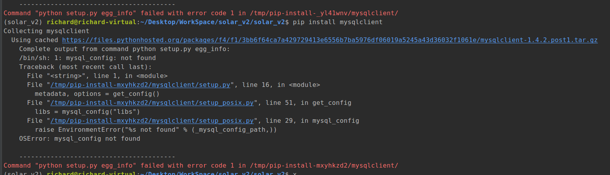

1.在 gitlab上新建项目仓库, 通过命令行把上一个版本的代码发布


2.配置 pycharm 连接 gitlab, 避免反复 写 用户名和密码


3.修改 settings.py 文件, 把上一个版本的代码跑起来.

- 配置mysql数据库, 两个选择:  可视化工具  |  命令行

- 给mysql 分配用户名和权限, 不要用 root 用户名和权限.

  ```shell
  # 此坑待填, 此语法和mysql的版本关系很大, 要注意
  grant all privileges on 库.表 to 用户名 identified by 密码;  # 分配对了,才能正常显示
  # 库: 指定数据库;
  # 表: 如果没有具体的表, 可以用 * 来指代所有的表
  # 用户名: 不加 引号
  # 密码: 必须加引号
  ```


4.安装 `mysqlclient-1.3.12`的时候如果报错:



 原因: 缺少python的依赖环境, 我试过网上的: `ln -s /usr/local/mysql/bin/mysql_config /usr/local/bin/mysql_config` 发现在 `ubuntu16.04` 下无效.

最终解决办法: `sudo apt-get install libmysqlclient-dev`,    可能有的还需要安装  `python3-dev`


**API**

```json
{
    "api/web/v2/codes": "http://127.0.0.1:8000/api/web/v2/codes/",
    "api/web/v2/register": "http://127.0.0.1:8000/api/web/v2/register/",
    "api/web/v2/login": "http://127.0.0.1:8000/api/web/v2/login/",
    "api/web/v2/logout": "http://127.0.0.1:8000/api/web/v2/logout/",
    "api/web/v2/update/company": "http://127.0.0.1:8000/api/web/v2/update/company/",
    "api/web/v2/industries": "http://127.0.0.1:8000/api/web/v2/industries/",
    "api/web/v2/update/user_info": "http://127.0.0.1:8000/api/web/v2/update/user_info/",
    "api/web/v2/drones/common": "http://127.0.0.1:8000/api/web/v2/drones/common/",
    "api/web/v2/payloads/common": "http://127.0.0.1:8000/api/web/v2/payloads/common/",
    "api/web/v2/company/drones": "http://127.0.0.1:8000/api/web/v2/company/drones/",
    "api/web/v2/company/payloads": "http://127.0.0.1:8000/api/web/v2/company/payloads/",
    "api/web/v2/applications": "http://127.0.0.1:8000/api/web/v2/applications/",
    "api/web/v2/company/projects": "http://127.0.0.1:8000/api/web/v2/company/projects/",
    "api/web/v2/company/task_templates": "http://127.0.0.1:8000/api/web/v2/company/task_templates/",
    "api/web/v2/company/apps": "http://127.0.0.1:8000/api/web/v2/company/apps/",
    "api/web/v2/company/app_temp_config": "http://127.0.0.1:8000/api/web/v2/company/app_temp_config/",
    "api/web/v2/company/tasks": "http://127.0.0.1:8000/api/web/v2/company/tasks/",
    "api/web/v2/upload_file": "http://127.0.0.1:8000/api/web/v2/upload_file/",
    "api/web/v2/app_config": "http://127.0.0.1:8000/api/web/v2/app_config/",
    "api/web/v2/get_users": "http://127.0.0.1:8000/api/web/v2/get_users/",
    "api/web/v2/get_project_tasks": "http://127.0.0.1:8000/api/web/v2/get_project_tasks/",
    "api/web/v2/smart_flight_resources": "http://127.0.0.1:8000/api/web/v2/smart_flight_resources/",
    "api/web/v2/get_fly_safe_info": "http://127.0.0.1:8000/api/web/v2/get_fly_safe_info/",
    "api/web/v2/common_flights": "http://127.0.0.1:8000/api/web/v2/common_flights/",
    "api/web/v2/update_task_app": "http://127.0.0.1:8000/api/web/v2/update_task_app/",
    "api/web/v2/mobile_device/common": "http://127.0.0.1:8000/api/web/v2/mobile_device/common/",
    "api/web/v2/company/mobile_device": "http://127.0.0.1:8000/api/web/v2/company/mobile_device/",
    "api/web/v2/company/get_task_applications_info": "http://127.0.0.1:8000/api/web/v2/company/get_task_applications_info/",
    "api/web/v2/company_register_code": "http://127.0.0.1:8000/api/web/v2/company_register_code/",
    "api/web/v2/flying_drones": "http://127.0.0.1:8000/api/web/v2/flying_drones/",
    "api/web/v2/task_app_status": "http://127.0.0.1:8000/api/web/v2/task_app_status/",
    "api/web/v2/update_task_app_status": "http://127.0.0.1:8000/api/web/v2/update_task_app_status/",
    "api/web/v2/drone_insurance": "http://127.0.0.1:8000/api/web/v2/drone_insurance/",
    "api/web/v2/company/pilot": "http://127.0.0.1:8000/api/web/v2/company/pilot/",
    "api/web/v2/company/pv_detection": "http://127.0.0.1:8000/api/web/v2/company/pv_detection/",
    "api/web/v2/company/defects": "http://127.0.0.1:8000/api/web/v2/company/defects/",
    "api/app/v2/task_flights": "http://127.0.0.1:8000/api/app/v2/task_flights/",
    "api/app/v2/login": "http://127.0.0.1:8000/api/app/v2/login/",
    "api/app/v2/app_flights": "http://127.0.0.1:8000/api/app/v2/app_flights/",
    "api/app/v2/company_drone_info": "http://127.0.0.1:8000/api/app/v2/company_drone_info/",
    "api/app/v2/smart_flight_resources": "http://127.0.0.1:8000/api/app/v2/smart_flight_resources/",
    "api/app/v2/company/projects": "http://127.0.0.1:8000/api/app/v2/company/projects/"
}
```


虚拟机网络问题:

- 1.要在操作系统的内部右下角, 设置网路的设置是:  `桥接模式`
- 2.要保证虚拟机的上面`虚拟网路设置` 必须是 桥接模式
- 3.推测(可能有错误, 仅个人电脑操作发现):  
  - 3.1如果虚拟网卡绑定的是无线网卡, 那么不能设置固定ip, 否则 "一宿两虚" 之间总有个别之间不能通信.
  - 3.2如果虚拟网卡绑定的是有限网卡, 那么似乎可以设置固定ip.
- 4.要关闭宿主机的外网防火墙,   否则可能出现 内网可以访问外网("虚拟机可以ping通宿主机"),  但是外网没法访问内网("宿主机没法ping通虚拟机")
- 5.通过 ping 来保证网络都是互相可以通信的. 然后, WIN10 配置 防火墙的高级设置 , 配置 ==出入站规则==
- 6.云服务器还要考虑到 `配置安全组`
- 7.如果是宿主机或者局域网访问 pycharm启动的 django应用, 那么启动脚本不能使用默认的 127.0.0.1的ip, 而应该更换成  0.0.0.0的 ip.


**网络问题(续)**

远程生产服务器部署, 考虑安全组问题, 需要查看端口开放问题:

- `telent ip port`


```latex
1./api/web/v1/login/  返回的数据:  全部应用列表 ->  部分应用列表.(不再返回应用列表)
修改版本号

2.新建电站类型.
增加模型类, 设置外键关联
```


**整理一个django开发的框架**


**整理一套完整的django部署的框架, 通过自动化脚本来实现**


项目可以复用,  目录必须要  使用 BASE_DIR

如果和别人合作, 有指定的目录, 也要再弄一个  TEMP_DIR


日志类进行一个封装, 其他类型的 日志配置  信息


**配置虚拟机内部的mysql给外部的navicat for mysql访问**

- 1.修改mysql的配置文件:   `/etc/mysql/mysql.conf.d/mysqld.cnf` , 注释掉 : `bind-address=127.0.0.1`
  - 1.1不同的mysql版本, 配置文件的位置可能有所不同;
  - 1.2 只读文件, 需要  `sudo` 权限
- 2.重启mysql服务  `service mysql restart`


版本管理


**自动生成api文档**

- 1.coreapi
- 2.


```python
cd /usr/local/src/kafka_2.11-1.1.0 && bin/zookeeper-server-start.sh -daemon config/zookeeper.properties
bin/kafka-server-start.sh config/server.properties
```


脚本问题

索要配置的域名


##### 安装搜狗输入法问题

- ##### 忘记去掉勾选 [√] **current** 

##### 

才安装的新OS， 需要很多依赖。所以报很多错， 还会出现 文件锁的问题

解决思路：

```shell
sudo rm /var/cache/apt/archives/lock
sudo rm /var/lib/dpkg/lock
```

解决 wsgi 安装报错的最终解决方案是:

报错信息:

```shell
    [thread 3][x86_64-linux-gnu-gcc -pthread] core/dot_h.o
    [thread 1][x86_64-linux-gnu-gcc -pthread] core/config_py.o
    *** uWSGI compiling embedded plugins ***
    [thread 0][x86_64-linux-gnu-gcc -pthread] plugins/python/python_plugin.o
    [thread 2][x86_64-linux-gnu-gcc -pthread] plugins/python/pyutils.o
    [thread 3][x86_64-linux-gnu-gcc -pthread] plugins/python/pyloader.o
    [thread 1][x86_64-linux-gnu-gcc -pthread] plugins/python/wsgi_handlers.o
    In file included from plugins/python/pyutils.c:1:0:
    plugins/python/uwsgi_python.h:2:20: fatal error: Python.h: No such file or directory
    compilation terminated.
    In file included from plugins/python/python_plugin.c:1:0:
    plugins/python/uwsgi_python.h:2:20: fatal error: Python.h: No such file or directory
    compilation terminated.
    In file included from plugins/python/pyloader.c:1:0:
    plugins/python/uwsgi_python.h:2:20: fatal error: Python.h: No such file or directory
    compilation terminated.
    In file included from plugins/python/wsgi_handlers.c:1:0:
    plugins/python/uwsgi_python.h:2:20: fatal error: Python.h: No such file or directory
    compilation terminated.
    
    ----------------------------------------
Command "/home/guang/.virtualenvs/AIsland/bin/python3 -u -c "import setuptools, tokenize;__file__='/tmp/pip-install-279e4kzn/uWSGI/setup.py';f=getattr(tokenize, 'open', open)(__file__);code=f.read().replace('\r\n', '\n');f.close();exec(compile(code, __file__, 'exec'))" install --record /tmp/pip-record-jjv5v2xd/install-record.txt --single-version-externally-managed --compile --install-headers /home/guang/.virtualenvs/AIsland/include/site/python3.5/uWSGI" failed with error code 1 in /tmp/pip-install-279e4kzn/uWSGI/
```

解决方案:

```shell
sudo apt-get install libpython3.x-dev
#  x 代表的是python的版本, 我这里是 3.5  所以就用的 3.5
```

 新的操作系统安装`pillow库`的时候要安装很多依赖环境:

- 针对  centos7 的操作系统

```
yum install zlib zlib-devel
yum install libjpeg libjpeg-devel
yum install freetype freetype-devel
```

- 针对 ubunut16.04操作系统

```shell
sudo apt-get install libtiff5-dev libjpeg8-dev zlib1g-dev libfreetype6-dev liblcms2-dev libwebp-dev tcl8.6-dev tk8.6-dev python-tk
```


分纯python代码实现的库和 其他语言实现的python库

```shell
yum install python-devel
yum install zlib-devel
yum install libjpeg-turbo-devel
```

脚本的原因:

**监听程序应该怎么写才更加有通用性呢?**


分支切换问题

```shell
git clone 
git pull origin dev
git branch  # 查看当前本地分支
git branch --set-upstream-to=origin/dev  # 本地分支关联到远程的dev分支
git push origin 本地分支名  # 提交本地分支到远程仓库
```

好好学习一下git 吧, 太菜了


mysqlclient

>  OSError: mysql_config not found
>
> 缺少依赖, 需要安装 `sudo apt-get install python3.5-dev libmysqlclient-dev`      这里 3.5 是我的python解释器版本号
>
> ​	注:  操作系统的版本是:   ubuntu16.04


服务单独一个个是否能启动, 然后联合测试

> 居然遇到一个 mysql 版本问题
>
> 关于MySQL服务的数据卷映射:
>
> - 1.冒号前面是宿主机的目录, 后面是容器内部的目录
> - 2.容器内部的目录不是宿主机的目录, 这里有点绕. 但是我之前理解的就是错误的.


ubuntu 安装  pdfkit 的依赖

```latex
apt-get -f install fonts-dejavu-core libfontconfig1 fontconfig-config  libfontenc1 fontconfig libxrender1 x11-common  libxfont1 xfonts-encodings xfonts-utils xfonts-base xfonts-75dpi
```


---

## 2019.4.22 -- 2019.4.28

1.创建超级用户:

```
username :  13207163828
email: guang@boonray.com
password: solar2019

pbkdf2_sha256$36000$VkrzSgoZYjyt$j4kqhONnaBp909wJV/AaKNfIDLR1JpH8KiLJsbHesLc=
pbkdf2_sha256$36000$RSQbDZ17TLMY$hq/St1Npjy4YU+qK+qmdjffv99qvt0XT6Oi7tHcPKjI=
pbkdf2_sha256$36000$iBcRsW0KB3Ps$eMesqRaSl7h93dSpu7egNj3gZD2oPyjmA8nTLMTIbmk=
行业版:
pbkdf2_sha256$36000$XxZnzxCDhYZX$P4tMQAvnJaTkar3SO0Uc0b61P3XvZfuciYiP64g2l6A=


"token": "f7c209a715ffaa8815b39efb620c1cbdb4e871dd"
```


登录成功的返回信息:

```
{
    "message": "登录成功",
    "data": {
        "privilege": "0",
        "company_id": null,
        "user_id": 1,
        "applications": [],
        "token": "f7c209a715ffaa8815b39efb620c1cbdb4e871dd",
        "last_login": "2019-04-22 11:31:36"
    },
    "code": 200
}
```


```
https://solar_api.boonray.com/api/web/v1/get_users/   # 公司下的所有成员

https://solar_api.boonray.com/api/web/v1/industries/  # 选行业相关, 去掉

每个电站 == 一个项目
prject/19/   admin 是项目所有者,   member 是项目成员

新建巡检  选择应用:光伏缺陷识别  去掉 ;  加上镜头数据

缺陷相关的接口:
https://solar_api.boonray.com/api/web/v1/company/pv_detection/?task_id=79

api/web/v2/company/tasks/ 新建任务(application_id 的问题)
```

