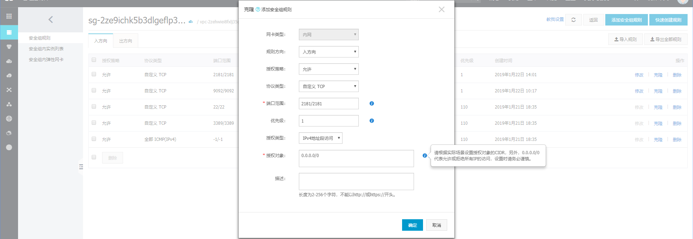

## 阿里云搭建kafka服务器

### 1. 安装JDK

1.1 下载对应版本:  [jdk-8u201-linux-x64.tar.gz]

`https://www.oracle.com/technetwork/java/javase/downloads/jdk8-downloads-2133151.html`

 (需要权限, 当出现弹框的时候点击 ` Accept License Agreement`, 然后再点击下载链接)

1.2 使用 **`SFTP工具`** 传输到服务器, 创建目录并解压

```bash
mkdir /usr/java
cd /usr/java
tar zxvf jdk-8u201-linux-x64.tar.gz
```

1.3 环境配置

```bash
vi /etc/profile

export JAVA_HOME=/usr/java/jdk1.8.0_201
export CLASSPATH=.:$JAVA_HOME/jre/lib/rt.jar:$JAVA_HOME/lib/dt.jar:$JAVA_HOME/lib/tools.jar 
export PATH=$PATH:$JAVA_HOME/bin
(建议加在  done 后面)
```

使配置的环境生效: `source /etc/profile`

1.4 测试是否成功 :  `java -version`

### 2. 安装`kafka_2.11-1.1.0`

2.1 官网下载kafka安装包, 同上面的操作上传到服务器`/opt/kafka`目录下, 解压

2.2 进入`config` 目录并修改 `server.properties` 文件

```sh
# The id of the broker. This must be set to a unique integer for each broker.
broker.id=0
port=9092
host.name=172.17.137.186  # 这里是我的阿里云内网地址, 如果在本地可以设未127.0.0.1
```

温馨提示:

```
接下来修改kafka安装目录下 bin/kafka-server-start.sh的参数，把jvm的内存设置小一点（原来默认1G），如下：

export KAFKA_HEAP_OPTS="-Xmx256M -Xms256M"

（因为我的阿里云虚机内存只有1G，不改小的话，jvm会报内存错误)
```

### 3. 配置阿里云安全组规则

3.1 需要配置 `9092`和`2181` 两个端口

3.2 具体安全组设置



### 4. 启动kafka

1. 打开一个新的Shell，切换到kafka安装目录，执行如下命令启动zookeeper

bin/zookeeper-server-start.sh config/zookeeper.properties

2. 打开一个新的Shell，切换到kafka安装目录，执行如下命令启动broker

bin/kafka-server-start.sh config/server.properties

3. 打开一个新的Shell，切换到kafka安装目录，执行如下命令启动consumer

bin/kafka-console-consumer.sh --bootstrap-server  阿里云公网IP：9092  --topic test  --from-beginning

4. 打开一个新的Shell，切换到kafka安装目录，执行如下命令启动producer

bin/kafka-console-producer.sh --broker-list 阿里云公网IP:9092  --topic test

(之后，在第4个shell里输入消息，便可以在第3个Shell里接收到消息了)

### 5.kafka 工具: kafka Tool

​	1.kafka可视化工具, 类似 `Navicat for sql` 很好用. 

### 6.python操作的代码

**略**

- 1.作为 **生产者** 产生的 topic 如果不存在, 那么在 kafka 服务器中会自动创建 topic 到列表中
- 2.作为 **消费者** 可以设置为 **手动** **同步|异步** 提交修改偏移量. 实现 **断点续传** 功能. 当然可以用替代方法 `auto_offset_reset='earliest'`   注: 未测试过
