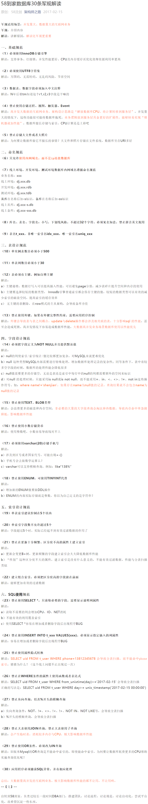

数据库触发器:

```latex
触发器（trigger）是SQL server 提供给程序员和数据分析员来保证数据完整性的一种方法，它是与表事件相关的特殊的存储过程，它的执行不是由程序调用，也不是手工启动，而是由事件来触发，比如当对一个表进行操作（ insert，delete， update）时就会激活它执行。触发器经常用于加强数据的完整性约束和业务规则等。 触发器可以从 DBA_TRIGGERS ，USER_TRIGGERS 数据字典中查到。SQL3的触发器是一个能由系统自动执行对数据库修改的语句。
触发器与存储过程的唯一区别是触发器不能执行EXECUTE语句调用，而是在用户执行Transact-SQL语句时自动触发执行。
```


数据库视图:


数据库设计:

[58到家数据库30条军规解读](https://mp.weixin.qq.com/s/Yjh_fPgrjuhhOZyVtRQ-SA?)



---


#### 省市区(自关联)

网络通信

数据库

- 缓存
- 索引
- 优化

web安全

- 字段: password_hash

坑

话术

登录|登录| 点赞|防止骗赞| 爬虫|反扒

reids  -- demo(订单, 设计...)

MRO   和    ORM  是两个不同的概念,不要搞混淆


### django开发中数据库优化

- 1.设计表时, 尽量减少外键,因为外键会影响插入和删除的新能;
- 2.使用缓存, 减少对数据库的访问;
- 3.Django ORM框架 下的 QuerySet本来就有缓存.
- 4.可以给搜索频率高的字段属性, 在定义时创建索引.
- 5.减少对数据库的联结次数(网络耗时操作),比如在redis中用pipeline等. 
  - 如果一个页面要多次连接数据库,最好一次取出所需要的全部数据,减少对数据库的查询次数.
- 6.查询的字段的时候只取必要的一些字段
- 7.在ORM框架下设置表时,能用varchar确定字段的长度时, 就别用 text;
- 8.在模板标签里使用 **with**标签可以缓存Qset的查询结果.


调bug的要点 
做一件事需要很多个环节都正确才行，只有有一个环节出错，就不行。 
我们要确定那个环节出了问题。

- 前端

   

  1. 看chrome调试工具的network，判断请求有没有发出，响应是什么
  2. 看chrome调试工具的console，看出了什么错

- 后端

   

  1. 看看日志请求是否进来
  2. 如果404检查url
  3. 代码报错一般看后面几行
  4. 找我们的代码
  5. 借助print 确认代码执行到了没有


#### 数据库索引

>  回答思路:
>
> 1.类比生活中直观的例子;
>
> 2.用专业的一句话来解释;
>
> 3.详细表述概念(比如分为哪几个部分构成, 可以类比什么)
>
> 4.阐述其优缺点,  结合优缺点阐述应用场景
>
> 5.可以结合自己的项目经历谈谈在使用过程中遇到的一些问题, 以及是如何解决的?

索引类似查字典或者书的目录,在目录中记录位置信息, 类似C中的指针或者python中的引用;

索引就是将`文档`按照某个（或某些）字段顺序组织起来，以便能根据该字段高效的查询的 **数据结构**。

MySql支持多种索引类型:   `B-Tree`, `哈希索引` , `全文索引` 


大牛文章: [[MySQL索引背后的数据结构及算法原理](http://blog.codinglabs.org/articles/theory-of-mysql-index.html)]


redis 重要资料

[2018年最全redis面试题整理](file:///C:/Users/XIEG2/Desktop/%E6%90%9C%E4%BA%91%E5%BA%93.html)