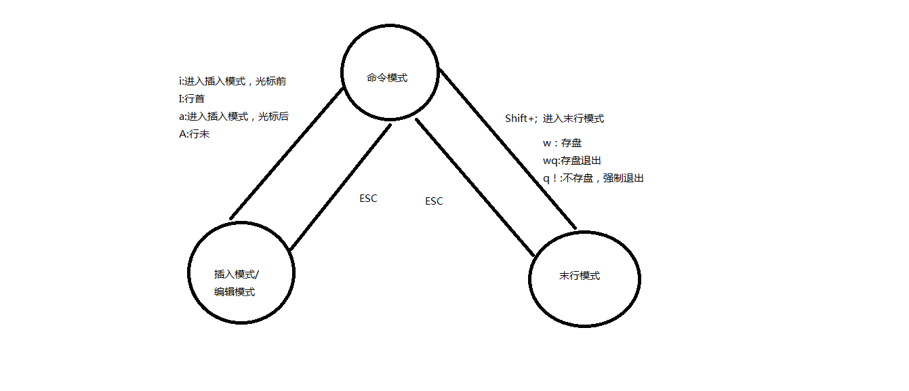

## 一、Linux介绍、命令

### 1.1 操作系统

#### 1.1.1 操作系统（Operation System，OS）


> 没有安装操作系统的计算机，通常被称为 **裸机**
>
> - 如果想在 **裸机** 上运行自己所编写的程序，就必须用机器语言书写程序
> - 如果计算机上安装了操作系统，就可以在操作系统上安装支持的高级语言环境，用高级语言开发程序

#### 1.1.2 操作系统的作用

- 是现代计算机系统中 **最基本和最重要** 的系统软件
- 是 **配置在计算机硬件上的第一层软件**，是对硬件系统的首次扩展
- 主要作用是**管理好硬件设备**，并为用户和应用程序提供一个简单的接口，以便于使用
- 而其他的诸如编译程序、数据库管理系统，以及大量的应用软件，都直接依赖于操作系统的支持

#### 1.1.3 不同领域的主流操作系统

- 1> 桌面操作系统

  - 1.1> `Windows` 系列 : 用户群体大
  - 1.2> `macOS` :  适合于开发人员
  - 1.3> `Linux `: 应用软件少

- 2> 服务器操作系统

  - 2.1> `Linux` : 安全、稳定、**免费**;  **占有率高**
  - 2.2> `Windows Server` : 付费; **占有率低**

- 3> 嵌入式操作系统

  - 3.1> `Linux`

- 4> 移动设备操作系统

  - 4.1> IOS
  - 4.2> Android(基于`Linux`)

  > *显然谁是"爸爸"一目了然!!!*


#### 1.1.4 虚拟机

虚拟机（Virtual Machine）指通过软件模拟的具有完整硬件系统功能的、运行在一个完全隔离环境中的完整计算机系统

- 虚拟系统通过生成现有操作系统的全新虚拟镜像，**具有真实操作系统完全一样的功能**
- 进入虚拟系统后，所有操作都是在这个全新的独立的虚拟系统里面进行，可以独立安装运行软件，保存数据，拥有自己的独立桌面，不会对真正的系统产生任何影响
- 而且能够在现有系统与虚拟镜像之间灵活切换的一类操作系统


### 1.2 操作系统发展史

#### 1.2.1 Unix

> 1965 年之前的时候，仅军事或者学院的研究机构才可能使用上，而且当时大型主机至多能提供30台终端（30个键盘、显示器)，连接一台电脑

**为了解决数量不够用的问题**

- 1965 年左后由 **贝尔实验室** 加入了 **麻省理工学院** 以及 **通用电气** 合作的计划 —— 该计划要建立一套 **多使用者(multi－user)**、**多任务(multi－processor)**、**多层次(multi－level)** 的 **MULTICS** 操作系统，想让大型主机支持 300 台终端
- 1969 年前后这个项目进度缓慢，资金短缺，贝尔实验室退出了研究
- 1969 年从这个项目中退出的 **Ken Thompson** 当时在实验室无聊时，为了让一台空闲的电脑上能够运行 "星际旅行（Space Travel）" 游戏，在 8 月份左右趁着其妻子探亲的时间，**用了 1 个月的时间**，使用汇编写出了 Unix 操作系统的原型
- 1970 年，美国贝尔实验室的 **Ken Thompson**，以 **BCPL** 语言为基础，设计出很简单且很接近硬件的 **B 语言**（取BCPL的首字母），并且他用 **B 语言** 写了第一个 UNIX 操作系统
- 1971 年，同样酷爱 "星际旅行（Space Travel）" 的 **Dennis M.Ritchie** 为了能早点儿玩上游戏，加入了 **Thompson** 的开发项目，合作开发 UNIX，他的主要工作是改造 **B 语言**，因为**B 语言** 的跨平台性较差
- 1972 年，**Dennis M.Ritchie** 在 **B 语言** 的基础上最终设计出了一种新的语言，他取了 **BCPL** 的第二个字母作为这种语言的名字，这就是 **C 语言**
- 1973 年初，**C 语言**的主体完成，**Thompson** 和 **Ritchie** 迫不及待地开始用它完全重写了现在大名鼎鼎的 **Unix 操作系统**

#### 1.2.2 Minix

- 因为 **AT&T（通用电气）** 的政策改变，在 Version 7 Unix 推出之后，发布新的使用条款，将 UNIX 源代码私有化，在大学中不能再使用 UNIX 源代码
- **Andrew S. Tanenbaum（塔能鲍姆）** 教授为了能 **在课堂上教授学生操作系统运作的细节**，决定在不使用任何 AT&T 的源代码前提下，自行开发与 UNIX 兼容的操作系统，以避免版权上的争议
- 以 **小型 UNIX（mini-UNIX）**之意，将它称为 **MINIX**

#### 1.2.3 Linux

- 1991 年 **林纳斯（Linus）** 就读于赫尔辛基大学期间，对 Unix 产生浓厚兴趣，尝试着在Minix 上做一些开发工作

- 因为 **Minix** 只是教学使用，因此功能并不强，**林纳斯** 经常要用他的终端 **仿真器（Terminal Emulator）** 去访问大学主机上的新闻组和邮件，为了方便读写和下载文件，他自己编写了磁盘驱动程序和文件系统，这些在后来成为了 Linux 第一个内核的雏形，当时，他年仅 21 岁！

- 林纳斯

   

  利用 GNU 的 bash 当做开发环境，gcc 当做编译工具，编写了 Linux 内核，一开始 Linux 并不能兼容 Unix

  - 即 Unix 上跑的应用程序不能在 Linux 上跑，即应用程序与内核之间的接口不一致
  - 一开始 Linux 只适用于 386，后来经过全世界的网友的帮助，最终能够兼容多种硬件

##### **C 语言**

- 在把 **UNIX**移植到其他类型的计算机上使用时，**C 语言**强大的移植性（Portability）在此显现
  - 机器语言和汇编语言都不具有移植性，为 x86 开发的程序，不可能在 Alpha，SPARC 和 ARM 等机器上运行
- 而 **C 语言**程序则可以使用在任意架构的处理器上，只要那种架构的处理器**具有对应的 C 语言编译器和库**，然后将 C 源代码编译、连接成目标二进制文件之后即可运行

#### 1.2.4 Unix 家谱


#### 1.2.5 Linux 内核

- **内核（kernel）**是系统的心脏，是运行程序和管理像磁盘和打印机等硬件设备的核心程序，它提供了一个在裸设备与应用程序间的抽象层
- Linux 内核版本又分为 **稳定版** 和 **开发版**，两种版本是相互关联，相互循环
  - **稳定版**：具有工业级强度，可以广泛地应用和部署。新的稳定版相对于较旧的只是修正一些 bug 或加入一些新的驱动程序
  - **开发版**：由于要试验各种解决方案，所以变化很快
- [内核源码网址](http://www.kernel.org)

> 所有来自全世界的对 Linux 源码的修改最终都会汇总到这个网站，由 Linus 领导的开源社区对其进行甄别和修改最终决定是否进入到 Linux 主线内核源码中


#### 1.2.6 Linux发行版本

- **inux 发行版（也被叫做 GNU/Linux 发行版）**通常包含了包括桌面环境、办公套件、媒体播放器、数据库等应用软件
- 常见的发行版本如下：
  - Ubuntu
  - Redhat
  - Fedora
  - openSUSE
  - Linux Mint
  - Debian
  - Manjaro
  - Mageia
  - CentOS
  - Arch
- 十大 Linux 服务器发行版排行榜: [10 Best Linux Server Distributions of 2018](https://www.tecmint.com/10-best-linux-server-distributions/)

#### 1.2.7 Linux 应用领域

##### 1> 服务器领域

##### 2> 嵌入式领域

> - Linux 运行稳定、对网络的良好支持性、低成本，且可以根据需要进行软件裁剪，内核最小可以达到几百 KB 等特点，使其近些年来在嵌入式领域的应用得到非常大的提高
> - 主要应用：**家用路由器**、**机顶盒**、**数字电视**、**网络电话**、**程控交换机**、**手机**、**PDA**、等都是其应用领域，得到了 Google、三星、摩托罗拉、NEC 等公司的大力推广

##### 3> 个人桌面领域

> - 此领域是传统 Linux 应用最薄弱的环节
> - 传统 Linux 由于界面简单、操作复杂、应用软件少的缺点，一直被 Windows 所压制
> - 近些年来随着 **Ubuntu**、**Fedora** 等优秀桌面环境的兴起，同时各大硬件厂商对其支持的加大，Linux 在个人桌面领域的占有率在逐渐的提高


### 1.3 文件和目录

#### 1.3.1 单用户操作系统和多用户操作系统

- **单用户操作系统**：指一台计算机在同一时间 **只能由一个用户** 使用，一个用户独自享用系统的全部硬件和软件资源
  - **Windows XP** 之前的版本都是单用户操作系统
- **多用户操作系统**：指一台计算机在同一时间可以由 **多个用户** 使用，多个用户共同享用系统的全部硬件和软件资源
  - **Unix** 和 **Linux** 的设计初衷就是多用户操作系统

#### 1.3.2 `Windows` 下的文件系统

- 在 `Windows` 下，打开 “计算机”，我们看到的是一个个的驱动器盘符


- 每个驱动器都有自己的根目录结构，这样形成了多个树并列的情形，如图所示：


#### 1.3.3 `Linux` 下的文件系统

- 在 `Linux` 下，我们是看不到这些驱动器盘符，我们看到的是文件夹（目录）：


- `Ubuntu` 没有盘符这个概念，只有一个根目录 `/`，所有文件都在它下面


#### 1.3.4 用户目录

位于 `/home/user`，称之为用户工作目录或家目录，表示方式：

> - /home/user
> - ~

#### 1.3.5 `Linux` 主要目录速查表

- /：根目录，

  一般根目录下只存放目录

  ，在 linux 下有且只有一个根目录，所有的东西都是从这里开始

  - 当在终端里输入 `/home`，其实是在告诉电脑，先从 `/`（根目录）开始，再进入到 `home` 目录

- /bin、/usr/bin：可执行二进制文件的目录，如常用的命令 ls、tar、mv、cat 等

- /boot：放置 linux 系统启动时用到的一些文件，如 linux 的内核文件：`/boot/vmlinuz`，系统引导管理器：`/boot/grub`

- /dev：存放linux系统下的设备文件，访问该目录下某个文件，相当于访问某个设备，常用的是挂载光驱`mount /dev/cdrom /mnt`

- /etc：系统配置文件存放的目录，不建议在此目录下存放可执行文件，重要的配置文件有

  - /etc/inittab
  - /etc/fstab
  - /etc/init.d
  - /etc/X11
  - /etc/sysconfig
  - /etc/xinetd.d

- /home：系统默认的用户家目录，新增用户账号时，用户的家目录都存放在此目录下

  - `~` 表示当前用户的家目录
  - `~edu` 表示用户 `edu` 的家目录

- /lib、/usr/lib、/usr/local/lib：系统使用的函数库的目录，程序在执行过程中，需要调用一些额外的参数时需要函数库的协助

- /lost+fount：系统异常产生错误时，会将一些遗失的片段放置于此目录下

- /mnt: /media：光盘默认挂载点，通常光盘挂载于 /mnt/cdrom 下，也不一定，可以选择任意位置进行挂载

- /opt：给主机额外安装软件所摆放的目录

- /proc：此目录的数据都在内存中，如系统核心，外部设备，网络状态，由于数据都存放于内存中，所以不占用磁盘空间，比较重要的文件有：/proc/cpuinfo、/proc/interrupts、/proc/dma、/proc/ioports、/proc/net/* 等

- /root：系统管理员root的家目录

- /sbin、/usr/sbin、/usr/local/sbin：放置系统管理员使用的可执行命令，如 fdisk、shutdown、mount 等。与 /bin 不同的是，这几个目录是给系统管理员 root 使用的命令，一般用户只能"查看"而不能设置和使用

- /tmp：一般用户或正在执行的程序临时存放文件的目录，任何人都可以访问，重要数据不可放置在此目录下

- /srv：服务启动之后需要访问的数据目录，如 www 服务需要访问的网页数据存放在 /srv/www 内

- /usr：应用程序存放目录

  - /usr/bin：存放应用程序
  - /usr/share：存放共享数据
  - /usr/lib：存放不能直接运行的，却是许多程序运行所必需的一些函数库文件
  - /usr/local：存放软件升级包
  - /usr/share/doc：系统说明文件存放目录
  - /usr/share/man：程序说明文件存放目录

- /var：放置系统执行过程中经常变化的文件

  - /var/log：随时更改的日志文件
  - /var/spool/mail：邮件存放的目录
  - /var/run：程序或服务启动后，其 PID 存放在该目录下


### 1.4 虚拟机和Linux(`Ubuntu 16.04`)安装

> 演示安装

#### 1.4.1 安装`VMware`

#### 1.4.2 安装 `Ubuntu 16.04`

> **1> 记录安装过程中的问题**
>
> **2> 作业: 在 Ubuntu上安装 Pycharm等软件**

##### 1.更新Ubuntu软件下载地址(软件源)

> 镜像源：可以理解为提供下载软件的地方(**软件商城**)

- 1.1寻找国内 镜像源

> 略

- 1.2 备份原来的源

```shell
sudo cp /etc/apt/sources.list /etc/apt/sources.list.backup
```

- 1.3 更新源服务器列表("素质三联": **(删除)复制粘贴保存**)

```shell
sudo gedit /etc/apt/sources.list
```

- 1.4 更新源

```shell
sudo apt-get update
```

##### 2. Ubuntu 软件操作相关命令

```shell
sudo apt-get update  更新源

sudo apt-get install package 安装包

sudo apt-get remove package 删除包

sudo apt-cache search package 搜索软件包

sudo apt-cache show package  获取包的相关信息，如说明、大小、版本等

sudo apt-get install package --reinstall   重新安装包

sudo apt-get -f install   修复安装

sudo apt-get remove package --purge 删除包，包括配置文件等

sudo apt-get build-dep package 安装相关的编译环境

sudo apt-get upgrade 更新已安装的包

sudo apt-get dist-upgrade 升级系统

sudo apt-cache depends package 了解使用该包依赖那些包

sudo apt-cache rdepends package 查看该包被哪些包依赖

sudo apt-get source package  下载该包的源代码

sudo apt-get clean && sudo apt-get autoclean 清理无用的包

sudo apt-get check 检查是否有损坏的依赖
```


### 1.5 Linux命令的基本使用

#### 1.5.1 学习 Linux 终端命令的原因


- 很多人可能在电视或电影中看到过类似的场景，黑客面对一个黑色的屏幕，上面飘着密密麻麻的字符，梆梆一顿敲，就完成了窃取资料的任务。
- Linux 刚出世时没有什么图形界面，所有的操作全靠命令完成，就如同电视里的黑客那样，充满了神秘与晦涩。近几年来，尽管 Linux 发展得非常迅速，图形界面越来越友好，但是在真正的开发过程中，Linux 命令行的应用还是占有非常重要的席位，而且许多Linux功能在命令行界面要比图形化界面下运行的快。**可以说不会命令，就不算会 Linux**。
- 在职场中，大量的 **服务器维护工作** 都是在 **远程** 通过 **SSH 客户端** 来完成的，并没有图形界面，所有的维护工作都需要通过命令来完成。如 **磁盘操作**、**文件存取**、**目录操作**、**进程管理**、**文件权限** 设定等
- Linux 发行版本的命令大概有 200 多个，但是常用的命令只有 10 多个而已

#### 1.5.2 学习 Linux 终端命令技巧

- 1.不需要死记硬背，对于常用命令, 熟能生巧
- 2.不常见命令, 百度即可
- **3.自动补全**
  - 在 敲出 **文件** **目录** **命令** 的前几个字母之后,  按下 `TAB` 键
    - 如果输入的没有歧义，系统会自动补全
    - 如果有歧义, 再按一次 `TAB` 键, 系统会提示可能存在的命令
- 4.**历史命令**
  - 按 `UP` 和 `DOWN` 光标键可以在曾经使用过的命令之间来回切换
  - 如果想要退出选择，并且不想执行当前选中的命令，可以按 `ctrl + c`
- 5.**终端的放大缩小**
  - `Ctrl + shift + =`
  - `ctrl + -`

#### 1.5.3 终端命令格式

```
command [-options] [parameter]
```

说明：

- `command`：命令名，相应功能的英文单词或单词的缩写
- `[-options]`：选项，可用来对命令进行控制，也可以省略
- `parameter`：传给命令的参数，可以是 **零个**、**一个** 或者 **多个**

> `[]` 代表可选

#### 1.5.4 查阅命令帮助信息

##### 1.方法一: `command --help`

说明：

- 显示 `command` 命令的帮助信息

##### 2.方法二: `man command`

说明：

- 查阅 `command` 命令的使用手册

> `man` 是 **manual** 的缩写，是 Linux 提供的一个 **手册**，包含了绝大部分的命令、函数的详细使用说明

使用 `man` 时的操作键：

| 操作键   | 功能                 |
| -------- | -------------------- |
| 空格键   | 显示手册页的下一屏   |
| Enter 键 | 一次滚动手册页的一行 |
| b        | 回滚一屏             |
| f        | 前滚一屏             |
| q        | 退出                 |
| /word    | 搜索 **word** 字符串 |


### 1.6 Linux 常用命令

| 序号 | 命令                | 对应英文             | 作用                        |
| ---- | ------------------- | -------------------- | --------------------------- |
| 01   | ls                  | list                 | 查看当前文件夹下的内容      |
| 02   | `pwd`               | print wrok directory | 查看当前所在文件夹          |
| 03   | `cd [目录名]`       | change directory     | 切换文件夹                  |
| 04   | touch [文件名]      | touch                | 如果文件不存在，新建文件    |
| 05   | `mkdir [目录名]`    | make directory       | 创建目录                    |
| 06   | rm [文件名]         | remove               | 删除指定的文件名            |
| 07   | clear               | clear                | 清屏                        |
| 08   | `cp`                | copy                 | 复制                        |
| 09   | `scp`               |                      | 远程复制                    |
| 10   | `mv`                |                      | 移动                        |
| 11   | `tree`              |                      | 树形展示目录结构            |
| 12   | `chmod`             |                      | 修改权限                    |
| 13   | `find`              |                      | 查找                        |
| 14   | `grep`              |                      | 文本搜索                    |
| 15   | `>` 重定向          |                      | 重定向                      |
| 16   | `>>` 重定向         |                      | 重定向                      |
| 17   | `ln` 软链接\|硬链接 |                      | 软链接 硬链接               |
| 18   | tar                 |                      | 压缩                        |
| 19   | `shutdown`          |                      | 关机                        |
| 20   | `reboot`            |                      | 重启                        |
| 21   | `who`               |                      | 查看当前用户                |
| 22   | `which`             |                      | 查看命令位置                |
| 23   | `exit`              |                      | 退出                        |
| 24   | `passwd`            |                      | 设置用户密码                |
| 25   | `sudo`              |                      | 获取超级管理员权限 |
| 26   | `su`                |                      | 切换到超级管理员账号 |
| 27   | `more`              |                      | 分屏显示                    |
| 28   | `|`                 |                      | 管道                        |
| 29   | `kill`              |                      | 杀死进程                    |
| 30   | history             |                      | 查看输入命令的历史记录      |
| 31   | `pkill`             |                      | 踢掉恶意登录的用户          |
| 32   | `dhclient`          |                      | 等待自动分配ip              |
| 33   | `tail`              |                      | `tail -f xx` 动态查看某文件 |
| 34   | `ps -aux`           |                      |                             |
| 35   | `top` | `htop`      |                      |
|      |                     |                      |                             |
|      |                     |                      |                             |
|      |                     |                      |                             |
|      |                     |                      |                             |


#### 1.6.0 绝对路径和相对路径


#### 1.6.1 查看文件信息: ls

> ls是英文单词list的简写，其功能为列出目录的内容，是用户最常用的命令之一，它类似于DOS下的dir命令。

> **Linux文件或者目录名称最长可以有265个字符，“.”代表当前目录，“..”代表上一级目录，以“.”开头的文件为隐藏文件，需要用 -a 参数才能显示。**

##### ls常用参数：

| 参数 | 含义                                         |
| ---- | -------------------------------------------- |
| -a   | 显示指定目录下所有子目录与文件，包括隐藏文件 |
| -l   | 以列表方式显示文件的详细信息                 |
| -h   | 配合 -l 以人性化的方式显示文件大小           |


> **`ls`查看目录下文件和文件夹信息**


> **1.从左至右依次是: `[目录|普通文件|软连接][文件拥有者、组其他人、不在组的其他人] [硬链接数量][用户名] [用户组][文件(夹)大小] [创建或修改时间][文件名(包括隐藏文件夹)]`**
>
> **2.`d`表示目录; `-`表示普通文件; `l`表示软链接**
>
> **3.`.` 表示当前目录;  `..`表示上一级目录**


与DOS下的文件操作类似，在Unix/Linux系统中，也同样允许使用特殊字符来同时引用多个文件名，这些特殊字符被称为**通配符**。

| 通配符    | 含义                                                         |
| --------- | ------------------------------------------------------------ |
| *         | 文件代表文件名中所有字符                                     |
| ls te*    | 查找以te开头的文件                                           |
| ls *html  | 查找结尾为html的文件                                         |
| ？        | 代表文件名中任意一个字符                                     |
| ls ?.c    | 只找第一个字符任意，后缀为.c的文件                           |
| ls a.?    | 只找只有3个字符，前2字符为a.，最后一个字符任意的文件         |
| []        | [”和“]”将字符组括起来，表示可以匹配字符组中的任意一个。“-”用于表示字符范围。 |
| [abc]     | 匹配a、b、c中的任意一个                                      |
| [a-f]     | 匹配从a到f范围内的的任意一个字符                             |
| ls [a-f]* | 找到从a到f范围内的的任意一个字符开头的文件                   |
| ls a-f    | 查找文件名为a-f的文件,当“-”处于方括号之外失去通配符的作用    |
| \         | 如果要使通配符作为普通字符使用，可以在其前面加上转义字符。“?”和“*”处于方括号内时不用使用转义字符就失去通配符的作用。 |
| ls \*a    | 查找文件名为*a的文件                                         |

#### 1.6.2 清屏：clear

clear作用为清除终端上的显示(类似于DOS的cls清屏功能)，也可使用快捷键：Ctrl + l ( “l” 为小写英文字母 )。

#### 1.6.3 切换工作目录： cd

在使用Unix/Linux的时候，经常需要更换工作目录。cd命令可以帮助用户切换工作目录。`Linux所有的目录和文件名大小写敏感`

cd后面可跟绝对路径，也可以跟相对路径。如果省略目录，则默认切换到当前用户的主目录。

| 命令  | 含义                                                         |
| ----- | ------------------------------------------------------------ |
| cd    | 切换到当前用户的主目录(/home/用户目录)，用户登陆的时候，默认的目录就是用户的主目录。 |
| cd ~  | 切换到当前用户的主目录(/home/用户目录)                       |
| cd .  | 切换到当前目录                                               |
| cd .. | 切换到上级目录                                               |
| cd -  | 可进入上次所在的目录                                         |

注意：

- 如果路径是从根路径开始的，则路径的前面需要加上 “ / ”，如 “ /mnt ”，通常进入某个目录里的文件夹，前面不用加 “ / ”。

#### 1.6.4 显示当前路径：pwd

使用pwd命令可以显示当前的工作目录，直接输入pwd即可，后面不带参数。

#### 1.6.5 创建目录：mkdir

通过mkdir命令可以创建一个新的目录。参数-p可递归创建目录。

**注意**

- 新建目录的名称不能与当前目录中已有的目录或文件同名
- 目录创建者必须对当前目录具有写权限

#### 1.6.6 删除文件: rm

可通过rm删除文件或目录。

使用rm命令要小心，因为文件删除后不能恢复。为了防止文件误删，可以在rm后使用-i参数以逐个确认要删除的文件。

常用参数及含义如下表所示：

| 参数 | 含义                                             |
| ---- | ------------------------------------------------ |
| -i   | 以进行交互式方式执行                             |
| -f   | 强制删除，忽略不存在的文件，无需提示             |
| -r   | 递归地删除目录下的内容，删除文件夹时必须加此参数 |

#### 1.6.7 拷贝：cp

cp命令的功能是将给出的文件或目录复制到另一个文件或目录中，相当于DOS下的copy命令。

常用选项说明：

| 选项 | 含义                                                         |
| ---- | ------------------------------------------------------------ |
| -a   | 该选项通常在复制目录时使用，它保留链接、文件属性，并递归地复制目录，简单而言，保持文件原有属性。 |
| -f   | 已经存在的目标文件而不提示                                   |
| -i   | 交互式复制，在覆盖目标文件之前将给出提示要求用户确认         |
| -r   | 若给出的源文件是目录文件，则cp将递归复制该目录下的所有子目录和文件，目标文件必须为一个目录名。 |
| -v   | 显示拷贝进度                                                 |

#### 1.6.8 移动、重命名: mv

用户可以使用mv命令来移动文件或目录，也可以给文件或目录重命名

常用选项说明：

| 选项 | 含义                                                         |
| ---- | ------------------------------------------------------------ |
| -f   | 禁止交互式操作，如有覆盖也不会给出提示                       |
| -i   | 确认交互方式操作，如果mv操作将导致对已存在的目标文件的覆盖，系统会询问是否重写，要求用户回答以避免误覆盖文件 |
| -v   | 显示移动进度                                                 |

#### 1.6.9 创建文件: touch

**注意:**

- Linux系统中没有严格的后缀（格式），所以创建文件时可以命名为任意的文件名

#### 1.6.10 输出重定向命令：> 和 >>

Linux允许将命令执行结果重定向到一个文件，本应显示在终端上的内容保存到指定文件中

如：``ls > test.txt ( test.txt 如果不存在，则创建，存在则覆盖其内容 )`

注意： `>输出重定向会覆盖原来的内容，>>输出重定向则会追加到文件的尾部。`

#### 1.6.11 分屏显示：more

> 查看内容时，在信息过长无法在一屏上显示时，会出现快速滚屏，使得用户无法看清文件的内容，此时可以使用more命令，每次只显示一页，按下空格键可以显示下一页，按下q键退出显示，按下h键可以获取帮助。

如: `more xx.doc`

#### 1.6.12 管道：|

管道：一个命令的输出可以通过管道做为另一个命令的输入。

- 管道左边命令行输出的结果, 作为管道右边命令行的输入结果

**举例: `tree /home/xxx | more`**


#### 1.6.13 建立链接文件：ln

Linux链接文件类似于Windows下的快捷方式。

链接文件分为软链接和硬链接。

**软链接：软链接不占用磁盘空间，源文件删除则软链接失效。**

**硬链接：硬链接只能链接普通文件，不能链接目录。**

使用格式：

```shell
ln 源文件 链接文件
ln -s 源文件 链接文件
```

如果`没有-s`选项代表建立一个硬链接文件，两个文件占用相同大小的硬盘空间，即使删除了源文件，链接文件还是存在，所以-s选项是更常见的形式。

**注意：**

​	**如果软链接文件和源文件不在同一个目录，源文件要使用绝对路径，不能使用相对路径。**

==关于软连接和硬链接的补充==

> **概念:  **
>
> - **1.文件内容和文件名在 操作系统中是分开保存的**
> - **2.操作系统的硬链接数 类比 python中 引用计数,  当两者为0的时候其对应的 文件或对象(`__del__`方法)将消失**


> - 当建立软链接时候, 将原来的文件名`file_name.txt` 修改, 那么软链接将失效, 当再次恢复原文件名的时候, 软链接将再次生效.
>
> - **软链接 相当于 链接 指向 的是 文件名.**
> - 文件内容修改, 软链接指向的文件内容也变化


> - 当建立硬链接时候, 将原来的文件名`file_name.txt` 修改, 那么硬链接仍然有效
> - **硬链接 相当于 链接 指向 的是 文件内容. 相当于新的文件名**
> - 文件内容修改, 硬链接指向的文件内容也变化

#### 1.6.14 查看或者合并文件内容：cat

```shell
cat /etc/rc.d/init.local

cat test1.txt test2.txt > 合并.txt
```

#### 1.6.15 文本搜索：grep

Linux系统中`grep`命令是一种强大的**文本搜索工具**，grep允许对文本文件进行模式查找。如果找到匹配模式， grep打印包含模式的所有行。

`grep [-选项] ‘搜索内容串’ 文件名`

- 在grep命令中输入字符串参数时，最好引号或双引号括起来

常用选项说明：

| 选项 | 含义                                     |
| ---- | ---------------------------------------- |
| -v   | 显示不包含匹配文本的所有行（相当于求反） |
| -n   | 显示匹配行及行号                         |
| -i   | 忽略大小写                               |

grep搜索内容串可以是正则表达式。

> 正则表达式是对字符串操作的一种逻辑公式，就是用事先定义好的一些特定字符、及这些特定字符的组合，组成一个“规则字符串”，这个“规则字符串”用来表达对字符串的一种过滤逻辑。

grep常用正则表达式：

| 参数         | 含义                                                         |
| ------------ | ------------------------------------------------------------ |
| ^a           | 行首,搜寻以 a 开头的行；grep -n '^a' 1.txt                   |
| ke$          | 行尾,搜寻以 ke 结束的行；grep -n 'ke$' 1.txt                 |
| [Ss]igna[Ll] | 匹配 [] 里中一系列字符中的一个；搜寻匹配单词signal、signaL、Signal、SignaL的行；grep -n '[Ss]igna[Ll]' 1.txt |
| .            | (点)匹配一个非换行符的字符；匹配 e 和 e 之间有任意一个字符，可以匹配 eee，eae，eve，但是不匹配 ee，eaae；grep -n 'e.e' 1.txt |

#### 1.6.16 查找文件：find

find命令功能非常强大，通常用来在特定的目录下搜索符合条件的文件，也可以用来搜索特定用户属主的文件。

常用用法：

| 命令                        | 含义                                   |
| --------------------------- | -------------------------------------- |
| find ./ -name test.sh       | 查找当前目录下所有名为test.sh的文件    |
| find ./ -name '*.sh'        | 查找当前目录下所有后缀为.sh的文件      |
| find ./ -name "[A-Z]*"      | 查找当前目录下所有以大写字母开头的文件 |
| find /tmp -size 2M          | 查找在/tmp 目录下等于2M的文件          |
| find /tmp -size +2M         | 查找在/tmp 目录下大于2M的文件          |
| find /tmp -size -2M         | 查找在/tmp 目录下小于2M的文件          |
| find ./ -size +4k -size -5M | 查找当前目录下大于4k，小于5M的文件     |
| find ./ -perm 777           | 查找当前目录下权限为 777 的文件或目录  |

> ==找到文件并删除: `find -name "file_name" ./  | xargs rm -rf`==

#### 1.6.17 归档管理 : tar

计算机中的数据经常需要备份，tar是Unix/Linux中最常用的备份工具，此命令可以把一系列文件归档到一个大文件中，也可以把档案文件解开以恢复数据。

tar使用格式 `tar [参数] 打包文件名 文件`

tar命令很特殊，其参数前面可以使用“-”，也可以不使用。

常用参数：

| 参数 | 含义                                                      |
| ---- | --------------------------------------------------------- |
| -c   | 生成档案文件，创建打包文件                                |
| -v   | 列出归档解档的详细过程，显示进度                          |
| -f   | 指定档案文件名称，f后面一定是.tar文件，所以必须放选项最后 |
| -t   | 列出档案中包含的文件                                      |
| -x   | 解开档案文件                                              |

**注意：除了f需要放在参数的最后，其它参数的顺序任意。**

#### 1.6.18 文件压缩解压：gzip

tar与gzip命令结合使用实现文件打包、压缩。 tar只负责打包文件，但不压缩，用gzip压缩tar打包后的文件，其扩展名一般用xxxx.tar.gz。

gzip使用格式如下：`gzip  [选项]  被压缩文件`

常用选项：

| 选项 | 含义           |
| ---- | -------------- |
| -d   | 解压           |
| -r   | 压缩所有子目录 |

**tar这个命令并没有压缩的功能，它只是一个打包的命令，但是在tar命令中增加一个选项(-z)可以调用gzip实现了一个压缩的功能，实行一个先打包后压缩的过程。**

压缩用法：`tar cvzf 压缩包包名 文件1 文件2 ...`

> `-z ：指定压缩包的格式为：file.tar.gz`

解压用法： `tar zxvf 压缩包包名`

> `-z:指定压缩包的格式为：file.tar.gz`

**解压到指定目录：-C （大写字母“C”）**

`tar -zxvf xxx.tar.gz -C /dir/subdir/`

#### 1.6.19 文件压缩解压：bzip2

tar与bzip2命令结合使用实现文件打包、压缩(用法和gzip一样)。

tar只负责打包文件，但不压缩，用bzip2压缩tar打包后的文件，其扩展名一般用xxxx.tar.gz2。

在tar命令中增加一个选项(-j)可以调用bzip2实现了一个压缩的功能，实行一个先打包后压缩的过程。

- **压缩用法：tar -jcvf 压缩包包名 文件...(tar jcvf bk.tar.bz2 *.c)**

- **解压用法：tar -jxvf 压缩包包名 (tar jxvf bk.tar.bz2)**

#### 1.6.20 文件压缩解压：zip、unzip

通过zip压缩文件的目标文件不需要指定扩展名，默认扩展名为zip。

压缩文件：``zip [-r] 目标文件(没有扩展名) 源文件``

解压文件：`unzip -d 解压后目录文件 压缩文件`

#### 1.6.21 查看某个命令(程序)位置: which

`which command`

#### 1.6.22 修改文件权限：chmod

chmod 修改文件权限有两种使用格式：**字母法与数字法**

**字母法：**chmod u/g/o/a +/-/= rwx 文件

| [ u/g/o/a ] | 含义                                                      |
| ----------- | --------------------------------------------------------- |
| u           | user 表示该文件的所有者                                   |
| g           | group 表示与该文件的所有者属于同一组( group )者，即用户组 |
| o           | other 表示其他以外的人                                    |
| a           | all 表示这三者皆是                                        |


| [ +-= ] | 含义     |
| ------- | -------- |
| +       | 增加权限 |
| -       | 撤销权限 |
| =       | 设定权限 |


| rwx  | 含义                                                         |
| ---- | ------------------------------------------------------------ |
| r    | read 表示可读取，对于一个目录，如果没有r权限，那么就意味着不能通过ls查看这个目录的内容。 |
| w    | write 表示可写入，对于一个目录，如果没有w权限，那么就意味着不能在目录下创建新的文件。 |
| x    | excute 表示可执行，对于一个目录，如果没有x权限，那么就意味着不能通过cd进入这个目录。 |


如果需要同时进行设定拥有者、同组者以及其他人的权限，参考: 

- `chmod u=rw,g=x,o=r xx.py`
- `chmod u=,g=,o= xx.py`


数字法：“rwx” 这些权限也可以用数字来代替

| 字母 | 说明                         |
| ---- | ---------------------------- |
| r    | 读取权限，数字代号为 "4"     |
| w    | 写入权限，数字代号为 "2"     |
| x    | 执行权限，数字代号为 "1"     |
| -    | 不具任何权限，数字代号为 "0" |

如执行：**chmod u=rwx,g=rx,o=r filename 就等同于：chmod 754 filename**

**chmod 751 file**：

- 文件所有者：读、写、执行权限
- 同组用户：读、执行的权限
- 其它用户：执行的权限

**注意：如果想递归所有目录加上相同权限，需要加上参数“ `-R `”。 如：chmod 777 test/ -R 递归 test 目录下所有文件加 777 权限**

> 归纳一些 `递归` 的情况:
>
> - `chmod -R`
> - `mkdir -p`
> - `rm -r`
> - `cp -r`
> - `scp -r`


#### 1.6.23 切换到管理员账号: `sudo -s`

```shell
whoami
sudo -s
whoami
```

#### 1.6.24 设置用户密码：passwd

- 在Unix/Linux中，超级用户可以使用passwd命令为普通用户设置或修改用户密码。

- 用户也可以直接使用该命令来修改自己的密码，而无需在命令后面使用用户名

如: 

- `sudo passwd user `  : 修改指定用户的密码
- `passwd` : 修改root用户的密码

#### 1.6.25 退出登录账户： exit

- 如果是图形界面，退出当前终端；
- 如果是使用ssh远程登录，退出登陆账户；
- 如果是切换后的登陆用户，退出则返回上一个登陆账号。

#### 1.6.26 查看登录用户：who

who命令用于查看当前**所有**登录系统的用户信息。

常用选项：

| 选项          | 含义                                 |
| ------------- | ------------------------------------ |
| -q或--count   | 只显示用户的登录账号和登录用户的数量 |
| -u或--heading | 显示列标题                           |

#### 1.6.27 who命令用于查看当前所有登录系统的用户信息。

常用选项：

| 选项          | 含义                                 |
| ------------- | ------------------------------------ |
| -q或--count   | 只显示用户的登录账号和登录用户的数量 |
| -u或--heading | 显示列标题                           |

| 命令              | 含义                                       |
| ----------------- | ------------------------------------------ |
| reboot            | 重新启动操作系统                           |
| shutdown –r now   | 重新启动操作系统，shutdown会给别的用户提示 |
| shutdown -h now   | 立刻关机，其中now相当于时间为0的状态       |
| shutdown -h 20:25 | 系统在今天的20:25 会关机                   |
| shutdown -h +10   | 系统再过十分钟后自动关机                   |

#### 1.6.28 history命令查看历史的命令记录


**小技巧:**

> **当想快速执行上述已经执行过的命令的时候, 只需要输入: `!命令前面的数字`**(注意`!`)


## 二、常用服务器: ftp 、ssh

### 1.ftp服务器

FTP 是File Transfer Protocol（文件传输协议）的英文简称，而中文简称为“文传协议”。

用于Internet上的控制文件的双向传输。

同时，它也是一个应用程序（Application）。基于不同的操作系统有不同的FTP应用程序，而所有这些应用程序都遵守同一种协议以传输文件。

在FTP的使用当中，用户经常遇到两个概念："下载"（Download）和"上传"（Upload）。

"下载"文件就是从远程主机拷贝文件至自己的计算机上；

"上传"文件就是将文件从自己的计算机中拷贝至远程主机上。用Internet语言来说，用户可通过客户机程序向（从）远程主机上传（下载）文件。


### 2.ssh服务器

#### 2.1 介绍

SSH为Secure Shell的缩写，由 IETF 的网络工作小组（Network Working Group）所制定；SSH 为建立在应用层和传输层基础上的安全协议。

SSH是目前较可靠，专为远程登录会话和其他网络服务提供安全性的协议。常用于远程登录，以及用户之间进行资料拷贝。

利用SSH协议可以有效防止远程管理过程中的信息泄露问题。SSH最初是 UNIX 系统上的一个程序，后来又迅速扩展到其他操作平台。SSH 在正确使用时可弥补网络中的漏洞。SSH 客户端适用于多种平台。几乎所有 UNIX 平台—包括 HP-UX、Linux、AIX、Solaris、Digital UNIX、Irix，以及其他平台，都可运行SSH。

使用SSH服务，**需要安装相应的服务器和客户端**。客户端和服务器的关系：如果，A机器想被B机器远程控制，那么，**A机器需要安装SSH服务器，B机器需要安装SSH客户端**。

#### 2.2 安装

A.安装ssh服务器

```
sudo apt-get install openssh-server
```

B.远程登陆

```
ssh 用户名@IP
```

使用ssh访问，如访问出现错误。可查看是否有该文件 ～/.ssh/known_ssh 尝试删除该文件解决。

第一次登录:

> SSH 告知用户，这个主机不能识别，这时键入"yes"，SSH 就会将相关信息，写入" ~/.ssh/know_hosts" 中，再次访问，就不会有这些信息了。然后输入完口令,就可以登录到主机了。


### 3.scp

远程拷贝文件,scp -r 的常用方法：

1.使用该命令的前提条件要求目标主机已经**成功安装openssh-server**

```
如没有安装使用 sudo apt-get install openssh-server 来安装
```

2.使用格式：

```
scp -r 目标用户名@目标主机IP地址：/目标文件的绝对路径  /保存到本机的绝对/相对路径

在后续会提示输入“yes”此时，只能输“yes”而不能简单输入“Y”
```

拷贝单个文件可以不加 -r参数，拷贝目录必须要加。

本地文件复制到远程：

```
scp FileName RemoteUserName@RemoteHostIp:RemoteFile
scp FileName RemoteHostIp:RemoteFolder
scp FileName RemoteHostIp:RemoteFile
```

本地目录复制到远程：

```
scp -r FolderName RemoteUserName@RemoteHostIp:RemoteFolder
scp -r FolderName RemoteHostIp:RemoteFolder
```

远程文件复制到本地：

```
scp RemoteUserName@RemoteHostIp:RemoteFile FileName
scp RemoteHostIp:RemoteFolder FileName
scp RemoteHostIp:RemoteFile FileName
```

远程目录复制到本地：

```
scp -r RemoteUserName@RemoteHostIp:RemoteFolder FolderName
scp -r RemoteHostIp:RemoteFolder FolderName
```


### 三、编辑器vim

## vi简介

vi是“Visual interface”的简称，它在Linux上的地位就仿佛Edit程序在DOS上一样。它可以执行输出、删除、查找、替换、块操作等众多文本操作，而且用户可以根据自己的需要对其进行定制。Vi不是一个排版程序，它不象Word或WPS那样可以对字体、格式、段落等其他属性进行编排，它只是一个文本编辑程序。 vi没有菜单，只有命令，且命令繁多。

```
Vi有三种基本工作模式：
+  命令模式
+  文本输入模式
+  末行模式。 
```



### 命令行模式

- 任何时候，不管用户处于何种模式，只要按一下ESC键，即可使Vi进入命令模式；
- 初次进入编辑器时，默认处于该模式，用户可以输入各种合法的Vi命令，用于管理自己的文档。(注意所输入的命令并不在屏幕上显示出来。若输入的字符不是Vi的合法命令，Vi会响铃报警)

### 文本输入模式

- 在命令模式下输入插入命令i、附加命令a 、打开命令o、修改命令c、取代命令r或替换命令s都可以进入文本输入模式。
- 在该模式下，用户输入的任何字符都被Vi当做文件内容保存起来，并将其显示在屏幕上。

### 末行模式

- 末行模式也称ex转义模式。在命令模式下，用户按“:”键即可进入末行模式下，此时Vi会在显示窗口的最后一行(通常也是屏幕的最后一行)显示一个“:”作为末行模式的提示符，等待用户输入命令。
- 多数文件管理命令都是在此模式下执行的(如把编辑缓冲区的内容写到文件中等)。末行命令执行完后，Vi自动回到命令模式。例如：

```
:wq
w 代表保存
q 代表退出
wq 代表保存并退出, 等价于 x (但是x好像出现过问题, 故我更习惯于wq)
```


## vim基础操作

vim是从 vi 发展出来的一个文本编辑器 。代码补完、编译及错误跳转等方便编程的功能特别丰富

进入插入模式:

```
i: 插入光标前一个字符 

I: 插入行首 

a: 插入光标后一个字符 

A: 插入行未 

o: 向下新开一行,插入行首 

O: 向上新开一行,插入行首
```

进入命令模式:

ESC:从插入模式或末行模式进入命令模式

移动光标:

```
h: 左移 

j: 下移 

k: 上移 

l: 右移

M: 光标移动到中间行 

L: 光标移动到屏幕最后一行行首 

G: 移动到指定行,行号 -G

w: 向后一次移动一个字 

b: 向前一次移动一个字

{: 按段移动,上移 

}: 按段移动,下移

Ctr-d: 向下翻半屏 

Ctr-u: 向上翻半屏

Ctr-f: 向下翻一屏 

Ctr-b: 向上翻一屏

gg: 光标移动文件开头 

G: 光标移动到文件末尾
```

删除命令:

```
x: 删除光标后一个字符,相当于 Del 

X: 删除光标前一个字符,相当于 Backspace

dd: 删除光标所在行,n dd 删除指定的行数 D: 删除光标后本行所有内容,包含光标所在字符 

d0: 删除光标前本行所有内容,不包含光标所在字符

dw: 删除光标开始位置的字,包含光标所在字符
```

撤销命令:

```
u: 一步一步撤销 


Ctr-r: 反撤销
```

重复命令:

```
.: 重复上一次操作的命令
```

文本行移动:

```
>>: 文本行右移 

<<: 文本行左移
```

复制粘贴:

```
yy: 复制当前行,n yy 复制 n 行 

p: 在光标所在位置向下新开辟一行,粘贴
```

可视模式:

```
v: 按字符移动,选中文本 

V: 按行移动,选中文本可视模式可以配合 d, y, >>, << 实现对文本块的删除,复制,左右移动
```

替换操作:

```
r: 替换当前字符 

R: 替换当前行光标后的字符
```

查找命令:

```
/: str查找
n: 下一个
N：上一个
```

替换命令：

把abc全部替换成123

```
末行模式下，将当前文件中的所有abc替换成123
:%s/abc/123/g

末行模式下，将第一行至第10行之间的abc替换成123
:1, 10s/abc/123/g
```

vim里执行 shell 下命令:

```
末行模式里输入!,后面跟命令
```


**vim编辑的自动补全**

`Ctrl + n`  n可以连续按两次就自动补全上面过去输入过的字符串


**自动打开并跳转到指定行**
`vim xx.py +10`

