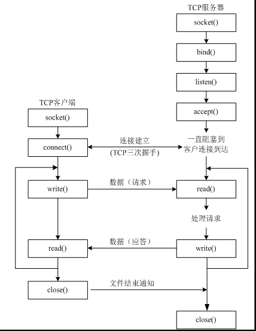

# 网络通信

## 一、`IP` 地址

### 1. 概述

网络编程:  进程间通信, 进行数据传输

### 2. `ip`地址

#### `ip`地址：用来在网络中标记一台电脑，比如192.168.1.1；在本地局域网上是唯一的。

### 3. ip地址的分类（了解）

每一个IP地址包括两部分：**网络地址和主机地址**


>- `IPV4`: `ip version4` 
>- 容纳最多主机数: `256*256*256*256`   , 4个字节共32个比特位.
>- 对于C类地址来说, 实际可用的主机号只有: `2*8-2=254台`
>  - `00000000 ~ 11111111` 既从 `0--255`, 但是两头的两个主机号不能用
>  - 所以, 只有 254 台.
>
>

#### 3.1 A类IP地址

一个A类IP地址由`1字节的网络地址`和`3字节主机地址`组成，网络地址的`最高位必须是“0”`，

地址范围: `1.0.0.1-126.255.255.254`

二进制表示为：00000001 00000000 00000000 00000001 - 01111110 11111111 11111111 11111110

可用的A类网络有126个，每个网络能容纳1677214个主机

#### 3.2 B类IP地址

一个B类IP地址由`2个字节的网络地址`和`2个字节的主机地址`组成，网络地址的`最高位必须是“10”`，

地址范围: `128.1.0.1-191.255.255.254`

二进制表示为：10000000 00000001 00000000 00000001 - 10111111 11111111 11111111 11111110

可用的B类网络有16384个，每个网络能容纳65534主机

#### 3.3 C类IP地址

一个C类IP地址由`3字节的网络地址`和`1字节的主机地址`组成，网络地址的`最高位必须是“110”`

范围192.0.1.1-223.255.255.254

二进制表示为: 11000000 00000000 00000001 00000001 - 11011111 11111111 11111110 11111110

C类网络可达2097152个，每个网络能容纳254个主机

#### 3.4 D类地址用于多点广播

D类IP地址第一个字节以“1110”开始，它是一个专门保留的地址。

它并不指向特定的网络，目前这一类地址被用在多点广播（Multicast）中

多点广播地址用来一次寻址一组计算机 s 地址范围224.0.0.1-239.255.255.254

> - 单播: **一对一**
> - 多播: **一对多**
> - 广播: **一对所有**

#### 3.5 E类IP地址

以“1111”开始，为将来使用保留

E类地址保留，仅作实验和开发用

#### 3.6 私有ip

在这么多网络IP中，国际规定有一部分IP地址是用于我们的局域网使用，也就

是属于私网IP，不在公网中使用的，它们的范围是：

```
10.0.0.0～10.255.255.255

172.16.0.0～172.31.255.255

192.168.0.0～192.168.255.255
```

#### 3.7 注意

`IP`地址127．0．0．1~127．255．255．255用于回路测试，如：127.0.0.1可以代表本机IP地址，用`http://127.0.0.1`就可以测试本机中配置的Web服务器。

### 4.Linux命令(ping, ifconfig)

#### 4.1 查看或配置网卡信息：`ifconfig`

- `ifconfig` 查看
- `sudo ifconfig 网卡名(如ens33) ip`  修改网卡的ip
- `sudo dhclient` 重新被动分配ip
- `sudo ifconfig 网卡名 down`  关闭网卡
- `sudo ifconfig 网卡名 up`  开启网卡
- `sudo /etc/init.d/networking restart` 重启网卡

#### 4.2 修改网络配置(Ubuntu16.04)

配置文件是 `/etc/network/interfaces`

- `sudo vim /etc/network/interfaces`
  - 修改之前可以先做一个备份

```shell
# 动态获取
auto eth0
iface eth0 inet dhcp
```

```shell
# 静态地址
auto eth0
iface eth0 inet static
address 10.0.0.5
netmask 255.255.255.0
gateway 10.0.0.1
dns-nameservers 119.29.29.29 223.5.5.5
```

- 重启网卡: `sudo /etc/init.d/networking restart`

## 二、端口

### 1. 什么是端口

- 端口就好一个房子的门，是出入这间房子的必经之路。
- 收发网络数据需要端口, IP地址与网络服务的关系是一对多的关系, 需要通过“IP地址+端口号”来区分不同的网络通信服务

### 2.端口号

- 在linux系统中，端口可以有65536（2的16次方）个之多！
  - 注意：端口数不一样的*nix系统不一样，还可以手动修改
- 范围: `0~65535`
- 网络程序, 一般会绑定默认的端口号;  如果没有绑定, 那么操作系统会随机为之分配一个普通端口

### 3.端口分类(其中一种方式)

#### 3.1 知名端口（Well Known Ports）

- 范围从0到1023

- 例如: 

  ```
  80端口分配给HTTP服务
  21端口分配给FTP服务
  22端口分配给ssh服务
  ```

- 一般情况下，如果一个程序需要使用知名端口的需要有root权限

#### 3.2 动态端口（Dynamic Ports）

- 动态端口的范围是从1024到65535
- 主机根据程序的申请 **动态分配**, 程序关闭则端口释放
- 服务器端的程序的话，是需要绑定端口

### 4.查看端口命令(`netstat`, `lsof`)

- `netstat -an` 查看端口状态
- `lsof -i [tcp/udp]:3306`

**新的发现:**

> 1.查看有些端口 还需要 **超级管理员权限**:
>
> -  `sudo netstat -lnp| grep port`
>   - `lnp` 这个参数会在后面显示所属的 `进程pid/comand` 
> - `sudo lsof -Pti:port`


## 三、socket 套接字

### 1.不同电脑间进程通信(数据交互)

- **同一台电脑间进程通信: 可以借助 唯一标识的进程号(`PID`)实现**
- TCP/IP协议族 :
  - **网络层的“ip地址”可以唯一标识网络中的主机**
  - **传输层的“协议+端口”可以唯一标识主机中的应用进程（进程）**
  - 协议 + ip + port

### 2.socket

- socket(简称 `套接字`) 是进程间通信的一种方式

- 全双工通信

- > 单工
  >
  > - 只能单向通信
  >
  > 半双工
  >
  > - 可以双向通信, 但是同一时刻只能与一个方向通信
  >
  > 全双工
  >
  > - 可以实时双向通信
  > - 显然, socket 是全双工

### 3.利用python创建 socket

```python
import socket
socket.socket(AddressFamily, Type)
```

- Address Family：可以选择 AF_INET（用于 Internet 进程间通信） 或者 AF_UNIX（用于同一台机器进程间通信）,实际工作中常用AF_INET
- Type：套接字类型，可以是 SOCK_STREAM（流式套接字，主要用于 TCP 协议）或者 SOCK_DGRAM（数据报套接字，主要用于 UDP 协议）

> **套接字使用流程 与 文件的使用流程很类似**
>
> - 创建套接字
> - 使用套接字收/发数据
> - 关闭套接字

## 四、UDP通信

### 1. UDP通信模型


### 2.相关代码

#### 1.UDP服务端

```python
import socket


def main(server_ip, server_port):
    # 1.创建upd通信套接字
    udp_server = socket.socket(socket.AF_INET, socket.SOCK_DGRAM)
    # 2.绑定ip和port, 注意是个元组
    udp_server.bind((server_ip, server_port))
    # 3.接收消息
    recv_data, addr = udp_server.recvfrom(1024)
    print("收到消息:{}".format(recv_data.decode("gbk")))
    print("对方ip和port://{}:{}".format(*addr))

    # 4.发送消息
    data_str = input("请输入要发送的消息内容：")
    udp_server.sendto(data_str.encode("utf-8"), addr)

    # 5.关闭套接字
    udp_server.close()


if __name__ == "__main__":
    # server_ip = "127.0.0.1"
    server_ip = ""
    server_port = 8080
    main(server_ip, server_port)

####################################################################################
"""
笔记：

0.udp_socket
- 服务器
    - 创建套接字
    - 绑定本地addr
    - 接收请求|返回响应
    - 关闭套接字
- 客户端
    - 创建套接字
    - 发送请求|接收响应
    - 关闭套接字
    - 补充：客户端也可以绑定端口
注: socket 类似文件操作: 打开， 读写， 关闭

1.socket.socket(Family, type)
- Family : AF_INET
- type: SOCK_DGRAM (UDP)  或  SOCK_STREAM (TCP)

2.bind(addr)
- addr 必须是一个元祖参数
- addr((ip, port))

3.recvfrom(1024) -> tuple : (data, src_addr)
- 1024 大小， 单位是 byte , 可接收数据的最大字节数
- 返回值： 元组： (接收到的数据, (发送方的ip, 发送方的port))
    - recv_data 是一个 bytes 类型的数据， 需要解码
    - addr 也是一个元祖： addr : (ip , port)
- 阻塞状态, 当收到消息才会解阻塞

4.关于编码|解码问题:
- win下：
    - 编码: gbk
    - 解码: utf-8
- Linux下：
    - 编码|解码: utf-8 (统一)
- encode("utf-8", errors="ignore")
    - 可以增加参数 errors="ignore" 或 error="strict"
- 案例：
    bytes.decode(encoding="utf-8", errors="strict")
    str.encode(encoding="utf-8", errors="strict")
    - 其中的encoding是指在解码编码过程中使用的编码(此处指“编码方案”是名词)，errors是指错误的处理方案

5.sendto(bytes_data, addr)
- bytes_data: 第一个参数是发送的数据，必须是 bytes 类型的数据；
- addr: 元祖， (ip, port)

"""
##############################################################################
```

#### 2.UDP客户端

```python
# *-* coding:utf8 *-*

import socket


def main():
    # 1.创建tcp套接字
    tcp_socket = socket.socket(socket.AF_INET, socket.SOCK_STREAM)
    # 2.创建连接, 连接tcp服务器
    ip = input("要访问的服务器ip:")
    port = int(input("要访问的服务器port:"))
    tcp_socket.connect((ip, port))
    # 3. 发送数据给tcp服务器
    while True:
        send_data = input("发送请求数据:")
        if send_data == 'exit':
            break
        tcp_socket.send(send_data.encode("utf-8"))
        # 4. 等待服务器的响应
        recv_data = tcp_socket.recv(1024)
        # print("服务器返回的响应: %s" % recv_data.decode("gbk"))
        print("服务器返回的响应: %s" % recv_data.decode("utf-8"))
    # 5.关闭客户端套接字
    tcp_socket.close()


if __name__ == '__main__':
    main()


####################################################################################
"""
笔记：

0.tcp_socket
- 服务器
    - 创建套接字
    - 绑定addr
    - 监听： 主动变被动 listen
    - 等待连接： accept
    - 接收请求|返回响应 : recv|send
    - 关闭套接字(子套接字和监听套接字)
- 客户端
    - 创建套接字
    - 创建连接
    - 发送请求|接收响应 send | recv
    - 关闭套接字
注: socket 类似文件操作: 打开， 读写， 关闭

1.socket.socket(Family, type)
- Family : AF_INET
- type: SOCK_DGRAM (UDP)  或  SOCK_STREAM (TCP)

2.connect(addr)
- addr 必须是一个元组参数 (server_ip, server_port)
- tcp_client 相比 udp_client 多了 connect 这一步

3.send(bytes: send_data)
- 不同于 sendto,  send只需要传递一个参数
"""
```

### 3.网路调试工具

略

## 五、TCP通信

### 1.TCP介绍

**TCP协议，传输控制协议（英语：Transmission Control Protocol，缩写为 TCP）**是一种==面向连接的、可靠的、基于字节流的传输层==通信协议，由IETF的RFC 793定义。

TCP通信需要经过**创建连接、数据传送、终止连接**三个步骤。

### 2.TCP特点

#### 1. 面向连接

- 通信双方必须先建立连接才能进行数据的传输，双方都必须为该连接分配必要的系统内核资源，以管理连接的状态和连接上的传输。
  - 当客户端需要链接服务器时，就需要使用connect进行链接，udp是不需要链接的而是直接发送，但是tcp必须先链接，只有链接成功才能通信
  - listen后的套接字是被动套接字，用来接收新的客户端的链接请求的，而accept返回的新套接字是标记这个新客户端的
  - 当一个tcp客户端连接服务器时，服务器端会有1个新的套接字，这个套接字用来标记这个客户端，单独为这个客户端服务
  - 当客户端的套接字调用close后，服务器端会recv解堵塞，并且返回的长度为0，因此服务器可以通过返回数据的长度来区别客户端是否已经下线

- 双方间的数据传输都可以通过这一个连接进行。

- 完成数据交换后，双方必须断开此连接，以释放系统资源。

- 这种连接是一对一的，因此TCP不适用于广播的应用程序，基于广播的应用程序请使用UDP协议。

#### 2. 可靠传输

1）**TCP采用发送应答机制**

TCP发送的每个报文段都必须得到接收方的应答才认为这个TCP报文段传输成功

2）**超时重传**

- 发送端发出一个报文段之后就启动定时器，如果在定时时间内没有收到应答就重新发送这个报文段。

- TCP为了保证不发生丢包，就给每个包一个序号，同时序号也保证了传送到接收端实体的包的按序接收。然后接收端实体对已成功收到的包发回一个相应的确认（ACK）；如果发送端实体在合理的往返时延（RTT）内未收到确认，那么对应的数据包就被假设为已丢失将会被进行重传。

3）**错误校验**

TCP用一个校验和函数来检验数据是否有错误；在发送和接收时都要计算校验和。

4) **流量控制和阻塞管理**

流量控制用来避免主机发送得过快而使接收方来不及完全收下。

### 3.TCP通信模型




### 4.相关代码

#### 1.TCP客户端

```python
# *-* coding:utf8 *-*

import socket


def main():
    # 1.创建tcp套接字
    tcp_socket = socket.socket(socket.AF_INET, socket.SOCK_STREAM)
    # 2.创建连接, 连接tcp服务器
    ip = input("要访问的服务器ip:")
    port = int(input("要访问的服务器port:"))
    tcp_socket.connect((ip, port))
    # 3. 发送数据给tcp服务器
    while True:
        send_data = input("发送请求数据:")
        if send_data == 'exit':
            break
        tcp_socket.send(send_data.encode("utf-8"))
        # 4. 等待服务器的响应
        recv_data = tcp_socket.recv(1024)
        # print("服务器返回的响应: %s" % recv_data.decode("gbk"))
        print("服务器返回的响应: %s" % recv_data.decode("utf-8"))
    # 5.关闭客户端套接字
    tcp_socket.close()


if __name__ == '__main__':
    main()


###################################################################
"""
笔记：
1.socket.socket(Family, type)
- Family : AF_INET
- type: SOCK_DGRAM (UDP)  或  SOCK_STREAM (TCP)

2.connect(addr)
- addr 必须是一个元组参数 (server_ip, server_port)
- tcp_client 相比 udp_client 多了 connect 这一步

3.send(bytes: send_data)
- 不同于 sendto,  send只需要传递一个参数


"""
```

#### 2.TCP服务端

```python
# *-* coding:utf8 *-*

import socket


def main(*addr):
    # 1.创建套接字 : 类比购买手机
    tcp_server = socket.socket(socket.AF_INET, socket.SOCK_STREAM)
    # 2.绑定addr(元祖：ip, port) : 类比插上新买的手机卡
    tcp_server.bind(addr)
    # 3.套接字：主动变被动 : 类比设置响铃
    tcp_server.listen(128)
    # 4.等待客户端连接 : 类比等待别人打电话过来
    # 如果有新的客户端来链接服务器，那么就产生一个新的套接字专门为这个客户端服务
    new_socket, client_addr = tcp_server.accept()
    # print(client_addr, type(client_addr))
    # 5.接收客户端的数据
    recv_data= new_socket.recv(1024)
    # print("收到客户端请求数据：", recv_data.decode("gbk"), type(recv_data))
    print("收到客户端请求数据：", recv_data.decode("utf-8"), type(recv_data))
    # 6.响应客户端
    send_data = input("响应给客户端的数据:")
    new_socket.send(send_data.encode("utf-8"))
    # 7.关闭套接字(子服务器端)
    new_socket.close()
    # 8.关闭套接字(总监听客户端)
    tcp_server.close()


if __name__ == '__main__':
    ip = ''
    port = 8081
    main(ip, port)


###################################################################
"""
笔记：

0.tcp_socket
- 服务器
    - 创建套接字
    - 绑定addr
    - 监听： 主动变被动 listen
    - 等待连接： accept
    - 接收请求|返回响应 : recv|send
    - 关闭套接字(子套接字和监听套接字)
- 客户端
    - 创建套接字
    - 创建连接
    - 发送请求|接收响应 send | recv
    - 关闭套接字
注: socket 类似文件操作: 打开， 读写， 关闭

1.socket.socket(Family, type)
- Family : AF_INET
- type: SOCK_DGRAM (UDP)  或  SOCK_STREAM (TCP)

2.bind(addr)
- addr 必须是一个元组参数
- addr((ip, port))
    - 如果ip是空字符串，那么表示本机的任何一个ip

3.listen(int) 
- 作用: 监听套接字, 负责等待有新的客户端进行连接.
- 使用socket创建的套接字默认的属性是主动的，使用listen将其变为被动的，这样就可以接收别人的链接了
- 参数：粗略理解为可以分配多少个新的socket去进行一对第一的服务, 必须是整数; 当然不同的操作系统不同
- 一般不建议超过 128 个

4.accept() -> tuple: (new_socket_server, client_client) 
- 作用： 产生的新的套接字用来为客户端服务
    - 阻塞状态， 当有客户端连接 会 解阻塞
- 返回值是元组， 第一个参数是生成的 用于服务的子socket_server
- 第二个参数是 客户端地址， 也是一个tuple: (ip, port)

5.recv(1024) -> bytes: data
- 非常重要： recv 解阻塞有两种情况：
    - 1.收到客户端的数据
    - 2.客户端主动断开连接， 那么会解堵塞； 同时收到的数据 为 b''
- 1024 大小， 单位是 byte , 可接收数据的最大字节数
- 返回值： bytes 类型的数据， 
    - 需要解码
- 阻塞状态, 当收到消息才会解阻塞

6.send(bytes: send_data)
- 不同于 sendto,  send只需要传递一个参数
"""
```

> TCP服务器过程:
>
> - socket创建一个套接字
> - bind绑定ip和port
> - listen使套接字变为可以被动链接
> - accept等待客户端的链接
> - recv/send接收发送数据


## 六、TCP与UDP的不同点

### 1.通俗来说

- TCP通信模型中，在通信开始之前，一定要先建立相关的链接，才能发送数据，类似于生活中，"打电话""
- udp通信模型中，在通信开始之前，不需要建立相关的链接，只需要发送数据即可，类似于生活中，"写信""

### 2.实际上

- 面向连接（确认有创建三方交握，连接已创建才作传输。）
- 有序数据传输
- 重发丢失的数据包
- 舍弃重复的数据包
- 无差错的数据传输
- 阻塞/流量控制

## 七、文件服务器案例

#### 1.客户端代码

```python
# *-* coding:utf8 *-*

import socket


def main():
    # 1.创建tcp套接字
    tcp_socket = socket.socket(socket.AF_INET, socket.SOCK_STREAM)
    # 2.创建连接, 连接tcp服务器
    ip = input("要访问的服务器ip:")
    port = int(input("要访问的服务器port:"))
    tcp_socket.connect((ip, port))
    # 3. 发送数据给tcp服务器
    file_name = input("请输入要下载的文件名:")
    if file_name:
        tcp_socket.send(file_name.encode("utf-8"))
        # 4. 等待服务器的响应
        recv_data = tcp_socket.recv(1024 * 1024)
        if recv_data:
            with open(file_name + "_bak", 'wb') as f:
                f.write(recv_data)
            print("下载结束...")
        else:
            print("下载的文件为空")

    # 5.关闭客户端套接字
    tcp_socket.close()


if __name__ == '__main__':
    main()
```

#### 2.服务端代码

```python
# *-* coding:utf8 *-*

import socket


def get_file_content(file_name):
    """获取文件的内容"""
    try:
        f = open(file_name, 'rb')
        file_content = f.read()
        f.close()
    except Exception as e:
        print("打开文件异常")
    else:
        return file_content


def main(*addr):
    # 1.创建套接字
    tcp_server = socket.socket(socket.AF_INET, socket.SOCK_STREAM)
    # 2.绑定addr(元祖：ip, port)
    tcp_server.bind(addr)
    # 3.套接字：主动变被动
    tcp_server.listen(128)
    # 4.等待客户端连接
    new_socket, client_addr = tcp_server.accept()
    # print(client_addr, type(client_addr))
    # 5.接收客户端的数据
    recv_data= new_socket.recv(1024).decode("utf-8")
    # 6.判断下载的文件是否存在， 如果存在： 读取文件内容并返回
    if recv_data:
        print("收到客户端希望下载的文件名：", recv_data)
        # 获取文件内容
        file_content = get_file_content(recv_data)
        if file_content:
            # 6.响应客户端
            new_socket.send(file_content)
            print("发送文件内容结束...")
        print("文件内容为空")
    # 7.关闭套接字(子服务器端)
    new_socket.close()
    # 8.关闭套接字(总监听客户端)
    tcp_server.close()


if __name__ == '__main__':
    ip = ''
    port = 8083
    main(ip, port)


####################################################################################
"""
笔记：
1. recv(1024).decode()  链式调用: 相当于 recv(1024)方法的返回值继续调用decode() 方法
2. 打开文件的两种方式比较：
- with 的优势是， 一定可以关闭 ，但是是否可以正常打开不确定， 所以常用在 以写的方式打开文件中；
- open 的优势是， 当是文件打开异常的时候， 通过报错， 而不再需要去关闭文件， 常用在 以读的方式打开文件， 结合try...except使用
"""
```

#### 3.存在扩展的问题:

- 流量控制, 大文件的下载
- 高并发
- 等等

## 八、网络通信过程

### 1.简单示意图


*注:  图片来自网络*

- 网络通信过程中，为了保证数据准确无误的传递, 需要将一个复杂的通信过程进行层层"打包", 然后再层层"解包"
- 网络数据传输这些协议, 本质上也是精心设计的数据结构而已, 和我们在写引用程序的时候设计数据结构没有什么不同.


> 同一个端口号:
>
> - 可以支持不同的协议同时使用.
> - - 浏览器和服务器之间的通信, 就在同一个端口同时发生了TCP和HTTP协议的
> - 同一个协议不能有多个进程使用同一个端口号
>
> ping 不通过传输层, 直接通过 `ICMP` 的网际层
>
> **原始套接字**
>
> **按位与计算**  -->  确认 网络号 和  主机号 分别是什么
>
> - 网络掩码 通过 和IP 进行 按位与 计算, 得到 网络号.
> - 一个ip必须有  网络掩码, 否则没法确认网络号和主机号分别是什么
>
> 网线传输的是 信号, 不是电流
>
> - 可以实现 "一发多收",  但是不能同时去发
>
> 集线器
>
> - 全部数据都是广播

MAC 地址:

- `arp -a`查看操作系统缓存区, 如果有目标的mac地址, 那么直接单播发送该IP和AMC数据; 如果没有目标的mac地址, 那么先使用 通用的mac地址 来进行广播, 所有终端都收到. 然后在解包的过程中, 对应目标ip的地址匹配后, 则可以进行单播回送数据, 完成链接和通信.
- 需要找到目标的mac 地址, 首先要 广播 通过 目标ip找到目标的 mac 地址
- 通用的MAC地址: `FF:FF:FF:FF:FF:FF`

ARP攻击

- 一种:  中间人攻击(同时欺骗两台原本想通信的设备, 然后自己作为转发的人, 保证数据的原样传输, 只是这些都可以被监听到)
- 转发: 

路由器

- MAC地址转换, IP 转换
- 增强的设备: NAT转换器

代理

默认网关

- 当设备发送数据的目标ip地址和 本设备的ip地址不在同一个网段的时候, 需要"一个设备去"转发, 这个就是 默认网关, 再由默认网关进行转发.
- IP地址在数据发送的过程中不变, 但是MAC地址在变

提问: 为什么IP过程中不变, 但是MAC转发变化?

- IP保证数据的正确传回来;
- MAC是传输之间的协议.

提问: 有了IP为何还需要MAC?

- 因为 IP 是在逻辑上标记一台电脑;
- MAC 是在 物理上标记一台电脑;

路由器和路由器之间有  **路由发现协议**

花生壳 -- ip映射