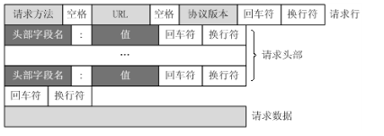

## 1.HTTP协议

### 1.1 简介

在Web应用中，服务器把网页传给浏览器，实际上就是把网页的HTML代码发送给浏览器，让浏览器(渲染)显示出来。而浏览器和服务器之间的传输协议是HTTP，所以：

- HTML是一种用来定义网页的文本
- HTTP是在网络上传输HTML的协议，用于浏览器和服务器的通信。
- HTTP是应用层协议, 超文本传输协议
- **当浏览器读取到HTML源码后，它会解析HTML，显示页面，然后，根据HTML里面的各种链接，再发送HTTP请求给服务器，拿到相应的图片、视频、Flash、JavaScript脚本、CSS等各种资源，最终显示出一个完整的页面。所以我们在Network下面能看到很多额外的HTTP请求。**

### 1.2 Chrome浏览器--调试工具

略

### 1.3 请求报文

```html
GET /path HTTP/1.1
Header1: Value1
Header2: Value2
Header3: Value3
```

```html
    POST /path HTTP/1.1
    Header1: Value1
    Header2: Value2
    Header3: Value3

    body data goes here...
```

实例:

```html
浏览器--向-->服务器发送的请求格式如下：
GET / HTTP/1.1   # 请求方式 HTTP协议/版本
Host: 127.0.0.1:8080  # 请求的服务器地址
Connection: keep-alive  # 连接类型: 长连接
Accept:text/html,application/xhtml+xml,application/xml;q=0.9,image/webp,*/*;q=0.8  # 浏览器可以接收的服务器数据类型
Upgrade-Insecure-Requests: 1 
User-Agent: Mozilla/5.0 (Windows NT 5.1) AppleWebKit/537.36 (KHTML, like Gecko) Chrome/49.0.2623.75 Safari/537.36  # 浏览器信息
Accept-Encoding: gzip, deflate, sdch  # 浏览器可以接收的压缩格式
Accept-Language: zh-CN,zh;q=0.8  # 浏览器可以接收的响应数据格式

[请求体]
```




### 1.4 响应报文

```html
HTTP/1.1 200 OK 
Header1: Value1
Header2: Value2
Header3: Value3

body data goes here...
```


- HTTP响应分为Header和Body两部分（Body是可选项）
- HTTP响应在底层实际上也是先发送响应头, 再发送响应体.
- HTTP响应的Body就是HTML源码

```html
HTTP/1.1 200 OK  # 响应行: 200表示一个成功的响应，后面的OK是说明
Bdpagetype: 2
Bdqid: 0x9ec84ff90004e40d
Cache-Control: private
Connection: Keep-Alive
Content-Encoding: gzip
Content-Type: text/html;charset=utf-8  # 响应的内容, 这里是网页
Date: Wed, 24 Jul 2019 06:01:41 GMT
Expires: Wed, 24 Jul 2019 06:01:41 GMT
Server: BWS/1.1  # 服务器/版本
Set-Cookie: BDSVRTM=54; path=/
Set-Cookie: BD_HOME=1; path=/
Set-Cookie: H_PS_PSSID=1468_21083_18559_29520_28519_29098_29567_28838_29220_26350_29459; path=/; domain=.baidu.com
Strict-Transport-Security: max-age=172800
X-Ua-Compatible: IE=Edge,chrome=1
Transfer-Encoding: chunked

<h1>html_content</h1>  # 响应体
```

- 响应行如果不是 200, 还可以其他功能:
  - 失败的响应有404 Not Found：网页不存在
  - 500 Internal Server Error：服务器内部出错

- Content-Type指示响应的内容
  - 浏览器就是依靠Content-Type来判断响应的内容是网页还是图片，是视频还是音乐。浏览器并不靠URL来判断响应的内容
  - 即使URL是`http://www.baidu.com/meimei.jpg`，它也不一定就是图片。

### 1.5补充: `\r\n`

- 历史原因, 为了各个平台的统一, 最终选择 `\r\n` 来表示
  - `*nux` 下是 `\n`
  - `mac` 下是 `\r`
  - `win` 下是 `\r\n`
- `&nbsp;`
  - 浏览器中所有的空白字符都会解析成一个空格
  - 当要表示多个空格, 用`&nbsp; * 个数`

## 2.`MiniWeb`

### 2.1 静态服务器 -- 显示指定的界面

```python
import socket
import re


def service_client(new_socket):
    """为这个客户端返回数据"""

    # 1. 接收浏览器发送过来的请求 ，即http请求  
    # GET / HTTP/1.1
    # .....
    request = new_socket.recv(1024).decode("utf-8")
    # print(">>>"*50)
    # print(request)

    request_lines = request.splitlines()
    print("")
    print(">"*20)
    print(request_lines)

    # GET /index.html HTTP/1.1
    # get post put del
    file_name = ""
    ret = re.match(r"[^/]+(/[^ ]*)", request_lines[0])
    if ret:
        file_name = ret.group(1)
        # print("*"*50, file_name)
        if file_name == "/":
            file_name = "/index.html"

    # 2. 返回http格式的数据，给浏览器
    
    try:
        f = open("./html" + file_name, "rb")
    except:
        response = "HTTP/1.1 404 NOT FOUND\r\n"
        response += "\r\n"
        response += "------file not found-----"
        new_socket.send(response.encode("utf-8"))
    else:
        html_content = f.read()
        f.close()
        # 2.1 准备发送给浏览器的数据---header
        response = "HTTP/1.1 200 OK\r\n"
        response += "\r\n"
        # 2.2 准备发送给浏览器的数据---boy
        # response += "hahahhah"

        # 将response header发送给浏览器
        new_socket.send(response.encode("utf-8"))
        # 将response body发送给浏览器
        new_socket.send(html_content)

    # 关闭套接
    new_socket.close()
    

def main():
    """用来完成整体的控制"""
    # 1. 创建套接字
    tcp_server_socket = socket.socket(socket.AF_INET, socket.SOCK_STREAM)
    tcp_server_socket.setsockopt(socket.SOL_SOCKET, socket.SO_REUSEADDR, 1)

    # 2. 绑定
    tcp_server_socket.bind(("", 7890))

    # 3. 变为监听套接字
    tcp_server_socket.listen(128)

    while True:
        # 4. 等待新客户端的链接
        new_socket, client_addr = tcp_server_socket.accept()

        # 5. 为这个客户端服务
        service_client(new_socket)

    # 关闭监听套接字
    tcp_server_socket.close()


if __name__ == "__main__":
    main()
```

- 上述程序是有一个BUG: 
  - 客户端(浏览器) 主动close 的时候, request_lines将是一个 空`[]`, 没法去取索引[0]
- 补充: 端口立即释放
  - `server_socket.setsockopt(socket.SOL_SOCKET, socket.SO_REUSEADDR, 1)`
  - 设置当服务器先close 即服务器端4次挥手之后资源能够立即释放，这样就保证下次运行程序时 可以立即绑定原来的端口
  - TCP 协议哪一方先调用 `close` 方法, 那一边等待 `2MSL`

### 2.2 静态服务器 -- 多进程

```python
# *-* coding:utf8 *-*
import multiprocessing
import socket
import re


def service_client(new_socket):
    """为这个客户端返回数据"""

    # 1.接收浏览器发送过来的请求， 即HTTP请求
    # GET / HTTP/1.1
    request = new_socket.recv(1024).decode('utf-8')
    # print("-" * 100)
    # print(request)
    if not request:
        new_socket.close()
        return
    request_lines = request.splitlines()
    # print(request_lines)

    # GET /index.html HTTP/1.1
    # GET POST DELETE
    file_name = ""
    ret = re.match(r'[^/]+(/[^ ]*)', request_lines[0])
    if ret:
        file_name = ret.group(1)
        print("*" * 50, file_name)
        if file_name == "/":
            file_name = "/index.html"

    # 2.返回HTTP格式的数据
    try:
        print("./html" + file_name)
        f = open("./html" + file_name, 'rb')
    except Exception as e:
        response = "HTTP/1.1 404 NOT FOUND\r\n"
        response += "\r\n"
        response += "----------file not found --------"
        new_socket.send(response.encode("utf-8"))
    else:
        html_content = f.read()
        f.close()
        # 2.1 准备发送给浏览器的数据 -- header
        response = "HTTP/1.1 200 OK\r\n"
        response += "\r\n"
        # 2.2 准备发送给浏览器的数据 -- body
        # response += “哈哈哈哈”

        # 将response header 发送给浏览器
        new_socket.send(response.encode("utf-8"))
        # 将response body 发送给服务器
        new_socket.send(html_content)

    # 这里必须再关闭一次， 底层:文件描述符
    new_socket.close()


def main():
    """主函数: 整体控制"""
    # 1.创建套接字
    listen_server = socket.socket(socket.AF_INET, socket.SOCK_STREAM)
    listen_server.setsockopt(socket.SOL_SOCKET, socket.SO_REUSEADDR, 1)
    # 2.绑定ip和port
    local_addr = ("", 8888)
    listen_server.bind(local_addr)
    # 3.主动变被动, 并制定队列的长度
    listen_server.listen(128)

    while True:
        # 4.等待新客户端的连接
        new_socket, client_addr = listen_server.accept()

        # 5.为这个客户端服务
        p = multiprocessing.Process(target=service_client, args=(new_socket, ))
        p.start()
        # 进程类实现的并发服务器，必须要在这里也new_socket.close一次； 原因：文件描述符 fd
        # 子进程已经复制了父进程的套接字等资源，所以父进程调用close不会将他们对应的这个链接关闭的
        new_socket.close()

    # 关闭监听套接字
    listen_server.close()


if __name__ == '__main__':
    main()
```

- `Linux 一切皆文件, 把一切的设备或资源都抽象成 一个文件`
- `new_socket.close()` 需要在 子进程  和 主进程 中都进行关闭;
- 类比:  硬链接.