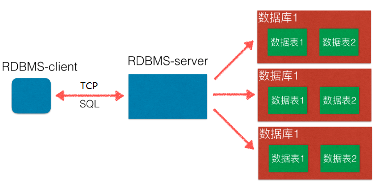
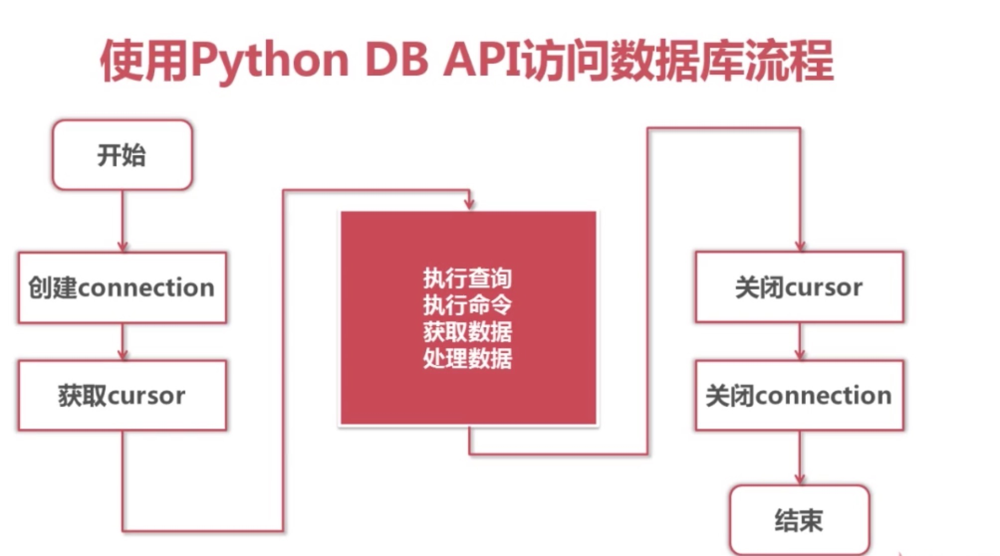

# 一 MySQL 基本使用

## 1.数据库简介

### 1.数据存储 --  引入

| 存储手段               | 缺点                                                         | 备注 |
| ---------------------- | ------------------------------------------------------------ | ---- |
| 结绳记事、甲骨文、图书 | 1.不易保存;<br />2.备份困难;<br />3.查找不便;                |      |
| 文件                   | 1.大容量数据对程序支持性一般, 性能差;<br />2.不易扩展        |      |
| 数据库                 | 1.持久存储;<br />2.读写速度极高;<br />3.保证数据有效性;<br />4.易扩展, 对程序支持非常好 |      |

### 2.数据库

#### 2.1 数据库就是一种特殊的文件，其中存储着需要的数据

#### 2.2 关系型数据库核心元素

- 数据行(记录)
- 数据列(字段)
- 数据表(数据行的集合)
- 数据库(数据表的集合)

### 3.RDBMS(Relational Database Management System)

按关系可以分为两种类型:

- 关系型数据库
  - oracle: 大型工业项目中使用, 银行|通信等
  - mysql: web时代使用最广的关系型
  - sqlite:  轻量级数据库, 主要应用在移动平台
- 非关系型数据库
  - redis
  - mongodb

查看数据库排名: [数据库排名](<https://db-engines.com/en/ranking>)

### 4.RDBMS 和 数据库 的关系



### 5.SQL (Structured Query Language)

> SQL是结构化查询语言，是一种用来操作RDBMS的数据库语言，当前关系型数据库都支持使用SQL语言进行操作,也就是说可以通过 SQL 操作 oracle,sql server,mysql,sqlite 等等所有的关系型的数据库

- SQL语句主要分为：
  - **DQL：数据查询语言，用于对数据进行查询，如select**
  - **DML：数据操作语言，对数据进行增加、修改、删除，如insert、udpate、delete**
  - TPL：事务处理语言，对事务进行处理，包括begin transaction、commit、rollback
  - DCL：数据控制语言，进行授权与权限回收，如grant、revoke
  - DDL：数据定义语言，进行数据库、表的管理等，如create、drop
  - CCL：指针控制语言，通过控制指针完成表的操作，如declare cursor

- SQL 是一门特殊的语言,专门用来操作关系数据库
- 不区分大小写

### 6.MySQL 

#### 6.1 历史

- 官网
- MySQL是一个关系型数据库管理系统，由瑞典MySQL AB公司开发，后来被Sun公司收购，Sun公司后来又被Oracle公司收购，目前属于Oracle旗下产品

#### 6.2 特点

- 使用C和C++编写，并使用了多种编译器进行测试，保证源代码的可移植性
- 支持多种操作系统，如Linux、Windows、AIX、FreeBSD、HP-UX、MacOS、NovellNetware、OpenBSD、OS/2 Wrap、Solaris等
- 为多种编程语言提供了API，如C、C++、Python、Java、Perl、PHP、Eiffel、Ruby等
- 支持多线程，充分利用CPU资源
- 优化的SQL查询算法，有效地提高查询速度
- 提供多语言支持，常见的编码如GB2312、BIG5、UTF8
- 提供TCP/IP、ODBC和JDBC等多种数据库连接途径
- 提供用于管理、检查、优化数据库操作的管理工具
- 大型的数据库。可以处理拥有上千万条记录的大型数据库
- 支持多种存储引擎
- MySQL 软件采用了双授权政策，它分为社区版和商业版，由于其体积小、速度快、总体拥有成本低，尤其是开放源码这一特点，一般中小型网站的开发都选择MySQL作为网站数据库
- MySQL使用标准的SQL数据语言形式
- Mysql是可以定制的，采用了GPL协议，你可以修改源码来开发自己的Mysql系统
- 在线DDL更改功能
- 复制全局事务标识
- 复制无崩溃从机
- 复制多线程从机

> 开源 免费 不要钱 使用范围广,跨平台支持性好,提供了多种语言调用的 API
>
> 是学习数据库开发的首选

### 7.数据类型和约束

- 数据库|数据表 也可以看作是 一种比较复杂的层级比较高的数据结构设计方案.

- 一个数据库就是一个完整的业务单元，可以包含多张表，数据被存储在表中
- 在表中为了更加准确的存储数据，保证数据的正确有效，可以在创建表的时候，为表添加一些强制性的验证，包括数据字段的类型、约束

#### 7.1 数据类型

- 原则: 够用就好(尽量使用取值范围小的，而不用大的; 节约存储空间, 提高查询效率)
- 常用书类型: 
  - 整数：int，bit
  - 小数：decimal
  - 字符串：varchar,char
  - 日期时间: date, time, datetime
  - 枚举类型(enum)
- 特别说明的类型如下：
  - decimal表示浮点数，如decimal(5,2)表示共存5位数，小数占2位
  - char表示固定长度的字符串，如char(3)，如果填充'ab'时会补一个空格为`'ab '`
  - varchar表示可变长度的字符串，如varchar(3)，填充'ab'时就会存储'ab'
  - 字符串text表示存储大文本，当字符大于4000时推荐使用
  - 对于图片、音频、视频等文件，不存储在数据库中，而是上传到某个服务器上，然后在表中存储这个文件的保存路径
- 更全的数据类型可以参考<http://blog.csdn.net/anxpp/article/details/51284106>

#### 7.2 数据约束

- 主键primary key：物理上存储的顺序
- 非空not null：此字段不允许填写空值
- 惟一unique：此字段的值不允许重复
- 默认default：当不填写此值时会使用默认值，如果填写时以填写为准
- 外键foreign key：对关系字段进行约束，当为关系字段填写值时，会到关联的表中查询此值是否存在，如果存在则填写成功，如果不存在则填写失败并抛出异常
- 说明：虽然外键约束可以保证数据的有效性，但是在进行数据的crud（增加、修改、删除、查询）时，都会降低数据库的性能，所以不推荐使用，那么数据的有效性怎么保证呢？答：可以在逻辑层进行控制

> 数值类型(常用)

| 类型        | 字节大小 | 有符号范围(Signed)                         | 无符号范围(Unsigned)     |
| ----------- | -------- | ------------------------------------------ | ------------------------ |
| TINYINT     | 1        | -128 ~ 127                                 | 0 ~ 255                  |
| SMALLINT    | 2        | -32768 ~ 32767                             | 0 ~ 65535                |
| MEDIUMINT   | 3        | -8388608 ~ 8388607                         | 0 ~ 16777215             |
| INT/INTEGER | 4        | -2147483648 ~2147483647                    | 0 ~ 4294967295           |
| BIGINT      | 8        | -9223372036854775808 ~ 9223372036854775807 | 0 ~ 18446744073709551615 |

> 字符串

| 类型    | 字节大小 | 示例                                                         |
| ------- | -------- | ------------------------------------------------------------ |
| CHAR    | 0-255    | 类型:char(3) 输入 'ab', 实际存储为'ab ', 输入'abcd' 实际存储为 'abc' |
| VARCHAR | 0-255    | 类型:varchar(3) 输 'ab',实际存储为'ab', 输入'abcd',实际存储为'abc' |
| TEXT    | 0-65535  | 大文本                                                       |

> 日期时间类型

| 类型      | 字节大小 | 示例                                                  |
| --------- | -------- | ----------------------------------------------------- |
| DATE      | 4        | '2020-01-01'                                          |
| TIME      | 3        | '12:29:59'                                            |
| DATETIME  | 8        | '2020-01-01 12:29:59'                                 |
| YEAR      | 1        | '2017'                                                |
| TIMESTAMP | 4        | '1970-01-01 00:00:01' UTC ~ '2038-01-01 00:00:01' UTC |


## 2.MySQL 安装

### 1.服务端安装

#### 1.1 Ubuntu16.04 安装

`sudo apt-get install mysql-server`

配置开机自启动

启动|重启|停止|等

`sudo service mysql start|restart|stop`

查看进程中是否存在mysql服务

`ps ajx|grep mysql`

#### 1.2 配置

- 配置文件目录:  `/etc/mysql/mysql.cnf`


- 进入 conf.d 目录, 打开 mysql.cnf, 发现并没有配置
- 进入 mysql.conf.d 目录,打开 mysql.cnf , 可以看到配置项
- 主要配置项

```python
bind-address表示服务器绑定的ip，默认为127.0.0.1

port表示端口，默认为3306

datadir表示数据库目录，默认为/var/lib/mysql

general_log_file表示普通日志，默认为/var/log/mysql/mysql.log

log_error表示错误日志，默认为/var/log/mysql/error.log
```

### 2.客户端安装

#### 2.1 Ubuntu16.04 安装

##### 2.1.1 命令行安装

`sudo apt-get install mysql-client`

`mysql –-help`

##### 2.1.2 图形化界面客户端navicat

官网下载并解压: `tar zxvf navicat112_mysql_cs_x64.tar.gz`

运行: `./start_navicat`

问题一: 中文乱码

> - 打开start_navicat文件
> - 将export LANG="en_US.UTF-8"改为export LANG="zh_CN.UTF-8"

问题二: 试用期

> - 删除删除用户目录下的.navicat64目录 `rm -r .navicat64`

#### 2.2 简单使用

##### 2.2.1 Navicat 字符集: `utf8--UTF-8 Unicode`, 排序规则: `utf8_general_ci`


## 3.命令行操作

### 1.连接和退出

- 操作mysql客户端的命令: `mysql`

- 登录

  远程: `mysql -u用户名 -p密码 -h IP地址 -P 端口`

  本地: `mysql -u用户名 -p密码`

- 退出:

```
quit 和 exit
或
ctrl+d
```

- 查看版本|当前时间|当前使用的数据库

```
select version();
select now();
select database();
```

### 2.数据库操作

- 查看所有数据库

```sql
show databases;
```

- 使用数据库

```sql
use 数据库名;
```

- 查看当前使用的数据库

```sql
select database();
```

- 创建数据库

```sql
create database 数据库名 charset=utf8;
```

- 删除数据库

```sql
drop database 数据库名;
```

- 备份

```sql
mysqldump –uroot –p 数据库名 > python.sql;
# 按提示输入mysql的密码
```

- 恢复

```sql
连接mysql，创建新的数据库
退出连接，执行如下命令:

mysql -uroot –p 新数据库名 < python.sql
# 根据提示输入mysql密码
```


### 3.数据表操作

- 查看当前数据库中所有表

```sql
show tables;
```

- 查看表结构

```sql
desc 表名;
```

- 创建表
- auto_increment表示自动增长

```sql
CREATE TABLE table_name(
    column1 datatype contrai,
    .....
    columnN datatype contrai,
    PRIMARY KEY(one or more columns)
);
```

例：创建班级表

```sql
create table classes(
    id int unsigned auto_increment primary key not null,
    name varchar(10)
);
```

例：创建学生表

```sql
create table students(
    id int unsigned primary key auto_increment not null,
    name varchar(20) default '',
    age tinyint unsigned default 0,
    height decimal(5,2),
    gender enum('男','女','中性','保密'),
    cls_id int unsigned default 0
)
```

- 修改表-添加字段

```sql
alter table 表名 add 列名 类型;
例：
alter table students add birthday datetime;
```

- 修改表-修改字段：重命名版
  - 注:  其实, 可以同时修改约束

```sql
alter table 表名 change 原名 新名 类型及约束;
例：
alter table students change birthday birth datetime not null;
```

- 修改表-修改字段：不重命名版

```sql
alter table 表名 modify 列名 类型及约束;
例：
alter table students modify birth date not null;
```

- 修改表-删除字段

```sql
alter table 表名 drop 列名;
例：
alter table students drop birthday;
```

- 删除表

```sql
drop table 表名;
例：
drop table students;
```

- 查看表的创建语句

```sql
show create table 表名;
例：
show create table classes;
```

### 4.简单的增删改查(CURD)

curd的解释: 代表创建（Create）、更新（Update）、读取（Retrieve）和删除（Delete)

#### 4.1 查询

- 查询所有列

```mysql
select * from 表名;
```

- 查询指定列(可以使用as为列或表指定别名)

```mysql
select 列1,列2,... from 表名;
```

#### 4.2 增加

> 格式:INSERT [INTO] tb**_**name [(col**_**name,...)] {VALUES | VALUE} ({expr | DEFAULT},...),(...),...

- 说明：主键列是自动增长，但是在全列插入时需要占位，通常使用0或者 default 或者 null 来占位，插入成功后以实际数据为准
- 全列插入：值的顺序与表中字段的顺序对应

```sql
insert into 表名 values(...)
例：
insert into students values(0,’郭靖‘,1,'蒙古','2016-1-2');
```

- 部分列插入：值的顺序与给出的列顺序对应

```sql
insert into 表名(列1,...) values(值1,...)
例：
insert into students(name,hometown,birthday) values('黄蓉','桃花岛','2016-3-2');
```

- 上面的语句一次可以向表中插入一行数据，还可以一次性插入多行数据，这样可以减少与数据库的通信
- 全列多行插入：值的顺序与给出的列顺序对应

```sql
insert into 表名 values(...),(...)...;
例：
insert into classes values(0,'python1'),(0,'python2');
insert into 表名(列1,...) values(值1,...),(值1,...)...;
例：
insert into students(name) values('杨康'),('杨过'),('小龙女');
```

#### 4.3 修改

> 格式: **UPDATE** **\*tbname*** **SET col1={expr1|DEFAULT} [,col2={expr2|default}]...[where 条件判断]**

```sql
update 表名 set 列1=值1,列2=值2... where 条件
例：
update students set gender=0,hometown='北京' where id=5;
```

#### 4.4 删除

> **DELETE FROM tbname [where 条件判断]**

```sql
delete from 表名 where 条件
例：
delete from students where id=5;
```

- 逻辑删除，本质就是修改操作

```sql
update students set is_delete=1 where id=1;
```

# 二 MySQL 查询

## 1.准备数据和去重

### 创建数据库| 创建数据表

```sql
-- 创建数据库
create database info charset=utf8;

-- 使用数据库
use info;

-- students表
create table students(
    id int unsigned primary key auto_increment not null,
    name varchar(20) default '',
    age tinyint unsigned default 0,
    height decimal(5,2),
    gender enum('男','女','中性','保密') default '保密',
    cls_id int unsigned default 0,
    is_delete bit default 0
);

-- classes表
create table classes (
    id int unsigned auto_increment primary key not null,
    name varchar(30) not null
);
```

### 插入数据

```sql
-- 向students表中插入数据
insert into students values
(0,'小明',18,180.00,2,1,0),
(0,'小月月',18,180.00,2,2,1),
(0,'彭于晏',29,185.00,1,1,0),
(0,'刘德华',59,175.00,1,2,1),
(0,'黄蓉',38,160.00,2,1,0),
(0,'凤姐',28,150.00,4,2,1),
(0,'王祖贤',18,172.00,2,1,1),
(0,'周杰伦',36,NULL,1,1,0),
(0,'程坤',27,181.00,1,2,0),
(0,'刘亦菲',25,166.00,2,2,0),
(0,'金星',33,162.00,3,3,1),
(0,'静香',12,180.00,2,4,0),
(0,'郭靖',12,170.00,1,4,0),
(0,'周杰',34,176.00,2,5,0);

-- 向classes表中插入数据
insert into classes values (0, "一班"), (0, "二班");
```

### 查询

```sql
-- 查询所有字段
select * from students;

-- 查询指定字段
select name from students;

-- 使用 as 给字段起别名
select id as 序号, name as 名字, gender as 性别 from students;

-- 可以通过 as 给表起别名
-- 如果是单表查询 可以省略表名
select id, name, gender from students;
-- 表名.字段名
select students.id,students.name,students.gender from students;
-- 可以通过 as 给表起别名 
select s.id,s.name,s.gender from students as s;
```

### 消除重复行: 

- 在select后面列前使用distinct可以消除重复的行

```sql
select distinct 列1,... from 表名;
例：
select distinct gender from students;
```

## 2.条件查询

### **使用where子句对表中的数据筛选，结果为true的行会出现在结果集中**

- 语法: `select * from 表名 where 条件;`
- where后面支持多种运算符，进行条件的处理
  - 比较运算符
  - 逻辑运算符
  - 模糊查询
  - 范围查询
  - 空判断

### 比较运算符

- 等于: =
- 大于: >
- 大于等于: >=
- 小于: <
- 小于等于: <=
- 不等于: != 或 <>

### 逻辑运算符

- and
- or
- not

### 模糊查询

- like
- %表示任意多个任意字符
- _表示一个任意字符

### 范围查询

- in表示在一个非连续的范围内
  - 注意: in 后面只能是 小括号 的元组

- between ... and ...表示在一个连续的范围内
- not between ... and ...表示不在一个连续的范围内
  - `not between` 是一个固定的用法.

### 空判断

- 注意：null与''是不同的
- 判空is null
- 判非空is not null

### 优先级

- 优先级由高到低的顺序为：小括号，not，比较运算符，逻辑运算符
- and比or先运算，如果同时出现并希望先算or，需要结合()使用


## 3. 排序

### 语法: `select * from 表名 order by 列1 asc|desc [,列2 asc|desc,...]`

##### 说明

- 将行数据按照列1进行排序，如果某些行列1的值相同时，则按照列2排序，以此类推
- 默认按照列值从小到大排列（asc）
- asc从小到大排列，即升序
- desc从大到小排序，即降序


## 4. 聚合函数

### 总数|最大值|最小值|求和|平均值

- count(*)表示计算总行数，括号中写星与列名，结果是相同的
- max(列)表示求此列的最大值
- min(列)表示求此列的最小值
- sum(列)表示求此列的和
- avg(列)表示求此列的平均值

```sql
select count(*) from students;

select max(id) from students where gender=2;

select min(id) from students where is_delete=0;

select sum(age) from students where gender=1;

-- 平均年龄
select sum(age)/count(*) from students where gender=1;

select avg(id) from students where is_delete=0 and gender=2;
```


## 5. 分组: group by

- group by的含义:将查询结果按照1个或多个字段进行分组，字段值相同的为一组
- group by可用于单个字段分组，也可用于多个字段分组

```sql
select gender from students group by gender;
```

### `group by + group_concat()`

- group_concat(字段名)可以作为一个输出字段来使用，
- 表示分组之后，根据分组结果，使用group_concat()来放置每一组的某字段的值的集合

```sql
select gender,group_concat(name) from students group by gender;
```

### group by + 集合函数

- 通过group_concat()的启发，我们既然可以统计出每个分组的某字段的值的集合，那么我们也可以通过集合函数来对这个`值的集合`做一些操作

```sql
分别统计性别为男/女的人年龄平均值
select gender,avg(age) from students group by gender;

分别统计性别为男/女的人的个数
select gender,count(*) from students group by gender;
```

### group by + having

- having 条件表达式：用来分组查询后指定一些条件来输出查询结果
- having作用和where一样，但having只能用于group by

```sql
select gender,count(*) from students group by gender having count(*)>2;
```

### group by + with rollup

- with rollup的作用是：在最后新增一行，来记录当前列里所有记录的总和

```sql
select gender,count(*) from students group by gender with rollup;

select gender,group_concat(age) from students group by gender with rollup;
```


## 6. 分页

### 语法: `select * from 表名 limit start,count`

- 从start开始，获取count条数据

### 分页: `select * from students where is_delete=0 limit (n-1)*m,m`


## 7. 连接查询

当查询结果的列来源于多张表时，需要将多张表连接成一个大的数据集，再选择合适的列返回

mysql支持三种类型的连接查询，分别为：

- 内连接查询：查询的结果为两个表匹配到的数据

  

- 右连接查询：查询的结果为两个表匹配到的数据，右表特有的数据，对于左表中不存在的数据使用null填充

  

- 左连接查询：查询的结果为两个表匹配到的数据，左表特有的数据，对于右表中不存在的数据使用null填充

  

### 语法

```sql
select * from 表1 inner或left或right join 表2 on 表1.列 = 表2.列
```

例1：使用内连接查询班级表与学生表

```sql
select * from students inner join classes on students.cls_id = classes.id;
```

例2：使用左连接查询班级表与学生表

- 此处使用了as为表起别名，目的是编写简单

```sql
select * from students as s left join classes as c on s.cls_id = c.id;
```

例3：使用右连接查询班级表与学生表

```sql
select * from students as s right join classes as c on s.cls_id = c.id;
```

例4：查询学生姓名及班级名称

```sql
select s.name,c.name from students as s inner join classes as c on s.cls_id = c.id;
```

## 8. 自关联

### 场景: 

- 省市区
- 部门组织结构

### 说明

- 自关联: 表中的某一列，关联了这个表中的另外一列

```sql
-- 查询一共有多少个省
select count(*) from areas where pid is null;

-- 查询省的名称为“山西省”的所有城市
select city.* from areas as city
inner join areas as province on city.pid=province.aid
where province.atitle='山西省';

-- 查询市的名称为“广州市”的所有区县
select dis.* from areas as dis
inner join areas as city on city.aid=dis.pid
where city.atitle='广州市';
```


## 9. 子查询

### 子查询: 

- 在一个 select 语句中,嵌入了另外一个 select 语句, 那么被嵌入的 select 语句称之为子查询语句

### 主查询:

- 主要查询的对象,第一条 select 语句

###  主查询和子查询的关系

- 子查询是嵌入到主查询中
- 子查询是辅助主查询的,要么充当条件,要么充当数据源
- 子查询是可以独立存在的语句,是一条完整的 select 语句

### 子查询分类

- 标量子查询: 子查询返回的结果是一个数据(一行一列)
- 列子查询: 返回的结果是一列(一列多行)
- 行子查询: 返回的结果是一行(一行多列)

### 标量子查询

1. 查询班级学生平均年龄
2. 查询大于平均年龄的学生

查询班级学生的平均身高

```sql
select * from students where age > (select avg(age) from students);
```

### 列级子查询

- 查询还有学生在班的所有班级名字
- 1. 找出学生表中所有的班级 id
  2. 找出班级表中对应的名字

```sql
select name from classes where id in (select cls_id from students);
```

### 行级子查询

- 需求: 查找班级年龄最大,身高最高的学生
- 行元素: 将多个字段合成一个行元素,在行级子查询中会使用到行元素

```sql
select * from students where (height,age) = (select max(height),max(age) from students);
```

### 子查询中特定关键字使用

- in 范围
  - 格式: 主查询 where 条件 in (列子查询)

## 10. 完整的查询格式

```sql
SELECT select_expr [,select_expr,...] [      
      FROM tb_name
      [WHERE 条件判断]
      [GROUP BY {col_name | postion} [ASC | DESC], ...] 
      [HAVING WHERE 条件判断]
      [ORDER BY {col_name|expr|postion} [ASC | DESC], ...]
      [ LIMIT {[offset,]rowcount | row_count OFFSET offset}]
]
```

- 完整的select语句

```sql
select distinct *
from 表名
where ....
group by ... having ...
order by ...
limit start,count
```

- 执行顺序为：
  - from 表名
  - where ....
  - group by ...
  - select distinct *
  - having ...
  - order by ...
  - limit start,count
- 实际使用中，只是语句中某些部分的组合，而不是全部

# 三 MySQL 与 Python 交互

## 1.准备数据

```sql
-- 创建 "京东" 数据库
create database jing_dong charset=utf8;

-- 使用 "京东" 数据库
use jing_dong;

-- 创建一个商品goods数据表
create table goods(
    id int unsigned primary key auto_increment not null,
    name varchar(150) not null,
    cate_name varchar(40) not null,
    brand_name varchar(40) not null,
    price decimal(10,3) not null default 0,
    is_show bit not null default 1,
    is_saleoff bit not null default 0
);

-- 向goods表中插入数据

insert into goods values(0,'r510vc 15.6英寸笔记本','笔记本','华硕','3399',default,default); 
insert into goods values(0,'y400n 14.0英寸笔记本电脑','笔记本','联想','4999',default,default);
insert into goods values(0,'g150th 15.6英寸游戏本','游戏本','雷神','8499',default,default); 
insert into goods values(0,'x550cc 15.6英寸笔记本','笔记本','华硕','2799',default,default); 
insert into goods values(0,'x240 超极本','超级本','联想','4880',default,default); 
insert into goods values(0,'u330p 13.3英寸超极本','超级本','联想','4299',default,default); 
insert into goods values(0,'svp13226scb 触控超极本','超级本','索尼','7999',default,default); 
insert into goods values(0,'ipad mini 7.9英寸平板电脑','平板电脑','苹果','1998',default,default);
insert into goods values(0,'ipad air 9.7英寸平板电脑','平板电脑','苹果','3388',default,default); 
insert into goods values(0,'ipad mini 配备 retina 显示屏','平板电脑','苹果','2788',default,default); 
insert into goods values(0,'ideacentre c340 20英寸一体电脑 ','台式机','联想','3499',default,default); 
insert into goods values(0,'vostro 3800-r1206 台式电脑','台式机','戴尔','2899',default,default); 
insert into goods values(0,'imac me086ch/a 21.5英寸一体电脑','台式机','苹果','9188',default,default); 
insert into goods values(0,'at7-7414lp 台式电脑 linux ）','台式机','宏碁','3699',default,default); 
insert into goods values(0,'z220sff f4f06pa工作站','服务器/工作站','惠普','4288',default,default); 
insert into goods values(0,'poweredge ii服务器','服务器/工作站','戴尔','5388',default,default); 
insert into goods values(0,'mac pro专业级台式电脑','服务器/工作站','苹果','28888',default,default); 
insert into goods values(0,'hmz-t3w 头戴显示设备','笔记本配件','索尼','6999',default,default); 
insert into goods values(0,'商务双肩背包','笔记本配件','索尼','99',default,default); 
insert into goods values(0,'x3250 m4机架式服务器','服务器/工作站','ibm','6888',default,default); 
insert into goods values(0,'商务双肩背包','笔记本配件','索尼','99',default,default);
```

## 2.高阶SQL语句

### 1. SQL语句的强化

- 查询类型cate_name为 '超极本' 的商品名称、价格

```sql
select name,price from goods where cate_name = '超级本';
```

- 显示商品的种类

```sql
select cate_name from goods group by cate_name;
```

- 求所有电脑产品的平均价格,并且保留两位小数

```sql
select round(avg(price),2) as avg_price from goods;
```

- 显示每种商品的平均价格

```sql
select cate_name,avg(price) from goods group by cate_name;
```

- 查询每种类型的商品中 最贵、最便宜、平均价、数量

```sql
select cate_name,max(price),min(price),avg(price),count(*) from goods group by cate_name;
```

- 查询所有价格大于平均价格的商品，并且按价格降序排序

```sql
select id,name,price from goods 
where price > (select round(avg(price),2) as avg_price from goods) 
order by price desc;
```

- 查询每种类型中最贵的电脑信息

```sql
select * from goods
inner join 
    (
        select
        cate_name, 
        max(price) as max_price, 
        min(price) as min_price, 
        avg(price) as avg_price, 
        count(*) from goods group by cate_name
    ) as goods_new_info 
on goods.cate_name=goods_new_info.cate_name and goods.price=goods_new_info.max_price;
```

### 2. 创建 "商品分类"" 表

```sql
-- 创建商品分类表
create table if not exists goods_cates(
    id int unsigned primary key auto_increment,
    name varchar(40) not null
);
```

- 查询goods表中商品的种类

```sql
select cate_name from goods group by cate_name;
```

- 将分组结果写入到goods_cates数据表

```sql
insert into goods_cates (name) select cate_name from goods group by cate_name;
```

### 3. 同步表数据

- 通过goods_cates数据表来更新goods表

```sql
update goods as g inner join goods_cates as c on g.cate_name=c.name set g.cate_name=c.id;
```

### 4. 创建 "商品品牌表" 表

- 通过create...select来创建数据表并且同时写入记录,一步到位

```sql
-- select brand_name from goods group by brand_name;

-- 在创建数据表的时候一起插入数据
-- 注意: 需要对brand_name 用as起别名，否则name字段就没有值
create table goods_brands (
    id int unsigned primary key auto_increment,
    name varchar(40) not null) select brand_name as name from goods group by brand_name;
```

### 5. 同步数据

- 通过goods_brands数据表来更新goods数据表

```sql
update goods as g inner join goods_brands as b on g.brand_name=b.name set g.brand_name=b.id;
```

### 6. 修改表结构

- 查看 goods 的数据表结构,会发现 cate_name 和 brand_name对应的类型为 `varchar` 但是存储的都是数字

```sql
desc goods;
```

- 通过alter table语句修改表结构

```sql
alter table goods  
change cate_name cate_id int unsigned not null,
change brand_name brand_id int unsigned not null;
```

### 7. 外键

- 分别在 goods_cates 和 goods_brands表中插入记录

```sql
insert into goods_cates(name) values ('路由器'),('交换机'),('网卡');
insert into goods_brands(name) values ('海尔'),('清华同方'),('神舟');
```

- 在 goods 数据表中写入任意记录

```sql
insert into goods (name,cate_id,brand_id,price)
values('LaserJet Pro P1606dn 黑白激光打印机', 12, 4,'1849');
```

- 查询所有商品的详细信息 (通过内连接)

```sql
select g.id,g.name,c.name,b.name,g.price from goods as g
inner join goods_cates as c on g.cate_id=c.id
inner join goods_brands as b on g.brand_id=b.id;
```

- 查询所有商品的详细信息 (通过左连接)

```sql
select g.id,g.name,c.name,b.name,g.price from goods as g
left join goods_cates as c on g.cate_id=c.id
left join goods_brands as b on g.brand_id=b.id;
```

- 如何防止无效信息的插入,就是可以在插入前判断类型或者品牌名称是否存在呢? 可以使用之前讲过的外键来解决
- 外键约束:对数据的有效性进行验证
- 关键字: foreign key,只有 innodb数据库引擎 支持外键约束
- 对于已经存在的数据表 如何更新外键约束

```sql
-- 给brand_id 添加外键约束成功
alter table goods add foreign key (brand_id) references goods_brands(id);
-- 给cate_id 添加外键失败
-- 会出现1452错误
-- 错误原因:已经添加了一个不存在的cate_id值12,因此需要先删除
alter table goods add foreign key (cate_id) references goods_cates(id);
```

- 如何在创建数据表的时候就设置外键约束呢?
- 注意: goods 中的 cate_id 的类型一定要和 goods_cates 表中的 id 类型一致

```sql
create table goods(
    id int primary key auto_increment not null,
    name varchar(40) default '',
    price decimal(5,2),
    cate_id int unsigned,
    brand_id int unsigned,
    is_show bit default 1,
    is_saleoff bit default 0,
    foreign key(cate_id) references goods_cates(id),
    foreign key(brand_id) references goods_brands(id)
);
```

- 如何取消外键约束

```sql
-- 需要先获取外键约束名称,该名称系统会自动生成,可以通过查看表创建语句来获取名称
show create table goods;
-- 获取名称之后就可以根据名称来删除外键约束
alter table goods drop foreign key 外键名称;
```

- **在实际开发中,很少会使用到外键约束,会极大的降低表更新的效率**

## 3.数据库的设计

### 创建 "商品分类" 表

```sql
create table goods_cates(
    id int unsigned primary key auto_increment not null,
    name varchar(40) not null
);
```

### 创建 "商品品牌" 表

```sql
create table goods_brands (
    id int unsigned primary key auto_increment not null,
    name varchar(40) not null
);
```

### 创建 "商品" 表

```sql
create table goods(
    id int unsigned primary key auto_increment not null,
    name varchar(40) default '',
    price decimal(5,2),
    cate_id int unsigned,
    brand_id int unsigned,
    is_show bit default 1,
    is_saleoff bit default 0,
    foreign key(cate_id) references goods_cates(id),
    foreign key(brand_id) references goods_brands(id)
);
```

### 创建 "顾客" 表

```sql
create table customer(
    id int unsigned auto_increment primary key not null,
    name varchar(30) not null,
    addr varchar(100),
    tel varchar(11) not null
);
```

### 创建 "订单" 表

```sql
create table orders(
    id int unsigned auto_increment primary key not null,
    order_date_time datetime not null,
    customer_id int unsigned,
    foreign key(customer_id) references customer(id)
);
```

### 创建 "订单详情" 表

```sql
create table order_detail(
    id int unsigned auto_increment primary key not null,
    order_id int unsigned not null,
    goods_id int unsigned not null,
    quantity tinyint unsigned not null,
    foreign key(order_id) references orders(id),
    foreign key(goods_id) references goods(id)
);
```

### 说明

- 以上创建表的顺序是有要求的,即如果goods表中的外键约束用的是goods_cates或者是goods_brands,那么就应该先创建这2个表,否则创建goods会失败
- 创建外键时,一定要注意类型要相同,否则失败

## 4. Python操作MySQL步骤



```python
import pymysql

conn=connect(参数列表)
参数host：连接的mysql主机，如果本机是'localhost'
参数port：连接的mysql主机的端口，默认是3306
参数database：数据库的名称
参数user：连接的用户名
参数password：连接的密码
参数charset：通信采用的编码方式，推荐使用utf8

cs = conn.cursor()

cs对象:
close()关闭
execute(operation [, parameters ])执行语句，返回受影响的行数，主要用于执行insert、update、delete语句，也可以执行create、alter、drop等语句
fetchone()执行查询语句时，获取查询结果集的第一个行数据，返回一个元组
fetchall()执行查询时，获取结果集的所有行，一行构成一个元组，再将这些元组装入一个元组返回

```

```python
from pymysql import *

def main():
    # 创建Connection连接
    conn = connect(host='localhost',port=3306,database='jing_dong',user='root',password='mysql',charset='utf8')
    # 获得Cursor对象
    cs1 = conn.cursor()
    # 执行insert语句，并返回受影响的行数：添加一条数据
    # 增加
    count = cs1.execute('insert into goods_cates(name) values("硬盘")')
    #打印受影响的行数
    print(count)

    count = cs1.execute('insert into goods_cates(name) values("光盘")')
    print(count)

    # # 更新
    # count = cs1.execute('update goods_cates set name="机械硬盘" where name="硬盘"')
    # # 删除
    # count = cs1.execute('delete from goods_cates where id=6')

    # 提交之前的操作，如果之前已经之执行过多次的execute，那么就都进行提交
    conn.commit()

    # 关闭Cursor对象
    cs1.close()
    # 关闭Connection对象
    conn.close()

if __name__ == '__main__':
    main()
```

```python
from pymysql import *

def main():
    # 创建Connection连接
    conn = connect(host='localhost',port=3306,user='root',password='mysql',database='jing_dong',charset='utf8')
    # 获得Cursor对象
    cs1 = conn.cursor()
    # 执行select语句，并返回受影响的行数：查询一条数据
    count = cs1.execute('select id,name from goods where id>=4')
    # 打印受影响的行数
    print("查询到%d条数据:" % count)

    for i in range(count):
        # 获取查询的结果
        result = cs1.fetchone()
        # 打印查询的结果
        print(result)
        # 获取查询的结果

    # 关闭Cursor对象
    cs1.close()
    conn.close()

if __name__ == '__main__':
    main()
```


```python
from pymysql import *

def main():
    # 创建Connection连接
    conn = connect(host='localhost',port=3306,user='root',password='mysql',database='jing_dong',charset='utf8')
    # 获得Cursor对象
    cs1 = conn.cursor()
    # 执行select语句，并返回受影响的行数：查询一条数据
    count = cs1.execute('select id,name from goods where id>=4')
    # 打印受影响的行数
    print("查询到%d条数据:" % count)

    # for i in range(count):
    #     # 获取查询的结果
    #     result = cs1.fetchone()
    #     # 打印查询的结果
    #     print(result)
    #     # 获取查询的结果

    result = cs1.fetchall()
    print(result)

    # 关闭Cursor对象
    cs1.close()
    conn.close()

if __name__ == '__main__':
    main()
```

## 5.参数化和防止SQL注入

参数化

- sql语句的参数化，可以有效防止sql注入
- 注意：此处不同于python的字符串格式化，全部使用%s占位

```python
from pymysql import *

def main():

    find_name = input("请输入物品名称：")

    # 创建Connection连接
    conn = connect(host='localhost',port=3306,user='root',password='mysql',database='jing_dong',charset='utf8')
    # 获得Cursor对象
    cs1 = conn.cursor()


    # # 非安全的方式
    # # 输入 " or 1=1 or "   (双引号也要输入)
    # sql = 'select * from goods where name="%s"' % find_name
    # print("""sql===>%s<====""" % sql)
    # # 执行select语句，并返回受影响的行数：查询所有数据
    # count = cs1.execute(sql)

    # 安全的方式
    # 构造参数列表
    params = [find_name]
    # 执行select语句，并返回受影响的行数：查询所有数据
    count = cs1.execute('select * from goods where name=%s', params)
    # 注意：
    # 如果要是有多个参数，需要进行参数化
    # 那么params = [数值1, 数值2....]，此时sql语句中有多个%s即可 

    # 打印受影响的行数
    print(count)
    # 获取查询的结果
    # result = cs1.fetchone()
    result = cs1.fetchall()
    # 打印查询的结果
    print(result)
    # 关闭Cursor对象
    cs1.close()
    # 关闭Connection对象
    conn.close()

if __name__ == '__main__':
    main()
```

# 四 MySQL高级

