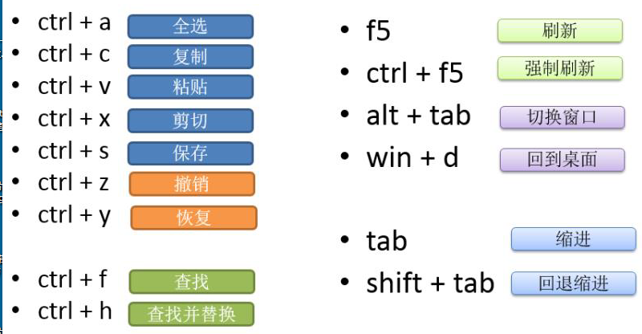
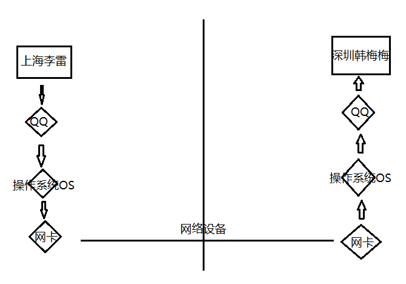
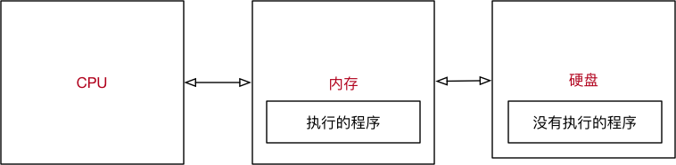
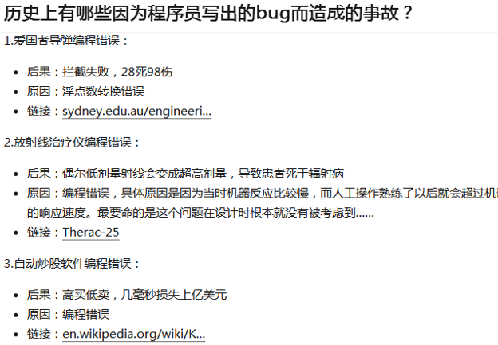
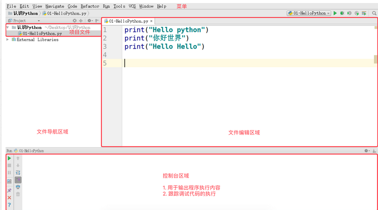

### 0、计算机基础知识操作

#### 0.1 计算机基本操作

##### 0.1.1 计算机盘符介绍

x86:  32位计算机操作系统 计算机内存2G安装X86

x64:  64位计算机操作系统 计算机内存4G(包含4G)以上安装X64

##### 0.1.2 常用快捷键介绍



##### 0.1.3 新建文件及文件夹

##### 0.1.4 文件夹及文件重命名

##### 0.1.5 显示文件后缀名

- win 10
- win 7

##### 0.1.6 ping 通网络

进入`CMD`窗口: `win + r` 输入 `cmd` 然后 `Enter`

```
ping 192.168.1.1
ping www.baidu.com
```


#### 0.2 操作系统科普(了解)

##### 0.2.1 举个QQ通信案例	



`用户` -->  `应用程序` -->  `操作系统` -->   `驱动` -->  `硬件`  

##### 0.2.2 操作系统的作用

- 是现代计算机系统中最基本和最重要的系统软件

- 是配置在计算机硬件上的第一层软件，是对硬件系统的首次扩展

- 主要作用是管理好硬件设备，并为用户和应用程序提供一个简单的接口，以便于使用
- 而其他的诸如编译程序、数据库管理系统，以及大量的应用软件，都直接依赖于操作系统的支持

##### 0.2.3 不同应用领域的主流操作系统

- 桌面操作系统：Windows（用户群体大） 系列、macOS、Linux系列

- 服务器操作系统：Linux（安全、稳定、免费、占有率高）、Windows Server（付费、占有率低）

- 嵌入式操作系统：Linux

- 移动设备操作系统：iOS、Android（基于 Linux）

##### 0.2.4 虚拟机

- 虚拟机（Virtual Machine）指通过软件模拟的具有完整硬件系统功能的、运行在一个完全隔离环境中的完整计算机系统

- 虚拟系统通过生成现有操作系统的全新虚拟镜像，具有真实操作系统完全一样的功能

- 进入虚拟系统后，所有操作都是在这个全新的独立的虚拟系统里面进行，可以独立安装运行软件，保存数据，拥有自己的独立桌面，不会对真正的系统产生任何影响

- 能够在现有系统与虚拟镜像之间灵活切换的一类操作系统


##### 0.2.5 环境变量配置(==重点==)

- 1.计算机右键[属性]
- 2.[高级系统设置] --> [环境变量]
- 3.点击环境变量配置
- 4.配置路径, 点击确定
  - 注意: 结尾已经要加英文字符的分号

#### 0.3 Python开发环境安装

##### 0.3.1 Python 解释器安装

python 官网: https://www.python.org/

##### 0.3.2 PyCharm 安装

*<u>详细步骤参考附件:<Python和Pycharm安装></u>*

##### 0.3.3 Python 的解释器有多大？

- 执行以下终端命令可以查看 Python 解释器的大小

```shell
# 1. 确认解释器所在位置
$ which python

# 2. 查看 python 文件大小(只是一个软链接)
$ ls -lh /usr/bin/python3

# 3. 查看具体文件大小
$ ls -lh /usr/bin/python3.5
```


#### 0.4 程序执行原理

##### 0.4.1 计算机三大件

程序要运行, 核心三个硬件:

- **CPU**
  - 中央处理器, 大规模集成电路
  - 负责 **处理数据/计算**
- **内存**
  - **临时** 存储数据 (**断电, 数据消失**)
  - 速度快
  - 空间小(单位价格高)
- **硬盘**
  - **永久** 存储数据
  - 速度慢
  - 空间大(单位价格低)

##### 0.4.2 程序执行原理



1. 操作系统会首先让 **CPU** 把 **Python 解释器** 的程序复制到 **内存** 中
2. **Python 解释器** 根据语法规则，**从上向下** 让 **CPU** 翻译 **Python 程序中的代码**
3. **CPU** 负责执行翻译完成的代码

##### 0.4.3 程序的作用

> **程序就是用来处理数据的**

- CPU 将 程序 从 硬盘 中 "转移" 到 内存中

- 思考:

  - 1.在 QQ 这个程序将 **QQ 号码** 和 **QQ 密码** 发送给服务器之前，**是否需要先存储一下 QQ 号码 和 密码?**

    - 答: 需要, 否则 QQ 这个程序就不知道把什么内容发送给服务器了！

  - 2.QQ 这个程序把 **QQ 号码** 和 **QQ 密码** 保存在哪里？

    - 内存, 由QQ来管理

  - 3.QQ 这个程序是怎么保存用户的 **QQ 号码** 和 **QQ 密码** 的？

    - 在内存中为 **QQ 号码** 和 **QQ 密码** 各自分配一块空间

      - 在 QQ 程序结束之前，这两块空间是由 QQ 程序负责管理的，其他任何程序都不允许使用
      - 在 QQ 自己使用完成之前，这两块空间始终都只负责保存 **QQ 号码** 和 **QQ 密码**

    - 使用一个 **别名** 标记 **QQ 号码** 和 **QQ 密码** 在内存中的位置
  > - 在程序内部，为 **QQ 号码** 和 **QQ 密码** 在内存中分配的空间就叫做 **变量**
  > - **程序就是用来处理数据的，而变量就是用来存储数据的**


---


### 一、了解python的起源

**人生苦短，我用 Python —— Life is short, you need Python**

#### 1.0 Python的起源

*创始人: 吉多·范罗苏姆（Guido van Rossum）*


1. 1989 年的圣诞节期间，吉多·范罗苏姆为了在阿姆斯特丹打发时间，决心开发一个新的**解释程序**，作为 ABC 语言的一种继承（**感觉下什么叫牛人**）

2. ABC 是由吉多参加设计的一种教学语言，就吉多本人看来，ABC 这种语言非常优美和强大，是**专门为非专业程序员设计的**。但是 ABC 语言并没有成功，究其原因，吉多认为是**非开放**造成的。吉多决心在 Python 中避免这一错误，并获取了非常好的效果

3. 之所以选中 Python（蟒蛇） 作为程序的名字，是因为他是 BBC 电视剧——蒙提·派森的飞行马戏团（Monty Python's Flying Circus）的爱好者 (类似:  JS, hadoop, java, C等)

4. 1991 年，第一个 Python **解释器** 诞生，它是用 C 语言实现的，并能够调用 C 语言的库文件


#### 1.1 解释器（科普）

**计算机不能直接理解任何除机器语言以外的语言**，所以必须要把程序员所写的程序语言翻译成机器语言，计算机才能执行程序。**将其他语言翻译成机器语言的工具，被称为编译器**

编译器翻译的方式有两种：一个是**编译**，另外一个是**解释**。两种方式之间的区别在于**翻译时间点的不同**。当编译器**以解释方式运行的时候**，也称之为**解释器**


- **编译型语言**：程序在执行之前需要一个专门的编译过程，把程序编译成为机器语言的文件，运行时不需要重新翻译，直接使用编译的结果就行了。程序执行效率高，依赖编译器，跨平台性差些。如 C、C++
- **解释型语言**：解释型语言编写的程序不进行预先编译，以文本方式存储程序代码，会将代码一句一句直接运行。在发布程序时，看起来省了道编译工序，但是在运行程序的时候，必须先解释再运行

​      编译型语言和解释型语言对比

- **速度** —— 编译型语言比解释型语言执行速度快
- **跨平台性** —— 解释型语言比编译型语言跨平台性好

#### 1.2 Python 的设计目标

1999 年，吉多·范罗苏姆向 DARPA 提交了一条名为 “Computer Programming for Everybody” 的资金申请，并在后来说明了他对 Python 的目标：

- 一门**简单直观的语言**并与主要竞争者一样强大
- **开源**，以便任何人都可以为它做贡献
- 代码**像纯英语那样容易理解**
- 适用于**短期**开发的日常任务

这些想法中的基本都已经成为现实，Python 已经成为一门流行的编程语言

#### 1.3 Python 的设计哲学

三大哲学: **优雅  简单  明确**

- Python 开发者的哲学是：**用一种方法，最好是只有一种方法来做一件事**
- 如果面临多种选择，Python 开发者一般会拒绝花俏的语法，而选择**明确没有或者很少有歧义的语法**

> *在 Python 社区，吉多被称为“仁慈的独裁者”.*


#### 1.4 为什么选择 Python？

```
1.代码量少... 开发一个简单的爬虫:  代码量是 java 的 十分之一
2.开发的瓶颈主要在 程序员的效率 而不再 程序运行的效率
3.库多(标准库: os, math, sys, re,   第三方库: 无穷无尽: Django, Flask, Scrapy...)
...
```


#### 1.5 Python 特点

- Python 是**完全面向对象的语言** 

- - **函数**、**模块**、**数字**、**字符串**都是对象，**在** **Python** **中一切皆对象**
  - 完全支持继承、重载、多重继承
  - 支持重载运算符，也支持泛型设计

- Python **拥有一个强大的标准库**，Python 语言的核心只包含 **数字**、**字符串**、**列表**、**字典**、**文件** 等常见类型和函数，而由 Python 标准库提供了 **系统管理**、**网络通信**、**文本处理**、**数据库接口**、**图形系统**、**XML** **处理** 等额外的功能

- Python 社区提供了**大量的第三方模块**，使用方式与标准库类似。它们的功能覆盖 **科学计算**、**人工智能**、**机器学习**、**Web** **开发**、**数据库接口**、**图形系统** 多个领域

> **面向对象的思维方式**：
>
> - **面向对象** 是一种      **思维方式**，也是一门 **程序设计技术**
> - 要解决一个问题前，首先考虑 **由谁** 来做，怎么做事情是 **谁** 的职责，最后把事情做好就行！ 
> - - **对象** 就是 **谁**
> - 要解决复杂的问题，就可以找**多个不同的对象**，**各司其职**，共同实现，最终完成需求

#### 1.6 Python 的优缺点

##### 1.6.1 优点

- 简单、易学

- 免费、开源

- **面向对象**

- 丰富的库

- 可扩展性 

- - 如果需要一段关键代码运行得更快或者希望某些算法不公开，可以把这部分程序用 `C` 或 `C++` 编写，然后在 `Python` 程序中使用它们

- ……

##### 1.6.2 缺点

- 运行速度
- 国内市场较小
- 中文资料匮乏


### 二、掌握第一个`HelloPython`程序的演练

#### 2.1 Python 源程序的基本概念

1.     Python 源程序就是**一个特殊格式的文本文件**，可以**使用任意文本编辑软件**做 `Python` 的开发


2. Python 程序的 **文件扩展名** 通常都是 `.py`

#### 2.2 演练步骤
1.新建一个python目录，在python目录下新建一个test.py文件
2.在控制台(cmd)中输入以下命令执行test.py文件。`python test.py`执行python程序

> cd 切换目录文件; exit 退出 `cmd` 终端
> print 是 python 中我们学习的第一个 函数
> print 函数的作用，可以把 "" 内部的内容，输出到屏幕上

#### 2.3 收集大家错误:

```
1.手误: SyntaxError: invalid character in identifier  
2.缩进: IndentationError: unexpected indent
3.中英文符号错误: 小括号, 引号
```

在学习语言时，不仅要**学会语言的语法**，而且还要**学会如何认识错误和解决错误的方法**

> ***python是一门格式非常严格的程序设计语言***

#### 2.4 **认识"BUG"**的严重性:



#### 2.5 python版本

目前市场上有两个 Python 的版本并存着，分别是 `Python 2.x` 和 `Python 3.x`

- **Python 2.x 默认不支持中文**，具体原因，等到介绍 **字符编码** 时给大家讲解
- Python 2.x 的解释器名称是 **python**
- Python 3.x 的解释器名称是 **python3**

```
SyntaxError: Non-ASCII character '\xe4' in file 01-HelloPython.py on line 3, 
but no encoding declared; 
see http://python.org/dev/peps/pep-0263/ for details
```

> *`ASCII` 字符只包含 `256` 个字符, 不支持中文*

- `Python 3.0` (**发布于 2008 年**)在设计的时候 **没有考虑向下兼容**
  - 许多早期 `Python` 版本设计的程序都无法在 `Python 3.0` 上正常执行
- Python 3.0 发布于 **2008 年**
- 到目前为止，Python 3.0 的稳定版本已经有很多年了
  - Python 3.3 发布于 2012
  - Python 3.4 发布于 2014
  - Python 3.5 发布于 2015
  - Python 3.6 发布于 2016
- 为了照顾现有的程序，官方提供了一个过渡版本 ——Python 2.6
  - 基本使用了 `Python 2.x` 的语法和库
  - 同时考虑了向 `Python 3.0` 的迁移，**允许使用部分** `Python 3.0` 的语法与函数
  - 2010 年中推出的 `Python 2.7` 被确定为 **最后一个Python 2.x 版本**

> 提示：如果开发时，无法立即使用 Python 3.0（还有极少的第三方库不支持 3.0 的语法），建议
>
> - 先使用 `Python 3.0` 版本进行开发
> - 然后使用 `Python 2.6`、`Python 2.7` 来执行，并且做一些兼容性的处理

#### 2.6 执行 `Python` 程序的三种方法

##### 2.6.1 解释器 `python` | `python3`

Python 解释器

```python
# 使用 python 2.x 解释器
$ python xxx.py

# 使用 python 3.x 解释器
$ python3 xxx.py
```

**其他解释器**

**Python 的解释器** 如今有多个语言的实现，包括：

- `CPython` —— 官方版本的 C 语言实现
- `Jython` —— 可以运行在 Java 平台
- `IronPython` —— 可以运行在 .NET 和 Mono 平台
- `PyPy` —— Python 实现的，支持 `JIT` 即时编译

##### 2.6.2 交互式运行 Python 程序

- 直接在终端中运行解释器，而不输入要执行的文件名
- 在 Python 的 `Shell` 中直接输入 **Python 的代码**，会立即看到程序执行结果

**1) 交互式运行 Python 的优缺点**

##### 优点

- 适合于学习/验证 Python 语法或者局部代码

##### 缺点

- 代码不能保存
- 不适合运行太大的程序

**2) 退出 官方的解释器**

##### 1> 直接输入 `exit()`

##### 2> 使用热键退出:  `ctrl + d` 可以退出解释器

#### 3) IPython

- IPython 中 的 “I” 代表 **交互 interactive**

##### 特点

- IPython 是一个 python 的交互式 `shell`，比默认的 `python shell`好用得多
  - 支持自动补全
  - 自动缩进
  - ==**支持 `bash shell` 命令**==
  - 内置了许多很有用的功能和函数

- IPython 是基于 BSD 开源的

##### 版本

- Python 2.x 使用的解释器是 **ipython**
- Python 3.x 使用的解释器是 **ipython3**
- 要退出解释器可以有以下两种方式：

##### 1> 直接输入 `exit`

```python
In [1]: exit
```

##### 2> 使用热键退出

在 IPython 解释器中，按热键 `ctrl + d`，`IPython` 会询问是否退出解释器

#### IPython 的安装

```bash
$ sudo apt install ipython
```

### 三、熟悉PyCharm的基本使用

#### 3.0 交互式终端: `Ipython`

#### 3.1  集成开发环境（IDE）

集成开发环境（`IDE`，Integrated Development Environment）—— **集成了开发软件需要的所有工具**，一般包括以下工具：

图形用户界面

代码编辑器（支持 **代码补全**／**自动缩进**）

编译器／解释器

调试器（**断点**／**单步执行**）

……

#### 3.2 PyCharm 介绍

- `PyCharm` 是 Python 的一款非常优秀的集成开发环境 (还有其他常见的集成开发环境)

- `PyCharm` 除了具有一般 IDE 所必备功能外，还可以在 `Windows`、`Linux`、`macOS` 下使用

- `PyCharm` 适合开发大型项目 

- - 一个项目通常会包含 **很多源文件**
  - 每个 **源文件** 的代码行数是有限的，通常在几百行之内
  - 每个 **源文件** 各司其职，共同完成复杂的业务功能

#### 3.3 PyCharm 体验
**图形界面的区域分布:**



- 1.菜单和工具栏 --  执行(SHIFT + F10) / 调试(SHIFT + F9) 代码
- 2.项目文件目录
- 3.文件导航区域 --  浏览／定位／打开 项目文件
- 4.文件编辑区域 --  编辑 当前打开的文件
- 5.控制台
  - 用于输入程序的执行内容
  - 跟踪调试代码的执行

#### 3.4 设置项目使用的解释器版本

> 当堂演示...

#### 3.5 恢复 `PyCharm` 的初始设置

​	`PyCharm` 的 **配置信息** 是保存在 **用户家目录下** 的 `.PyCharmxxxx.x` 目录下的，`xxxx.x` 表示当前使用的 `PyCharm` 的版本号

如果要恢复 `PyCharm` 的初始设置，可以按照以下步骤进行：

- 1. 关闭正在运行的 `PyCharm`
- 2. 在终端中执行`rm -r ~/.Pycharm`，删除 `PyCharm` 的配置信息目录

#### 3.6 设置专业版启动图标

- 在**专业版**中，选择菜单 **Tools/ Create Desktop Entry …** 可以设置任务栏启动图标
  - 注意: 设置图标时，需要勾选 `Create the entry for all users`

#### 3.7 安装和卸载

##### 1.安装

```shell
tar -zxvf pycharm-professional-2017.1.3.tar.gz
sudo mv pycharm-2017.1.3/ /opt/
cd /opt/pycharm-2017.1.3/bin
./pycharm.sh
```

##### 2.卸载

```shell
sudo rm -r /opt/pycharm-2016.3.1/  # 删除解压缩目录
rm -r ~/.PyCharm2016.3/  # 删除家目录下用于保存配置信息的隐藏目录
rm /usr/share/applications/jetbrains-pycharm.desktop # 如果不再使用 PyCharm 还需要将 快捷方式删掉
```

> 可以自己设置 **快捷方式的内容**

```
[Desktop Entry]
Version=1.0
Type=Application
Name=PyCharm
Icon=/opt/pycharm-edu-3.5.1/bin/pycharm.png  # 注意目录要正确
Exec="/opt/pycharm-edu-3.5.1/bin/pycharm.sh" %f
Comment=The Drive to Develop
Categories=Development;IDE;
Terminal=false
StartupWMClass=jetbrains-pycharm
```


#### 3.8 其它个性化的配置

- 不同区域的字体
- ...

### 四、熟悉Python程序注释的应用

#### 4.1 注释的作用

标注程序, 增强程序可读性, 方便代码的交接 和 方便自己日后优化代码.

#### 4.2 单行注释(行注释)

以 `#`开头，`#`右边的所有东西都被当做说明文字，而不是真正要执行的程序，只起到辅助说明作用

示例代码:

```python
# 单行注释
# (规范: #后面空一格)
print("敌军还有三秒达到战场")  # 这里也可以添加注释
# (规范: 代码后面至少空格两次, 然后#, 然后再空格一次,  然后写注释)
```

#### 4.3 多行注释(块注释)

- 如果希望编写的 **注释信息很多，一行无法显示**，就可以使用多行注释
- 要在 Python 程序中使用多行注释，可以用 **一对 连续的 三个 引号**(单引号和双引号都可以)

```python
"""
这是一个由一对儿连续的三个双引号组成的 多行注释
记住是 一对儿 哟, 连续 哟
"""

# 我是单行注释

'''
这是一个由一对儿连续的三个单引号组成的 多行注释
记住是 一对儿 哟, 连续 哟
'''
```

#### 4.4 什么时候需要使用注释?

- **注释不是越多越好**，对于一目了然的代码，不需要添加注释

- 对于 **复杂的操作**，应该在操作开始前写上若干行注释

- 对于 **不是一目了然的代码**，应在其行尾添加注释

- 绝不要描述代码，假设阅读代码的人比你更懂 Python，他只是不知道你的代码业务功能是什么

- 在一些正规的开发团队，通常会有 **代码审核** 的惯例，就是一个团队中彼此阅读对方的代码

#### 4.5 代码规范

- `Python` 官方提供有一系列 PEP（Python Enhancement Proposals） 文档
- 其中第 8 篇文档专门针对 **Python**      **的代码格式** 给出了建议，也就是俗称的 **PEP8** 规范
  - [文档地址] <https://www.python.org/dev/peps/pep-0008/>
  - 谷歌对应的中文文档地址: <http://zh-google-styleguide.readthedocs.io/en/latest/google-python-styleguide/python_style_rules/>
- 任何语言的程序员，编写出符合规范的代码，是开始程序生涯的第一步

