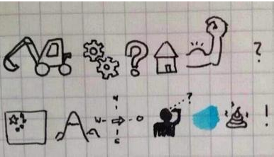
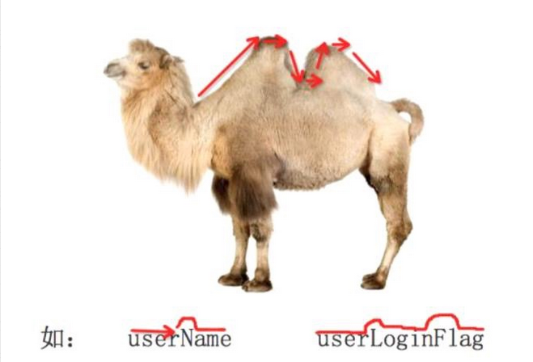
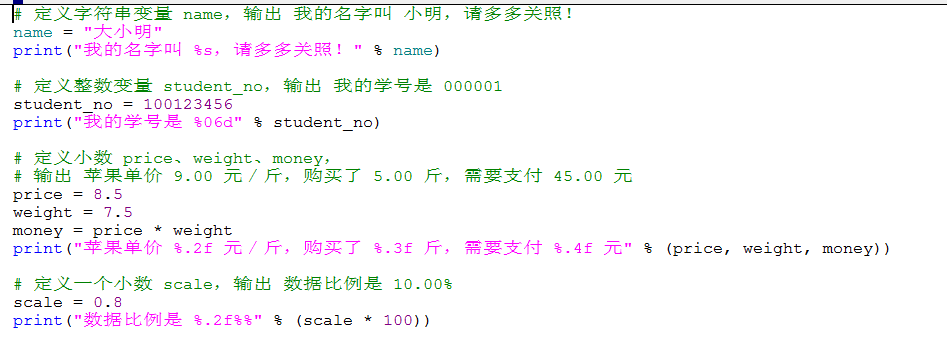
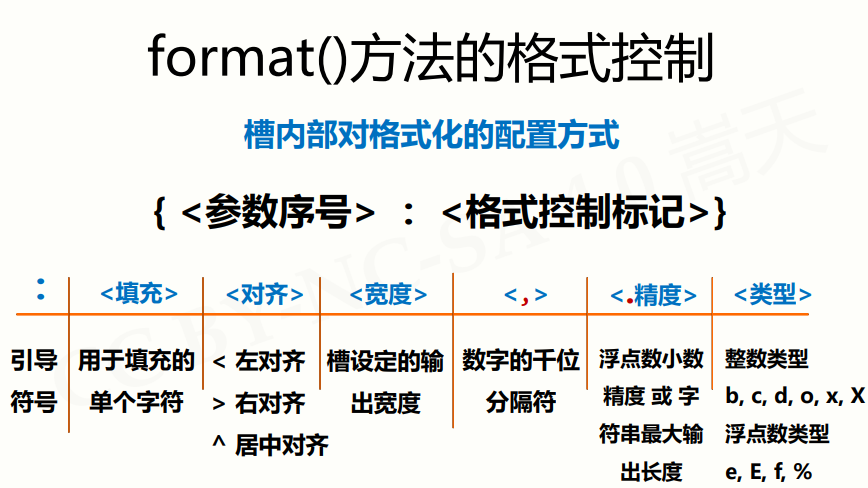

引子: 
> - 在程序内部，为 **QQ 号码** 和 **QQ 密码** 在内存中分配的空间就叫做 **变量**
> - ==**程序就是用来处理数据的，而变量就是用来存储数据的**==


### 1.变量的命名

#### 1.1 标识符和关键字

##### 1.1.1 标识符

> 标识符就是程序定义的  **变量名**  和  **函数名**
>
> 名字 需要 **见名知义** , 见下图

 

- 1.标示符可以由 **字母**、**下划线** 和 **数字** 组成
- 2.**不能以数字开头**
- 3.**不能与关键字重名**
- 4.补充: **一般也不建议和常用的python内置函数等重名**

<u>练习题: 下列标识符那些是正确的, 那些不正确? </u>

```python
fromNo.1  不可以: 特殊字符
fromNo    可以
yongyong  可以
Yong-yong 不可以
yong_yong  可以
new        可以
ojb2       可以
int        不可以
U.Z.I      不可以
2daye      不可以
myInt      可以
MY_TEST    可以
test!32    不可以
# 注释      不可以
注释        不可以
_test      可以
xianyu(ziben)  不可以
jack&docker   不可以
GUN        可以
```

> 注: 中文变量的问题


##### 1.1.2 关键字

> **关键字:**  在python 内部已经被使用的 标识符

- **关键字具有特殊的功能和含义**
- **开发者  不允许定义和关键字相同的名字的标识符**

**查看 python 中关键字的方法**

```python
>>> import keyword
>>> keyword.kwlist
['False', 'None', 'True', 'and', 'as', 'assert', 'async', 'await', 'break', 'class', 'continue', 'def', 'del', 'elif', 'else', 'except', 'finally', 'for', 'from', 'global', 'if', 'import', 'in', 'is', 'lambda', 'nonlocal', 'not', 'or', 'pass', 'raise', 'return', 'try', 'while', 'with', 'yield']

```

> - import 本身也是一个关键字, 可以导入一个 **"工具包"**
> - 注意: 命名的时候其实不止这些限制,  我们命名的时候还不要和 python标准库或者三方的库重名 等等


#### 1.2 变量的命名规则

##### 1.2.1 基础概念

- **命名规则** 可以被视为一种 **惯例**，并无绝对与强制

- 目的是为了 **增加代码的识别和可读性**

- **注意** `Python` 中的 **标识符** 是 **区分大小写的** (大小写敏感)

1. 在定义变量时，为了保证代码格式，= 的左右应该各保留一个空格

2. 在 Python 中，如果 **变量名** 需要由 **二个** 或 **多个单词** 组成时，可以按照以下方式命名

   ```python
   first_name
   fei_zhai_kuai_le_shui
   gen_edu_info
   ```

##### 1.2.2 驼峰命名法(行内)

当 **变量名** 是由二个或多个单词组成时，还可以利用驼峰命名法来命名

**1.2.2.1 小驼峰命名法**

语法: `第一个单词以小写字母开始，后续单词的首字母大写`

举例: `firstName`

**1.2.2.1 大驼峰命名法**

语法: `每一个单词首字母都大写`

举例: `FirstName`



```python
a = "1"  # 字符串1
print(a)
print(type(a))  # type函数是用于 判断 数据类型的

a = 1  # 整数1
print(a)
print(type(a))
```


### 2.变量的基本使用

> #### 程序就是用来处理数据的, 而变量就是用来存储数据的.

#### 2.1 变量的定义

> 前置知识: python是一门 动态 、强类型  、 解释性 的语言
>
> - 动态: 不需要声明变量的类型, 在解释的时候才去确认变量的类型; 且`=`右边是什么类型, 变量就是什么类型
> - 强类型: python很少进行隐式转换;  不同的变量类型之间有"明确的界限", 不会混合的加减.
> - 解释性:  相对于 编译型语言 来说, 在执行的时候才会"一句一句" 的编译成 机器语言 去执行;  而编译型语言在执行前有专门的统一的编译过程. 

*<u>下面是 JavaScript 的语言, 用来 说明 python 的强类型的特点</u>*


```javascript
Type ".help" for more information.
> 1 + "2"
'12'
> "2" + 1
'21'
```

- 1.在 Python 中，每个变量 **在使用前都必须赋值**，变量 **赋值以后** 该变量 **才会被创建**
- **2.语法: `变量名 = 值`**
  - **等号（=）用来给变量赋值**
  - **= 左边是一个变量名**
  - **= 右边是存储在变量中的值**
- 3.变量定义之后后续就可以直接使用了
  - 变量名 只有在 **第一次出现** 才是 **定义变量**
  - 变量名 再次出现，不是定义变量，而是直接使用之前定义过的变量
- 4.可以用 **其他变量的计算结果** 来定义变量
- 5.在内存中创建一个变量, 包括:
  - 1.变量的名称
  - 2.变量保存的数据
  - 3.变量存储数据的类型
  - 4.变量的内存地址(标示)


案例演示

```python
# 定义姓名
name = "ruhua"
# 定义年龄
age = 18
# 定义性别
sex = None
# 资产
money = 0.50
# 是否有钱人
is_toff = True

# 在python源程序中如果要显示变量的内容需要通过  print 函数, 交互式不需要.
# PyCharm 单步调试 确认变量中保存数据的类型
```

> 问题:  在上面的案例演练中一共有多少种数据类型?


#### 2.2 变量类型

##### 1. 在 `Python` 中定义变量是 **不需要指定类型**（在其他很多高级语言中都需要）

##### 2. 数据类型可以分为 **数字型** 和 **非数字型**

- 数字型
  - int  --  整型
  - float -- 浮点型(小数)
  - bool --  布尔(真假)
    - 真 True 非 0 数   ----   **非零即真**
    - 假 False 0
  - complex 复数型
    - 主要用于科学计算, 例如: 平面场问题、波动问题、电感电容等问题
- 非数字型
  - str  --  字符串
  - 列表
  - 元组
  - 字典
  - 集合

> 注:
>
> 提示：在 Python 2.x 中，**整数** 根据保存数值的长度还分为：
>
> - int    整型
> - long    长整型

##### 3. type 函数 和 isinstance 函数 的使用

```python
In [1]: isinstance(1, int)
Out[1]: True

In [2]: type(1)
Out[2]: int
```


#### 2.3 不同类型变量之间的计算

##### 1. 数字类型的变量 之间可以直接进行 算术计算

​	如果变量类型是 bool 类型, 计算时候:

- True 对应的数字是 1
- False 对应的数字是 0

```python
# 示例代码
In [9]: a = 1

In [10]: b = 2.2

In [11]: c = True

In [12]: a + b + c
Out[12]: 4.2
```

##### 2. 字符串变量  之间使用 `+` 拼接字符串

```python
# 应用场景: 1.爬虫中拼接 URL ; 2.拼接文件路径
dirname = "/usr/local/workspace"
file_name = "xx.py"
file_path = dirname + '/' + file_name
```

##### 3.字符串变量 可以和 整数 使用 * 重复拼接相同的字符串

```python
In [13]: "*" * 50
Out[13]: '**************************************************'
```

##### 4.**数字型变量** 和 **字符串** 之间 **不能进行其他计算**


#### 2.4 变量的算术运算

##### 2.4.1 算术运算符

算数运算符是 **运算符的一种** , 是完成四则运算的符号

| 运算符 | 描述           | 示例                 |
| ------ | -------------- | -------------------- |
| +      | 加             | 10 + 10 = 20         |
| -      | 减             | 10 - 10 = 0          |
| *      | 乘             | 10 * 2 = 20          |
| /      | 除             | 10 / 2 = 5.0    注意 |
| //     | 取整除(地板除) | 10 // 3 = 3          |
| %      | 取余           | 10 % 3 = 1           |
| **     | 幂             | 2 ** 2 = 4           |


##### 2.4.2 算术运算符 优先级

- 同 数学 一致: **先乘除后加减, 小括号可以调整优先级**
- 同级运算: **从左至右**
- 优先级表:

| 运算符   | 描述               |
| -------- | ------------------ |
| **       | 幂(最高优先级)     |
| * / // % | 乘、除、整除、取余 |
| + -      | 加 、 减           |

##### 2.4.3 案例: 变量类型和算术运算

```
需求:  买冰棍儿
1. 单价: 2.5元
2. 数量: 9
3. 优惠: 每满10元减2元
4. 求: 消费结果
----------------------
问题:
1.请用代码表达上述业务
2.假如小明只有 20 元 可以买多少根冰棍?
```

提问:

- 1.上述共出现多少个变量? 变量类型分别是什么?
- 2.**定义变量**  和  **使用变量** 的 区分
  - 变量名 只有在 **第一次出现** 才是 **定义变量**
  - 变量名 再次出现，不是定义变量，而是直接使用之前定义过的变


#### 2.5 变量的输入

##### 2.5.1 **输入:**  **<u>代码</u> 获取用户 通过 <u>键盘</u> 输入的信息**

- 在Python, 如果要获取用户在 键盘上 的输入信息, 需要使用到 `input` 函数. 
- 关于函数:
  - 通俗解释:   一个 提前准备好的 **"较为高级工具"** , 可以直接  **使用** , **而不再关心内部的细节** 
  - 目前已经接触过:  `print()`   `type()` 

##### 2.5.2 input 函数实现键盘输入

- 1.==用户输入的任何内容都 当作一个字符串==
- 2.语法:  `字符串变量 = input("这个引号中可以加提示信息, 但是引号的内容和键盘输入没有直接关系"`

##### 2.5.3 变量的类型转换函数(属于: 工厂函数)

| 函数     | 描述                                                        |
| -------- | ----------------------------------------------------------- |
| int(x)   | 将可以转换成int类型的 **python数据类型** 转换成 整形        |
| float(x) | 将 可以转换成 float 类型的 **python数据类型** 转换成 浮点型 |

##### 2.5.4 案例: 变量输入演练

> 演练目标:
>
> - 1.**利用学习的 input 函数, 来实现上述 "买冰棍儿" 案例的交互功能.**
> - 2.减少中间变量的使用,  使用函数的嵌套.


#### 2.6 变量的格式化输出

##### 2.6.1 格式化输出的思考

前置概念:

- 在Python中可以使用 print 函数将信息输出到控制台

问题引入:

- 如果希望输出文字的同时也动态的输出 数据 ?

解决思路:

- 1.==此坑待填: 利用我们前面学过的字符串知识==
- 2.使用 **格式化操作符**

##### 2.6.2 格式化操作符:  `%`

- 包含 `%` 的字符串, 被称为 **格式化字符串**
- `%` 和不同的 **字符** 连用, **不同类型的数据** 需要使用 **不同的格式化字符**

| 格式化字符 | 含义                                                         |
| ---------- | ------------------------------------------------------------ |
| %s         | 字符串                                                       |
| %d         | 有符号十进制整数, %06d 表示输出的整数显示位数, 不足的地方使用 0 补全 |
| %f         | 浮点数, %.2f 表示小数点后只显示两位;  默认是小数点后6位      |
| %%         | 输出 %                                                       |

语法:

- `print("格式化字符串" % 变量)`
- `print("多个格式化字符串" % 多个变量)`

##### 2.6.3 案例: 格式化输出演练

==此坑待填==



##### 2.6.4 `format()` 函数




##### 2.6.5 `f-string`(`Python3.6>=`) 新特性

参考资料: <https://www.python.org/dev/peps/pep-0498/>

