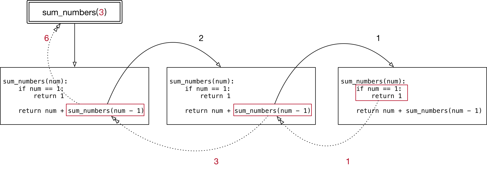

# 函数进阶

## 目标

- 函数参数和返回值的作用
- 函数的返回值 进阶
- 函数的参数 进阶
- 递归函数

## 01. 函数参数和返回值的作用

函数根据 **有没有参数** 以及 **有没有返回值**，可以 **相互组合**，一共有 **4 种** 组合形式

1. 无参数，无返回值
2. 无参数，有返回值
3. 有参数，无返回值
4. 有参数，有返回值

> 定义函数时，**是否接收参数，或者是否返回结果**，是根据 **实际的功能需求** 来决定的！

1. 如果函数 **内部处理的数据不确定**，就可以将外界的数据以参数传递到函数内部
2. 如果希望一个函数 **执行完成后，向外界汇报执行结果**，就可以增加函数的返回值

### 1.1 无参数，无返回值

此类函数，不接收参数，也没有返回值，应用场景如下：

1. **只是单纯地做一件事情**，例如 **显示菜单**
2. 在函数内部 **针对全局变量进行操作**，例如：**新建名片**，最终结果 **记录在全局变量** 中

> 注意：

- 如果全局变量的数据类型是一个 **可变类型**，在函数内部可以使用 **方法** 修改全局变量的内容 —— **变量的引用不会改变**
- 在函数内部，**使用赋值语句** 才会 **修改变量的引用**

### 1.2 无参数，有返回值

此类函数，不接收参数，但是有返回值，应用场景如下：

- 采集数据，例如 **温度计**，返回结果就是当前的温度，而不需要传递任何的参数

### 1.3 有参数，无返回值

此类函数，接收参数，没有返回值，应用场景如下：

- 函数内部的代码保持不变，针对 **不同的参数 处理 不同的数据**
- 例如 **名片管理系统** 针对 **找到的名片** 做 **修改**、**删除** 操作

### 1.4 有参数，有返回值

此类函数，接收参数，同时有返回值，应用场景如下：

- 函数内部的代码保持不变，针对 **不同的参数 处理 不同的数据**，并且 **返回期望的处理结果**
- 例如 **名片管理系统** 使用 **字典默认值** 和 **提示信息** 提示用户输入内容
  - 如果输入，返回输入内容
  - 如果没有输入，返回字典默认值

## 02. 函数的返回值 进阶

- 在程序开发中，有时候，会希望 **一个函数执行结束后，告诉调用者一个结果**，以便调用者针对具体的结果做后续的处理
- **返回值** 是函数 **完成工作**后，**最后** 给调用者的 **一个结果**
- 在函数中使用 `return` 关键字可以返回结果
- 调用函数一方，可以 **使用变量** 来 **接收** 函数的返回结果

> 问题：一个函数执行后能否返回多个结果？

- 可以通过元组或者列表序列返回多个值

> 提示：如果一个函数返回的是元组，括号可以省略

**技巧**

- 在 `Python` 中，可以 **将一个元组** 使用 **赋值语句** 同时赋值给 **多个变量**
- 注意：变量的数量需要和元组中的元素数量保持一致

```python
result = temp, wetness = measure()
```

### 面试题 —— 交换两个数字

**题目要求**

1. 有两个整数变量 `a = 6`, `b = 100`
2. 不使用其他变量，**交换两个变量的值**

#### 解法 1 —— 使用其他变量

```python
# 解法 1 - 使用临时变量
c = b
b = a
a = c
```

#### 解法 2 —— 不使用临时变量

```python
# 解法 2 - 不使用临时变量
a = a + b
b = a - b
a = a - b
```

#### 解法 3 —— Python 专有，利用元组

```python
a, b = b, a
```

## 03. 函数的参数 进阶

### 3.1. 不可变和可变的参数

> 问题 1：在函数内部，针对参数使用 **赋值语句**，会不会影响调用函数时传递的 **实参变量**？ —— 不会！

- 无论传递的参数是 **可变** 还是 **不可变**
  - 只要 **针对参数** 使用 **赋值语句**，会在 **函数内部** 修改 **局部变量的引用**，**不会影响到 外部变量的引用**

```python
def demo(num, num_list):

    print("函数内部")

    # 赋值语句
    num = 200
    num_list = [1, 2, 3]

    print(num)
    print(num_list)

    print("函数代码完成")


gl_num = 99
gl_list = [4, 5, 6]
demo(gl_num, gl_list)
print(gl_num)
print(gl_list)
```

> 问题 2：如果传递的参数是 **可变类型**，在函数内部，使用 **方法** 修改了数据的内容，**同样会影响到外部的数据**

```python
def mutable(num_list):

    # num_list = [1, 2, 3]
    num_list.extend([1, 2, 3])
    
    print(num_list)

gl_list = [6, 7, 8]
mutable(gl_list)
print(gl_list)
```

#### 面试题 —— `+=`

- 在 `python` 中，列表变量调用 `+=` 本质上是在执行列表变量的 `extend` 方法，不会修改变量的引用

```python
def demo(num, num_list):

    print("函数内部代码")

    # num = num + num
    num += num
    # num_list.extend(num_list) 由于是调用方法，所以不会修改变量的引用
    # 函数执行结束后，外部数据同样会发生变化
    num_list += num_list
    # 如果 不用这种赋值语句, 则变成 赋值操作,  得到的是另外一种结果

    print(num)
    print(num_list)
    print("函数代码完成")


gl_num = 9
gl_list = [1, 2, 3]
demo(gl_num, gl_list)
print(gl_num)
print(gl_list)
```

### 3.2 缺省参数

- 定义函数时，可以给 **某个参数** 指定一个**默认值**，具有默认值的参数就叫做 **缺省参数**
- 调用函数时，如果没有传入 **缺省参数** 的值，则在函数内部使用定义函数时指定的 **参数默认值**
- 函数的缺省参数，**将常见的值设置为参数的缺省值**，从而 **简化函数的调用**
- 例如：对列表排序的方法

```python
gl_num_list = [6, 3, 9]

# 默认就是升序排序，因为这种应用需求更多
gl_num_list.sort()
print(gl_num_list)

# 只有当需要降序排序时，才需要传递 `reverse` 参数
gl_num_list.sort(reverse=True)
print(gl_num_list)
```

#### 指定函数的缺省参数

- 在参数后使用赋值语句，可以指定参数的缺省值

```python
def print_info(name, gender=True):

    gender_text = "男生"
    if not gender:
        gender_text = "女生"

    print("%s 是 %s" % (name, gender_text))
```

**提示**

1. 缺省参数，需要使用 **最常见的值** 作为默认值！
2. 如果一个参数的值 **不能确定**，则不应该设置默认值，具体的数值在调用函数时，由外界传递！

#### 缺省参数的注意事项

##### 1) 缺省参数的定义位置

- **必须保证** **带有默认值的缺省参数** **在参数列表末尾**
- 所以，以下定义是错误的！

```python
def print_info(name, gender=True, title):
```

##### 2) 调用带有多个缺省参数的函数

- 在 **调用函数时**，如果有 **多个缺省参数**，**需要指定参数名**，这样解释器才能够知道参数的对应关系！

```python
def print_info(name, title="", gender=True):
    """

    :param title: 职位
    :param name: 班上同学的姓名
    :param gender: True 男生 False 女生
    """

    gender_text = "男生"

    if not gender:
        gender_text = "女生"

    print("%s%s 是 %s" % (title, name, gender_text))


# 提示：在指定缺省参数的默认值时，应该使用最常见的值作为默认值！
print_info("小明")
print_info("老王", title="班长")
print_info("小美", gender=False)
```

### 3.3 多值参数（知道）

#### 定义支持多值参数的函数

- 有时可能需要 **一个函数** 能够处理的参数 **个数** 是不确定的，这个时候，就可以使用 **多值参数
- `python` 中有 **两种** 多值参数：
  - 参数名前增加 **一个** `*` 可以接收 **元组**
  - 参数名前增加 **两个** `*` 可以接收 **字典**
- 一般在给多值参数命名时，**习惯**使用以下两个名字
  - `*args` —— 存放 **元组** 参数，前面有一个 `*`
  - `**kwargs` —— 存放 **字典** 参数，前面有两个 `*`
- `args` 是 `arguments` 的缩写，有变量的含义
- `kw` 是 `keyword` 的缩写，`kwargs` 可以记忆 **键值对参数**

```python
def demo(num, *args, **kwargs):

    print(num)
    print(args)
    print(kwargs)


demo(1, 2, 3, 4, 5, name="小明", age=18, gender=True)
```

> 提示：**多值参数** 的应用会经常出现在网络上一些大牛开发的框架中，知道多值参数，**有利于我们能够读懂大牛的代码**

#### 多值参数案例 —— 计算任意多个数字的和

**需求**

1. 定义一个函数 `sum_numbers`，可以接收的 **任意多个整数**
2. 功能要求：将传递的 **所有数字累加** 并且返回累加结果

```python
def sum_numbers(*args):

    num = 0
    # 遍历 args 元组顺序求和
    for n in args:
        num += n

    return num

print(sum_numbers(1, 2, 3))
```

#### 元组和字典的拆包（知道）

- 在调用带有多值参数的函数时，如果希望：
  - 将一个 **元组变量**，直接传递给 `args`
  - 将一个 **字典变量**，直接传递给 `kwargs`
- 就可以使用 **拆包**，简化参数的传递，**拆包** 的方式是：
  - 在 **元组变量前**，增加 **一个** `*`
  - 在 **字典变量前**，增加 **两个** `*`

```python
def demo(*args, **kwargs):

    print(args)
    print(kwargs)


# 需要将一个元组变量/字典变量传递给函数对应的参数
gl_nums = (1, 2, 3)
gl_xiaoming = {"name": "小明", "age": 18}

# 会把 num_tuple 和 xiaoming 作为元组传递个 args
# demo(gl_nums, gl_xiaoming)
demo(*gl_nums, **gl_xiaoming)
```

## 04. 函数的递归

> 函数调用自身的 **编程技巧** 称为递归

### 4.1 递归函数的特点

**特点**

- **一个函数** **内部** **调用自己**
  - 函数内部可以调用其他函数，当然在函数内部也可以调用自己

**代码特点**

1. 函数内部的 **代码** 是相同的，只是针对 **参数** 不同，**处理的结果不同**
2. 当 **参数满足一个条件** 时，函数不再执行
   - **这个非常重要**，通常被称为递归的出口，否则 **会出现死循环**！

示例代码

```python
def sum_numbers(num):

    print(num)
    
    # 递归的出口很重要，否则会出现死循环
    if num == 1:
        return

    sum_numbers(num - 1)
    
sum_numbers(3)
```



### 4.2 递归案例 —— 计算数字累加

**需求**

1. 定义一个函数 `sum_numbers`
2. 能够接收一个 `num` 的整数参数
3. 计算 1 + 2 + ... num 的结果

```python
def sum_numbers(num):

    if num == 1:
        return 1
    
    # 假设 sum_numbers 能够完成 num - 1 的累加
    temp = sum_numbers(num - 1)

    # 函数内部的核心算法就是 两个数字的相加
    return num + temp

print(sum_numbers(2))
```



> 提示：递归是一个 **编程技巧**，初次接触递归会感觉有些吃力！在处理 **不确定的循环条件时**，格外的有用，例如：**遍历整个文件目录的结构**


---

# `eval` 函数

`eval()` 函数十分强大 —— **将字符串** 当成 **有效的表达式** 来求值 并 **返回计算结果**

```python
# 基本的数学计算
In [1]: eval("1 + 1")
Out[1]: 2

# 字符串重复
In [2]: eval("'*' * 10")
Out[2]: '**********'

# 将字符串转换成列表
In [3]: type(eval("[1, 2, 3, 4, 5]"))
Out[3]: list

# 将字符串转换成字典
In [4]: type(eval("{'name': 'xiaoming', 'age': 18}"))
Out[4]: dict
```

## 案例 - 计算器

**需求**

1. 提示用户输入一个 **加减乘除混合运算**
2. 返回计算结果

```python
input_str = input("请输入一个算术题：")

print(eval(input_str))
```

## 不要滥用 `eval`

> 在开发时千万不要使用 `eval` 直接转换 `input` 的结果

```python
__import__('os').system('ls')
```

- 等价代码

```python
import os

os.system("终端命令")
```

- 执行成功，返回 0
- 执行失败，返回错误信息