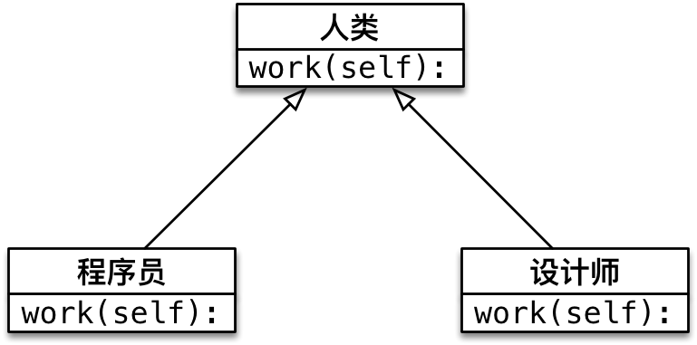

### 一、类

#### 1. 面向对象(`OOP`)基本概念

**面向对象编程** —— Object Oriented Programming 简写 `OOP`

##### 1.1.1 面向对象基本概念

- **面相过程** 和 **面相对象**，是两种不同的 **编程方式**
- 对比 **面向过程** 的特点，可以更好地了解什么是 **面向对象**

##### 1.1.2 过程和函数(科普)

- **过程** 是早期的一个编程概念
- **过程** 类似于函数，只能执行，但是没有返回值
- **函数** 不仅能执行，还可以返回结果

##### 1.1.3 面向过程 和 面向对象 基本概念

1) 面向过程

- 把完成某一个需求的 `所有步骤` `头到尾` 逐步实现
- 根据开发需求，将某些 **功能独立** 的代码 **封装** 成一个又一个 **函数**
- 最后完成的代码，就是顺序地调用 **不同的函数** , 存在大量的耦合

**特点:**

- 注重 **步骤与过程**，不注重职责分工
- 如果需求复杂，代码会变得很复杂
- **开发复杂项目，没有固定的套路，开发难度很大！**

2) 面向对象

**面向对象** 是 **更大** 的 **封装**，根据 **职责** 在 **一个对象中 封装 多个方法**

- 1.在完成某一个需求前，首先确定 **职责** —— **要做的事情（方法）**
- 2.根据 **职责** 确定不同的 **对象**，在 **对象** 内部封装不同的 **方法**（多个）
- 3.顺序地让 **不同的对象** 调用 **不同的方法**

特点

- 注重 **对象和职责**，不同的对象承担不同的职责
- 更加适合应对复杂的需求变化，**是专门应对复杂项目开发，提供的固定套路**
- **需要在面向过程基础上，再学习一些面向对象的语法**

==面向对象三大特征==

- 封装
  - **封装** 是面向对象编程的一大特点
  - 面向对象编程的 **第一步** —— 将 **属性** 和 **方法** **封装** 到一个抽象的 **类** 中
  - **外界** 使用 **类** 创建 **对象**，然后 **让对象调用方法**
  - **对象方法的细节** 都被 **封装** 在 **类的内部**
- 继承
  - **实现代码的重用**，相同的代码不需要重复的编写
- 多态
  - **多态** 不同的 **子类对象** 调用相同的 **父类方法**，产生不同的执行结果
  - **多态** 可以 **增加代码的灵活度**
  - 以 **继承** 和 **重写父类方法** 为前提


### 二. 类和对象

**类** 和 **对象** 是 **面向对象编程的 两个 核心概念**

#### 2.1.1 类

- 1.类 是对一群具有 **相同 特征** 或者 **行为** 的事物的一个统称，是**抽象**的，**不能直接使用**
  - *类 就相当于制造航空母舰时的图纸，是一个 模板，是 负责创建对象的*
- 2.**特征 被称为 属性**
- 3.**行为 被称为 方法**

**案例演练:** 根据下面的描述来实现 ***对象* *属性*   和 *方法*** 的提取

```
•李雷 今年 18 岁，身高 1.75，每天早上 跑 完步，会去 吃 东西
•韩梅梅 今年 17 岁，身高 1.65，韩梅梅不跑步，韩梅梅喜欢 吃 东西
```

#### 2.1.2 对象

**对象** 是 **由类创建出来的一个具体 实例** ，可以直接使用.

- 由**哪一个类**创建的**对象**, 就拥有在 **哪一个类**中定义的 **属性**  和 **方法**
- 类(抽象: 模板) --> 对象(具体: 实例)   过程:  **实例化**

#### 2.1.3 类和对象的关系

- **类是模板**，**对象** 是根据 **类** 这个模板创建出来的，应该 **先有类，再有对象**
- **类** 只有一个，而 **对象** 可以有很多个
- **不同的对象** 之间 **属性** 可能会各不相同
- **类** 中定义了什么 **属性和方法**，**对象** 中就有什么属性和方法，**不可能多，也不可能少**

#### 2.1.4 类的设计

- **类名**  : **大驼峰**, **"见名知义"**
  - **名词提炼法** 分析 **整个业务流程**，出现的 **名词**，通常就是找到的类
- **属性 **(静态): **对象的特征描述**
- **方法** (动态) : **对象具有的行为**（动词）

> 提示：需求中没有涉及的属性或者方法在设计类时，不需要考虑

#### 2.1.5 查看: 类具有的属性和方法

- 1.**python的内置函数(`BIF`):**    `dir()`  ,  注: 括号内传入 **标识符**  ==dir()==
  - 在 `Python` 中 **对象几乎是无所不在的**，我们之前学习的 **变量**、**数据**、**函数** 都是对象
  - 使用内置函数 `dir` 传入 **标识符** / **数据**，可以查看对象内的 **所有属性及方法**
- 2.在交互式或者`IDE`的情况下, 在 `对象的标识符` 后继续输入`.` , 然后再按 `Tab键` 会提示 **该标识符所具有的属性和方法**

#### 2.1.6 python自己提供的常见的内置属性和类方法

| 方法名     | 类型 | 作用                                                         |
| ---------- | ---- | ------------------------------------------------------------ |
| `__new__`  | 方法 | **创建对象的时候, 会被自动调用: <br />1.给对象分配内存地址和空间; <br />2.返回对象的引用(创建的内存地址)** |
| `__init__` | 方法 | **对象被初始化时, 会被自动调用**                             |
| `__del__`  | 方法 | **对象被从内存中销毁前, 会被自动调用**  注: 生命周期的概念   |
| `__str__`  | 方法 | **返回对象的描述信息, print函数输出使用**                    |

#### 2.1.7 定义类的实例方法语法和注意事项

```python
class DefineClass:
    """定义一个只包含实例方法的类"""
    def func1(self, *args, **kwargs):
        pass
    def func2(self, *args, **kwargs):
        pass
```

注意事项:

- **方法**  定义格式和之前的函数几乎相同, 唯一的区别是, 对象的方法第一个参数必须是 `self` 
  - 注: 当然也不必须是`self`, 但是 `self` 已经是约定俗成的; 可以当作必须是 `self`
  - `self` 代表什么含义呢?
    - ==哪一个对象调用的 的方法, `self` 就是哪一个对象的引用==
- 类名命名:  大驼峰

#### 2.1.8 创建对象的语法

`对象变量 = 类名()`


#### 2.1.9 案例演练

*<u>上述的需求扩展成具体的代码</u>*

```python
class Person:
    def __init__(self, name, age, height):
        self.name = name
        self.age = age
        self.height = height
        
    def eat(self):
        print("%s 贪吃" % self.name)
        
    def run(self):
        print("%s 去跑步" % self.name)
# 语法规范: 方法之间空1个行


lilei = Person('lilei', 18, 175.5)
# addr = id(lilei)
# print("%d" % addr)
print(Person)
print(lilei)
print(lilei.name)

hanmeimei = Person('hanmeimei', 17, 165)
print(Person)
print(hanmeimei)
print(hanmeimei.name)

# lilei = Person('lilei', 18, 175.5)
# print(lilei)
# print(lilei.name)


# 给实例对象添加属性
lilei.weight = 56
```


#### 2.1.10 python 的 "引用" 概念(强调)

> 在面向对象开发中，**引用**的概念是同样适用的！

- 在 `Python` 中使用类 **创建对象之后**，实例对象**变量**中 仍然记录的是 **对象在内存中的地址**
- 也就是变量 **引用** 了 **实例化后的实例对象**
- 使用 `print` 输出 **对象变量**，默认情况下，是能够输出这个变量 **引用的对象** 是 **由哪一个类创建的对象**，以及 **在内存中的地址**（**十六进制表示**）

> 提示：在计算机中，通常使用 **十六进制** 表示 **内存地址**
>
> - **十进制** 和 **十六进制** 都是用来表达数字的，只是表示的方式不一样
> - **十进制** 和 **十六进制** 的数字之间可以来回转换

- `%d` 可以以 **10 进制** 输出数字
- `%x` 可以以 **16 进制** 输出数字

#### 2.1.11 self 参数

```python
# 需求分析：
"""
1. 某人的一天
2. 属性：　姓名，　身高，　体重。。。
3. 方法：　跑步，　吃饭　。。。
4. 实现一个只有方法的类
"""

class Person:
    """某人的一天"""
    def run(self):
        print("%s爱跑步" % self.name)

    def eat(self):
        print("周老师爱吃面")


# 类的使用第一步： 实例化
person = Person()  # 实例化并赋值给person变量
print(Person.__doc__)
print(Person())  # 实例化
print(person)  # 打印第一次实例化的对象

# 给对象定义属性
person.name = "周老师"

# 调用实例对象的方法
person.run()
# Person.run()  # 报错： 实例出的新对象

print(dir(Person))
```

> 由 **哪一个对象** 调用的方法，方法内的 `self` 就是 **哪一个对象的引用**

- 在类封装的方法内部，`self` 就表示 **当前调用方法的对象自己**
- **调用方法时**，程序员不需要传递 `self` 参数
- **在方法内部**
  - 可以通过 `self.` **访问对象的属性**
  - 也可以通过 `self.` **调用其他的对象方法**
- 在 **类的外部**，通过 `变量名.` 访问对象的 **属性和方法**
- 在 **类封装的方法中**，通过 `self.` 访问对象的 **属性和方法**

> 解决上面的"弊端", Python专门提供了 `__init__` 方法.

**提示**

- 在日常开发中，不推荐在**类的外部**给对象增加属性
  - 如果**在运行时，没有找到属性，程序会报错**
- 对象应该包含有哪些属性，应该 **封装在类的内部**

```python
# 需求分析：
"""
1. 某人的一天
2. 属性：　姓名，　身高，　体重。。。
3. 方法：　跑步，　吃饭　。。。
4. 实现一个只有方法的类
"""


class Person:
    """某人的一天"""

    def __init__(self, name, height, weight):
        self.name = name
        self.height = height
        self.weight = weight

    def run(self):
        print("%s爱跑步" % self.name)

    def eat(self):
        print("周老师爱吃面")

    def __str__(self):
        return "这是一个展示实例对象人性化提示的方法"

    def __del__(self):
        print("这是__del__方法")

    # def get_weight(self):
    #     return 199


# 类的使用第一步： 实例化
person = Person("周老师", 188, 56)  # 实例化并赋值给person变量
person.run()
print(person)
print(dir(person))

print(person.weight)

del person

print("*" * 50)
```

#### 2.1.12 初始化方法的具体介绍

- 当使用`类名()`创建对象时，会**自动**执行以下操作：

  1. 为对象在内存中 **分配空间** —— 创建对象方法(`__new__`)
  2. 为对象的属性 **设置初始值** —— 初始化方法(`__init__`)

- 这个 **初始化方法** 就是 `__init__` 方法，`__init__` 是对象的**内置方法**

> `__init__` 方法是 **专门** 用来定义一个实例对象 **具有哪些属性的方法**！

- 在 `__init__` 方法内部使用 `self.属性名 = 属性的初始值` 就可以 **定义属性**
- 定义属性之后，再使用 类创建的对象，都会拥有该属性

**具体操作:**

1. 把希望设置的属性值，定义成 `__init__` 方法的参数
2. 在方法内部使用 `self.属性 = 形参` 接收外部传递的参数
3. 在创建对象时，使用 `类名(属性1, 属性2...)` 调用

```python
"""
1.有一个mysql客户端
2.连接mysql需要  ip地址   port端口号  数据库名  用户名  密码
3.通过mysql客户端操作mysql数据库, 插入一条数据到数据库中的某个表中
5.关闭mysql客户端数据库连接
6.智能提示mysql客户端信息
"""


class MysqlClient:
    """mysql客户端类"""
    def __init__(self, ip, port, db_name, user_name, user_passwd):
        self.ip = ip
        self.port = port
        self.db_name = db_name
        self.user_name = user_name
        self.user_passwd = user_passwd

    def insert_data(self, data):
        """插入数据到mysql数据库"""
        print("插入%s到mysql数据了。。。" % data)

    def __del__(self):
        print("我已经执行了")
        return "发送close信号"

    def __str__(self):
        return "这是我们自定义的mysql客户端操作方法"


mysql_client = MysqlClient("127.0.0.1", 3306, "db_name", "root", "password")
mysql_client.insert_data("有用教育")
print(mysql_client)
```

#### 2.1.13 其他内置方法和属性

> `__del__` 方法

在 `Python` 中

- 当使用 `类名()` 创建对象时，为对象 **分配完空间**后，**自动** 调用 `__init__`方法
- 当一个 **对象被从内存中销毁** 前，会 **自动** 调用 `__del__` 方法

**生命周期**

- 一个对象从调用 `类名()` 创建，生命周期开始
- 一个对象的 `__del__` 方法一旦被调用，生命周期结束
- 在对象的生命周期内，可以访问对象属性，或者让对象调用方法


> `__str__` 方法

- 在 `Python` 中，使用 `print` 输出 **对象变量**，默认情况下，会输出这个变量 **引用的对象** 是 **由哪一个类创建的对象**，以及 **在内存中的地址**（**十六进制表示**）
- 如果在开发中，希望使用 `print` 输出 **对象变量** 时，能够打印 **自定义的内容**，就可以利用 `__str__` 这个内置方法了

- **注意：`__str__` 方法必须返回一个字符串**

#### 2.2.1 封装案例

```python
"""
案例2:
知识点: 一个对象的属性可以是 另外一个类创建的对象

1. 周老师 有一个 存钱罐(型号, 容量)
2. 周老师 可以 花钱
3. 存钱罐 可以 提供 钱 给周老师去花
4. 存钱罐 可以 提供 位置 给周老师藏钱

"""

"""
技术方案：
1.定义一个存钱罐类
2.存钱罐类有两个方法： “吃钱”， “吐钱”
3.存钱罐类要有两个属性：型号，　容量

4.定义一个人类
5.人类有属性： 周老师
6.人类有方法： 花钱， 存钱

---------
问题：
1.我们应该先定义什么类？ 
2.分析之后发现还需要 给 存钱罐 添加属性 剩余容量
3.分析之后发现还需要 给 人类 添加属性 存钱罐
4.分析之后发现 存钱 可以不写

"""


class Piggy:
    """
    这是一个存钱罐类
    存钱罐类有两个方法： “吃钱”， “吐钱”
    存钱罐类要有两个属性：型号，　容量
    """
    def __init__(self, cate, total_money):
        self.cate = cate
        self.money = total_money
        self.remain_money = total_money

    def eat_money(self, money):
        """吃钱"""
        if money > self.remain_money:
            print("待放入的钱已经超过容量, 容量剩余{}".format(self.remain_money))
            return
        else:
            # self.remain_money = self.remain_money - money
            self.remain_money -= money
            print("本次存入%s, 还剩余容量： %s" % (money, self.remain_money))

    def out_money(self):
        """吐钱, 每次出1万"""
        if self.money - self.remain_money < 1:
            print("余额{}不足， 请充值".format(self.money - self.remain_money))
        else:
            self.remain_money += 1
            print("还剩余钱数： %s" % (self.money - self.remain_money))


class Person:
    """人类"""
    def __init__(self, name):
        self.name = name
        self.piggy = None

    def spend_money(self):
        """花钱"""
        # 重点：花钱之前需要判断是否有实例化的存钱罐
        if self.piggy is None:
            print("%s 还没有放私房钱的地方" % self.name)
            return
        else:
            self.piggy.out_money()


piggy = Piggy("小猪佩奇", 20)
person = Person("周老师")
person.spend_money()

piggy.eat_money(2)
person.spend_money()

piggy.eat_money(200)
```

**小结**

1. 创建了一个 **人类**，使用到 `__init__` 内置方法
2. 在定义属性时，如果 **不知道设置什么初始值**，可以设置为 `None`
3. 在 **封装的** 方法内部，还可以让 **自己的** **使用其他类创建的对象属性** 调用已经 **封装好的方法**  如`self.piggy.out_money()`
4. 一个对象的 **属性** 可以是 **另外一个类创建的对象**

**补充**

**1.定义没有初始值的属性**

在定义属性时，如果 **不知道设置什么初始值**，可以设置为 `None`

- `None` **关键字** 表示 **什么都没有**
- 表示一个 **空对象**，**没有方法和属性，是一个特殊的常量**
- 可以将 `None` 赋值给任何一个变量

**2.身份运算符**

身份运算符用于 **比较** 两个对象的 **内存地址** 是否一致 —— **是否是对同一个对象的引用**

- 在 `Python` 中针对 `None` 比较时，建议使用 `is` 判断

| 运算符 | 描述                                      | 实例                            |
| ------ | ----------------------------------------- | ------------------------------- |
| is     | is 是判断两个标识符是不是引用同一个对象   | x is y，类似 id(x) == id(y)     |
| is not | is not 是判断两个标识符是不是引用不同对象 | x is not y，类似 id(a) != id(b) |

**`is` 与 `==` 区别：**

`is` 用于判断 **两个变量 引用对象是否为同一个** 
`==` 用于判断 **引用变量的值** 是否相等

```python
>>> a = [1, 2, 3]
>>> b = [1, 2, 3]
>>> b is a 
False
>>> b == a
True
```

#### 2.2.2 私有属性和私有方法

##### 1.应用场景

- 在实际开发中，**对象** 的 **某些属性或方法** 可能只希望 **在对象的内部被使用**，而 **不希望在外部被访问到**
- **私有属性** 就是 **对象** 不希望公开的 **属性**
- **私有方法** 就是 **对象** 不希望公开的 **方法**

##### 2.**定义方式**

- 在 **定义属性或方法时**，在 **属性名或者方法名前** 增加 **两个下划线**，定义的就是 **私有** 属性或方法

##### 3. 案例演练

```python
class Women:

    def __init__(self, name):

        self.name = name
        # 不要问女生的年龄
        self.__age = 18

    def __secret(self):
        print("我的年龄是 %d" % self.__age)


xiaofang = Women("小芳")
# 私有属性，外部不能直接访问
# print(xiaofang.__age)

# 私有方法，外部不能直接调用
# xiaofang.__secret()
```

##### 4.伪私有属性和私有方法

> 提示：在日常开发中，**不要使用这种方式**，**访问对象的 私有属性 或 私有方法**

`Python` 中，并没有 **真正意义** 的 **私有**

- 在给 **属性**、**方法** 命名时，实际是对 **名称** 做了一些特殊处理，使得外界无法访问到
- **处理方式**：在 **名称** 前面加上 `_类名` => `_类名__名称`

```python
# -----------------(接上面的案例)-----------------
# 私有属性，外部不能直接访问到
print(xiaofang._Women__age)

# 私有方法，外部不能直接调用
xiaofang._Women__secret()
```

##### 5.其他私有化

- xx: 公有变量
- _x: 单前置下划线,私有化属性或方法，from somemodule import *禁止导入,类对象和子类可以访问(同一模块内, 类的外部是可以通过对象访问的)
- __xx：双前置下划线,避免与子类中的属性命名冲突，无法在外部直接访问(名字重整所以访问不到)
  - 可以通过`__dict__` 查看当前对象内存空间所具有的自定义属性和方法.
    - 注意:  实例方法保存在类对象的内存空间中, 所有要查看应该是 `类名.__dict__` 而不是 `实例对象名.__dict__` , 这里很容易混淆.
- __xx__:双前后下划线,用户名字空间的魔法对象或属性。例如:`__init__` , __ 不要自己发明这样的名字
- xx_:单后置下划线,用于避免与Python关键词的冲突

**通过name mangling（名字重整(目的就是以防子类意外重写基类的方法或者属性)如：_Class__object）机制就可以访问private了。**

>  **总结**
>
> - 父类中属性名为`__名字`的，子类不继承，子类不能访问
> - 如果在子类中向`__名字`赋值，那么会在子类中定义的一个与父类相同名字的属性
> - `_名`的变量、函数、类在使用`from xxx import *`时都不会被导入

==特别强调: 私有还是公有 辨析==

> - ==严格意义上, 并不是有无前置双下划线, 而是python解释器是否对该属性或者方法进行命名重整==
> - 私有: 在对象实例化(即调用`__new__`和`__init__`方法)的时候, 会在 类的空间中存储 被命名重整后的实例方法,  在 实例对象空间中存储 被命名重整后的实例属性.
>   - 当然也可以调用其它(普通)实例方法, 在实例方法内部进行 "私有化", 这样也可以实现命名重整.
> - 非私有: 实例化结束后, 在外部利用对象进行 前置双下划线的操作, 则不会发生命名重整.

**请仔细观察下面的代码**

```python
In [16]: class T:
    def __init__(self):
        self.__age = 18
    def __sec(self):
        pass
       

In [17]: t = T()

In [18]: t.__dict__
Out[18]: {'_T__age': 18}

In [21]: T.__dict__
Out[21]: mappingproxy({'__weakref__': <attribute '__weakref__' of 'T' objects>, '__module__': '__main__', '__init__': <function T.__init__ at 0x7f34ca6076a8>, '_T__sec': <function T.__sec at 0x7f34ca607620>, '__doc__': None, '__dict__': <attribute '__dict__' of 'T' objects>})

In [22]: class T:
    def __init__(self):
        self.__age = 18
    def __sec(self):
        pass
    def other(self):
        self.__lala = 1
       

In [23]: T.__dict__
Out[23]: mappingproxy({'__weakref__': <attribute '__weakref__' of 'T' objects>, 'other': <function T.other at 0x7f34ca5e8950>, '__module__': '__main__', '__init__': <function T.__init__ at 0x7f34ca5e8840>, '_T__sec': <function T.__sec at 0x7f34ca5e88c8>, '__doc__': None, '__dict__': <attribute '__dict__' of 'T' objects>})

In [24]: t.__dict__
Out[24]: {'_T__age': 18}

In [25]: t = T()

In [26]: t.__dict__
Out[26]: {'_T__age': 18}

In [27]: t.other()

In [28]: T.__dict__
Out[28]: mappingproxy({'__weakref__': <attribute '__weakref__' of 'T' objects>, 'other': <function T.other at 0x7f34ca5e8950>, '__module__': '__main__', '__init__': <function T.__init__ at 0x7f34ca5e8840>, '_T__sec': <function T.__sec at 0x7f34ca5e88c8>, '__doc__': None, '__dict__': <attribute '__dict__' of 'T' objects>})

In [29]: t.__dict__
Out[29]: {'_T__lala': 1, '_T__age': 18}

In [30]: t.__haha = 100

In [31]: t.__dict__
Out[31]: {'_T__lala': 1, '__haha': 100, '_T__age': 18}
```


#### 2.3.1 继承(单继承)

**面向对象三大特性**

1. **封装** 根据 **职责** 将 **属性** 和 **方法** **封装** 到一个抽象的 **类** 中
2. **继承** **实现代码的重用**，相同的代码不需要重复的编写
3. **多态** 不同的对象调用相同的方法，产生不同的执行结果，**增加代码的灵活度**

##### 1. 单继承: 继承的概念、语法和特点

**继承的概念**：**子类** 拥有 **父类** 的所有 **方法** 和 **属性**


**1) 继承的语法**

```python
class 类名(父类名):
    pass
```

- **子类** 继承自 **父类**，可以直接 **享受** 父类中已经封装好的方法，不需要再次开发
- **子类** 中应该根据 **职责**，封装 **子类特有的** **属性和方法**

**2) 专业术语**

- `Dog` 类是 `Animal` 类的**子类**，`Animal` 类是 `Dog` 类的**父类**，`Dog` 类从 `Animal` 类**继承**
- `Dog` 类是 `Animal` 类的**派生类**，`Animal` 类是 `Dog` 类的**基类**，`Dog` 类从 `Animal` 类**派生**

**3) 继承的传递性**

- `C` 类从 `B` 类继承，`B` 类又从 `A` 类继承
- 那么 `C` 类就具有 `B` 类和 `A` 类的所有属性和方法

**子类** 拥有 **父类** 以及 **父类的父类** 中封装的所有 **属性** 和 **方法**


##### 2.方法的重写

- **子类** 拥有 **父类** 的所有 **方法** 和 **属性**
- **子类** 继承自 **父类**，可以直接 **享受** 父类中已经封装好的方法，不需要再次开发

**应用场景**

- 当 **父类** 的方法实现不能满足子类需求时，可以对方法进行 **重写(override)**


**重写** 父类方法有两种情况：

1. **覆盖** 父类的方法
2. 对父类方法进行 **扩展**

**1) 覆盖父类的方法**

- 如果在开发中，**父类的方法实现** 和 **子类的方法实现**，**完全不同**

- #### 就可以使用 **覆盖** 的方式，**在子类中** **重新编写** 父类的方法实现

> 具体的实现方式，就相当于在 **子类中** 定义了一个 **和父类同名的方法并且实现**

重写之后，在运行时，**只会调用** 子类中重写的方法，而不再会调用 **父类封装的方法**

**2) 对父类方法进行 扩展**

- 如果在开发中，**子类的方法实现**中**包含父类的方法实现**
  - **父类原本封装的方法实现** 是 **子类方法的一部分**
- 就可以使用**扩展**的方式
  1. **在子类中** **重写** 父类的方法
  2. 在需要的位置使用 `super().父类方法` 来调用父类方法的执行
  3. 代码其他的位置针对子类的需求，编写 **子类特有的代码实现**

##### 关于 `super`

- 在 `Python` 中 `super` 是一个 **特殊的类**
- `super()` 就是使用 `super` 类创建出来的对象
- **最常** 使用的场景就是在 **重写父类方法时**，调用 **在父类中封装的方法实现**

##### 调用父类方法的另外一种方式（知道）

> 在 `Python 2.x` 时，如果需要调用父类的方法，还可以使用以下方式：

```python
父类名.方法(self)
```

- 这种方式，目前在 `Python 3.x` 还支持这种方式
- 这种方法 **不推荐使用**，因为一旦 **父类发生变化**，方法调用位置的 **类名** 同样需要修改

**提示**

- 在开发时，`父类名` 和 `super()` 两种方式不要混用
- 如果使用 **当前子类名** 调用方法，会形成递归调用，**出现死循环**

##### 3. 父类的 私有属性 和 私有方法

1. **子类对象** **不能** 在自己的方法内部，**直接** 访问 父类的 **私有属性** 或 **私有方法**
2. **子类对象** 可以通过 **父类** 的 **公有方法** **间接** 访问到 **私有属性** 或 **私有方法**

> - **私有属性、方法** 是对象的隐私，不对外公开，**外界** 以及 **子类**都不能直接访问
> - **私有属性、方法** 通常用于做一些内部的事情

**案例示例**

```python
class A:
    def __init__(self):
        num1 = 1
        __num2 = 2
    def __test(self):
        pass
	def test(self):
        print(self.__num2)
        print(self.__test())
        pass

   
class B(A):
    def demo(self):
        pass
```

- `B` 的对象不能直接访问 `__num2` 属性
- `B` 的对象不能在 `demo` 方法内访问 `__num2` 属性
- `B` 的对象可以在 `demo` 方法内，调用父类的 `test` 方法
- 父类的 `test` 方法内部，能够访问 `__num2` 属性和 `__test` 方法


#### 2.3.2 继承(多继承)

##### 1.**概念**

- **子类** 可以拥有 **多个父类**，并且具有 **所有父类** 的 **属性** 和 **方法**
- 例如：**孩子** 会继承自己 **父亲** 和 **母亲** 的 **特性**

##### 2.语法

```python
class 子类名(父类名1, 父类名2...)
    pass
```

##### 3.注意事项

**问题的提出**

- 如果 **不同的父类** 中存在 **同名的方法**，**子类对象** 在调用方法时，会调用 **哪一个父类中**的方法呢？

> 提示：**开发时，应该尽量避免这种容易产生混淆的情况！** —— 如果 **父类之间** 存在 **同名的属性或者方法**，应该 **尽量避免** 使用多继承


##### 4.**Python 中的 MRO —— 方法搜索顺序（知道）**

- `Python` 中针对 **类** 提供了一个 **内置属性** `__mro__` 可以查看 **方法** 搜索顺序
- MRO 是 `method resolution order`，主要用于 **在多继承时判断 方法、属性 的调用 路径**

```python
print(C.__mro__)
# 输出如下结果:
(<class '__main__.C'>, <class '__main__.A'>, <class '__main__.B'>, <class 'object'>)
```

- 在搜索方法时，是按照 `__mro__` 的输出结果 **从左至右** 的顺序查找的
- 如果在当前类中 **找到方法，就直接执行，不再搜索**
- 如果 **没有找到，就查找下一个类** 中是否有对应的方法，**如果找到，就直接执行，不再搜索**
- 如果找到最后一个类，还没有找到方法，程序报错

##### 5. 新式类与旧式（经典）类

> `object` 是 `Python` 为所有对象提供的 **基类**，提供有一些内置的属性和方法，可以使用 `dir` 函数查看

- **新式类**：以 `object` 为基类的类，**推荐使用**
- **经典类**：不以 `object` 为基类的类，**不推荐使用**
- 在 `Python 3.x` 中定义类时，如果没有指定父类，会 **默认使用** `object` 作为该类的 **基类** —— `Python 3.x` 中定义的类都是 **新式类**
- 在 `Python 2.x` 中定义类时，如果没有指定父类，则不会以 `object` 作为 **基类**

> **新式类** 和 **经典类** 在多继承时 —— **会影响到方法的搜索顺序**

为了保证编写的代码能够同时在 `Python 2.x` 和 `Python 3.x` 运行！
今后在定义类时，**如果没有父类，建议统一继承自 object**

```python
class 类名(object):
    pass
```

#### 2.4.1 多态
**面向对象三大特性**

1. **封装**根据**职责**将**属性**和**方法**封装到一个抽象的**类**中
   - 定义类的准则
2. **继承实现代码的重用**，相同的代码不需要重复的编写
   - 设计类的技巧
   - 子类针对自己特有的需求，编写特定的代码
3. **多态** 不同的 **子类对象** 调用相同的 **父类方法**，产生不同的执行结果
   - **多态** 可以 **增加代码的灵活度**
   - 以 **继承** 和 **重写父类方法** 为前提
   - 是调用方法的技巧，**不会影响到类的内部设计**


##### 1. 示意图



##### 2.案例演练

```python
class Dog(object):

    def __init__(self, name):
        self.name = name

    def game(self):
        print("%s 蹦蹦跳跳的玩耍..." % self.name)


class XiaoTianDog(Dog):

    def game(self):
        print("%s 飞到天上去玩耍..." % self.name)


class Person(object):

    def __init__(self, name):
        self.name = name

    def game_with_dog(self, dog):

        print("%s 和 %s 快乐的玩耍..." % (self.name, dog.name))

        # 让狗玩耍
        dog.game()


# 1. 创建一个狗对象
# wangcai = Dog("旺财")
wangcai = XiaoTianDog("飞天旺财")

# 2. 创建一个小明对象
xiaoming = Person("小明")

# 3. 让小明调用和狗玩的方法
xiaoming.game_with_dog(wangcai)
```

##### 案例小结

- `Person`类中只需要让**狗对象**调用`game`方法，而不关心具体是什么狗
  - `game` 方法是在 `Dog` 父类中定义的

- 在程序执行时，传入不同的 **狗对象** 实参，就会产生不同的执行效果

> **多态** 更容易编写出出通用的代码，做出通用的编程，以适应需求的不断变化！


#### 2.5 类属性和类方法

##### 1. 回顾之前的实例化

1. 使用面相对象开发，**第 1 步** 是设计 **类**
2. 使用 **`类名()`** 创建对象，创建对象的动作有两步：
   - 1) 在内存中为对象 **分配空间**
   - 2) 调用初始化方法 `__init__` 为 **对象初始化**
3. 对象创建后，**内存** 中就有了一个对象的 **实实在在** 的存在 —— **实例**


因此，通常也会把：

1. 创建出来的 **对象** 叫做 **类** 的 **实例**
2. 创建对象的 **动作** 叫做 **实例化**
3. **对象的属性** 叫做 **实例属性**
4. **对象调用的方法** 叫做 **实例方法**

在程序执行时：
1. 对象各自拥有自己的 **实例属性**
2. 调用对象方法，可以通过`self.`
   - 访问自己的属性
   - 调用自己的方法

**结论**

- ==**每一个对象** 都有自己 **独立的内存空间**，**保存各自不同的属性**, **但是实例方法公用一份保存在类的内存空间中**==
- **多个对象的方法**，**在内存中只有一份**，在调用方法时，**需要把对象的引用** 传递到方法内部

##### 2. 类是一个特殊的对象

> `Python` 中 **一切皆对象**：
>
> - `class AAA:` 定义的类属于 **类对象**
> - `obj1 = AAA()` 属于 **实例对象**

- 在程序运行时，**类** 同样 **会被加载到内存**
- 在 `Python` 中，**类** 是一个特殊的对象 —— **类对象**
- 在程序运行时，**类对象** 在内存中 **只有一份**，使用 **一个类** 可以创建出 **很多个对象实例**
- 除了封装 **实例** 的 **属性** 和 **方法**外，**类对象** 还可以拥有自己的 **属性** 和 **方法**
  - **类属性**
  - **类方法**
- 通过 **类名.** 的方式可以 **访问类的属性** 或者 **调用类的方法**


##### 3. 类属性和实例属性

**概念和使用**

- **类属性** 就是给 **类对象** 中定义的 **属性**
- 通常用来记录 **与这个类相关** 的特征
- **类属性** **不会用于**记录 **具体对象的特征**

**示例需求**

- 定义一个 **工具类**
- 每件工具都有自己的 `name`
- **需求** —— 知道使用这个类，创建了多少个工具对象？

```python
class Tool(object):

    # 使用赋值语句，定义类属性，记录创建工具对象的总数
    count = 0

    def __init__(self, name):
        self.name = name

        # 针对类属性做一个计数+1
        Tool.count += 1


# 创建工具对象
tool1 = Tool("斧头")
tool2 = Tool("榔头")
tool3 = Tool("铁锹")

# 知道使用 Tool 类到底创建了多少个对象?
print("现在创建了 %d 个工具" % Tool.count)
```

##### 4. 属性的获取机制（科普）

- 在 `Python` 中 **属性的获取** 存在一个 **向上查找机制**     ==>  作用域
  - 1.首先在对象内部 **查找对象属性**, 
  - 2.没有找到就会 **向上寻找类属性**

访问类属性有两种方式：

1. **类名.类属性**
2. **对象.类属性** （不推荐）

**注意**

- ==如果使用 `对象.类属性 = 值` 赋值语句，只会 **给对象添加一个属性**，而不会影响到 **类属性的值**==


#### 2.6 类方法和静态方法

##### 1. 类方法

- **类属性** 就是针对 **类对象** 定义的属性
  - 使用 **赋值语句** 在 `class` 关键字下方可以定义 **类属性**
  - **类属性** 用于记录 **与这个类相关** 的特征
- **类方法** 就是针对 **类对象** 定义的方法
  - 在 **类方法** 内部可以直接访问 **类属性** 或者调用其他的 **类方法**

##### 2.类方法语法

```python
@classmethod
def 类方法名(cls):
    pass
```

- 类方法需要用 **修饰器** `@classmethod` 来标识，**告诉解释器这是一个类方法**
- 类方法的 **第一个参数** 应该是 `cls`
  - 由 **哪一个类** 调用的方法，方法内的 `cls` 就是 **哪一个类的引用**
  - 这个参数和 **实例方法** 的第一个参数是 `self` 类似
  - **提示** 使用其他名称也可以，不过习惯使用 `cls`
- 通过 **类名.** 调用 **类方法**，**调用方法时**，不需要传递 `cls` 参数
- **在方法内部**
  - 可以通过 `cls.` **访问类的属性**
  - 也可以通过 `cls.` **调用其他的类方法**

##### 3. 静态方法

- 在开发时，如果需要在 **类** 中封装一个方法，这个方法：
  - 既 **不需要** 访问 **实例属性** 或者调用 **实例方法**
  - 也 **不需要** 访问 **类属性** 或者调用 **类方法**
- 语法

```python
@staticmethod
def 静态方法名():
    pass
```

- **静态方法** 需要用 **修饰器** `@staticmethod` 来标识，**告诉解释器这是一个静态方法**
- 通过 **类名.** 调用 **静态方法**

```python
class Dog(object):
    
    # 狗对象计数
    dog_count = 0
    
    @staticmethod
    def run():
        
        # 不需要访问实例属性也不需要访问类属性的方法
        print("狗在跑...")

    def __init__(self, name):
        self.name = name
```

#### 案例小结

1. **实例方法** —— 方法内部需要访问**实例属性**
   - **实例方法** 内部可以使用 **类名.** 访问类属性
2. **类方法** —— 方法内部 **只** 需要访问 **类属性**
3. **静态方法** —— 方法内部，不需要访问 **实例属性** 和 **类属性**

**提问**

如果方法内部 即需要访问 **实例属性**，又需要访问 **类属性**，应该定义成什么方法？

**答案**

- 应该定义 **实例方法**
- 因为，**类只有一个**，在 **实例方法** 内部可以使用 **类名.** 访问类属性

```python
class Game(object):

    # 游戏最高分，类属性
    top_score = 0

    @staticmethod
    def show_help():
        print("帮助信息：让僵尸走进房间")
        
    @classmethod
    def show_top_score(cls):
        print("游戏最高分是 %d" % cls.top_score)

    def __init__(self, player_name):
        self.player_name = player_name

    def start_game(self):
        print("[%s] 开始游戏..." % self.player_name)
        
        # 使用类名.修改历史最高分
        Game.top_score = 999

# 1. 查看游戏帮助
Game.show_help()

# 2. 查看游戏最高分
Game.show_top_score()

# 3. 创建游戏对象，开始游戏
game = Game("小明")

game.start_game()

# 4. 游戏结束，查看游戏最高分
Game.show_top_score()
```


### 三、封装|继承|多态 提高

#### 1.封装

##### 1.1 增加了模块中 变量|属性|方法 存储空间的层级

- 面向过程时代, 实际开发中可能存在 不同的函数都要对某些数据进行修改, 这个时候解决思路是 创建全局变量 来解决. 会存在一些弊端:
  - 1.如果函数较多, 那么不便于 控制或者快速 确认那些函数对变量进行修改, 容易发生遗漏等错误, 同时代码的开发和测试难度也会很大.
  - 2.如果有并发程序, 那么会出现对全局变量操作的情况, 不便于控制和管理

- 将面向过程时代的全局变量封装成 类属性, 那么现在的全局变量就可以在更高的层级发挥作用

##### 1.2 类的封装: 将 `变量(数据) + 函数(功能) ` 封装成一个模板, 供不同的调用者使用;

##### 1.3 不同的调用人会有相对独立的空间, 来保留自己特有的 `变量(数据) `, 同时还有一个`__class__`属性来指向对应的类(模板)

#### 2.继承

##### 2.1 表现形式:

- 单继承

```python
# *-* coding:utf8 *-*


class Parent(object):
    """父类"""
    def __init__(self, name):
        print("parent的init方法开始调用")
        self.name = name
        print("parent的init方法结束调用")


class Son(Parent):
    """子类"""
    def __init__(self, name, age):
        print("Son的init方法开始调用")
        self.age = age
        super().__init__(name)  # 单继承不能提供全部参数
        print("Son的init方法结束调用")


class GrandSon(Son):
    """子类"""
    def __init__(self, name, age, gender):
        print("GrandSon的init方法开始调用")
        self.gender = gender
        super().__init__(name, age)  # 单继承不能提供全部参数
        print("GrandSon的init方法结束调用")


if __name__ == '__main__':
    print(GrandSon.__mro__)
    gs = GrandSon('张三', 11, 'woman')
    print('姓名：', gs.name)
    print('年龄：', gs.age)
    print('性别：', gs.gender)


"""
笔记：
1.单继承和多继承在使用 super() 的区别：
- 1.1 单继承： 传递的参数只传需要的， 因为调用顺序是可以确定的， 需要的参数也是确定的；
- 1.1 多继承：　传递的参数必须是所有的，　应为调用的顺序没法直接判断，需python解释器自动调用c3来确定， 所以我们需要把所有的传递。
"""
```

- 多继承

```python
class Parent(object):
    """"""
    def __init__(self, name, *args, **kwargs):  # 为避免多继承报错, 使用不定长参数， 接收参数
        print('parent的init开始被调用')
        self.name = name
        print('parent的init结束被调用')


class Son1(Parent):
    def __init__(self, name, age, *args, **kwargs):  # 为避免多继承报错, 使用不定长参数， 接收参数
        print('Son1的init开始被调用')
        self.age = age
        # Parent.__init__(self, name)
        super().__init__(name, *args, **kwargs)  # 为避免多继承报错, 使用不定长参数， 接收参数
        print('Son1的init结束被调用')


class Son2(Parent):
    def __init__(self, name, gender, *args, **kwargs):  # 为避免多继承报错, 使用不定长参数， 接收参数
        print('Son2的init开始被调用')
        self.gender = gender
        # Parent.__init__(self, name)
        super().__init__(name, *args, **kwargs)  # 为避免多继承报错, 使用不定长参数， 接收参数
        print('Son2的init结束被调用')


class GrandSon(Son1, Son2):
    def __init__(self, name, age, gender):
        print("Grandson的init开始被调用")
        # 多继承时， 相对于使用 类名.__init__方法， 要把每个父类全部写一遍
        # 而super只用一句话，执行了全部父类的方法, 这也是为何多继承要全部传参的原因
        # Son1.__init__(self, name, age)  # 单独调用父类的初始化方法
        # Son2.__init__(self, name, gender)
        super().__init__(name, age, gender)
        # super(GrandSon, self).__init__(name, age, gender)
        print("Grandson的init结束被调用")


if __name__ == '__main__':
    print(GrandSon.__mro__)
    gs = GrandSon('小王', 11, 'man')
    print("姓名:", gs.name)
    print("年龄:", gs.age)
    print("性别:", gs.gender)


"""
笔记：
1.执行次数：
- 如果2个子类中都继承了父类，当在子类中通过父类名调用时，parent被执行了2次
- 如果2个子类中都继承了父类，当在子类中通过super调用时，parent被执行了1次
2.super 使用
- super().方法名
- super(类名, self).方法名
3.总结：
- super().__init__相对于类名.__init__，在单继承上用法基本无差
- 但在多继承上有区别，super方法能保证每个父类的方法只会执行一次，而使用类名的方法会导致方法被执行多次，具体看前面的输出结果
- 多继承时，使用super方法，对父类的传参数，应该是由于python中super的算法导致的原因，必须把参数全部传递，否则会报错
- 单继承时，使用super方法，则不能全部传递，只能传父类方法所需的参数，否则会报错
- 多继承时，相对于使用类名.__init__方法，要把每个父类全部写一遍, 而使用super方法，只需写一句话便执行了全部父类的方法，这也是为何多继承需要全部传参的一个原因

"""
```

**附: 演示**


##### 2.2 对方法的继承表现形式

- 添加新方法
- 扩展方法
- 重写方法

##### 2.3 多继承

- python解释器会默认使用 `C3` 算法(合理推测是一种规划算法), 来规划多继承的顺序, 以及某个父类只被执行一次.
- 实现多继承有3中方式
  - 1.`父类名.方法名()`
  - 2.`super().方法名()`
  - 3.`super(父类名, self).方法名()`
- 注意事项:
  - 1.参数是否需要传递 `self`
  - 2.`super()`不传递参数时候, 默认调用当前实例对象的`__mro__`属性中的下一个类
  - 3.`super()`本质上不是调用父类, 而是`__mro__`方法的下一个类.所以, 可以给`super()`的第一个参数传递一个类名, 用来指定继承的下一个类是谁, 更精准的控制.

#### 3.多态

##### 3.1 多态基于继承, 常见套路是:

- 1.某几个具有继承关系的类对象, 进行实例化后, 把实例对象作为参数传入到目标实例对象中, 作为目标实例对象的属性存在.
- 2.在目标实例对象调用 该属性(传入的实例对象)的实例方法的时候, 调用同一方法, 产生不同结果.

##### 3.2 示例代码

```python
class MiniOS(object):
    """MiniOS 操作系统类 """
    def __init__(self, name):
        self.name = name
        self.apps = []  # 安装的应用程序名称列表

    def __str__(self):
        return "%s 安装的软件列表为 %s" % (self.name, str(self.apps))

    def install_app(self, app):
        # 判断是否已经安装了软件
        if app.name in self.apps:
            print("已经安装了 %s，无需再次安装" % app.name)
        else:
            app.install()
            self.apps.append(app.name)


class App(object):
    def __init__(self, name, version, desc):
        self.name = name
        self.version = version
        self.desc = desc

    def __str__(self):
        return "%s 的当前版本是 %s - %s" % (self.name, self.version, self.desc)

    def install(self):
        print("将 %s [%s] 的执行程序复制到程序目录..." % (self.name, self.version))


class PyCharm(App):
    pass


class Chrome(App):
    def install(self):
        print("正在解压缩安装程序...")
        super().install()


linux = MiniOS("Linux")
print(linux)

pycharm = PyCharm("PyCharm", "1.0", "python 开发的 IDE 环境")
chrome = Chrome("Chrome", "2.0", "谷歌浏览器")

linux.install_app(pycharm)
linux.install_app(chrome)
linux.install_app(chrome)

print(linux)
```

#### 4.静态方法和类方法

##### 1.类属性和实例属性

它们在定义和使用中有所区别，而最本质的区别是内存中保存的位置不同，

- 实例属性属于对象
- 类属性属于类
- 类属性在内存中只保存一份
- 实例属性在每个对象中都要保存一份

##### 2.实例方法、静态方法和类方法

==方法包括：实例方法、静态方法和类方法，三种方法在内存中都归属于类，区别在于调用方式不同。==

- 实例方法：由对象调用；至少一个self参数；执行实例方法时，自动将调用该方法的对象赋值给self；
- 类方法：由类调用； 至少一个cls参数；执行类方法时，自动将调用该方法的类赋值给cls；
- 静态方法：由类调用；无默认参数；

>  - 相同点：对于所有的方法而言，均属于类，所以 在内存中也只保存一份
>  - 不同点：方法调用者不同、调用方法时自动传入的参数不同。

##### 3.注意点:

- 静态方法: 类对象和实例对象都可以调用; 诞生于 需要一种函数, 即不用传递 `self`, 又不用传递 `cls` 参数
- 实例方法: 只有实例对象可以调用; 
- 实例属性: 只有实例对象可以调用; 
- 类方法: 类对象和实例对象都可以调用;
- 类属性: 类对象和实例对象都可以调用;
  - **实例对象 获取 的时候 是正常调用;**
  - **实例对象 设置或修改 的时候 本质上 会创建或修改 实例属性, 而不再是 类属性;** 

