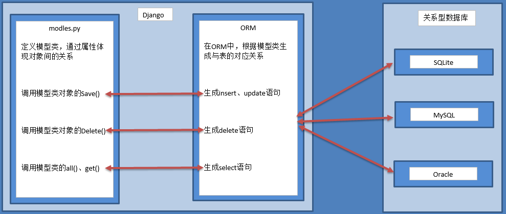
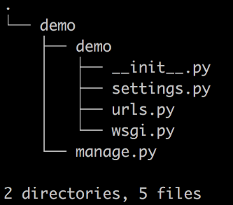
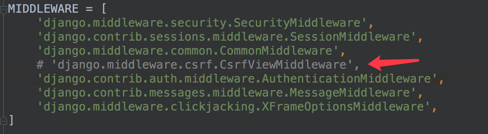

## 一 python基础

### 1.数据结构--可变类型和不可变类型

对**<u>可变类型</u>**进行修改, 其 **<u>内存地址不变,但是其内部的内容发生改变</u>**

- 主要是: 字典 \ 列表

对**<u>不可变类型</u>**进行修改, 其 **<u>内存地址变化,即引用发生改变,等同赋值操作</u>**

- 主要是: 数字  字符  元组


### 2.赋值|浅拷贝|深拷贝

#### 一、赋值--"旧瓶装旧酒"

在python中,对象的赋值就是简单的对象`引用`, 这点和C++等语言不同.如:

```python
In[2]: a = [1, 2, 'hello', ['python', 'C++']]
In[3]: b = a
In[4]: a is b
Out[4]: True
In[5]: b is a
Out[5]: True
In[6]: id(a)
Out[6]: 139705399858952
In[7]: id(b)
Out[7]: 139705399858952
# 总结: 
1.通过 is 判断它们的内存地址相同;
2.通过 id() 来查看两者的内存地址也相同.

In [1]: a = 3                                     
In [2]: b = 3                                     
In [3]: a is b                                     Out[3]: True
In [4]: id(a)                                     Out[4]: 10919488
In [5]: id(b)                                     Out[5]: 10919488
# 通过这个例子,很容易说明:
1. python 中 不可变类型 在内存中只有一份, 不论如何嵌套,其id()值相同.
```

​	在上述情况下,`a`和`b`是一样的,它们指向同一片内存地址,b不过是a的别名,是引用.

​	赋值操作(包括对象作为参数、返回值)不会开辟新的内存空间,只是复制了对象的引用. 也就是说 <u>除了 b 这个名字之外, 没有其它的内存开销</u>. 修改了 a 或 b , 另外一个 b 或 a 同样跟着受影响.

​	python的赋值操作还有一个通俗的理解: **<u>先在内存中创建等号右边的对象, 然后把等号左边的变量作为标签贴在右边对象上,是为引用.</u>**

​	**赋值操作注意:** 还要注意作用域,在不同作用域可以创建同样的 "值"; 但是这个"值"的内存空间是不同的.

#### 二、浅拷贝(shallow copy)--"新瓶装旧酒"

​	浅拷贝会创建新对象, 其对象非原来对象的引用, 而是原来对象内第一层对象的引用.

 	<u>通俗理解:拷贝了引用,并没有拷贝内容;产生了新对象,但是里面的内容还是同一份</u>

​	浅拷贝 三种形式: **<u>切片操作</u>**  **<u>工厂函数</u>**  **<u>copy模块中的copy函数</u>**. 比如上述列表a;

 - 切片操作:   c = a[:]
 - 工程函数:  c = list(a)
 - copy函数: c = copy.copy(a)

```python
In[8]: c = a[:]
In[9]: c is a
Out[9]: False
In[10]: id(a)
Out[10]: 139705399858952
In[11]: id(c)
Out[11]: 139705390811656
In[12]: [id(x) for x in a]
Out[12]: [10919424, 10919456, 139705494889056, 139705399859272]
In[13]: [id(x) for x in c]
Out[13]: [10919424, 10919456, 139705494889056, 139705399859272]
# 总结:
1. b 不在(is)是 a ,也不指向(id())同一个内存空间;
2. 但是 [id(x) for x in a] 和 [id(x) for x in c] 结果相同. 说明: a 和 c 内部的元素对象指向的是同一片内存地址.
    
In[14]: id(a[3][0])
Out[14]: 139705495480280
In[15]: id(c[3][0])
Out[15]: 139705495480280
In[16]: a[3][0]
Out[16]: 'python'
In[17]: a[3].append('java')
In[18]: b
Out[18]: [1, 2, 'hello', ['python', 'C++', 'java']]
# 总结:
1. 关于浅copy的理解,个人以为用内层和外层来区分更容易理解.通俗来说,浅拷贝就是只修改了最外层的引用, 使得元素最外层的地址变化,但是对原来元素的内层地址和引用均未做修改.
2. 把这里最外层列表中的每一个元素(包括列表元素)都看作一个'坑', 每个'坑'再指向一个具体的 对象. 这就是'引用'.

In[19]: a[1] = 10
In[20]: a
Out[20]: [1, 10, 'hello', ['python', 'C++', 'java']]
In[21]: c
Out[21]: [1, 2, 'hello', ['python', 'C++', 'java']]
In[22]: b
Out[22]: [1, 10, 'hello', ['python', 'C++', 'java']]
 
# 事实上,这里就比较绕; 思路还是要从 是否修改引用 来思考.
1. python中一直都是先在内存中有对象,然后再对对象有引用.
2. [17]修改的是 嵌套列表内部的元素,并未对最里层列表本身的 内存地址 产生影响, 所以 a 和 c 指向的内层列表仍然是同一个对象,所以其中一个修改,两者同时发生改变.
3. [19]修改的是 不可变类型, 相当于 指向了新的引用;所以 a 和 c 不同.
```

#### 三、深拷贝(deep copy)--"新瓶装新酒"

​	深拷贝 只有一种形式 , copy模块中的 `deepcopy()` 函数

​	深拷贝拷贝了对象的所有元素,包括多层嵌套的元素.  因此,它的时间和空间开销要高.

​	深拷贝拷贝出来的对象根本就是一个全新的对象,不再于原来的对象有任何的关联.

​	深拷贝类似没有 `出口的递归拷贝`

#### 四、拷贝注意点

​	**<u>对于非容器类型, 如数字 , 字符 , 以及其它的"原子"类型, 没有拷贝一说, 产生的都是原对象的引用.</u>**

​	**<u>如果元组变量值包含原子类型对象, 即使采用了深拷贝,也只能得到浅拷贝.</u>**

(上面这句话, 没有理解...)


#### 五、最直观的还是补充高级中学习的图.

##### ---待补"坑"---


deepcopy()  通过引用计数


### 3.python基本数据结构

#### 3.1 字典

##### 3.1.1 按照字典的v值进行排序

`sorted(d.items(),  key=lambda x:x[1] )`

- items 取出的是 类字典的键值对 对象
- keys 取出的是 类列表对象
- 注意排序后的返回值是一个list，而原字典中的kv对被转换为了list中的元组。

```python
# 案例
alist = [{'name':'a','age':20}, {'name':'b','age':30}, {'name':'c','age':25}]
def sort_by_age(alist):
    return sorted(alist, key=lambda x:x['age'], reverse=True)
```

补充1: `sorted()函数`: 

**sorted(iterable,key,reverse)，sorted一共有iterable,key,reverse这三个参数**。

- iterable表示可以迭代的对象，例如可以是dict.items()、dict.keys()等
- key是一个函数，用来选取参与比较的元素
- reverse则是用来指定排序是倒序还是顺序，reverse=true则是倒序，reverse=false时则是顺序，默认是reverse=false。

补充2: `lanbda函数` [链接:lanbda函数](#8.1 匿名函数 lambda)

##### 3.1.2 字典和json的区别

​	字典是一种数据结构, json是一种数据的表现形式, 字典的key值只能是能hash的就行, json的值必须是字符串.

参考CSDN博文: [json和python中字典的区别和联系](https://blog.csdn.net/py_tester/article/details/79032077)


#### 3.2 列表

##### 3.2.1 列表的常见操作

1)增加

- `li.insert(index, 数据): 在制定的位置插入数据(指定位置前有空元素会自动补位)`
  - 这个说法不严谨,其实如果用 **负索引插入** 到初始位置之间有空位也会自动补位
- `li.apend(数据): 在列表的末尾追加数据(最常用的方法)`
- `li.extend(Iterable): 将可迭代对象中的元素追加到列表`
  - extend和 `+=` 的区别

2)取值和修改

- 取值: 列表名[index] : 根据下标来取值
- 修改: 列表名[index] = 数据 : 修改指定索引的数据

3)删除

- del 列表名[index] : 删除指定索引的数据
- del 列表名: 删除指定列表, 和 clear() 区别
- 列表名.remove(数据): 删除第一个出现的数据
- 列表名.pop() : 删除末尾数据,返回值: 返回被删除的元素
- 列表名.pop(index) : 删除指定索引的数据,返回值: 返回被删除的元素
- 列表名.clear()  : 清空整个列表的元素

4)排序

- 列表名.sort() : 升序(小到大)
- 列表名.sort(reverse=True) : 降序(大到小)
- 列表名.reverse() : 逆序, 反转

5)统计相关

- len(列表名) : 计算列表长度
- 列表名.count(数据) : 数据在列表中出现的次数
- 列表名.index(数据): 数据在列表中首次出现时的索引, 没有查到会报错.
- 数据  in  列表  

6)循环遍历

- while循环
- for循环

7)切片

- 正向切片,反向切片
- 注意"左闭右开"

##### 3.2.2 列表的注意事项

```python
索引超出会报错:IndexError
但是切片超出不会报错,返回 空[]
插入超出也不会报错, 自动从两端往中间补位
```

##### 3.2.3 列表生成式 | 元组生成器 | 字典推导式 | 三元运算符 | 逻辑操作符

```python
# 平时注意积累写法和场景,有时候灵活运用可以大大简化代码
```

##### 3.2.2 列表思考题:

-  1.实现list去重的思路

```python
1. 集合
2. 遍历
```

- 2.代码题

```python
def extendList(val, list=[]):
    list.append(val)
    return list

list1 = extendList(10)
list2 = extendList(123, [])
list3 = extendList('a')

print(list1)
print(list2)
print(list3)
------------------
结果:
    [10, 'a']
    [123]
    [10, 'a']
解释:
    许多人会错误的认为 list1 应该等于 [10] 以及 list3 应该等于 ["a"]。认为 list 的参数会在 extendList 每次被调用的时候会被设置成它的默认值 []。 尽管如此，实际发生的事情是，新的默认列表仅仅只在函数被定义时创建一次。随后当 extendList 没有被指定的列表参数调用的时候，其使用的是同一个列表。这就是为什么当函数被定义的时候，表达式是用默认参数被计算，而不是它被调用的时候。 因此，list1 和 list3 是操作的相同的列表。而 ````list2是操作的它创建的独立的列表（通过传递它自己的空列表作为list``` 参数的值）。 extendList 函数的定义可以做如下修改，但，当没有新的 list 参数被指定的时候，会总是开始一个新列表，这更加可能是一直期望的行为。 def extendList(val, list=None): if list is None: list = [] list.append(val) return list 使用这个改进的实现，输出将是： list1 = [10] list2 = [123] list3 = ["a"]
参考链接:http://www.maiziedu.com/article/8260/ 
解释2:
    很多人都会误认为list1=[10],list3=['a'],因为他们以为每次extendList被调用时，列表参数的默认值都将被设置为[].但实际上的情况是，新的默认列表只在函数被定义的那一刻创建一次。当extendList被没有指定特定参数list调用时，这组list的值随后将被使用。这是因为带有默认参数的表达式在函数被定义的时候被计算，不是在调用的时候被计算。
因此list1和list3是在同一个默认列表上进行操作（计算）的。而list2是在一个分离的列表上进行操作（计算）的。（通过传递一个自有的空列表作为列表参数的数值）。
```

​	**新的默认列表只有在函数被定义的那一刻创建一次. 当func 被没有指定list 的情况下调用时,这组list的值随后将被使用. 这是因为带有默认参数的表达式在函数被定义的时候被计算,不是在调用的时候被计算.**

​	拓展资料: [深度拓展,来自sf网站](https://segmentfault.com/a/1190000006265256)


#### 3.3 元组

- 单个元素的元组 `(1, )`

#### 3.4 字符串

3.4.1 反转字符串

字符串:`str.[::-1]`


#### 3.5 数字(int)

- 小数 保留指定位数的小数 `round(float, 要保留的位数)`


#### 3.6 集合

**支持 union(联合), intersection(交), difference(差), sysmmetric_difference(对称差集)等数学运算.**

- 去重  `set()`
- 交集: `a&b `   共有的部分
- 并集: `a|b`  总共的部分
- 差集: `a-b` 或 `b-a` 另一个集合中没有的部分  (前者有后者没有,即在第一个集合中,不在第二个集合中)
- 对称差集: `a^b`  (在a, b中, 但是不会同时出现在二者中...)


#### 3.7 布尔类型


### 4.文件读写操作--大文件读写|生成器读取


### 5.python 常见标准库

#### 5.1 random库 -- 生成随机数

random.random()    0-1之间随机浮点数

random.uniform(a, b)   [a, b]之间浮点数

random.randint(a, b)  [a, b]之间的整数

random.randrange(a, b, step)  [a, b) 中 以 step 为基数 随机取数

random.choice(sequence)  从特定序列中随机取一个 元素

补充: 打乱一个排序的列表

- `random.shuffle(alist)`


#### 5.2 datetime库 -- 日期操作


#### 5.3 time库


### 6.日志功能


### 7. python性能提升 | 内存管理与垃圾回收机制 | 作用域 | 命名空间 | PEP8规范

#### 7.1 性能提升:

- 1.多进程,充分利用机器的多核性能;
- 2.对性能影响较大的部分代码,可以使用C或C++编写
- 3.对于IO阻塞造成的性能影响,可以使用IO多路复用来解决
  - 链接:  [IO多路复用机制](https://blog.csdn.net/chewbee/article/details/78108223)
- 4.尽量使用Python的内建函数
- 5.尽量使用局部变量

#### 7.2 内存管理与垃圾回收机制

##### 7.2.1 python 的内存管理机制及调优手段

**内存管理机制: 引用计数, 垃圾回收, 内存池**

- 1.引用计数
- 2.标记清除
  - 1.引用计数
  - 2.标记清除
  - 3.分代回收
  - 
- 3.内存池

**调优手段:**

- 1.手动垃圾回收 `__del__`
- 2.调高垃圾回收阈值
- 3.避免循环引用(手动解循环引用和弱引用)

##### 7.2.2 内存泄漏是什么? 如何避免?

- 指由于疏忽或者错误造成程序未能释放已经不再使用的内存情况.(失去对内存的控制,造成内存浪费)
- `__del__()`方法的对象间的循环引用是导致内存泄漏的主凶;
  - 解决方法也是: 不使用的时候,正确 del object 删除
- 辅助python模块:
  -  `gc` 查看不能回收对象的详细信息;
  - `sys.getrefcount(obj)` 来获取对象的引用计数,并根据返回值是否为0 来判断是否内存泄漏.

#### 7.3 作用域

​	python中,一个变量的作用域总是由在代码中被赋值的地方所决定.当python遇到一个变量的时候,会按照下列的顺序进行搜索:

**本地作用域(Local)** --->  **当前作用域被嵌入的本地作用域(Enclosing locals)** --->  **全局\模块作用域(Global)** ---> **内置作用域(Built-in)**

- 参考链接: [Python基本语法_变量作用域LEGB](https://blog.csdn.net/jmilk/article/details/50244817)
- 个人理解:
  -  Local就是内层函数的空间;
  - Enclosing locals 就是 外层函数的空间(闭包)
  - Global  就是 模块 全局
  - Built-in  就是 python解释器自带的内置函数和属性空间.

#### 7.4 命名空间

​	在python中所有的名字都存在一个空间中, 它们在该空间中存在和被操作----这就是命名空间

​	它就像是一个盒子,每一个变量名字都对应装着一个对象.当查询变量的时候,会从该盒子里面寻找相应的对象.

#### 7.5 PEP8规范

链接: [PEP8的python风格格式规范（中文版）](http://http//zh-google-styleguide.readthedocs.io/en/latest/google-python-styleguide/python_style_rules/)


### 8.关于编码问题


### 9.序列化与反序列化


## 二 python高级

### 1.Liunx | 虚拟环境 | 


### 2.网络通信

大牛文章必看: 

[IP地址的分配原理](https://blog.csdn.net/qzcsu/article/details/72859431)

[TCP的三次握手与四次挥手（详解+动图）](https://blog.csdn.net/qzcsu/article/details/72861891)

```latex
为什么建立连接是三次握手，关闭连接确是四次挥手呢？

建立连接的时候， 服务器在LISTEN状态下，收到建立连接请求的SYN报文后，把ACK和SYN放在一个报文里发送给客户端。 
而关闭连接时，服务器收到对方的FIN报文时，仅仅表示对方不再发送数据了但是还能接收数据，而自己也未必全部数据都发送给对方了，所以己方可以立即关闭，也可以发送一些数据给对方后，再发送FIN报文给对方来表示同意现在关闭连接，因此，己方ACK和FIN一般都会分开发送，从而导致多了一次。
```


### 1.三大法器|递归

#### 迭代器

#### 生成器

#### 装饰器


```python
# 面向切面编程 -- 切面需求的场景
Aspect Oriented Programming(AOP)，面向切面编程，是一个比较热门的话题。AOP主要实现的目的是针对业务处理过程中的切面进行提取，它所面对的是处理过程中的某个步骤或阶段，以获得逻辑过程中各部分之间低耦合性的隔离效果。
# 需求场景案例:
- 插入日志
- 性能测试
- 事务处理
- 缓存
- 权限的校验
```


#### 递归


### 1.数据库基础

##### 关系型数据库核心元素

- 数据行(记录)
- 数据列(字段)
- 数据表(数据行的集合)
- 数据库(数据表的集合)

##### 关系型数据库的主要产品：

- oracle：在以前的大型项目中使用,银行,电信等项目
- mysql：web时代使用最广泛的关系型数据库
- ms sql server：在微软的项目中使用
- sqlite：轻量级数据库，主要应用在移动平台

##### RDBMS

- Relational Database Management System

数据库的命令:

##### 主从配置优势:

- 实现读写分离
- 可以实现集群(灵活扩展)
- 相互之间可以 实现 **'备份'**


### 2.Mysql数据库

#### 2.1 原理 优势 应用场景

- 适合用于关系特别复杂的数据查询场景的 **应用场景**.

#### 2.2 开启,创建库,创建表

- 分为服务端和客户端
- 命令

```mysql
# 安装 服务端 , 客户端
# 启动 关闭 重启
# 创建数据库,创建数据表,创建字段, 创建记录
# 查看创建过程, 
insert into 
update set ... where...
select * from ...
delete from ... where ...
# 回复和备份:
mysqldump -uroot -p db_name > db_copy_name.sql;   # 使用: mysqldump
mysql -uroot -p db_refleshed_name < db_copy_name.sql;  # 使用: mysql
```


#### 2.3 增删改查

#### 2.4 容灾备份和恢复


### 3.Redis数据库

#### 3.1 原理 优势 应用场景 

- 持久化存储
- 内存型数据库
- 缓存,速度快,自动过期
  - 是不是完全贴合 'session'?
  - 以及做高并发的场景.
- redis性能最受影响的就是 **联网的时候**

#### 3.2 创建库,创建表
```python
redis-server  # 启动服务器
redis-cli  # 启动客户端
ping
select 1
keys *
type 键
flushdb  清空当前db数据库
flushall 清空数据库
```

#### 3.3 增删改查

- Redis原生指令参考 <http://redisdoc.com/index.html>
- [中文网站的命令文档](http://redis.cn/commands.html#generic)
- Redis python客户端 方法参考 <http://redis-py.readthedocs.io/en/latest/#indices-and-tables>

#### 3.4 容灾备份和恢复


### 4.Mangodb数据库

#### 4.1 原理 优势 应用场景 

#### 4.2 创建库,创建表

#### 4.3 增删改查

#### 4.4 容灾备份和恢复


### 5.ORM | 数据库原理 | 数据库调优 | 数据库迁移

#### 5.1ORM

##### 5.1.1 概念

- **ORM** 全拼`Object-Relation Mapping`.
- 中文意为 **对象-关系映射**.
- 主要实现模型对象到关系数据库数据的映射.
  - 比如：把数据库表中每条记录映射为一个模型对象

##### 5.1.2 ORM图解



##### 5.1.3 优点 :

- 只需要面向对象编程, 不需要面向数据库编写代码.
  - 不用编写各种数据库的`sql语句`.
  - 对数据库的操作都转化成对类属性和方法的操作.
- 实现了数据模型与数据库的解耦, 屏蔽了不同数据库操作上的差异.
  - 不在关注用的是`mysql`、`oracle`...等.
  - 通过简单的配置就可以轻松更换数据库, 而不需要修改代码.

##### 5.1.2 缺点 :

- 相比较直接使用SQL语句操作数据库,有性能损失.
- 根据对象的操作转换成SQL语句,根据查询的结果转化成对象, 在映射过程中有性能损失.


#### 数据库迁移


### 5.虚拟环境

5.1 在ubuntu中安装虚拟环境管理工具(配置环境变量)

```python
sudo pip install virtualenv
sudo pip install virtualenvwrapper
# 安装完虚拟环境后，如果提示找不到 mkvirtualenv 命令，须配置环境变量：

# 1、创建目录用来存放虚拟环境
mkdir 
$HOME/.virtualenvs

# 2、打开~/.bashrc文件，并添加如下：
export WORKON_HOME=$HOME/.virtualenvs
source /usr/local/bin/virtualenvwrapper.sh

# 3、运行
source ~/.bashrc

```

5.2 创建项目虚拟环境(python解释器)

```python
# 默认是python2
mkvirtualenv 项目虚拟环境名称
# 如果安装python3解释器的 项目虚拟环境
mkvirtualenv -p python3 项目虚拟环境名称
```

小提示:

- **创建虚拟环境需要联网**
- 创建成功后, 会自动工作在这个虚拟环境上
- 工作在虚拟环境上, 提示符最前面会出现 “虚拟环境名称”
- 虚拟环境安装python包的时候, 不要加 `sudo` , 否则达不到隔离.

5.3`使用(查看)` | `退出` | `删除`虚拟环境

```python
# 使用查看(workon不是worken; 该命令可以在任意目录下输入)
workon 两次tab键  (然后选择一个需要使用的虚拟环境)
workon 项目虚拟环境名
# 退出
deactivate   （敲除deac后可以自动补全）
# 删除
先退出：deactivate
再删除：rmvirtualenv 项目虚拟环境名
```

5.4 如何在虚拟环境中安装工具包

提示 : 工具包安装的位置 :

python2版本下：
​	~/.virtualenvs/项目虚拟环境名/lib/python2.7/site-packages/
python3版本下：
​	~/.virtualenvs/项目虚拟环境名/lib/python3.5/site-packages

```python
# pip
pip install  # 安装依赖包   虚拟环境中不需要权限(千万注意,如果使用sudo则安装在全局)
pip uninstall  # 卸载依赖包
pip list  # 查看已安装的依赖包
pip freeze  # 冻结当前环境的依赖包
```

5.5 虚拟环境是独立的,你可以看成是一块儿独立的环境,该环境中存在硬链接的`python`解释器; 然后 `workon`该环境后切换 项目的目录 来运行各个项目.

5.6 pycharm 配置虚拟环境


5.7 辨析(虚拟环境, python包, 以及依赖环境)

- 遇到的问题: 想在虚拟环境中安装 `opencv` , 但是opencv 有很多底层依赖
- 解决: 安装还是要通过 `sudo apt-get ...` 来安装.

### 6.git和GitHub

#### 6.1 使用GIt管理源代码

<u>注: 1.本地提交:add(添加到暂存区)->commit(提交到工作区)->push(提交到远程仓库)</u>

##### 6.1.1 本地提交

```python
# 1.初始化git
cd [项目目录]
git init
# 2.配置当前项目git提交信息(可省略此步，如不配置则使用全局配置)
git config user.name xxx
git config user.email XX@xxx.com
# 3.添加忽略文件
touch .gitignore  (注意不要写成 .ignore)
# 3.1 在忽略文件中,设置忽略文件内容(后续可以根据需要继续添加)
.idea
*.py[cod]
# 4.添加所有文件到暂存区
git add .
# 5.提交本地仓库并填写注释
git commit -m"第一次提交"
# 6.让pycharm管理当前项目
File -> setting -> Version Control -> ...
```


##### 6.1.2 远程提交

<u>在github或者码云等平台创建项目,创建完成后将已有项目上传到码云</u>

上传项目到github

方式1：使用命令行的形式将项目上传到码云

```python
cd 项目根目录
git remote add origin 仓库地址
git push -u origin master
```

方式2：使用Pycharm将项目上传到码云

- 拷贝地址:  从remote拷贝 https或者ssh地址
- 添加远程地址到pycharm
  - `VCS -> Git -> Remotes`
- 输入远程地址
  - orign   
  - URL
- 输入github或者码云等账号和密码,点击`ok`
- 选择菜单中的 `VCS` -> `Git` -> `Push`
- Push 成功后Pycharm 弹出提示 `Push successful`


git的一些其它指令

```python
# 回滚到上一个版本
git reset --hard HEAD~1
# 查看所有提交版本记录
git reflog
# 回到指定版本
git reset --hard 提交id

# 查看本地 暂存区|工作区的状态?????(待核实)
git status
```

其它:

- 难在:  冲突的处理, 一般谁冲突谁解决;
- 最好的习惯是在remote创建项目然后 pull 到本地.

6.1.3 关于实际开发中分支切换等问题--来自[公众号]整理

- 从远程仓储clone: `git clone git@github.com:GalphaXie/Review_Python.git` 或 `git clone https://github.com/GalphaXie/Review_Python.git`
- 下载后的项目默认是在 `master`分支, 一定要进行分支切换 `git checkout develop`
- 这个时候需要添加 **A功能**, 那么应该从`master`分支再创建一个分支 : `git branch feature-A`,并切换到该分支: `git checkout feature-A` 
  - 可以合并命令为:  `git checkout -b feature-A develop` 

- 提交到暂存区: `git add feature-A`     (类似本地的文件的 `Ctrl + s` 的操作)
- 提交到工作区: `git commit -m 'add feature-A'`
- 进行**分支合并**,但是这**之前一定要做**的一步是: `git pull origin develop` 取回远程库的更新,来防止冲突(因为很多人在develop上面提交代码) 
- 然后再切换到自己的分支: `git checkout feature-A`, 然后 用 `rebase命令` 合并新的更新到自己目前的工作分支.
- 最后: `git merge --no-ff feature-A`
- 最最后: `git push origin develop`


### 7. Linux 命令 | vim 命令

[Linux命令大全](https://blog.csdn.net/DefaultTest/article/details/80721021)

[编辑器之神：VIM 常用命令整理](https://blog.csdn.net/DefaultTest/article/details/80755709)


### 8.函数

#### 8.1 匿名函数 lambda

语法: `lambda [arg1 [,arg2,.....argn]]:expression`  即:   **关键字  参数 : 语句**

所谓匿名，意即不再使用 def 语句这样标准的形式定义一个函数。

- lambda 只是一个表达式，函数体比 def 简单很多。
- lambda的主体是一个表达式，而不是一个代码块。仅仅能在lambda表达式中封装有限的逻辑进去。
- lambda 函数拥有自己的命名空间，且不能访问自己参数列表之外或全局命名空间里的参数。
- 虽然lambda函数看起来只能写一行，却不等同于C或C++的内联函数，后者的目的是调用小函数时不占用栈内存从而增加运行效率。

参考链接: [菜鸟教程 Python3 函数](http://www.runoob.com/python3/python3-function.html)


### 9.面向对象


### 10.进程 线程 协程

#### 10.1概念辨析

异步

同步

阻塞

非阻塞

并行

并发

I/O密集型 

CPU密集型


## 三 Python web 框架要点

### 1.web开发基本概念:

#### 1.1**web框架的定义** ：

- <u>协助开发者快速进行**web程序**开发的一套功能代码块。</u>

#### 1.2**框架的优势**： <u>避免重复造轮子</u>

- 降低开发难度， 提高开发效率
- 稳定性和可扩展性强
- 通俗理解：成熟的web框架对**数据流，安全性**等进行了很好的通用支持，使得开发者可以更好的专注于 **业务逻辑的实现**。

#### 1.3web开发各部分的构成


- web开发(开发框架)  是基于 **应用层(HTTP)** 开发.
  - 前端通过 实现  **HTTP请求** 来和后端通信
  - 后端程序又分为 **服务器程序** + **框架程序**
    - 服务器
      - 处理的是 HTTP请求报文
    - 框架程序
      - 接收并解析HTTP请求，获取具体的请求信息
      - 处理本次HTTP请求，即完成本次请求的业务逻辑处理
      - 构造并返回处理结果——HTTP响应
    - ==WSIG== 协议 **(待完善)**
    - WSGI 协议 规定:  框架处理请求和响应对象, 中间还要提供中间件处理.

### 2.web框架学习方法

- 1.如何搭建工程程序
  - 工程的组建
    - 如何创建应用实例, 如 flask=Flask()
    - 单个脚本 还是  拆分成多个目录?
  - 工程的配置
    - 配置文件、配置类、==?(flask还有一种)== 等配置方式的选择
  - 路由定义
    - Flask是以装饰器的形式实现;
    - Django是以**项目urls**文件和**应用urls**文件共同实现
  - 视图函数定义
    - 函数视图、类视图
    - 是否需要必传参数(如django中的request是必传参数)
    - 固定写法
- 2.如何获取请求数据（操作request对象）
  - 身份认证, 权限校验, 限流校验
  - 请求头参数的获取
  - 请求路径参数的获取
  - 请求体的获取(包括Form表单数据)的获取
- 3.如何构造响应数据（构造response对象）
  - 响应头
  - 响应体
  - 状态码
- 4.如何使用中间层
  - 请求钩子
  - 中间件
- 5.框架提供的其他功能组件的使用
  - 数据库
  - 模板
  - admin


## 三 Flask基础

### 1.web基础

- 

#### 1.3跨站请求伪造(CSRF : Cross-site request forgery)

```python
1.CSRF原理分析:
- 1.1 HTTP是无状态协议,所以需要会话保持手段, 比如用 cookies;
- 1.2 CSRF的场景是: 正常网站A,  黑客网站B, 客户端(浏览器).
- 1.3: 跨站请求伪造: 存在两个网站A(trusted)和网站B(hacked),用户C.用户C登陆交易网站A,正常登陆之后,网站A返回响应并在响应中添加cookie,在未退出网站A登陆的情况下又登陆了黑客网站B.网站B以诱导用户C点击的方式发送了向网站A交易请求url,这个请求会带着用户C浏览器刚才生成的cookie,去进行在网站A上的转出交易.给用户造成损失.   
```

09  CSRF原理分析
​		跨站请求伪造: 存在两个网站A(trusted)和网站B(hacked),用户C.用户C登陆交易网站A,正常登陆之后,网站A返回响应并在响应中添加cookie,
​		在未退出网站A登陆的情况下又登陆了黑客网站B.网站B以诱导用户C点击的方式发送了向网站A交易请求url,这个请求会带着用户C浏览器刚才生成的cookie,
​		去进行在网站A上的转出交易.给用户造成损失.

10  解决CSRF攻击
​	1. 在原生form表单提交的时候,设置变量代码块{{ csrf_token()  }}来接收每次服务器返回的不同随机值,并且把这个标签设置为隐藏:type="hidden"
​	2. 在返回响应的时候设置 cookies 中的部分内容为相同随机出来的 csrf_token.
​	3. 在每次提交的时候,服务端从cokies中取出request.cookies.get("csrf_token"),并从表单中 request.form.get("csrf_token")取出,进行校验.
​	设置方式:
​		bytes.decode(base64.b64encode(os.urandom(48)))	

	进行CSRF之后:
		1. 网站B提交的表单没法获取到用户C的csrf_token,只能获取csrf_token标签的结构和自己的csrf_token;
		可以利用用户C浏览器中的csrf_token,但是也没法获取到用户C的cookies(浏览器的同源策略)
	
	Flask 自带CSRFProtect 只需要在前端Form表单中设置   {{ form.csrf_token() }} 即可
	
	还有一个要注意的点: flask默认是存到 session 中的.所以,这个和在session中要设置   secret_key 而不是在 cookie中设置 对应上了.

#### 1.4 ORM的简单介绍


#### 1.5 扩展

- **WSGI 工具箱采用 Werkzeug（路由模块），模板引擎则使用 Jinja2。**
- 7行代码实现 Flask 简单的应用.
- 视图常用逻辑

  - 1.返回json数据;
  - 2.重定向;
  - 3.自定义状态码;
- (url)转换器  基类:  BaseConverter

  - to_url 方法
  - to_python方法
- 异常捕获

  - 主动抛出:   HTTP异常 abort(500)方法
  - 捕获错误:  @errorhandler(code_or_exception) 装饰器
- 请求钩子 -- (Django中 中间件)

  - before_first_request

    - 在处理第一个请求前执行

  - before_request

    - 在每次请求前执行

  - after_request

    - 在请求完成后, 响应返回之前执行.可以对响应进一步处理.
    - 前提: 没有抛出错误

  - teardown_request
- Flask框架


  - Flask有两大核心：Werkzeug和Jinja2

      - Werkzeug是一个遵循WSGI协议的python函数库
          - Rule类
            - 用来构造不同的URL模式的对象，路由URL规则
        - Map类
          - 存储所有的URL规则和一些配置参数
        - BaseConverter的子类
          - 负责定义匹配规则
        - MapAdapter类
          - 负责协调Rule做具体的匹配的工作

- 获取请求参数

  - request 就是flask中代表当前请求的 request 对象，其中一个请求上下文变量(理解成全局变量，在视图函数中直接使用可以取到当前本次请求)
  - 常用属性:  data, form, args, cookies, headers, method, url, files...

- 状态保持

  - Cookie
    - Cookie基于域名安全，不同域名的Cookie是不能互相访问的
  - Session

- 上下文

  - 请求上下文:  
    - request  
    - session
  - 应用上下文:  
    - current_app
    - g    
      - g 作为 flask 程序全局的一个临时变量, 每次请求都会刷新.
  - 两者区别:
    - 请求上下文：保存了客户端和服务器交互的数据
    - 应用上下文：flask 应用程序运行过程中，保存的一些配置信息，比如程序名、数据库连接、应用信息等

#### 1.6 蓝图

- 1.解决的问题: 在 项目中模块增多的时候, 需要'解耦', 而直接解耦的话会存在 '循环导入' 的问题,这个时候就有了 蓝图. 蓝图就是 '缩小版'的 flask_app,  可以有自己的独立的模板,模块等.
- 2.相当于 '中间人 和 小弟 ';  可以类比Django中的  app包.
- 3.注意: 在蓝图注册路由的时候,并未把蓝图后的url添加到map中,是在 蓝图的 注册 后添加的.


## 四 Flask项目


## 五 Djaong基础

### Django介绍


#### 1. 简介

Django，**发音为[`dʒæŋɡəʊ]**，是用python语言写的开源web开发框架，并遵循MVC设计。劳伦斯出版集团为了开发以新闻内容为主的网站，而开发出来了这个框架，于2005年7月在BSD许可证下发布。这个名称来源于比利时的爵士音乐家DjangoReinhardt，他是一个吉普赛人，主要以演奏吉它为主，还演奏过小提琴等。**由于Django在近年来的迅速发展，应用越来越广泛，被著名IT开发杂志SDTimes评选为2013SDTimes100，位列"API、库和框架"分类第6位，被认为是该领域的佼佼者。**


Django的**主要目的是简便、快速的开发数据库驱动的网站。**它强调代码复用，多个组件可以很方便的以"插件"形式服务于整个框架，Django有许多功能强大的第三方插件，你甚至可以很方便的开发出自己的工具包。这使得Django具有很强的可扩展性。它还强调快速开发和DRY(DoNotRepeatYourself)原则。

#### 2. 特点

##### 1） 重量级框架

对比Flask框架，Django原生提供了众多的功能组件，让开发更简便快速。

- 提供项目工程管理的自动化脚本工具(shell)  ==具体使用,补充链接==
  - 命令行创建工程目录
  - 提供shell
  - 类比 Flask中的 **script 扩展**  ==忘记==
- 数据库ORM支持（对象关系映射，英语：Object Relational Mapping）
- 模板
- 表单
- Admin管理站点
  - 一旦创建完成数据库, 那么就可以自动进行管理后台的 增删改查.
- 文件管理
  - 前端上传文件, 后端自动可以保存到 服务器 指定的位置 ==疑问==
- 认证权限
- session机制
- 缓存
- 等等

##### 2）MVT模式

有一种程序设计模式叫**MVC**，其核心思想是**分工、解耦，让不同的代码块之间降低耦合，增强代码的可扩展性和可移植性，实现向后兼容**。

> MVC的全拼为**Model-View-Controller**，最早由TrygveReenskaug在1978年提出，是施乐帕罗奥多研究中心(Xerox PARC)在20世纪80年代为程序语言Smalltalk发明的一种软件设计模式，是为了将传统的输入（input）、处理（processing）、输出（output）任务运用到图形化用户交互模型中而设计的。随着标准输入输出设备的出现，开发人员只需要将精力集中在业务逻辑的分析与实现上。后来被推荐为Oracle旗下Sun公司Java EE平台的设计模式，并且受到越来越多的使用ColdFusion和PHP的开发者的欢迎。现在虽然不再使用原来的分工方式，但是这种分工的思想被沿用下来，广泛应用于软件工程中，是一种典型并且应用广泛的软件架构模式。后来，MVC的思想被应用在了Ｗeb开发方面，被称为Ｗeb MVC框架。

#### MVC模式说明


- M全拼为Model，主要封装对数据库层的访问，对数据库中的数据进行增、删、改、查操作。
- V全拼为View，用于封装结果，生成页面展示的html内容。
- C全拼为Controller，用于接收请求，处理业务逻辑，与Model和View交互，返回结果。

#### Django的MVT


- M全拼为Model，与MVC中的M功能相同，负责和数据库交互，进行数据处理。
- V全拼为View，与MVC中的C功能相同，接收请求，进行业务处理，返回应答。
- T全拼为Template，与MVC中的V功能相同，负责封装构造要返回的html。

**注：差异就在于黑线黑箭头标识出来的部分**

#### 3. Django学习资料

- [官方网站](https://www.djangoproject.com/)
- [Github源码](https://github.com/django/django)
- [1.11版英文文档](https://docs.djangoproject.com/en/1.11/)
- [1.11版中文文档](https://yiyibooks.cn/xx/Django_1.11.6/index.html)
- [Django Book 教程](http://djangobook.com/)
- [Tange With Django 教程](http://www.tangowithdjango.com/book17/)


接口设计思路


#### restful风格

**综合上面的解释，RESTful架构就是：**

- **每一个URL代表一种资源；**
- **客户端和服务器之间，传递这种资源的某种表现层；**
- **客户端通过四个HTTP动词，对服务器端资源进行操作，实现"表现层状态转化"。**

```txt
自己的理解:
1. 具象状态转化协议
2. 通过请求的四个方法(POST, GET, PUT, PATCH, DELETE)  来获取资源
3. 主要是url,将之前的查询参数变成资源路径. url中使用名词, 且使用复数
```


#### 使用drf实现视图时的思路

- 先以视图为主
- 分析视图实现的具体逻辑
- 思考逻辑中有哪些可以使用 drf 框架提供的工具来复用代码
  - 序列化
    - 参数校验
    - 保存
    - 序列化返回数据
  - 视图扩展类  子类视图
    - 视图整个实现的流程  可以复用的代码


## 六 Django项目

### 1. 环境创建和工程创建注意事项

#### 1.1 环境创建和工程创建

- 1.推荐 `1.XX` 版本的 **Django** ,  在虚拟环境中通过 `-p` 选项来指定对应的 解释器版本, 如果不指定可能会默认是python2的解释器.

- 2.推荐通过命令行的模式创建 `django` 工程, 然后再在 **pycharm** 中进行适当配置(如果不能自动找到新创建的django虚拟环境,则需要我们手动添加虚拟环境;  对于通过manage.py启动来说还需要我们添加必要的启动参数 `runserver` 这些).

  - 2.1 解释: 如果直接通过 pycharm 创建工程 可能会自动添加其它额外参数, 可能导致在 线上命令行部署时候出现其它的一些问题.
  - 2.2 补充：我们在pycharm打开django工程的时候, 发现会自动创建 `db.splite3` 数据库, 这是 **django** 默认数据库.  在我们配置指定的数据库之后, 该文件会被django自动删除.

- 3.**manage.py** 不仅是功能模块,  还是 **Django** 提供的脚本文件的模块, 可以用来提供 **django命令模式来操作django项目**, 类似 Flask 框架的 Script 模块. 

- 4.单个django工程 | 单个app 分别包括:

  - 4.1 **settings.py**  **urls.py**  **uwsgi**  **\_\_init\_\_.py**  和平行的 **manage.py** , **db.splite3**
  - 4.2 **migrations文件夹**  **\_\_init\_\_.py**  **admin.py(后台管理站点)**  **apps.py(关于该子应用的一些配置信息)**  **models.py**  **tests.py(子引用的单元测试)**  **views.py**  和 我们需要自己创建的 **serializers.py**  **urls.py**

  

  - 与项目同名的目录，此处为demo。
  - **settings.py** 是项目的整体配置文件。
  - **urls.py** 是项目的URL配置文件。
  - **wsgi.py** 是项目与WSGI兼容的Web服务器入口。
  - **manage.py** 是项目管理文件，通过它管理项目。

- 5.运行 **开发服务器**

  `python manage.py runserver ip:端口`  其中,  `ip:port`可省略, 则默认: **127.0.0.1:8000 **

  `python manage.py runserver` 运行 服务器

  - django默认工作在调式Debug模式下，如果增加、修改、删除文件，服务器会自动重启。
  - 按ctrl+c停止服务器。

#### 1.2 创建子应用

​	在Web应用中，通常有一些业务功能模块是在不同的项目中都可以复用的，故在开发中通常将工程项目拆分为不同的子功能模块，各功能模块间可以保持相对的独立，在其他工程项目中需要用到某个特定功能模块时，可以将该模块代码整体复制过去，达到复用。

在Flask框架中也有类似子功能应用模块的概念，即蓝图Blueprint。

**Django的视图编写是放在子应用中的。**

##### 通过命令行创建子应用

 `python manage.py startapp 子应用名称`   备注: 可能需要创建目录如apps等(看需求)

- **admin.py** 文件跟网站的后台管理站点配置相关。
- **apps.py** 文件用于配置当前子应用的相关信息。
  - 注: **子应用的配置文件**,和在`settings.py`中注册APP联系起来, **app_name.apps.XxConfig**
  - 类比 **Flask** 中的 **蓝图注册**, 将独立的蓝图模块和项目配置关联起来.
- **migrations** 目录用于存放数据库迁移历史文件夹。
- **models.py** 文件用户保存数据库模型类。  ==整理常见的套路==
- **tests.py** 文件用于开发测试用例，编写单元测试。
- **views.py** 文件用于编写Web应用视图。


#### 1.3 注册APP

创建出来的子应用目录文件虽然被放到了工程项目目录中，但是django工程并不能立即直接使用该子应用，需要注册安装后才能使用。

在工程配置文件settings.py中，**INSTALLED_APPS**项保存了工程中已经注册安装的子应用，初始工程中的INSTALLED_APPS如下：


- **注册安装一个子应用的方法，即是将子应用的配置信息文件apps.py中的Config类添加到INSTALLED_APPS列表中。**
- 从 **1.8 版本**之后, 注册路由就不在直接使用 **子应用的名字** 而是 代替成 **子应用名.apps.配置类的名字**
- 注意: 项目中, 往往有**多个 APP 应用**, 常常会创建**apps**目录, 将各个应用添加到apps目录下, 则需要在 **settings.py** 文件中配置 `sys.path.insert(0, os.path.join(BASE_DIR, "apps"))` 

#### 1.4 APP应用配置

在每个应用目录中都包含了apps.py文件，用于保存该应用的相关信息。

在创建应用时，Django会向apps.py文件中写入一个该应用的配置类，如

```python
from django.apps import AppConfig

class UsersConfig(AppConfig):
    name = 'users'
```

我们将此类添加到工程settings.py中的INSTALLED_APPS列表中，表明注册安装具备此配置属性的应用。

- **AppConfig.name** 属性表示这个配置类是加载到哪个应用的，每个配置类必须包含此属性，默认自动生成。

- **AppConfig.verbose_name** 属性用于设置该应用的直观可读的名字，此名字在Django提供的Admin管理站点中会显示，如

  ```python
  from django.apps import AppConfig
  
  class UsersConfig(AppConfig):
      name = 'users'
      verbose_name = '用户管理'  # 涉及到admin的时候要设置
  ```


#### 1.4 创建视图函数或视图类

*<u>同Flask框架一样，Django也用视图来编写Web应用的业务逻辑。</u>*

*<u>Django的视图是定义在子应用的views.py中的</u>*

##### 1.4.1 打开刚创建的users模块，在views.py中编写视图代码。

```python
from django.http import HttpResponse  # 注意导包的位置, 注意包名; 不要和爬虫中HTTPResponse混淆

def index(request):  # 必须有request参数
    """
    index视图
    :param request: 包含了请求信息的请求对象
    :return: 响应对象
    """
    return HttpResponse("hello the world!")  # 不能直接返回一个字符串
```

说明：

- 视图函数的第一个传入参数必须定义，用于接收Django构造的包含了请求数据的**HttpReqeust**对象，通常名为**request**。
  - ==区别==: **Flask** 中是 `from flask import request` 请求上下文来获取到`request` 对象.
- 视图函数的返回值必须为一个响应对象，不能像**Flask一样直接返回一个字符串**，可以将要返回的字符串数据放到一个**HTTPResponse**对象中。

##### 1.4.2 类视图

==待续==


#### 1.5 定义路由url

##### 1) 在子应用中新建一个`urls.py`文件用于保存该应用的路由。

##### 2) 在users/urls.py文件中定义路由信息。

```python
from django.conf.urls import url  # 导包

from . import views

# urlpatterns是被django自动识别的路由列表变量
urlpatterns = [
    # 每个路由信息都需要使用url函数来构造
    # url(路径, 视图)  元素不是简单的元组,而是url()函数对象
    url(r'^index/$', views.index),    # $ 结尾, 以防 url 覆盖问题的发生. 但是 项目url不能, 否则报错.
]
```

关于**视图集**,  还有一种设置 url 的方式:

```pyton
router = DefaultRouter()
router.register('app_name', views.App_View_ViewSet, base_name="xxx")
urlpatterns = []
urlpatterns += router.urls
```


##### 3) 在工程总路由demo/urls.py中添加子应用的路由数据。

```python
from django.conf.urls import url, include
from django.contrib import admin

urlpatterns = [
    url(r'^admin/', admin.site.urls),  # django默认包含的

    # 添加
    url(r'^users/', include('users.urls')), 
]
# 该文件上面有关于如何创建 urlpatterns 变量的提示信息, 在创建django项目的时候自动生成
```

- 使用include来将子应用users里的全部路由包含进工程路由中；

- r'^users/' 决定了users子应用的所有路由都已/users/开头，如我们刚定义的视图index，其最终的完整访问路径为/users/index/。

include函数除了可以传递字符串之外，也可以直接传递应用的urls模块，如

```python
from django.conf.urls import url, include
from django.contrib import admin
import users.urls  # 先导入应用的urls模块

urlpatterns = [
    url(r'^admin/', admin.site.urls),
    # url(r'^users/', include('users.urls')),
    url(r'^users/', include(users.urls)),  # 添加应用的路由
]
```

##### 4) 启动运行

重新启动django程序

```shell
python manage.py runserver
```

### 2. 配置、静态文件与路由

#### 2.1 配置文件

##### 1. BASE_DIR

```python
BASE_DIR = os.path.dirname(os.path.dirname(os.path.abspath(__file__)))
```

当前工程的根目录，Django会依此来定位工程内的相关文件，我们也可以使用该参数来构造文件路径。

实战:

- 在项目中一般会 创建 apps 文件夹用来 放多个 app , 需要添加到 **python解释器** 的搜索路径中, 代码 `sys.path.insert(0, os.path.join(BASE_DIR, 'apps'))` , 注: 也有使用 `os.path.append()` 方法的; 其次要注意 同时用到 `os` 和 `sys` 模块.
- 类似的还有,  常常需要创建不同环境下的 运行环境, 那么需要在 `manage.py`中修改 django项目的默认配置环境: `os.environ.setdefault("DJANGO_SETTINGS_MODULE", "buyfree_mall.settings.dev")`.

##### 2. SECRET_KEY 

​	该变量是创建 django 项目的时候自动生成的, 其值常用于 加密传输过程, 不要泄露.

##### 3. DEBUG

调试模式，创建工程后初始值为**True**，即默认工作在调试模式下。

作用：

- 修改代码文件，程序自动重启
- Django程序出现异常时，向前端显示详细的错误追踪信息，例如


​	而非调试模式下，仅返回Server Error (500)

 **特别注意：部署线上运行的Django不要运行在调式模式下，记得修改DEBUG=False。**

- 如果DEBUG = False , 那么必须要进行  ALLOWED_HOSTS 配置.

##### 4. ALLOWED_HOSTS

​	允许访问的 **域名** 或者 **IP** , 如  ALLOWED_HOSTS=['127.0.0.1', 'www.yuming.com']

​	配置任意:  ALLOWED_HOSTS = ['*']

##### 5. INSTALLED_APPS

- 注意区分 django 不同版本的不同写法.
- django 会自带一部分

##### 6. MIDDLEWARE

- 重点: **关注顺序:** 在视图函数执行之前是从上往下调用, 视图函数执行过程中是从下往上调用.  ( ==需要核实, 视图函数执行结束之后== )
- 通常分为三部分: 
  - 1.django 自带的 app 
  - 2.我们使用三方工具引入的 app
  - 3.我们自己定义的视图 app. `app_name.apps.App_nameConfig`
- 实例

```python
MIDDLEWARE = [
    'corsheaders.middleware.CorsMiddleware',  # 2. 关注顺序(一定要添加到最前面)  # 解决跨域请求
    'django.middleware.security.SecurityMiddleware',
    'django.contrib.sessions.middleware.SessionMiddleware',
    'django.middleware.common.CommonMiddleware',
    'django.middleware.csrf.CsrfViewMiddleware',
    'django.contrib.auth.middleware.AuthenticationMiddleware',
    'django.contrib.messages.middleware.MessageMiddleware',
    'django.middleware.clickjacking.XFrameOptionsMiddleware',
]
```

##### 7. ROOT_URLCONF = 'pro_name.urls'   

​	创建项目,自动生成

##### 8. TEMPLATES  模板配置

```python
TEMPLATES = [
    {
        'BACKEND': 'django.template.backends.django.DjangoTemplates',
        'DIRS': [os.path.join(BASE_DIR, 'templates')],  # 配置模板文件的目录
        'APP_DIRS': True,
        'OPTIONS': {
            'context_processors': [
                'django.template.context_processors.debug',
                'django.template.context_processors.request',
                'django.contrib.auth.context_processors.auth',                			'django.contrib.messages.context_processors.messages',
            ],
        },
    },
]
```

##### 9. WSGI_APPLICATION = 'pro_name.wsgi.application'

##### 10. DATABASES

```python
DATABASES = {
    'default': {
        'ENGINE': 'django.db.backends.mysql',  # 后端可以配置, mysql、oracle 等等
        'HOST': '127.0.0.1',  # 数据库主机
        'PORT': 3306,  # 数据库端口
        'USER': 'user_name',  # 数据库用户名
        'PASSWORD': 'password',  # 数据库用户密码
        'NAME': 'db_name'  # 数据库名字
    }
}
```

== 考虑数据库集群如何配置, 考虑如何分配用户的权限, 不要直接使用 root 账户, 不安全 ==

##### 11. CACHES  

<u>注: 是django框架中比较重要的部分</u>

配置方式: 以字典的形式配置, 内部元素也是字典, k用于标记保存对应数据的名字, 配置三个值

```python
CACHES = {
    "default": {  # 默认的是用于做什么呢?
        "BACKEND": "django_redis.cache.RedisCache",
        "LOCATION": "redis://127.0.0.1:6379/0",
        "OPTIONS": {
            "CLIENT_CLASS": "django_redis.client.DefaultClient",
        }
    },
    "session": {
        "BACKEND": "django_redis.cache.RedisCache",
        "LOCATION": "redis://127.0.0.1:6379/1",  指明数据库ip:port/库名
        "OPTIONS": {
            "CLIENT_CLASS": "django_redis.client.DefaultClient",
        }
    },
    "verify_codes": {
        "BACKEND": "django_redis.cache.RedisCache",
        "LOCATION": "redis://127.0.0.1:6379/2",
        "OPTIONS": {
            "CLIENT_CLASS": "django_redis.client.DefaultClient",
        }
    },
    "history": {
        "BACKEND": "django_redis.cache.RedisCache",
        "LOCATION": "redis://127.0.0.1:6379/3",
        "OPTIONS": {
            "CLIENT_CLASS": "django_redis.client.DefaultClient",
        }
    },
    "cart": {
        "BACKEND": "django_redis.cache.RedisCache",
        "LOCATION": "redis://127.0.0.1:6379/4",
        "OPTIONS": {
            "CLIENT_CLASS": "django_redis.client.DefaultClient",
        }
    }
}

# 给admin站点使用的session
SESSION_ENGINE = "django.contrib.sessions.backends.cache"
SESSION_CACHE_ALIAS = "session"
```

*<u>注: redis 数据库也是可以设置 用户名和密码的,  这种情况下有些配置需要添加</u>*

##### 12. AUTH_PASSWORD_VALIDATORS    密码校验


##### 13. 本地语言与时区

<u>*Django支持本地化处理，即显示语言与时区支持本地化。*</u>

本地化是将显示的语言、时间等使用本地的习惯，这里的本地化就是进行中国化，中国大陆地区使用**简体中文**，时区使用**亚洲/上海**时区，注意这里不使用北京时区表示。

初始化的工程默认语言和时区为**英语**和**UTC**标准时区, 但是在做定时任务的时候可能还存在问题.

```python
LANGUAGE_CODE = 'en-us'  # 语言
TIME_ZONE = 'UTC'  # 时区
```

将语言和时区修改为中国大陆信息

```python
LANGUAGE_CODE = 'zh-hans'  # 记忆方式: zhongwen ,  hanyu  s 
TIME_ZONE = 'Asia/Shanghai'
```


##### 14. STATIC_URL='/static/'   是 django 的默认配置

```python
STATIC_URL = '/static/'  # 静态文件的前缀, 类比Flask中的 pre_fix
STATICFILES_DIRS = [  # 复数, 配置列表
    os.path.join(BASE_DIR, 'static_files')  
]
# django 一旦 发现传递过来的请求是 /static/..., 那么直接去请求本地的静态文件, 而不会再进行动态url解析.
# django是一个动态框架, 所以在生产模式下, django默认关闭 提供静态文件的功能, 转而提供一个函数来收集静态文件打包交给专门的静态文件服务器处理.
```

==待补充完善,  如何使用打包静态文件的函数==


##### 15. 配置日志


##### 16. REST_FRAMEWORK


##### 17. JWT_AUTH


##### 18. AUTH_USER_MODEL = 'users.User'  # 配置,让django使用我们定义的模型


##### 19. CORS_ORIGIN_WHITELIST


#### 2.2 静态文件

项目中的CSS、图片、js都是静态文件。一般会将静态文件放到一个单独的目录中，以方便管理。在html页面中调用时，也需要指定静态文件的路径，Django中提供了一种解析的方式配置静态文件路径。静态文件可以放在项目根目录下，也可以放在应用的目录下，由于有些静态文件在项目中是通用的，所以**推荐放在项目的根目录下，方便管理**。

为了提供静态文件，需要配置两个参数：

- **STATICFILES_DIRS** 存放查找静态文件的目录    <u>注: `S`说明是容器类型, 可以有多个元素.</u>
- **STATIC_URL** 访问静态文件的URL前缀

##### 示例

1） 在项目根目录下创建static_files目录来保存静态文件。

2） 在demo/settings.py中修改静态文件的两个参数为

```python
STATIC_URL = '/static/'
STATICFILES_DIRS = [
    os.path.join(BASE_DIR, 'static_files'),
]
```

3）此时在static_files添加的任何静态文件都可以使用网址 **/static/文件在static_files中的路径** 来访问了。

例如，我们向static_files目录中添加一个index.html文件，在浏览器中就可以使用127.0.0.1:8000/static/index.html来访问。

或者我们在static_files目录中添加了一个子目录和文件goods/detail.html，在浏览器中就可以使用127.0.0.1:8000/static/goods/detail.html来访问。

##### 注意

Django 仅在调试模式下（DEBUG=True）能对外提供静态文件。

当DEBUG=False工作在生产模式时，Django不再对外提供静态文件，需要是用collectstatic命令来收集静态文件并交由其他静态文件服务器来提供。==（详细在部署时会讲）==

#### 2.3 路由

##### 1. 路由定义位置

Django的主要路由信息定义在工程同名目录下的urls.py文件中，该文件是Django解析路由的入口。

每个子应用为了保持相对独立，可以在各个子应用中定义属于自己的urls.py来保存该应用的路由。然后用主路由文件包含各应用的子路由数据。

除了上述方式外，也可将工程的全部路由信息都定义在主路由文件中，子应用不再设置urls.py。如：

```
from django.conf.urls import url
from django.contrib import admin
import users.views

urlpatterns = [
    url(r'^admin/', admin.site.urls),
    url(r'^users/index/$', users.views.index)
]
```

##### 2. 路由解析顺序

Django在接收到一个请求时，从主路由文件中的urlpatterns列表中以由上至下的顺序查找对应路由规则，如果发现规则为include包含，则再进入被包含的urls中的urlpatterns列表由上至下进行查询。

值得关注的**由上至下**的顺序，有可能会使上面的路由屏蔽掉下面的路由，带来非预期结果。例如：

```python
urlpatterns = [
    url(r'^say', views.say),
    url(r'^sayhello', views.sayhello),
]
```

即使访问sayhello/路径，预期应该进入sayhello视图执行，但实际优先查找到了say路由规则也与sayhello/路径匹配，实际进入了say视图执行。

###### 提示：

**需要注意定义路由的顺序，避免出现屏蔽效应。**

##### 3. 路由命名与reverse反解析（逆向）

###### 3.1 路由命名

在定义路由的时候，可以为路由命名，方便查找特定视图的具体路径信息。

1) 在使用include函数定义路由时，可以使用namespace参数定义路由的命名空间，如

```python
url(r'^users/', include('users.urls', namespace='users')),
```

命名空间表示，凡是users.urls中定义的路由，均属于namespace指明的users名下。

**命名空间的作用：避免不同应用中的路由使用了相同的名字发生冲突，使用命名空间区别开。**

2) 在定义普通路由时，可以使用name参数指明路由的名字，如

```python
urlpatterns = [
    url(r'^index/$', views.index, name='index'),
    url(r'^say', views.say, name='say'),
]
```

###### 3.2 reverse反解析

使用reverse函数，可以根据路由名称，返回具体的路径，如：

```python
from django.core.urlresolvers import reverse  # 注意导包路径

def index(request):
    return HttpResponse("hello the world!")

def say(request):
    url = reverse('users:index')  # 返回 /users/index/
    print(url)
    return HttpResponse('say')
```

- 对于未指明namespace的，reverse(路由name)
- 对于指明namespace的，reverse(命名空间namespace:路由name)

##### 4. 路径结尾斜线/的说明

Django中定义路由时，通常以斜线/结尾，其好处是用户访问不以斜线/结尾的相同路径时，Django会把用户重定向到以斜线/结尾的路径上，而不会返回404不存在。如

```python
urlpatterns = [
    url(r'^index/$', views.index, name='index'),
]
```

用户访问 index 或者 index/ 网址，均能访问到index视图。

**说明：**

虽然路由结尾带/能带来上述好处，但是却违背了HTTP中URL表示资源位置路径的设计理念。

是否结尾带/以所属公司定义风格为准。

==待补充, 秦老师所讲==


### 3. 请求和响应 COOKIE和SESSION

#### 3.1 请求 Request

回想一下，利用HTTP协议向服务器传参有几种途径？

- 提取URL的特定部分，如/weather/beijing/2018，可以在服务器端的路由中用正则表达式截取；
- 查询字符串（query string)，形如key1=value1&key2=value2；
- 请求体（body）中发送的数据，比如表单数据、json、xml；
- 在http报文的头（header）中。

##### 1 URL路径参数

在定义路由URL时，可以使用正则表达式提取参数的方法从URL中获取请求参数，Django会将提取的参数直接传递到视图的传入参数中。

- 未命名参数按定义顺序传递， 如

  ```python
  url(r'^weather/([a-z]+)/(\d{4})/$', views.weather),  # url函数自带正则匹配功能
  
  def weather(request, city, year):
      print('city=%s' % city)
      print('year=%s' % year)
      return HttpResponse('OK')
  ```

- 命名参数按名字传递，如

  ```python
  url(r'^weather/(?P<city>[a-z]+)/(?P<year>\d{4})/$', views.weather),  # 这种方式更被推荐一些
  
  def weather(request, year, city):
      print('city=%s' % city)
      print('year=%s' % year)
      return HttpResponse('OK')
  ```

##### 2 Django中的QueryDict对象

定义在django.http.QueryDict

HttpRequest对象的属性GET、POST都是QueryDict类型的对象

与python字典不同，QueryDict类型的对象用来处理同一个键带有多个值的情况

- 方法get()：根据键获取值

  如果一个键同时拥有多个值将获取最后一个值

  如果键不存在则返回None值，可以设置默认值进行后续处理

  ```python
  dict.get('键',默认值)
  可简写为
  dict['键']
  ```

- 方法getlist()：根据键获取值，值以列表返回，可以获取指定键的所有值

  如果键不存在则返回空列表[]，可以设置默认值进行后续处理

  ```python
  dict.getlist('键',默认值)
  ```

##### 3. 查询字符串Query String

获取请求路径中的查询字符串参数（形如?k1=v1&k2=v2），可以通过request.GET属性获取，返回QueryDict对象。

```python
# /qs/?a=1&b=2&a=3

def qs(request):
    a = request.GET.get('a')
    b = request.GET.get('b')
    alist = request.GET.getlist('a')
    print(a)  # 3
    print(b)  # 2
    print(alist)  # ['1', '3']
    return HttpResponse('OK')
```

**重要：查询字符串不区分请求方式，即假使客户端进行POST方式的请求，依然可以通过request.GET获取请求中的查询字符串数据。**

##### 4 请求体

请求体数据格式不固定，可以是表单类型字符串，可以是JSON字符串，可以是XML字符串，应区别对待。

可以发送请求体数据的请求方式有**POST**、**PUT**、**PATCH**、**DELETE**。

**Django默认开启了CSRF防护**，会对上述请求方式进行CSRF防护验证，在测试时可以关闭CSRF防护机制，方法为在settings.py文件中注释掉CSRF中间件，如：



###### 4.1 表单类型 Form Data

前端发送的表单类型的请求体数据，可以通过request.POST属性获取，返回QueryDict对象。

```python
def get_body(request):
    a = request.POST.get('a')
    b = request.POST.get('b')
    alist = request.POST.getlist('a')
    print(a)
    print(b)
    print(alist)
    return HttpResponse('OK')
```

**重要：只要请求体的数据是表单类型，无论是哪种请求方式（POST、PUT、PATCH、DELETE），都是使用request.POST来获取请求体的表单数据。**

###### 4.2 非表单类型 Non-Form Data

非表单类型的请求体数据，Django无法自动解析，可以通过**request.body**属性获取最原始的请求体数据，自己按照请求体格式（JSON、XML等）进行解析。**request.body返回bytes类型。**

例如要获取请求体中的如下JSON数据

```json
{"a": 1, "b": 2}
```

可以进行如下方法操作：

```python
import json

def get_body_json(request):
    json_str = request.body
    json_str = json_str.decode()  # python3.6 无需执行此步
    req_data = json.loads(json_str)
    print(req_data['a'])
    print(req_data['b'])
    return HttpResponse('OK')
```

##### 5 请求头

可以通过**request.META**属性获取请求头headers中的数据，**request.META为字典类型**。

常见的请求头如：

- `CONTENT_LENGTH` – The length of the request body (as a string).
- `CONTENT_TYPE` – The MIME type of the request body.
- `HTTP_ACCEPT` – Acceptable content types for the response.
- `HTTP_ACCEPT_ENCODING` – Acceptable encodings for the response.
- `HTTP_ACCEPT_LANGUAGE` – Acceptable languages for the response.
- `HTTP_HOST` – The HTTP Host header sent by the client.
- `HTTP_REFERER` – The referring page, if any.
- `HTTP_USER_AGENT` – The client’s user-agent string.
- `QUERY_STRING` – The query string, as a single (unparsed) string.
- `REMOTE_ADDR` – The IP address of the client.
- `REMOTE_HOST` – The hostname of the client.
- `REMOTE_USER` – The user authenticated by the Web server, if any.
- `REQUEST_METHOD` – A string such as `"GET"` or `"POST"`.
- `SERVER_NAME` – The hostname of the server.
- `SERVER_PORT` – The port of the server (as a string).

具体使用如:

```python
def get_headers(request):
    print(request.META['CONTENT_TYPE'])
    return HttpResponse('OK')
```

##### 6 其他常用HttpRequest对象属性

- **method**：一个字符串，表示请求使用的HTTP方法，常用值包括：'GET'、'POST'。
- **user：请求的用户对象。**
- path：一个字符串，表示请求的页面的完整路径，不包含域名和参数部分。
- encoding：一个字符串，表示提交的数据的编码方式。
  - 如果为None则表示使用浏览器的默认设置，一般为utf-8。
  - 这个属性是可写的，可以通过修改它来修改访问表单数据使用的编码，接下来对属性的任何访问将使用新的encoding值。

- FILES：一个类似于字典的对象，包含所有的上传文件。


#### 3.2 响应 Response

视图在接收请求并处理后，必须返回HttpResponse对象或子对象。HttpRequest对象由Django创建，HttpResponse对象由开发人员创建。

##### 1 HttpResponse

可以使用**django.http.HttpResponse**来构造响应对象。

```python
HttpResponse(content=响应体, content_type=响应体数据类型, status=状态码)
```

也可通过HttpResponse对象属性来设置响应体、响应体数据类型、状态码：

- content：表示返回的内容。
- status_code：返回的HTTP响应状态码。
- content_type：指定返回数据的的MIME类型。

响应头可以直接将HttpResponse对象当做字典进行响应头键值对的设置：

```python
response = HttpResponse()
response['Itcast'] = 'Python'  # 自定义响应头Itcast, 值为Python
```

示例：

```python
from django.http import HttpResponse

def demo_view(request):
    return HttpResponse('itcast python', status=400)
    或者
    response = HttpResponse('itcast python')
    response.status_code = 400
    response['Itcast'] = 'Python'
    return response
```

##### 2 HttpResponse子类

Django提供了一系列HttpResponse的子类，可以快速设置状态码

- HttpResponseRedirect 301
- HttpResponsePermanentRedirect 302
- HttpResponseNotModified 304
- HttpResponseBadRequest 400
- HttpResponseNotFound 404
- HttpResponseForbidden 403
- HttpResponseNotAllowed 405
- HttpResponseGone 410
- HttpResponseServerError 500

##### 3 JsonResponse

若要返回json数据，可以使用JsonResponse来构造响应对象，作用：

- 帮助我们将数据转换为json字符串
- 设置响应头**Content-Type**为 **application/json**

```python
from django.http import JsonResponse

def demo_view(request):
    return JsonResponse({'city': 'beijing', 'subject': 'python'})
```

##### 4 redirect重定向

```python
from django.shortcuts import redirect

def demo_view(request):
    return redirect('/index.html')
```

#### 3.3 Cookie

​	Cookie，有时也用其复数形式Cookies，指某些网站为了辨别用户身份、进行session跟踪而储存在用户本地终端上的数据（通常经过加密）。Cookie最早是网景公司的前雇员Lou Montulli在1993年3月的发明。Cookie是由服务器端生成，发送给User-Agent（一般是浏览器），浏览器会将Cookie的key/value保存到某个目录下的文本文件内，下次请求同一网站时就发送该Cookie给服务器（前提是浏览器设置为启用cookie）。Cookie名称和值可以由服务器端开发自己定义，这样服务器可以知道该用户是否是合法用户以及是否需要重新登录等。服务器可以利用Cookies包含信息的任意性来筛选并经常性维护这些信息，以判断在HTTP传输中的状态。Cookies最典型记住用户名。

Cookie是存储在浏览器中的一段纯文本信息，建议不要存储敏感信息如密码，因为电脑上的浏览器可能被其它人使用。

**Cookie的特点**

- Cookie以键值对的格式进行信息的存储。
- Cookie基于域名安全，不同域名的Cookie是不能互相访问的，如访问itcast.cn时向浏览器中写了Cookie信息，使用同一浏览器访问baidu.com时，无法访问到itcast.cn写的Cookie信息。
- 当浏览器请求某网站时，会将浏览器存储的跟网站相关的所有Cookie信息提交给网站服务器。
##### 1 设置Cookie
可以通过HttpResponse对象中的set_cookie方法来设置cookie。
`HttpResponse.set_cookie(cookie名, value=cookie值, max_age=cookie有效期)`
- **max_age** 单位为秒，默认为**None**。如果是临时cookie，可将max_age设置为None。
示例：
```python
def demo_view(request):
    response = HttpResponse('ok')
    response.set_cookie('itcast1', 'python1')  # 临时cookie
    response.set_cookie('itcast2', 'python2', max_age=3600)  # 有效期一小时
    return response
```
##### 2 读取Cookie
可以通过**HttpRequest对象**的**COOKIES**属性来读取本次请求携带的cookie值。**request.COOKIES为字典类型**。
```python
def demo_view(request):
    cookie1 = request.COOKIES.get('itcast1')
    print(cookie1)
    return HttpResponse('OK')
```

#### 3.4 Session

##### 1 启用Session

**Django项目默认启用Session。**

可以在settings.py文件中查看，如图所示


如需禁用session，将上图中的session中间件注释掉即可。

##### 2 存储方式

在settings.py文件中，可以设置session数据的存储方式，可以保存在数据库、本地缓存等。

##### 2.1 数据库

存储在数据库中，如下设置可以写，也可以不写，**这是默认存储方式**。

```python
SESSION_ENGINE='django.contrib.sessions.backends.db'
```

如果存储在数据库中，需要在项INSTALLED_APPS中安装Session应用。


数据库中的表如图所示


表结构如下


由表结构可知，操作Session包括三个数据：键，值，过期时间。

##### 2.2 本地缓存

存储在本机内存中，如果丢失则不能找回，比数据库的方式读写更快。

```python
SESSION_ENGINE='django.contrib.sessions.backends.cache'
```

##### 2.3 混合存储

优先从本机内存中存取，如果没有则从数据库中存取。

```python
SESSION_ENGINE='django.contrib.sessions.backends.cached_db'
```

##### 2.4 Redis

在redis中保存session，需要引入第三方扩展，我们可以使用**django-redis**来解决。

1） 安装扩展

```python
pip install django-redis
```

2）配置

在settings.py文件中做如下设置

```python
CACHES = {
    "default": {
        "BACKEND": "django_redis.cache.RedisCache",
        "LOCATION": "redis://127.0.0.1:6379/1",
        "OPTIONS": {
            "CLIENT_CLASS": "django_redis.client.DefaultClient",
        }
    }
}
SESSION_ENGINE = "django.contrib.sessions.backends.cache"
SESSION_CACHE_ALIAS = "default"
```

###### 注意

如果redis的ip地址不是本地回环127.0.0.1，而是其他地址，访问Django时，可能出现Redis连接错误，如下：


解决方法：

修改redis的配置文件，添加特定ip地址。

打开redis的配置文件

```shell
sudo vim /etc/redis/redis.conf
```

在如下配置项进行修改（如要添加10.211.55.5地址）


重新启动redis服务

```shell
sudo service redis-server restart
```

##### 3 Session操作

通过HttpRequest对象的session属性进行会话的读写操作。

1） 以键值对的格式写session。

```
request.session['键']=值
```

2）根据键读取值。

```
request.session.get('键',默认值)
```

3）清除所有session，在存储中删除值部分。

```
request.session.clear()
```

4）清除session数据，在存储中删除session的整条数据。

```
request.session.flush()
```

5）删除session中的指定键及值，在存储中只删除某个键及对应的值。

```
del request.session['键']
```

6）设置session的有效期

```
request.session.set_expiry(value)
```

- 如果value是一个整数，session将在value秒没有活动后过期。
- 如果value为0，那么用户session的Cookie将在用户的浏览器关闭时过期。
- 如果value为None，那么session有效期将采用系统默认值，**默认为两周**，可以通过在settings.py中设置**SESSION_COOKIE_AGE**来设置全局默认值。


### 2. 业务逻辑(模块)


#### 1.用户

##### 1.1注册

- 图片验证码
  - 业务描述
- 短信验证码
  - 业务描述
  - 技术: redis管道
  - 技术: celery异步任务
- 用户名是否存在判断
- 手机号是否存在判断
- 注册保存用户数据
  - 技术:序列化器获取视图对象
    - self.context[request] 
    - self.context[ view] 
    - self.context[format] 
  - 技术:视图对象中的方法--获取视图参数
    - self.request
    - self.args  `/demo/(\d+)/`
    - self.kwargs  `/demo/(?P<order_id>\d+)/`
  - 保存用户的登陆状态:
    - session
    - jwt
      - token机制
      - token机制的流程
        - 签发
        - 验证
      - 构成
        - 头部  header
        - 载荷  payload
        - 签名  sign
      - 优点和注意事项
        - 优点: ?????
        - 注意: payload不放敏感数据
      - 适用的场景:    `前后端分离的场景`
      - drf中的实现:   引入扩展`djangorestframework-jwt`扩展

##### 1.2登陆

- 登陆
  - 技术: `djangorestframework-jwt`扩展提供了登陆处理视图
  - 技术: django中多种账号类型的登陆:
    - 构造 `ModelBackend` 的子类
    - 实现 `authenticate` 

##### 1.3找回密码

##### 1.4三方登录(QQ登陆)

- 业务:实现QQ登录的处理时序图能够描述清楚

- 技术: 工具类的封装: `SDK`  

  - 类的构造实现 
    - 思路: 1.先考虑使用场景; 2.用什么就添加什么
    - 属性和方法的选择 

- 技术: urllib

  - 1.python标准模块

  - 2.作用: 主要用python程序向外发送 http请求

  - 3.常用模块

    ```python
    urllib.parse.urlencode
    urllib.parse.parse_qs
    urllib.request.urlopen
    ```
```

- 技术:itsdangerous

##### 1.5个人中心

- 展示个人信息
- 邮箱验证
  - 业务
    -  保存邮箱并发送邮件
    - 邮箱验证链接
  - 技术
    - 发送邮件
      - 流程:  依赖邮箱服务器
      - django发送邮件的方法:  `send_mail`
    - 生成验证链接
      - 使用itsdangerous模块生成验证链接参数(包含用户的身份)
    - 使用celery异步发送邮件

##### 1.6邮件发送与认证

##### 1.7用户地址

- 业务  
  - 省市区三级联动
  - 用户地址管理
    - 增删改查
    - 默认地址
    - 地址标题
- 技术
  - 省市区可以用一张自关联的表保存
  - django中如何实现自关联(models.Model  -> ForeignKey  -> 'self')
  - 缓存
    - 作用: 减少数据库的查询次数
    - 原理: 1.先查询缓存; 2.如果缓存中没有数据查询数据库,并保存到缓存中; 3.如果缓存中有数据,直接读取并返回; 4. ==注意:== 缓存要设置有效期
    - drf使用缓存的方法:  (引入: `drf-extensions扩展` )
      - 装饰器
      - 扩展类继承
  - drf视图集的使用

##### 1.8用户浏览记录

- 业务
  - 浏览商品详情页记录浏览历史
  - 个人中心   产看浏览历史
- 技术
  - redis数据类型的选择
    - str  单一的数据
    - list  一组数据  有顺序  无去重
    - set  一组数据  无序  去重
    - hash  一组键值对数据
      - 不同于python中的字典
      - 键和值都是字符串
  - 浏览历史纪录   使用 list 保存

##### 1.9修改密码


#### 2.商品

##### <u>商品--前台部分--给消费者用户使用</u>

##### 2.1 首页广告

- 业务:广告数据
- 技术:页面静态化

##### 2.2 商品详情页

- 业务: 一部分静态化,一部分动态请求
- 技术: admin站点数据修改时静态化
  - django中如何向admin站点保存数据时添加自定义地逻辑
    - 自定义admin管理器
    - save_model
    - delete_model
  - 使用celery执行静态化地异步任务

##### 2.3 列表页

- 业务
- 技术
  - drf的列表视图中如何实现排序和分页

##### 2.4 搜索页

- 业务
- 技术: 搜索引擎

##### <u>商品--后台部分--公司内部运营人员使用</u>

##### 2.5 商品数据管理

- 技术
  - 概念:  SPU  SKU
  - 数据库的设计思路
    - 分析产品的原型图,明确要保存哪些数据
    - 分析中心(核心)数据
    - 确定中心数据需要保存哪些字段
    - 分析要保存的字段中,哪些可以保存到中心数据表中,哪些不合适保存到当前表,需要另建表保存.
    - 在确定了表和关系之后,确定了保存的基本数据,还要考虑使用数据库的查询方便与否
    - 考虑数据库在编程的时候的应用场景,是否可以通过添加冗余字段,减少数据库的查询时间
  - FastDFS  -- 图片保存

#### 3.购物车

- 业务
  - 3.1 登陆与未登陆的数据(状态)保存
  - 3.2 增
  - 3.3 删
  - 3.4 改
  - 3.5 查
  - 3.6 全选|反选
  - 3.6 合并购物车
- 技术
  - 登录   redis   
    - hash  数量
    - set  勾选状态
  - 未登录  cookie
    - 将购物车数据转换成字符串保存到cookie中
    - pickle
      - dumps
      - loads
    - base64
      - b64encode
      - b64decode
  - 登录合并
    - 修改jwt扩展提供的登录视图,补充合并逻辑


#### 4.订单

业务

- 4.1 订单结算(确认提交订单页面)
  - 数据来源于购物车redis的查询

- 4.2 保存订单

- 4.3 我的订单

- 4.4 订单评论

技术

- 事务
  - 作用
    - 保证数据的完整性,一些列相关的数据库操作一起成功或失败
    - Django当中的使用方式:  
      - 提供`transaction模块`
      - atomic
        - 装饰器
        - with
      - save_point
- 并发请求
  - 现象: 商品超卖(超库存)
  - 原因: 多个请求同时修改同一数据资源(资源竞争)
  - 解决方法
    - 悲观锁  :  数据库中真实存在的数据锁   -  死锁
    - 乐观锁  :  在更新时增加判断的逻辑
    - 任务队列  :  强制排队,将并行的请求串行化
- 数据库事务隔离级别
  - read  uncommit  读未提交
  - read   commited   读取已提交
  - repeated  read  可重复读
  - serialize  串行化
  - 解决: 在一个事务中读取的数据是否受到其它事务修改的影响


#### 5.支付

##### 5.1 第三方支付(支付宝支付)

业务

获取支付链接

保存支付结果

技术

调用支付宝的支付接口流程

#### 6.运营后台

技术

xadmin

- 增强了django原生的admin功能
- 使用方法

用户权限控制

- 作用: 不同的用户在admin站点中可以读取或修改哪些数据
- django的认证系统自带实现
- 用户权限 = 组权限 +  用户特有权限
- 借鉴意义: 通过6张表实现


### 技术选型

##### redis管道

- 1.减少程序与redis之间通信的网络消耗

- 2.管道收集了redis的命令,一次性发送给redis服务器执行

- 3.使用方法:

  ```python
  pl = pipeline()
  pl.xxx  # 命令同redis命令   那种类型的命令???
  pl.execute()   
  # 管道其实有点类似: '事务'
```

##### 跨域请求及解决

- 定义: 不同的域发起的请求

- `域(源)`的概念:

  - 域名  或  ip
  - 端口号
  - 协议  http   https

- 后端解决方式 `CORS` 

  - 具体思路:

    - 1.浏览器会先发送option请求,询问后端是否支持当前域名的跨域请求

    - 2.后端支持处理option请求,返回'同意'的响应

    - 3.思考如何在 Flask 项目中实现???

  - django的解决方式:

    - 1.在中间键中 处理option 
    - 2.使用  `django-cors-headers` 扩展来实现

##### JWT

##### itsdangerous(不用反映在简历中）

- 作用:生成token, 在token中保存隐藏一些数据,如果前端修改了token中的数据,可以通过校验识别错误的token
- `token`中包含了 **有效期** 和 **签名**
- 使用方法:
  - 创建对象
  - dumps
  - loads
- 应用场景: 1. 需要传递一些数据到前端,而且这些数据我们期望隐藏传递; 2.并且前端如果对这些数据进行了修改,我们还能通过校验发现.

```python
from itsdangerous import TimedJSONWebSignatureSerializer as Serializer  # 注意:别名
from django.conf import settings

# serializer = Serializer(秘钥, 有效期秒)
serializer = Serializer(settings.SECRET_KEY, 300)
# serializer.dumps(数据), 返回bytes类型
token = serializer.dumps({'mobile': '18512345678'})
token = token.decode()  # bytes 解码

# 检验token
# 验证失败，会抛出itsdangerous.BadData异常
serializer = Serializer(settings.SECRET_KEY, 300)
try:
    data = serializer.loads(token)  # 字符串来解析成token, 过程中会进行校验
except BadData:
    return None
```


##### 第三方登录

##### 发送邮件与邮件激活

##### 缓存

##### Celery

- 作用: 将耗时任务交给celery执行, 减少视图响应时间
- 构成: client(任务发布程序), broker(任务队列), worker(任务执行者)
- 工作流程(运行原理)
- 使用方式
  - 定义任务   `@celery_app.task`   
  - 发布任务   `delay(可以传递参数)`
  - 启动worker   `celery -A  celery入口文件  -i worker 执行文件`
- 什么时候使用:  有需要将耗时任务从主程序剥离的时候,可以交给celery执行

```python
# celery 构成  -- "生产者 消费者模型"设计模式
1. 客户端(client) 任务发送方 - 谁调用,谁实现
2. 任务队列(broker)  解耦合
3. 任务执行者(worker)  多进程\多协程
# Celery就是一个用python写的并行分布式框架, 用来 异步 处理任务.
- Celery的架构
Celery的架构由三部分组成，消息中间件（message broker），任务执行单元（worker）和任务执行结果存储（task result store）组成。
- 消息中间件
Celery本身不提供消息服务，但是可以方便的和第三方提供的消息中间件集成，包括，RabbitMQ,Redis,MongoDB等，这里我先去了解RabbitMQ,Redis。
- 任务执行单元
Worker是Celery提供的任务执行的单元，worker并发的运行在分布式的系统节点中

----------------------------python中使用--------------------------
# 0. 创建独立的 包; 目录结构如下:
celery_tasks
├── config.py  # 必须添加配置文件,用来配置 消息中间件
├── email  # celery用来处理: email发送任务; html静态化任务; sms短信验证码任务;
│   ├── __init__.py
│   └── tasks.py  # 每一个具体任务的客户端, 文件命名必须是 tasks
├── html  # celery用来处理: html静态化任务;
│   ├── __init__.py
│   └── tasks.py
├── __init__.py
├── main.py  # celery 执行的入口
└── sms  # celery用来处理: sms短信验证码任务;
    ├── __init__.py
    ├── tasks.py
    └── utils
        ├── __init__.py
        └── yuntongxun
            ├── CCPRestSDK.py
            ├── __init__.py
            ├── sms.py

# 具体使用:
-----------在main.py文件中-------------
1. from celery import Celery    # 安装第三方的 celery(芹菜) 包
# 2.创建 celery_app
celery_app = Celery('celery名字')  # 可以给celery取一个项目相关的名字
	- Celery第一个参数是给其设定一个名字， 
    - 第二参数我们设定一个中间人broker
# 3.添加配置文件
celery_app.config_from_object("celery_tasks.config")  # 注意路径起始位置
# 4.自动注册
celery_app.autodiscover_tasks(['celery_tasks.sms', 'celery_tasks.email', 'celery_tasks.html'])  # 注意点:1.列表; 2.路径只需要写到 包 名即可, 自动取查找包里面的 tasks.py

-------------在 具体的 tasks.py 文件中----------------
# 5.1 通过装饰器的形式,指明worker任务.
@celery_app.task(name='send_sms_code')  # 装饰器传递参数,任务的名字; task是单数
def send_sms_code(mobile, code, expires):
    pass
# 5.2 注意要配置环境,以防任务中用到 django 的环境变量,因为 celery 是可以独立执行的.

--------------------在 views.py 中----------
6.对应的视图函数中, 通过 `任务名.delay()` ,还可以传递参数来执行
sms_tasks.send_sms_code.delay(mobile, sms_code, sms_code_expires)

注: 除了 delay,还可以使用更加复杂的 apply_async() 等函数

```


##### SKU  SPU 概念  

##### FastDFS 图片存储

- 原因(优势)
  - 文件名与文件内容的对应关系
  - 扩展灵活
  - 备份方便
- 背景: 淘宝开源出来的适用于电商的图片文件存储系统
- 构成角色:
  - tracker服务器   
    - 调度协调
  - storage服务器
    - 文件存储
    - 会一起安装nginx, 直接向外提供文件
  - **Tracker**: 管理集群，tracker 也可以实现集群。每个 tracker 节点地位平等。收集 Storage 集群的状态。
  - **Storage**: 实际保存文件， Storage 分为多个组，每个组之间保存的文件是不同的。每 个组内部可以有多个成员，组成员内部保存的内容是一样的，组成员的地位是一致的，没有 主从的概念。
- Django的文件存储系统
  - django默认实现了文件存储`ImageField`
  - 默认图片保存在django运行的服务器本机中
  - 对接FastDFS, 需要修改默认的文件存储系统
  - 修改文件存储的方法
    - 构造 Storage 类的子类
- 扩展阅读
  - [分布式文件系统FastDFS详解](./技术专题--FastDFS.md)

```python
# 分布式文件系统的引入 - 解决图片存储的问题
- 1.文件命名和内容重复问题:
	- 1.1 不同用户,文件名相同,但是文件内容不同;
    - 1.2 文件名不同,但是文件内容相同.
- 2.灵活 扩展 备份 问题
	- 2.0 django的admin模块中自带 Image 支持,但是不能满足需求
	- 2.1 传统的解决思路: 增加磁盘,使用磁盘阵列(磁盘阵列是由很多价格较便宜的磁盘，组合成一个容量巨大的磁盘组)
        -2.1.1 存在问题一: 没有冗余功能，如果一个磁盘（物理）损坏，则所有的数据都无法使用。
        -2.1.2 存在问题二: 磁盘的利用率较低.
    - 2.2 磁盘阵列扩展,需要停机更新.
- 3.七牛云等平台 -- 成本问题

# 解决思路: 自主搭建 FastDFS 
1. 通过 加密算法(sha1, sha256, md5等) 计算出  计算机文件指纹, 然后解决 问题一;
2. 通过 FastDFS的特点,解决问题二和问题三;

# 应用场景:
    特别适合以中小文件（建议范围：4KB  file_size 500MB）为载体的在线服务，如相册网站、视频网站等等。

# 原理细节
1.分布式系统,肯定是一个 '服务器集群' 的概念. 三个部分构成,包括两个服务器+一个客户端.
2.tracker 调度服务器;  只负责调度
3.storage 存储服务器.  上传操作,先通过tracker(返回storage的ip和port)之后,然后然后上传给storage服务器, storage 保存,并对上传的内容进行 '加密算法' 处理, 生成的 'file_id' 保证文件的唯一性,然后将 'file_id'返回.  
4.文件下载需要通过 '网络请求, http协议', 是通过 FastDFS系统自动安装的 'Nginx' 实现的, storage服务器不擅长处理.
5.关于storage,其本身是按照 '群(卷)' 来划分, 同一个卷内部的 服务器 保存相同的内容, 但是没有主从的概念,主要用来备份; 不同卷的服务器保存的内容不同,用来扩展.

# 上传文件的流程:


# 优点：
- 扩展能力: 毫无疑问，扩展能力是一个分布式文件系统最重要的特点；
- 高可用性: 在分布式文件系统中，高可用性包含两层，一是整个文件系统的可用性，二是数据的完整和一致性；
- 弹性存储: 可以根据业务需要灵活地增加或缩减数据存储以及增删存储池中的资源，而不需要中断系统运行
# 缺点：
- 系统复杂度稍高，需要更多服务器

# 安装
1. 安装起来很复杂,一般由 运维 执行.
2. 方便: 引入 Docker

# 拓展思考
1.类比处理动态数据是: web服务器--web程序--数据库
2.图片属于静态文件是: nginx服务器 -- storage服务器
```


##### Docker

- 作用
  - 以容器的技术来实现"虚拟机",提供一个独立隔离的程序运行环境.
- 使用场景
  - 通常用来进行程序的部署安装,一次构建镜像,多次创建容器运行.
- 概念
  - 仓库
    - 共有仓库    `docker  hub`
    - 私有仓库    `公司会搭建私有仓库`: 在一台服务器中运行docker官方的仓库镜像即可.
  - 镜像 :  包括运行环境的程序
  - 容器 :  在独立空间运行起来的程序(进程)和其配套的资源 
- 基本操作
  - 镜像
  - 容器

```python
# Docker 和 虚拟机(虚拟系统) 的区别
Docker -- 容器技术
虚拟机 -- 虚拟化技术
其它对比,见下图

# Docker 适合搭载的操作系统:
1. Linux(ubuntu等)
2. windows
3. mac(原因: 对网络限制的比较多, 对于需要联网操作的话会有很大限制.)

# Docker 安装与使用(部分细节)
- 权限问题, 注销重新登录
- C/S架构
```


```python
# 使用Docker安装 FastDFS
1. 安装包含FastDFS的Docker镜像
- 1.1 通过 利用已有的FastDFS Docker镜像
- 1.2 通过 本地文件安装
2. 运行 tracker 服务器 (启动)   注:必须要先启动 tracker , 后启动 storage
3. 运行 storage 服务器 (启动)
--------------------
4.安装 python版本的FastDFS客户端
注:python版本的FastDFS客户端使用说明参考https://github.com/jefforeilly/fdfs_client-py
4.1 需要安装 github 最新的源码;
4.2 还需要安装两个 依赖 包: 'mutagen'  'requests'

5.需要修改配置文件,并将配置文件放置在 客户端文件 的目录中.
'''
base_path=FastDFS客户端存放日志文件的目录
tracker_server=运行tracker服务的机器ip:22122
'''
6.上传文件需要先创建fdfs_client.client.Fdfs_client的对象，并指明配置文件，也是有直接封装好的类,如
'''
from fdfs_client.client import Fdfs_client  
client = Fdfs_client('meiduo_mall/utils/fastdfs/client.conf')
'''
7.通过创建的客户端对象执行上传文件的方法
'''
# 指定文件路径上传
client.upload_by_filename(文件名)
 # 指定文件内容上传，注意
 # client.upload_by_buffer(文件bytes数据)
'''
------------------------------
8.自定义Django文件存储系统
(Django自带文件存储系统，但是默认文件存储在本地，在本项目中，我们需要将文件保存到FastDFS服务器上，所以需要自定义文件存储系统。)
1) 需要继承自django.core.files.storage.Storage，如
from django.core.files.storage import Storage

class FastDFSStorage(Storage):
    ...

2)支持Django不带任何参数来实例化存储类，也就是说任何设置都应该从django.conf.settings中获取
对应  __init__()方法

3)存储类中必须实现_open()和_save()方法，以及任何后续使用中可能用到的其他方法。

4)需要为存储类添加django.utils.deconstruct.deconstructible装饰器

# 代码如下
from django.conf import settings
from django.core.files.storage import Storage
from django.utils.deconstruct import deconstructible
from fdfs_client.client import Fdfs_client

@deconstructible  # 必须使用装饰器
class FastDFSStorage(Storage):
    def __init__(self, base_url=None, client_conf=None):
		"""用来添加配置文件和信息"""

    def _open(self, name, mode='rb'):  # 必须实现的方法之一
        """
        用不到打开文件，所以省略
        """
        pass

    def _save(self, name, content):   # 必须实现的方法之一
        """
        在FastDFS中保存文件
        :param name: 传入的文件名
        :param content: 文件内容
        :return: 保存到数据库中的FastDFS的文件名
        """
        client = Fdfs_client(self.client_conf)
        ret = client.upload_by_buffer(content.read())
        if ret.get("Status") != "Upload successed.":
            raise Exception("upload file failed")
        file_name = ret.get("Remote file_id")
        return file_name

    def url(self, name):
        """
        返回文件的完整URL路径
        :param name: 数据库中保存的文件名
        :return: 完整的URL
        """
        return self.base_url + name

    def exists(self, name):
        """
        判断文件是否存在，FastDFS可以自行解决文件的重名问题
        所以此处返回False，告诉Django上传的都是新文件
        :param name:  文件名
        :return: False
        """
        return False

说明: django 自动将 _save() 返回的数据(即这里是文件路径)保存到数据库,所以...
-------------------------------
9.最后 Django的 dev.py 文件中配置
# django文件存储
DEFAULT_FILE_STORAGE = 'buyfree.utils.fastdfs.fdfs_storage.FastDFSStorage'
# FastDFS
FDFS_URL = 'http://image.buyfree.site:8888/'    # 配置域名的形式,因为专门的服务器.
FDFS_CLIENT_CONF = os.path.join(BASE_DIR, 'utils/fastdfs/client.conf')
10. 在/etc/hosts中添加访问FastDFS storage服务器的域名 '127.0.0.1   image.buyfree.site'
```


##### 富文本编辑器

- 作用
  - 提供给前端的输入框支持格式编辑的功能;
  - CKEditer      `django-ckeditor` 

##### 页面静态化

- 作用: 提升服务器响应速度,减少动态接口的执行和数据库查询的次数
- 原理: 提前查询数据库,将数据渲染到模板中,写到静态的html文件中
- 说明: 页面静态化并不是全部页面都要静态化,可以一部分数据静态化,另一部分数据进行动态请求.
- 触发时机: 1.定时任务;  2.数据修改后生成
- 在django中使用定时任务完成

##### 定时任务

- django-crontab  
- ==|== 可以适当地扩展...

##### redis数据结构的设计

##### 列表页 分页

##### 搜索   全文检索

- 原因: 传统的sql查询,需要构造复杂的查询,模糊查询效率很低
- 原理: 维护索引数据(**分词**),通过将关键词在索引数据中检索,来提升查询速度.
- elasticsearch
  - java
  - rest API
- django中使用对接工具 haystack
- haystack的使用方法
  - 创建索引数据
  - 实现视图查询关键词
- 技术专题链接:  [技术专题](./技术专题--检索技术(elasticsearch).md)


##### 购物车

##### 订单保存

##### 支付宝的支付

##### xadmin

##### 权限控制

##### 数据库的读写分离

##### 部署相关

- 数据库
  - 主从分离
    - 作用: 备份, 分散数据库的压力
    - 配置方法
  - 读写分离
    - 通过程序代码分开控制数据库的读写
    - django中实现:  定义数据库的读写路由器类
      - db_for_read
      - db_for_write
- 部署
  - 静态文件处理  
    - django中需要收集静态文件
      - collectstatic
      - 收集目录  STATIC_ROOT
    - nginx提供
  - 动态程序的运行
    - uwsgi的使用方法
    - nginx转发
  - 项目的服务器结构


---

### Python中三大框架各自的应用场景?


2.Tornado 的核心是什么?

​	Tornado的核心是 ioloop 和 iostream 两个模块, 前者提供了一个高效的 I/O 事件循环, 后者则封装了 一个无阻塞的socket.

​	通过向 ioloop中添加 网络 I/O 事件, 利用 无阻塞的 socket, 再搭配 相应的 回调函数, 达到 高效异步执行.


### 性能分析工具

- timeit   -- ipython
- cProfile


---


## 七 爬虫基础及项目


## 八 项目分析方法&开发&设计模式

#### 0.业务逻辑与接口设计

- 分析要实现的业务逻辑，明确在这个业务中需要涉及到几个相关子业务，将每个子业务当做一个接口来设计。
- 分析接口的功能任务，明确接口的访问方式与返回数据：
  - 接口的请求方式，如GET 、POST 、PUT等
  - 接口的URL路径定义(rest风格)
  - 需要前端传递的数据及数据格式（如路径参数、查询字符串、请求体表单、JSON等）
  - 返回给前端的数据及数据格式

在前后端分离的应用模式中，我们作为后端开发人员设计后端接口时，可以不用考虑返回给前端数据后，前端如何处理，这是前端开发人员的工作，我们只需明确我们要保存的或者要返回的是什么数据即可。

明确上述每一点后，即可开始编写接口。

#### 1. 架构设计

- 分析可能用到的技术点
- 前后端是否分离
- 前端使用哪些框架
- 后端使用哪些框架
- 选择什么数据库
- 如何实现缓存
- 是否搭建分布式服务
- 如何管理源代码

#### 2. 数据库设计

- 数据库表的设计至关重要
- 根据项目需求，设计合适的数据库表
- 数据库表在前期如果设计不合理，后期随需求增加会变得难以维护

#### 3. 集成测试

- 在测试阶段要留意测试反馈平台的bug报告


---

1.收集所有的 小技术  ,并且去 归纳和对比(比如 异步任务耗时任务在不同项目中的解决方案), 以及去扩展  当下主流 的互联网公司的产品中应可能用到该技术的地方.


2.简历项目:  教务系统(信息化) | 内控系统(包括内控评价系统)  |  经济运营系统 | OA系统(找彭福州咨询, 夏天咨询...)


3.权限管理和认证怎么做???很具体的去阐述


4.脚本的撰写 和 os  sys  等库的常见操作...大文件的读写...

定时任务...

(运维的shell脚本... 晦涩,易忘...)


5.**DRF 中的Request和Response与Django中的HttpRequest、HttpResponse有什么区别。**

```python
REST framework 传入视图的request对象不再是Django默认的HttpRequest对象，而是REST framework提供的扩展了HttpRequest类的Request类的对象。
REST framework 提供了Parser解析器，在接收到请求后会自动根据Content-Type指明的请求数据类型（如JSON、表单等）将请求数据进行parse解析，解析为类字典对象保存到Request对象中。
Request对象的数据是自动根据前端发送数据的格式进行解析之后的结果
DRF中的Response用来构造响应对象，它可以根据请求头中的Accept（接收数据类型声明）来自动转换响应数据到对应格式， 如果前端请求中未进行Accept声明，则会采用默认方式处理响应数据。
```


6.聚合接口

- 新闻怎么获取...


7.django问题:  处理高并发


8.页面静态化 -- 解决高并发


----

==注: 上面的是我期待按照自己的思路整理的python语法 | web | 数据库 等知识.但是现在时间不允许,我只能先复习.重新按照老师笔记的思路去复习.==


# 二 python高级

## 1.Liunux介绍、命令

### 1.1操作系统

### 1.2操作系统发展史

### 1.3文件和目录

### 1.4Ubuntu图形界面入门

### 1.5Linux命令的基本使用

### 1.6Linux 终端命令格式

### 1.7Linux基本命令(一)

### 1.8Linux基本命令(二)


## 2.Linux安装软件、python开发环境


## 3.网络

3.1网络通信概述

3.2

## 4.多任务

协程的切换只是单纯的操作CPU的上下文，所以一秒钟切换个上百万次系统都抗的住。

```python
# 有耗时操作时需要
monkey.patch_all()  # 将程序中用到的耗时操作的代码，换为gevent中自己实现的模块
```

#### 简单总结

1. 进程是资源分配的单位
2. 线程是操作系统调度的单位
3. 进程切换需要的资源很最大，效率很低
4. 线程切换需要的资源一般，效率一般（当然了在不考虑GIL的情况下）
5. 协程切换任务资源很小，效率高
6. 多进程、多线程根据cpu核数不一样可能是并行的，但是协程是在一个线程中 所以是并发

#### 问题:

1.进程,线程,协程定义是啥?各自有什么特点?彼此之间有啥区别?应用场景分别是什么?

```python
# 协程的demo
from gevent import monkey
import gevent
import urllib.request

# 有耗时操作时需要
monkey.patch_all()

def my_downLoad(url):
    pass

gevent.joinall([
        gevent.spawn(my_downLoad, param),
        gevent.spawn(my_downLoad, param),
        gevent.spawn(my_downLoad, param),
])
```


2.什么是可迭代对象?什么是迭代器?什么是生成器?yield的作用?

3.锁?互斥锁?死锁?GIL锁?

```python
Python中的多线程是假的多线程?  # 因为 GIL
为什么这么说，我们先明确一个概念，全局解释器锁（GIL）global interpreter lock
Python代码的执行由Python虚拟机（解释器）来控制,同时只有一个线程在执行
对Python虚拟机的访问由全局解释器锁（GIL）来控制，正是这个锁能保证同时只有一个线程在运行。
在多线程环境中，Python虚拟机按照以下方式执行。 
- 1.设置GIL。 
- 2.切换到一个线程去执行。 
- 3.运行。 
- 4.把线程设置为睡眠状态。 
- 5.解锁GIL。 
- 6.再次重复以上步骤。
比方我有一个4核的CPU，那么这样一来，在单位时间内每个核只能跑一个线程，然后时间片轮转切换。但是Python不一样，它不管你有几个核，单位时间多个核只能跑一个线程，然后时间片轮转。执行一段时间后让出，多线程在Python中只能交替执，100核只能用到1个核例如，下面的代码4核cpu只会用一个核，大概占用25%的cpu使用率。
```

**GIL和互斥锁也什么关系?**

- 没有任何关系.
- GIL 保证同一时刻只有一个进程(线程)在执行;
- 互斥锁 保证某一个任务必须全部做完才释放资源. -- 类似原子性


4.队列,进程池

5.epoll  -- 单进程单线程

```python
epoll是在  kernel 和 应用程序 空间中共享的 特殊内存空间; Nginx服务器就是基于epoll, Linux 是基于 epoll.
优势:
    - 1. 共享内存--由 操作系统和应用程序共享
    - 2. 事件通知 代替 轮询.
```

### 小总结

**I/O 多路复用的特点：**

​	通过一种机制使一个进程能同时等待多个文件描述符，而这些文件描述符（套接字描述符）其中的任意一个进入读就绪状态，epoll()函数就可以返回。 所以, IO多路复用，本质上不会有并发的功能，因为任何时候还是只有一个进程或线程进行工作，它之所以能提高效率是因为select\epoll 把进来的socket放到他们的 '监视' 列表里面，当任何socket有可读可写数据立马处理，那如果select\epoll 手里同时检测着很多socket， 一有动静马上返回给进程处理，总比一个一个socket过来,阻塞等待,处理高效率。

如果想了解下epoll在Linux中的实现过程可以参考：[【Linux学习】epoll详解](https://blog.csdn.net/xiajun07061225/article/details/9250579)


## 5.正则表达式

#### 注意：`(?P<name>)`和`(?P=name)`中的字母p大写

#### \num   ???

re.split(r'', html)    作用: 根据匹配进行切割.

## 6.HTTP协议、web服务器

#### HTTP是在网络上传输HTML的协议，用于浏览器和服务器的通信。

响应代码：200表示成功，3xx表示重定向，4xx表示客户端发送的请求有错误，5xx表示服务器端处理时发生了错误；

响应类型：由Content-Type指定；不要误认为是由url决定

**splitlines**  返回一个包含每行数据的列表(默认不包括换行符,可以通过参数设置,让其包括)[菜鸟教程链接](http://www.runoob.com/python3/python3-tutorial.html)

**enumerate**  依次返回一个可迭代对象的  `index` 和 `value`

**sys.argv[1]**   提取 通过命令行 输入 `python3 demo.py  params...`时, 其参数

**sys.path**  查看python解释器在 导包过程中的 搜索搜索模块时的先后顺序

```python
sys.path.append('/home/itcast/xxx')
sys.path.insert(0, '/home/itcast/xxx')  # 可以确保先搜索这个路径
```

**isdigit()** 方法检测字符串是否只由数字组成。语法: `str.isdigit()`


## 7.高级语法

```python
_x: 单前置下划线,私有化属性或方法，from somemodule import *禁止导入,类对象和子类可以访问(# 注意: 必须是类对象而不是 实例对象)
__xx：双前置下划线,避免与子类中的属性命名冲突，无法在外部直接访问(名字重整所以访问不到)
    # 可以通过  _类名__xx 访问
```


`__call__` 方法, 类中该方法可以通过 **实例化对象()**来调用.

`__str__` 方法, 可以通过 **print(实例对象)** 


`global` 关键字, 用于  在函数内部修改 (不可变类型的)全局变量 时使用.


### 封装的好处

- 从统一的'模板'处获取的  方法(功能)和属性变量(数据) 有了自己的独立空间, 使得彼此不受影响.

### 继承的好处

- 一个方法或者属性, 在父类中有了之后就可以直接在子类中使用,这样只需要定义一次即可,大大提高了代码重用率,提升开发效率.

### 多态的好处

- 调用不同子类的 **同一方法** 会**返回不同的结果**.

### super()

- 单继承 -- 没区别
- 多继承 -- 通过内置`__mro__`的方法,    (Cpython 解释器默认调用的是 C3 算法, 在新式类中实现的是广度优先, 保证 每一个父类有自己的调用顺序且只被调用一次.)

### 类方法、实例方法、静态方法

- 相同点：对于所有的方法而言，均属于类，所以 在内存中也只保存一份
- 不同点：方法调用者不同、调用方法时自动传入的参数不同。

### @property

- Python的property属性的功能是：property属性内部进行一系列的逻辑计算，最终将计算结果返回。

##### 两种实现方式:

- 装饰器 即：在方法上应用装饰器

  - 旧式类: 只有一种 **方法变属性**

  - 新式类: 通过 **取值(方法变属性)** , **修改(赋值)**, **删除方法或属性** 三类操作, 来对应 调用类方法中的`@property`方法, `@方法名.setter`方法, `@方法名.deleter`方法.

  - ```python
    class Goods:
        """python3中默认继承object类
            以python2、3执行此程序的结果不同，因为只有在python3中才有@xxx.setter  @xxx.deleter
        """
        @property
        def price(self):
            print('@property')
    
        @price.setter
        def price(self, value):
            print('@price.setter', value)
    
        @price.deleter
        def price(self):
            print('@price.deleter')
    
    obj = Goods()
    obj.price          # 自动执行 @property 修饰的 price 方法，并获取方法的返回值
    obj.price = 123    # 自动执行 @price.setter 修饰的 price 方法，并将  123 赋值给方法的参数
    del obj.price      # 自动执行 @price.deleter 修饰的 price 方法
    ```

- 类属性 即：在类中定义值为property对象的类属性

  - property方法中有个四个参数

    - 第一个参数是方法名，调用 对象.属性 时自动触发执行方法
    - 第二个参数是方法名，调用 对象.属性 ＝ XXX 时自动触发执行方法
    - 第三个参数是方法名，调用 del 对象.属性 时自动触发执行方法
    - 第四个参数是字符串，调用 对象.属性.__doc__ ，此参数是该属性的描述信息

  - ```python
    class Foo(object):
        def get_bar(self):
           pass
    
        def set_bar(self, value): 
           pass
        def del_bar(self):
            pass
    
        BAR = property(get_bar, set_bar, del_bar, "description...")
    
    obj = Foo()
    
    obj.BAR  # 自动调用第一个参数中定义的方法：get_bar
    obj.BAR = "alex"  # 自动调用第二个参数中定义的方法：set_bar方法，并将“alex”当作参数传入
    desc = Foo.BAR.__doc__  # 自动获取第四个参数中设置的值：description...
    print(desc)
    del obj.BAR  # 自动调用第三个参数中定义的方法：del_bar方法
    ```


### 上下文管理器

  - 任何实现了 enter() 和 exit() 方法的对象都可称之为上下文管理器

  - 实现方式:

      - with方法

      - `@contextmanager` 更进一步简化了上下文管理器的实现方式。通过 yield 将函数分割成两部分，yield 之前的语句在 __enter__ 方法中执行，yield 之后的语句在 __exit__ 方法中执行。紧跟在 yield 后面的值是函数的返回值。

      - ```python
        from contextlib import contextmanager
        
        @contextmanager
        def my_open(path, mode):
            f = open(path, mode)
            yield f
            f.close()
        ```


#### 数据库


接口调试:  postman